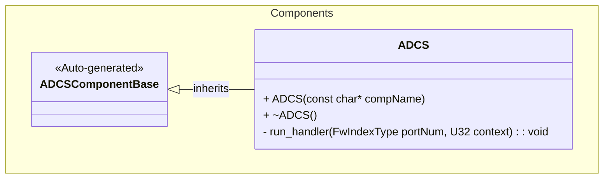
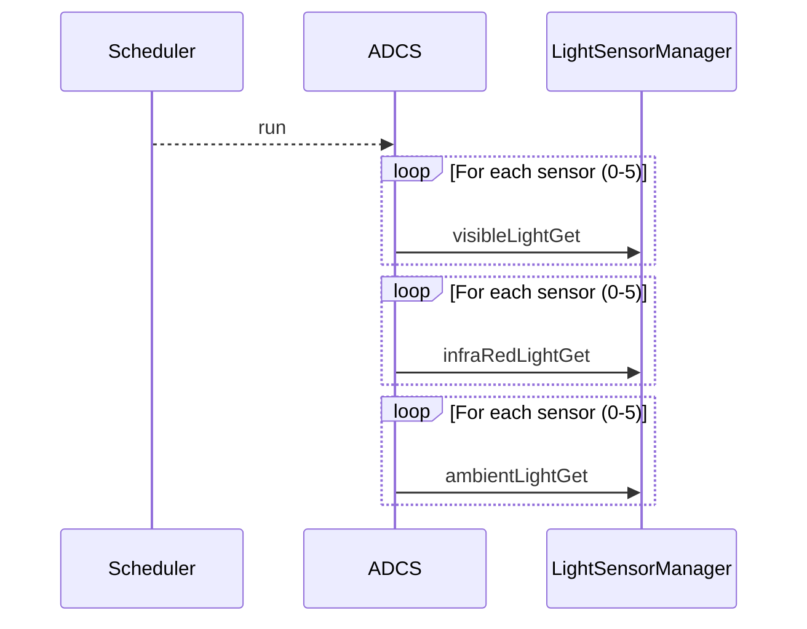

# Components::ADCS

The ADCS (Attitude Determination and Control System) component is responsible for collecting sensor data related to the spacecraft's attitude. Currently, it interfaces with light sensors (VEML6031) to gather visible, infrared, and ambient light data, which can be used for sun sensing and attitude determination.

## Usage Examples

The ADCS component is designed to be scheduled periodically to trigger collection of sensor data. It operates as a passive component that responds to scheduler calls.

### Typical Usage

1. The component is instantiated and initialized during system startup.
2. The scheduler calls the `run` port at regular intervals.
3. On each run call, the component:
   - Iterates through the connected light sensor ports.
   - Fetches visible light data.
   - Fetches infrared light data.
   - Fetches ambient light data.

## Class Diagram

## Port Descriptions
| Name | Type | Description |
|---|---|---|
| run | sync input | Scheduler port that triggers sensor data collection |
| visibleLightGet | output | Array of ports [6] for getting visible light data from sensors |
| infraRedLightGet | output | Array of ports [6] for getting infrared light data from sensors |
| ambientLightGet | output | Array of ports [6] for getting ambient light data from sensors |
| timeCaller | time get | Port for requesting current system time |
| tlmOut | telemetry | Port for emitting telemetry |
| logOut | event | Port for emitting events |
| logTextOut | text event | Port for emitting text events |

## Sequence Diagrams

## Requirements
| Name | Description | Validation |
|---|---|---|
| Light Sensor Data Collection | The component shall trigger data collection from connected light sensors when run is called | Verify all connected light sensor output ports are called |
| Periodic Operation | The component shall operate as a scheduled component responding to scheduler calls | Verify component responds correctly to scheduler input |

## Change Log
| Date | Description |
|---|---|
| 2025-12-04 | Initial ADCS component SDD |
