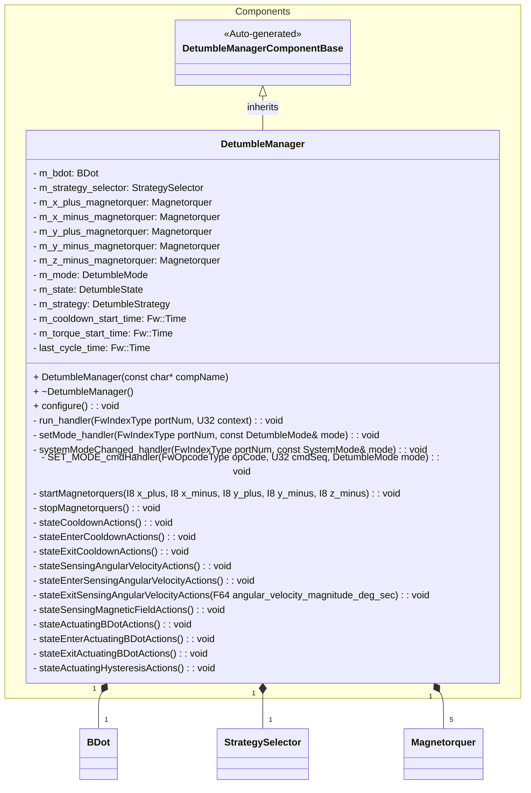
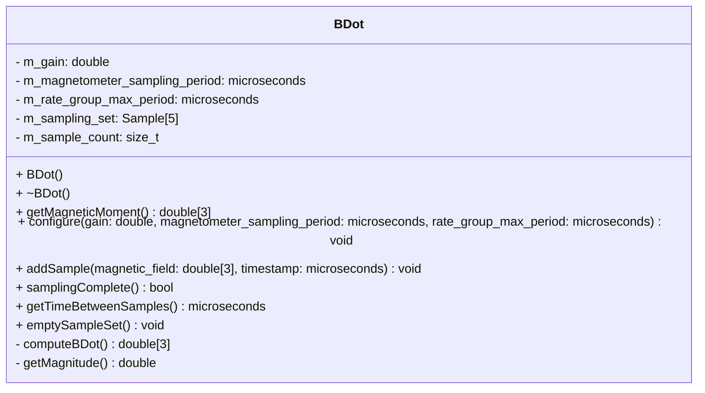
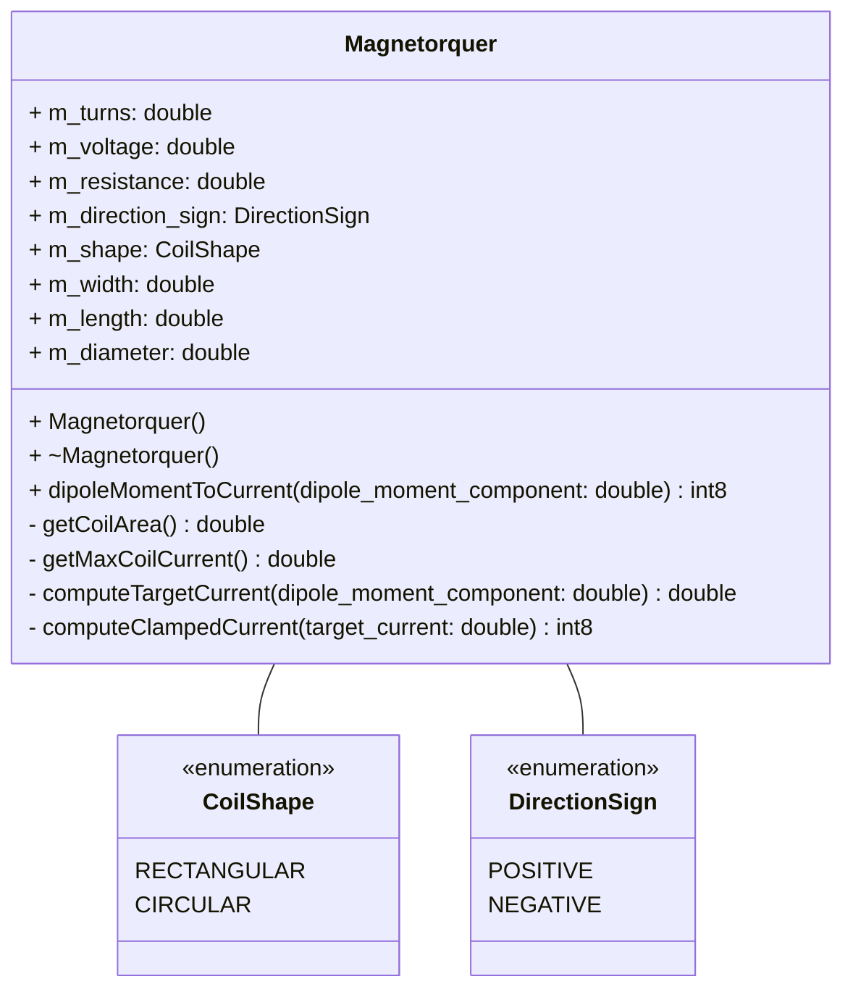
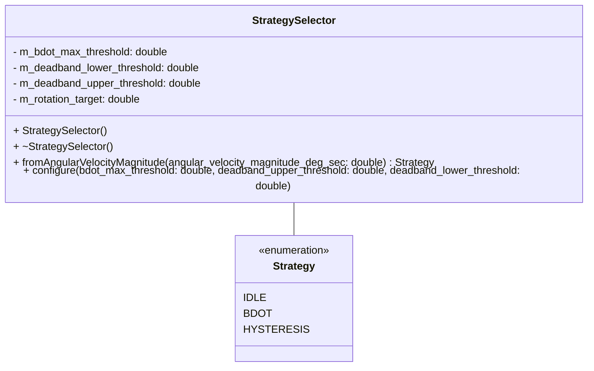
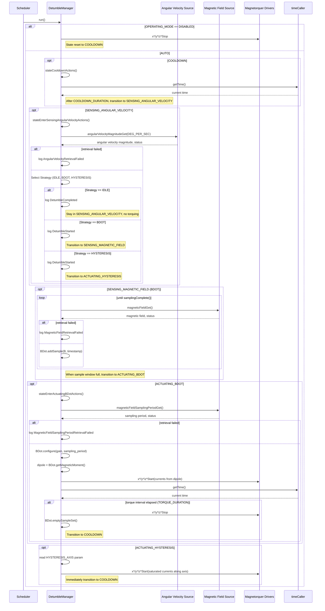

# Components::DetumbleManager

The Detumble Manager component implements a B-dot style detumbling controller. It coordinates angular-velocity measurements, dipole moment commands, and magnetorquer actuation to reduce the spacecraft rotation rate. The component operates as a scheduled passive component and drives a set of configured magnetorquer coils.

## Usage Examples

The Detumble Manager is designed to be scheduled periodically to drive its internal state machine:

- **COOLDOWN** – wait for sensors and the magnetic environment to settle after a torque command.
- **SENSING_ANGULAR_VELOCITY** – read angular velocity magnitude, compare against configurable thresholds, and select a detumble strategy (IDLE, BDOT, or HYSTERESIS).
- **SENSING_MAGNETIC_FIELD** – collect a fixed window of magnetic field samples for the B-Dot controller.
- **ACTUATING_BDOT** – command magnetorquers using a dipole moment computed by the internal B-Dot controller.
- **ACTUATING_HYSTERESIS** – command magnetorquers using a bang‑bang hysteresis strategy along a selected axis.

### Typical Usage

1. The component is instantiated and initialized during system startup.
2. Parameters are loaded (mode, thresholds, timing, coil properties).
3. The deployment calls `configure()` in the component configuration phase to cache coil parameters and publish related telemetry.
4. The scheduler periodically calls the `run` port.
5. On each run:
   - The component checks the operating mode (DISABLED or AUTO).
     - The state machine executes COOLDOWN, SENSING_ANGULAR_VELOCITY, SENSING_MAGNETIC_FIELD, ACTUATING_BDOT, or ACTUATING_HYSTERESIS actions.
     - When appropriate, it requests:
         - Angular velocity magnitude via `angularVelocityMagnitudeGet`.
         - Magnetic field samples via `magneticFieldGet` and sampling period via `magneticFieldSamplingPeriodGet`.
     - It computes a dipole moment using the internal `BDot` helper (for BDOT strategy) or selects a bang‑bang axis (for HYSTERESIS strategy).
     - It starts or stops the magnetorquers via the `x*/y*/z*Start` and `x*/y*/z*Stop` ports.

## Class Diagram

### Helper Classes

#### BDot

#### Magnetorquer

#### StrategySelector

## Default Parameters and Mathematical Constants

### BDot Maximum Threshold

The B-Dot maximum threshold parameter defines the upper rotational rate (deg/s) above which the hysteresis strategy is used instead of B-Dot. This threshold is computed as:

$$
\omega_{\max} = \min\left(\frac{2\pi}{\Delta t}, \frac{\pi}{2\delta T}\right) = \min\left(\frac{360\ \text{deg}}{\Delta t}, \frac{90\ \text{deg}}{\delta T}\right)
$$

where:

- $\omega_{\max}$ is the maximum angular velocity (deg/s),
- $\Delta t$ is the duration of the actuation,
- $\delta T$ is the time elapsed between the measurement of $\dot{B}$.

For the PROVES CubeSat mission, we have:

$$
\omega_{\max} = \min\left(\frac{360\ \text{deg}}{0.32\ \text{s}}, \frac{90\ \text{deg}}{0.08\ \text{s}}\right) = 1125\ \text{deg/s}
$$

Given:
- Actuation duration, $\Delta t = 0.32\ \text{s}$ (configured via `TORQUE_DURATION` parameter)
- Time between $\dot{B}$ measurements, $\delta T = 0.08\ \text{s}$ (based on `DetumbleManager` rate group $20Hz$ and B-Dot sample window of $5$ samples)

In this reference deployment the `BDOT_MAX_THRESHOLD` parameter defaults to $720\,\text{deg/s}$ (see the FPP definition), well under the computed maximum of $1125\ \text{deg/s}$ to provide a buffer for margin of error. Above the configured threshold, the hysteresis strategy is used, which is less sensitive to timing issues.

### `TORQUE_DURATION` Decision
The `TORQUE_DURATION` parameter defines the duration of a single torque actuation. We can choose this duration based on the maximum angular velocity we wish to control via the B-Dot controller. Given the maximum angular velocity of $1125\ \text{deg/s}$, bound by the magnetic field sampling duration, we can select a torque duration that allows us to control up to this rate.

$$
\Delta t = \frac{360\ \text{deg}}{\omega_{\max}} = \frac{360\ \text{deg}}{1125\ \text{deg/s}} = 0.32\ \text{s} = 320\ \text{ms}
$$

We set the `TORQUE_DURATION` parameter to $320ms$ in this reference deployment, which allows us to control angular velocities up to $1125\ \text{deg/s}$ as computed above.

### `COOLDOWN_DURATION` Decision
The `COOLDOWN_DURATION` parameter defines the time spent waiting after a torque command before sensing angular velocity again. This cooldown period allows the magnetic environment and sensors to settle after actuation so that measurements are not contaminated by residual fields. The LIS2MDL magnetometer takes new measurements every $10ms$ ($100Hz$). To ensure at least one new measurement is available after actuation, we set the `COOLDOWN_DURATION` parameter to $20ms$ in this reference deployment.

### `DEADBAND_LOWER_THRESHOLD` Decision
The `DEADBAND_LOWER_THRESHOLD` parameter defines the rotational rate (deg/s) below which detumbling is considered complete and the `IDLE` strategy is selected. This threshold should be set low enough to ensure that the spacecraft is sufficiently detumbled for mission operations, but high enough to prevent the satellite from settling into a poor orientation (like antenna board directly pointed at the sun) or suffer thermal issues due to heat taken on from the sun.

### BDot Implementation Options
The B-Dot algorithm estimates the time derivative of the magnetic field vector $\dot{B}$ to compute the required dipole moment for detumbling. Several methods exist for estimating $\dot{B}$ from various sensor inputs:

#### 1. Cross Product Method
The cross product method estimates $\dot{B}$ using the cross product of an angular velocity vector $\omega$ and the magnetic field vector $B$:

$$
\dot{B} = \omega \times B
$$

Both the angular velocity and magnetic field vectors are available to the `DetumbleManager` component via ports in the `ImuManager` component. This method requires accurate angular velocity measurements and is sensitive to noise in both measurements.

References:
- [Discrete Control with First Order Bdot Controller - Dr. Carlos Montalvo - University of South Alabama ](https://www.youtube.com/watch?v=0mh9D5QpjT8&list=PL_D7_GvGz-v0dng864FPenLhbSUNyKmfm&index=102).

#### 2. Derivative Method
The derivative method estimates $\dot{B}$ using finite differences between consecutive magnetic field readings:

$$
\dot{B} \approx \frac{B(t) - B(t - \Delta t)}{\Delta t}
$$

This method is straightforward to implement and requires only magnetic field measurements. However, like the cross product method it is sensitive to noise. Also, in `Discrete Control with First Order Bdot Controller`, Dr. Montalvo notes that this method did not perform as well as the cross product method in simulations.

References:
- [Lecture slides on Control Systems - Dr. Jan Bekkeng - University of Oslo](https://www.uio.no/studier/emner/matnat/fys/FYS3240/v23/lectures/l11---control-systems-v23.pdf)
- [Discrete Control with First Order Bdot Controller - Dr. Carlos Montalvo - University of South Alabama](https://www.youtube.com/watch?v=0mh9D5QpjT8&list=PL_D7_GvGz-v0dng864FPenLhbSUNyKmfm&index=102).

#### 3. Least Squares Method
The least squares method fits a line to a series of magnetic field readings over time and computes the slope of that line as an estimate of $\dot{B}$.

This method can be more robust to noise, especially when multiple readings are available.

References:
- [Hardware-In-The-Loop and Software-In-The-Loop
Testing of the MOVE-II CubeSat - Jonis Kiesbye et al. - 2019](https://s3vi.ndc.nasa.gov/ssri-kb/static/resources/aerospace-06-00130-v2.pdf)

#### 4. 5-Point Central Difference Method
The central difference method uses a five-point stencil to estimate $\dot{B}$, providing a higher-order approximation:

$$
\dot{B} \approx \frac{-B_4 + 8B_3 - 8B_1 + B_0}{12\cdot \Delta t}
$$

Where $B_i$ are magnetic field readings at different time points and $\Delta t$ is the time interval between readings. The `DetumbleManager` is on a $50Hz$ rate group so the time between readings is $0.02 s$.

The 5‑point central finite‑difference formula is obtained by combining Taylor expansions at five equally spaced points so that the combination reproduces the first derivative and cancels as many low‑order error terms as possible. The derivation of the 5‑point central finite‑difference formula is as follows:

Let $f(t)$ be smooth and suppose values are known at five equally spaced points

$$
t_{-2}=t_0-2\Delta t,\quad
t_{-1}=t_0-\Delta t,\quad
t_0,\quad
t_{+1}=t_0+\Delta t,\quad
t_{+2}=t_0+2\Delta t,
$$

with corresponding values

$$
f_{-2}=f(t_0-2\Delta t),\;
f_{-1}=f(t_0-\Delta t),\;
f_0=f(t_0),\;
f_{+1}=f(t_0+\Delta t),\;
f_{+2}=f(t_0+2\Delta t).
$$

Expand $f$ at points $t_0\pm\Delta t$ and $t_0\pm 2\Delta t$ using Taylor series about $t_0$.

Write derivatives at $t_0$ as

$$
f_0 = f(t_0),\quad
f_0' = f'(t_0),\quad
f_0'' = f''(t_0),\quad
f_0^{(3)} = f^{(3)}(t_0),\quad
f_0^{(4)} = f^{(4)}(t_0),\dots
$$

Then

$$
f(t_0+\Delta t) = f_0 + f_0'\Delta t + \frac{f_0''}{2}\Delta t^2 + \frac{f_0^{(3)}}{6}\Delta t^3 + \frac{f_0^{(4)}}{24}\Delta t^4 + O(\Delta t^5),
$$

$$
f(t_0-\Delta t) = f_0 - f_0'\Delta t + \frac{f_0''}{2}\Delta t^2
                 - \frac{f_0^{(3)}}{6}\Delta t^3
                 + \frac{f_0^{(4)}}{24}\Delta t^4
                 + O(\Delta t^5),
$$

$$
f(t_0+2\Delta t) = f_0 + 2f_0'\Delta t + 2^2\frac{f_0''}{2}\Delta t^2
                  + 2^3\frac{f_0^{(3)}}{6}\Delta t^3
                  + 2^4\frac{f_0^{(4)}}{24}\Delta t^4
                  + O(\Delta t^5),
$$

$$
f(t_0-2\Delta t) = f_0 - 2f_0'\Delta t + 2^2\frac{f_0''}{2}\Delta t^2
                  - 2^3\frac{f_0^{(3)}}{6}\Delta t^3
                  + 2^4\frac{f_0^{(4)}}{24}\Delta t^4
                  + O(\Delta t^5).
$$

These expansions are the raw material for building a linear combination that isolates $f_0'$.

Consider a general linear combination of the five samples:

$$
L = a f(t_0-2\Delta t) + b f(t_0-\Delta t) + c f(t_0) + d f(t_0+\Delta t) + e f(t_0+2\Delta t).
$$

The goal is to choose $a,b,c,d,e$ so that

$$
L = f_0'\,\Delta t + \text{higher‑order terms},
$$

so that after division by $\Delta t$ the result approximates $f'(t_0)$.

Because a central first‑derivative operator should be antisymmetric about the center, impose

$$
a = -e,\quad b=-d,\quad c=0.
$$

This automatically makes the approximation odd in $\Delta t$, which matches the behavior of a first derivative.

With this symmetry,

$$
L = a\bigl[f(t_0-2\Delta t) - f(t_0+2\Delta t)\bigr] + b\bigl[f(t_0-\Delta t) - f(t_0+\Delta t)\bigr].
$$

Substitute the expansions and collect terms by derivative order. Using the series above, the contributions to $L$ are:

- Constant term (involving $f_0$):

$$
a(f_0 - f_0) + b(f_0 - f_0) = 0,
$$

so the constant always cancels; that is consistent with $f'(t)$ being zero for constant functions.
- First‑derivative term (involving $f_0'$):

$$
a\bigl(-2f_0'\Delta t - 2f_0'\Delta t\bigr) + b\bigl(-f_0'\Delta t - f_0'\Delta t\bigr) = (-4a - 2b) f_0' \Delta t.
$$
- Third‑derivative term (involving $f_0^{(3)}$), from the $\Delta t^3$ terms:

$$
a\left(-\frac{8}{6}f_0^{(3)}\Delta t^3 -\frac{8}{6}f_0^{(3)}\Delta t^3\right) + b\left(-\frac{1}{6}f_0^{(3)}\Delta t^3 -\frac{1}{6}f_0^{(3)}\Delta t^3\right) = -\frac{16a+2b}{6} f_0^{(3)}\Delta t^3.
$$

Terms in $f_0''$ already cancel because of the symmetry $a=-e,b=-d$, and higher derivatives are left as truncation error.

To make $L$ approximate $f_0'\Delta t$ with high accuracy, require

1. The coefficient of $f_0'\Delta t$ is $1$:

$$
-4a - 2b = 1.
$$
2. The coefficient of $f_0^{(3)}\Delta t^3$ vanishes (cancel cubic error):

$$
-\frac{16a+2b}{6} = 0 \quad\Longrightarrow\quad 16a + 2b = 0.
$$

So the coefficients must satisfy the system

$$
\begin{cases}
-4a - 2b = 1,\\[0.2em]
16a + 2b = 0.
\end{cases}
$$

Solving:

$$
16a + 2b = 0 \;\Rightarrow\; b = -8a,
$$

$$
-4a - 2(-8a) = -4a + 16a = 12a = 1 \;\Rightarrow\; a = \dfrac{1}{12},
$$

$$
b = -8a = -\dfrac{8}{12} = -\dfrac{2}{3},\quad
d = -b = \dfrac{2}{3},\quad
e = -a = -\dfrac{1}{12},\quad
c = 0.
$$

Thus

$$
L
= \frac{1}{12} f(t_0-2\Delta t)
  - \frac{2}{3} f(t_0-\Delta t)
  + 0\cdot f(t_0)
  + \frac{2}{3} f(t_0+\Delta t)
  - \frac{1}{12} f(t_0+2\Delta t).
$$

Factor a common denominator $12$:

$$
L
= \frac{-f(t_0+2\Delta t)
        + 8 f(t_0+\Delta t)
        - 8 f(t_0-\Delta t)
        + f(t_0-2\Delta t)}{12}.
$$

From the construction,

$$
L = f_0'\Delta t + O(\Delta t^5),
$$

so dividing by $\Delta t$ gives the final 5‑point central derivative formula:

$$
f'(t_0)
\approx
\frac{-f(t_0+2\Delta t)
      + 8 f(t_0+\Delta t)
      - 8 f(t_0-\Delta t)
      + f(t_0-2\Delta t)}{12\,\Delta t}
+ O(\Delta t^4).
$$

### BDot Implementation Decision
After evaluating the options, we selected the 5-Point Central Difference Method for the following reasons:
- **Noise Robustness**: The central difference method can better handle noisy measurements by averaging over multiple readings.
- **Simplicity**: It requires only magnetic field measurements, addition and division, simplifying the system architecture.
- **Performance**: While the cross product and least squared methods may offer better performance in some scenarios, the central difference method provides a good balance between performance and robustness for our application.

### `k` Gain Constant Default Value
The gain constant `k` in the B-Dot algorithm determines the strength of the magnetic moment command in response to the estimated $\dot{B}$. A higher `k` value results in stronger torques, while a lower `k` value results in gentler torques.

We can determine the `k` constant based on the following formula:

$$
k ≤ \frac{m_{\max}}{||\dot{B}_{\max}||}
$$

where:
- $m_{max}$ is the maximum magnetic moment achievable by the magnetorquers (A⋅m²),
- $||\dot{B}_{max}||$ is the maximum expected rate of change of the magnetic field (G/s).

For the PROVES CubeSat mission, we estimated using the lowest performing magnetorquer (Z- coil) and an altitude of 420 km:

$$
m_{max} = I_{max}\cdot n\cdot A
 \approx 43.575491\ G
$$

Given:
- Maximum coil current, $I_{\max} = 3.3\ \text{V} / 150.7\ \text{m}\Omega$
- Number of turns, $n = 153$
- Coil diameter, $d = 0.05755\ \text{m}$
- Coil area, $A = \frac{1}{2}\pi \cdot (\frac{1}{2}\ 0.05755\ \text{m})^2$

And

$$
||\dot{B}_{\max}|| = \omega_{\max} \cdot B_{\max} \approx 7.854\ G/s
$$

Given:
- Maximum angular velocity controllable by the B-Dot controller, $\omega_{\max} \approx 19.635\ \text{rad/s}$ (computed below)
- Maximum magnetic field at 420 km altitude, $B_{\max} \approx 0.4\ G$

Therefore:

$$
k ≤ \frac{43.575491\ G}{7.854\ G/s} \approx 5.55\ A\cdot m^2\cdot s/G
$$

We set the default `k` gain constant to $3.0 \ s$ in this reference deployment, providing a small margin below the computed maximum to account for uncertainties.

## Port Descriptions

| Name             | Type         | Description                                                        |
| ---------------- | ------------ | ------------------------------------------------------------------ |
| run              | sync input   | Scheduler port that advances the detumble state machine           |
| setMode          | sync input   | Port for setting the detumble mode (DISABLED or AUTO)            |
| systemModeChanged| sync input   | Port for receiving system mode change notifications (SAFE disables detumble) |
| angularVelocityMagnitudeGet | output | Requests current angular velocity magnitude                     |
| magneticFieldGet | output       | Requests current magnetic field vector (gauss)                    |
| magneticFieldSamplingPeriodGet | output | Requests magnetometer sampling period                          |
| xPlusStart       | output       | Command to start the X+ magnetorquer with a signed current value  |
| xPlusStop        | output       | Command to stop the X+ magnetorquer                               |
| xMinusStart      | output       | Command to start the X− magnetorquer with a signed current value  |
| xMinusStop       | output       | Command to stop the X− magnetorquer                               |
| yPlusStart       | output       | Command to start the Y+ magnetorquer with a signed current value  |
| yPlusStop        | output       | Command to stop the Y+ magnetorquer                               |
| yMinusStart      | output       | Command to start the Y− magnetorquer with a signed current value  |
| yMinusStop       | output       | Command to stop the Y− magnetorquer                               |
| zMinusStart      | output       | Command to start the Z− magnetorquer with a signed current value  |
| zMinusStop       | output       | Command to stop the Z− magnetorquer                               |
| timeCaller       | time get     | Requests current system time for timing COOLDOWN and TORQUING     |
| logTextOut       | text event   | Sends textual events                                               |
| logOut           | event        | Sends binary events                                                |
| tlmOut           | telemetry    | Sends telemetry channels                                           |
| prmGetOut        | param get    | Retrieves parameter values                                        |
| prmSetOut        | param set    | Updates parameter values                                          |
| cmdRegOut        | command reg  | Registers commands                                                 |
| cmdIn            | command recv | Receives commands                                                  |
| cmdResponseOut   | command resp | Sends command responses                                            |

## Parameters and Telemetry (Summary)

- **Mode and thresholds**
  - `BDOT_MAX_THRESHOLD` (F64): Upper rotational threshold (deg/s) above which hysteresis is used.
  - `DEADBAND_UPPER_THRESHOLD` (F64): Upper deadband rotational threshold (deg/s).
  - `DEADBAND_LOWER_THRESHOLD` (F64): Lower deadband rotational threshold (deg/s).
    - `GAIN` (F64): Gain used for B-Dot algorithm.
    - `HYSTERESIS_AXIS` (HysteresisAxis): Axis used for hysteresis detumbling.
  - `COOLDOWN_DURATION` (Fw.TimeIntervalValue): Time spent waiting after a torque command.
  - `TORQUE_DURATION` (Fw.TimeIntervalValue): Duration of a single torque actuation.

- **Coil configuration (per axis/coil)**
  - Voltage, resistance, number of turns, dimensions, and shape.
  - A full set exists for X+, X−, Y+, Y−, and Z− coils.

- **Key telemetry**
  - `Mode` (DetumbleMode): Current operating mode.
    - `State` (DetumbleState): COOLDOWN, SENSING_ANGULAR_VELOCITY, SENSING_MAGNETIC_FIELD, ACTUATING_BDOT, or ACTUATING_HYSTERESIS.
  - `DetumbleStrategy` (DetumbleStrategy): IDLE, BDOT, or HYSTERESIS.
    - `BdotMaxThresholdParam`, `DeadbandUpperThresholdParam`, `DeadbandLowerThresholdParam`, `GainParam`.
    - `HysteresisAxisParam`.
    - `CooldownDurationParam`, `TorqueDurationParam`, and measured `TorqueDuration`.
    - `TimeBetweenMagneticFieldReadings`.
  - Per-coil configuration telemetry for all coils (voltage, resistance, turns, geometry, shape).

- **Events**
    - `DetumbleStarted`: Logged when a detumble cycle starts, with the current angular velocity magnitude.
    - `DetumbleCompleted`: Logged when detumbling is considered complete (IDLE strategy selected).
    - `MagneticFieldRetrievalFailed`: Logged if `magneticFieldGet` does not succeed.
    - `MagneticFieldSamplingPeriodRetrievalFailed`: Logged if `magneticFieldSamplingPeriodGet` does not succeed.
    - `AngularVelocityRetrievalFailed`: Logged if `angularVelocityMagnitudeGet` does not succeed.

## Sequence Diagrams

### State Machine Overview (AUTO mode)

## Requirements

| Name                        | Description                                                                                               | Validation                                                   |
| --------------------------- | --------------------------------------------------------------------------------------------------------- | ------------------------------------------------------------ |
| Mode Control                | The component shall support DISABLED and AUTO modes via `OPERATING_MODE`.                                | Parameter set and telemetry `Mode` observed over GDS.        |
| External Control            | The component shall provide an input port to allow other components to set the detumble mode.             | Verify that calling the `setMode` port updates the component mode. |
| System Safe Mode            | The component shall disable detumbling when the system enters SAFE mode.                                  | Simulate a system mode change to SAFE and verify detumbling is disabled. |
| Safe Disable                | When in DISABLED mode, all magnetorquer outputs shall be turned off and the internal state reset.       | Force DISABLED, verify all `*Stop` ports are called.         |
| Deadband Activation         | The component shall implement a deadband using upper and lower thresholds to prevent rapid switching between IDLE and active detumbling. | Verify that detumbling starts only above the upper threshold and stops only below the lower threshold. |
| Hysteresis Strategy         | The component shall employ a hysteresis (bang-bang) strategy when the angular velocity exceeds the `BDOT_MAX_THRESHOLD`. | Verify that the Hysteresis strategy is selected when angular velocity is high. |
| B-Dot Strategy              | The component shall employ a B-Dot strategy when the angular velocity is within the active range (above deadband, below `BDOT_MAX_THRESHOLD`). | Verify that the B-Dot strategy is selected when angular velocity is in the intermediate range. |
| Cooldown Timing             | After TORQUING, the component shall remain in COOLDOWN for at least `COOLDOWN_DURATION` before SENSING. | Instrument time via `timeCaller` and observe state changes.  |
| Parameter Telemetry         | Coil configuration parameters shall be telemetered for all coils after configuration.                   | Call `configure()` and verify coil telemetry channels.       |
| Error Reporting             | The component shall emit warning events when angular velocity or magnetic field retrieval fails.         | Force non-success return codes and observe events.           |

## Change Log

| Date       | Description                                                                 |
| ---------- | --------------------------------------------------------------------------- |
| 2025-12-20 | Initial design document drafted for Detumble Manager component             |
