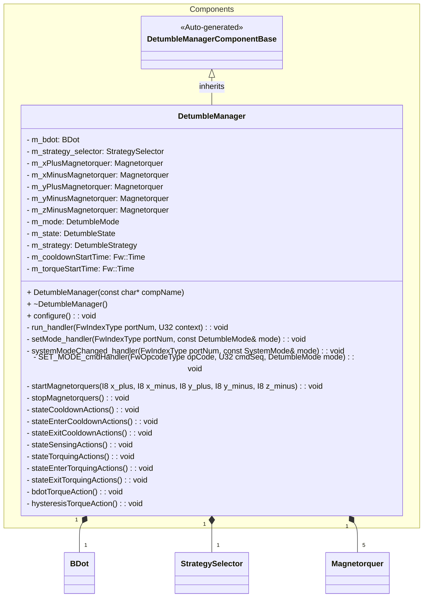
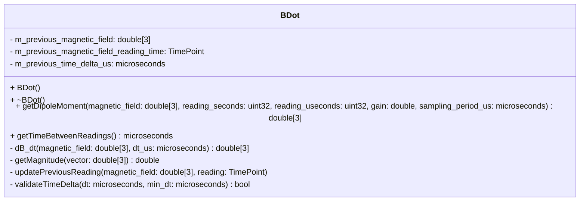
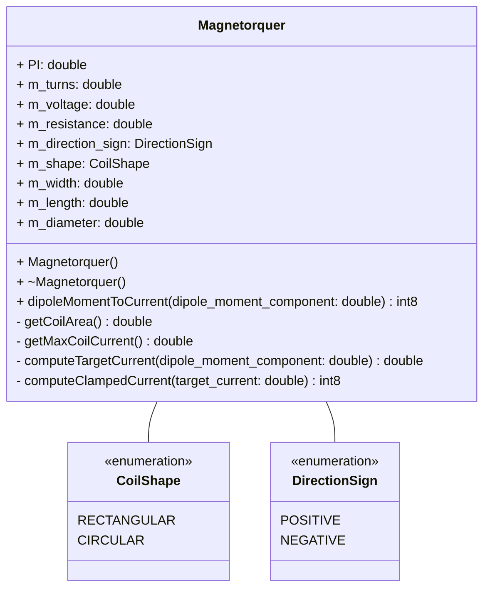
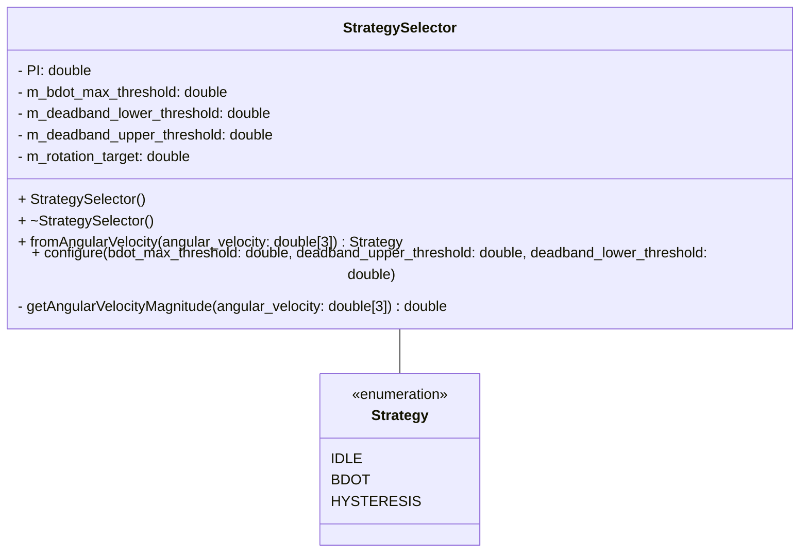
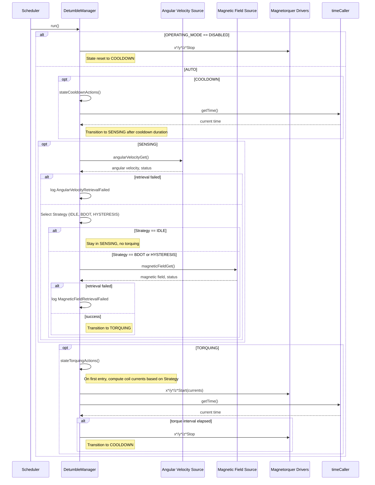

# Components::DetumbleManager

The Detumble Manager component implements a B-dot style detumbling controller. It coordinates angular-velocity measurements, dipole moment commands, and magnetorquer actuation to reduce the spacecraft rotation rate. The component operates as a scheduled passive component and drives a set of configured magnetorquer coils.

## Usage Examples

The Detumble Manager is designed to be scheduled periodically to drive its internal state machine:

- **COOLDOWN** – wait for sensors and the magnetic environment to settle after a torque command
- **SENSING** – read angular velocity, compare against a configurable threshold, and decide whether detumbling is required
- **TORQUING** – command magnetorquers using a dipole moment provided by an upstream controller

### Typical Usage

1. The component is instantiated and initialized during system startup.
2. Parameters are loaded (mode, thresholds, timing, coil properties).
3. The deployment calls `configure()` in the component configuration phase to cache coil parameters and publish related telemetry.
4. The scheduler periodically calls the `run` port.
5. On each run:
   - The component checks the operating mode (DISABLED or AUTO).
   - The state machine executes COOLDOWN, SENSING, or TORQUING actions.
   - When appropriate, it requests:
     - Angular velocity via `angularVelocityGet`.
     - Dipole moment command via `dipoleMomentGet`.
   - It starts or stops the magnetorquers via the `x*/y*/z*Start` and `x*/y*/z*Stop` ports.

## Class Diagram

### Helper Classes

#### BDot

#### BDot Implementation Options
The B-Dot algorithm estimates the time derivative of the magnetic field vector $\dot{B}$ to compute the required dipole moment for detumbling. Several methods exist for estimating $\dot{B}$ from various sensor inputs:

##### 1. Cross Product Method
The cross product method estimates $\dot{B}$ using the cross product of an angular velocity vector $\omega$ and the magnetic field vector $B$:

$$
\dot{B} = \omega \times B
$$

Both the angular velocity and magnetic field vectors are available to the `DetumbleManger` component via ports in the `ImuManager` component. This method requires accurate angular velocity measurements and is sensitive to noise in both measurements.

References:
- [Discrete Control with First Order Bdot Controller - Dr. Carlos Montalvo - University of South Alabama ](https://www.youtube.com/watch?v=0mh9D5QpjT8&list=PL_D7_GvGz-v0dng864FPenLhbSUNyKmfm&index=102).

##### 2. Derivative Method
The derivative method estimates $\dot{B}$ using finite differences between consecutive magnetic field readings:

$$
\dot{B} \approx \frac{B(t) - B(t - \Delta t)}{\Delta t}
$$

This method is straightforward to implement and requires only magnetic field measurements. However, like the cross product method it is sensitive to noise. Also, in `Discrete Control with First Order Bdot Controller`, Dr. Montalvo notes that this method did not perform as well as the cross product method in simulations.

References:
- [Lecture slides on Control Systems - Dr. Jan Bekkeng - University of Oslo](https://www.uio.no/studier/emner/matnat/fys/FYS3240/v23/lectures/l11---control-systems-v23.pdf)
- [Discrete Control with First Order Bdot Controller - Dr. Carlos Montalvo - University of South Alabama](https://www.youtube.com/watch?v=0mh9D5QpjT8&list=PL_D7_GvGz-v0dng864FPenLhbSUNyKmfm&index=102).

##### 3. Least Squares Method
The least squares method fits a line to a series of magnetic field readings over time and computes the slope of that line as an estimate of $\dot{B}$.

This method can be more robust to noise, especially when multiple readings are available.

References:
- [Hardware-In-The-Loop and Software-In-The-Loop
Testing of the MOVE-II CubeSat - Jonis Kiesbye et al. - 2019](https://s3vi.ndc.nasa.gov/ssri-kb/static/resources/aerospace-06-00130-v2.pdf)

##### 4. 5-Point Central Difference Method
The central difference method uses a five-point stencil to estimate $\dot{B}$, providing a higher-order approximation:

$$
\dot{B} \approx \frac{-B_4 + 8B_3 - 8B_1 + B_0}{12\cdot \Delta t}
$$

Where $B_i$ are magnetic field readings at different time points and $\Delta t$ is the time interval between readings. The `DetumbleManager` is on a $50Hz$ rate group so the time between readings is $0.02 s$.

TODO(egjellison): Write up on coefficient derivation (-1, 8, 12, etc.)

#### BDot Implementation Decision
After evaluating the options, we selected the 5-Point Central Difference Method for the following reasons:
- **Noise Robustness**: The central difference method can better handle noisy measurements by averaging over multiple readings.
- **Simplicity**: It requires only magnetic field measurements, addition and division, simplifying the system architecture.
- **Performance**: While the cross product and least squared methods may offer better performance in some scenarios, the central difference method provides a good balance between performance and robustness for our application.

#### `k` Gain Constant Default Value
The gain constant `k` in the B-Dot algorithm determines the strength of the magnetic moment command in response to the estimated $\dot{B}$. A higher `k` value results in stronger torques, while a lower `k` value results in gentler torques.

We can determine the `k` constant based on the following formula:

$$
k ≤ \frac{m_{\max}}{||\dot{B}_{\max}||}
$$

where:
- $m_{max}$ is the maximum magnetic moment achievable by the magnetorquers (A⋅m²),
- $||\dot{B}_{max}||$ is the maximum expected rate of change of the magnetic field (uT/s).

For the PROVES CubeSat mission, we estimated using the lowest performing magnetorquer (Z- coil) and an altitude of 420 km:

$$
m_{max} = I_{max}\cdot n\cdot A
 \approx 0.0043575491\ \mu T
$$

Given:
- Maximum coil current, $I_{\max} = 3.3\ \text{V} / 150.7\ \text{m}\Omega$
- Number of turns, $n = 153$
- Coil diameter, $d = 0.05755\ \text{m}$
- Coil area, $A = \frac{1}{2}\pi \cdot (\frac{1}{2}\ 0.05755\ \text{m})^2$

And

$$
||\dot{B}_{\max}|| = \omega_{\max} \cdot B_{\max} \approx 785\ \mu T/s
$$

Given:
- Maximum angular velocity controllable by the B-Dot controller, $\omega_{\max} \approx 19.635\ \text{rad/s}$ (computed below)
- Maximum magnetic field at 420 km altitude, $B_{\max} \approx 40\ \mu T$

#### Magnetorquer

#### StrategySelector

#### BDot Maximum Threshold

The B-Dot maximum threshold parameter defines the upper rotational rate (deg/s) above which the hysteresis strategy is used instead of B-Dot. This threshold is computed as:

$$
\omega_{\max} = \min\left(\frac{2\pi}{\Delta t}, \frac{\pi}{2\delta T}\right) = \min\left(\frac{360\ \text{deg}}{\Delta t}, \frac{90\ \text{deg}}{\delta T}\right)
$$

where:

- $\omega_{\max}$ is the maximum angular velocity (deg/s),
- $\Delta t$ is the duration of the actuation,
- $\delta T$ is the time elapsed between the measurement of $\dot{B}$.

Testing on 2025‑12‑28 indicated that our B-Dot controller could maintain control up to an angular velocity of $180\,\text{deg/s}$. For the default value we have selected a more conservative threshold of $150\,\text{deg/s}$ to ensure robust operation. Above this threshold, the hysteresis strategy is used, which is less sensitive to timing issues.

## Port Descriptions

| Name             | Type         | Description                                                        |
| ---------------- | ------------ | ------------------------------------------------------------------ |
| run              | sync input   | Scheduler port that advances the detumble state machine           |
| setMode          | sync input   | Port for disabling detumbling                                     |
| systemModeChanged| sync input   | Port for receiving system mode change notifications               |
| angularVelocityGet | output     | Requests current angular velocity vector                          |
| magneticFieldGet | output       | Requests current magnetic field vector                            |
| xPlusStart       | output       | Command to start the X+ magnetorquer with a signed current value  |
| xPlusStop        | output       | Command to stop the X+ magnetorquer                               |
| xMinusStart      | output       | Command to start the X− magnetorquer with a signed current value  |
| xMinusStop       | output       | Command to stop the X− magnetorquer                               |
| yPlusStart       | output       | Command to start the Y+ magnetorquer with a signed current value  |
| yPlusStop        | output       | Command to stop the Y+ magnetorquer                               |
| yMinusStart      | output       | Command to start the Y− magnetorquer with a signed current value  |
| yMinusStop       | output       | Command to stop the Y− magnetorquer                               |
| zMinusStart      | output       | Command to start the Z− magnetorquer with a signed current value  |
| zMinusStop       | output       | Command to stop the Z− magnetorquer                               |
| timeCaller       | time get     | Requests current system time for timing COOLDOWN and TORQUING     |
| logTextOut       | text event   | Sends textual events                                               |
| logOut           | event        | Sends binary events                                                |
| tlmOut           | telemetry    | Sends telemetry channels                                           |
| prmGetOut        | param get    | Retrieves parameter values                                        |
| prmSetOut        | param set    | Updates parameter values                                          |
| cmdRegOut        | command reg  | Registers commands                                                 |
| cmdIn            | command recv | Receives commands                                                  |
| cmdResponseOut   | command resp | Sends command responses                                            |

## Parameters and Telemetry (Summary)

- **Mode and thresholds**
  - `OPERATING_MODE` (DetumbleMode): DISABLED or AUTO.
  - `BDOT_MAX_THRESHOLD` (F64): Upper rotational threshold (deg/s) above which hysteresis is used.
  - `DEADBAND_UPPER_THRESHOLD` (F64): Upper deadband rotational threshold (deg/s).
  - `DEADBAND_LOWER_THRESHOLD` (F64): Lower deadband rotational threshold (deg/s).
  - `GAIN` (F64): Gain used for B-Dot algorithm.
  - `COOLDOWN_DURATION` (Fw.TimeIntervalValue): Time spent waiting after a torque command.
  - `TORQUE_DURATION` (Fw.TimeIntervalValue): Duration of a single torque actuation.

- **Coil configuration (per axis/coil)**
  - Voltage, resistance, number of turns, dimensions, and shape.
  - A full set exists for X+, X−, Y+, Y−, and Z− coils.

- **Key telemetry**
  - `Mode` (DetumbleMode): Current operating mode.
  - `State` (DetumbleState): COOLDOWN, SENSING, or TORQUING.
  - `DetumbleStrategy` (DetumbleStrategy): IDLE, BDOT, or HYSTERESIS.
  - `BdotMaxThreshold`, `DeadbandUpperThreshold`, `DeadbandLowerThreshold`, `Gain`.
  - `CooldownDuration`, `TorqueDuration`.
  - Per-coil configuration telemetry for all coils (voltage, resistance, turns, geometry, shape).

- **Events**
  - `MagneticFieldRetrievalFailed`: Logged if `magneticFieldGet` does not succeed.
  - `AngularVelocityRetrievalFailed`: Logged if `angularVelocityGet` does not succeed.
  - `MagneticFieldTooSmallForDipoleMoment`: Logged if magnetic field magnitude is too small.
  - `InvalidMagneticFieldReadingForDipoleMoment`: Logged if readings are out of order or too fast.
  - `UnknownDipoleMomentComputationError`: Logged if an unknown error occurs during computation.
  - `InvalidDetumbleStrategy`: Logged if an invalid strategy is selected.

## Sequence Diagrams

### State Machine Overview (AUTO mode)

## Requirements

| Name                        | Description                                                                                               | Validation                                                   |
| --------------------------- | --------------------------------------------------------------------------------------------------------- | ------------------------------------------------------------ |
| Mode Control                | The component shall support DISABLED and AUTO modes via `OPERATING_MODE`.                                | Parameter set and telemetry `Mode` observed over GDS.        |
| External Control            | The component shall provide an input port to allow other components to set the detumble mode.             | Verify that calling the `setMode` port updates the component mode. |
| System Safe Mode            | The component shall disable detumbling when the system enters SAFE mode.                                  | Simulate a system mode change to SAFE and verify detumbling is disabled. |
| Safe Disable                | When in DISABLED mode, all magnetorquer outputs shall be turned off and the internal state reset.       | Force DISABLED, verify all `*Stop` ports are called.         |
| Deadband Activation         | The component shall implement a deadband using upper and lower thresholds to prevent rapid switching between IDLE and active detumbling. | Verify that detumbling starts only above the upper threshold and stops only below the lower threshold. |
| Hysteresis Strategy         | The component shall employ a hysteresis (bang-bang) strategy when the angular velocity exceeds the `BDOT_MAX_THRESHOLD`. | Verify that the Hysteresis strategy is selected when angular velocity is high. |
| B-Dot Strategy              | The component shall employ a B-Dot strategy when the angular velocity is within the active range (above deadband, below `BDOT_MAX_THRESHOLD`). | Verify that the B-Dot strategy is selected when angular velocity is in the intermediate range. |
| Cooldown Timing             | After TORQUING, the component shall remain in COOLDOWN for at least `COOLDOWN_DURATION` before SENSING. | Instrument time via `timeCaller` and observe state changes.  |
| Parameter Telemetry         | Coil configuration parameters shall be telemetered for all coils after configuration.                   | Call `configure()` and verify coil telemetry channels.       |
| Error Reporting             | The component shall emit warning events when angular velocity or magnetic field retrieval fails.         | Force non-success return codes and observe events.           |

## Change Log

| Date       | Description                                                                 |
| ---------- | --------------------------------------------------------------------------- |
| 2025-12-20 | Initial design document drafted for Detumble Manager component             |
