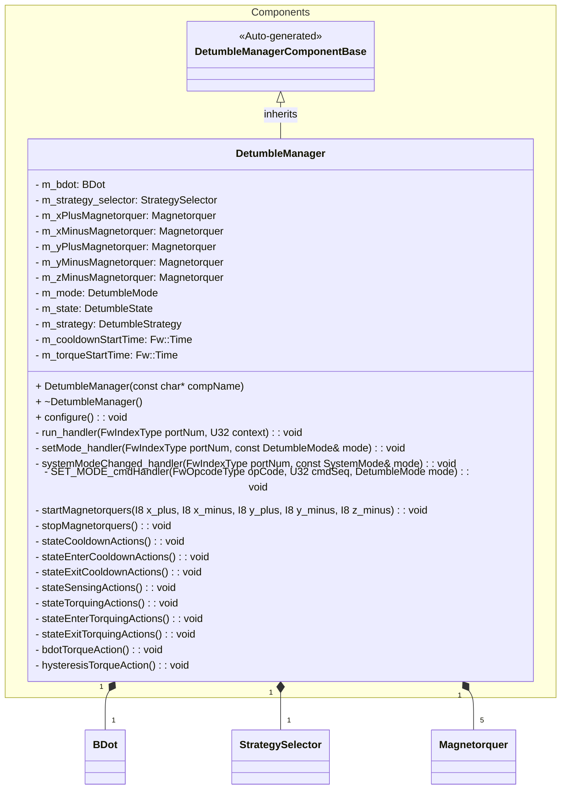
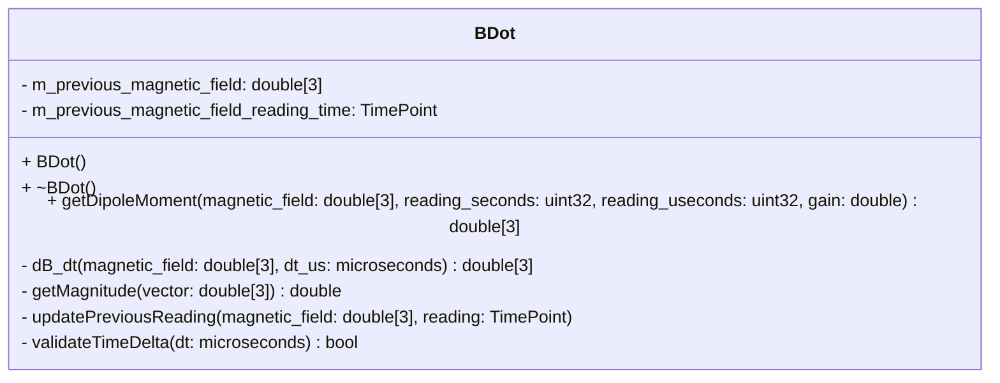
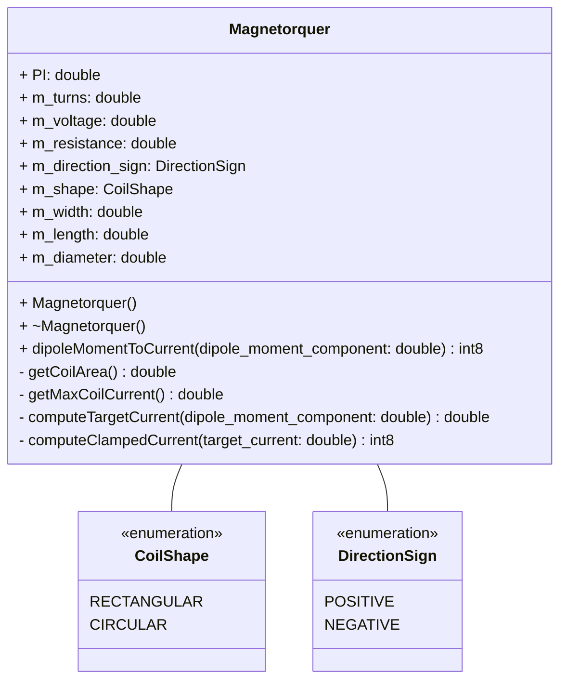
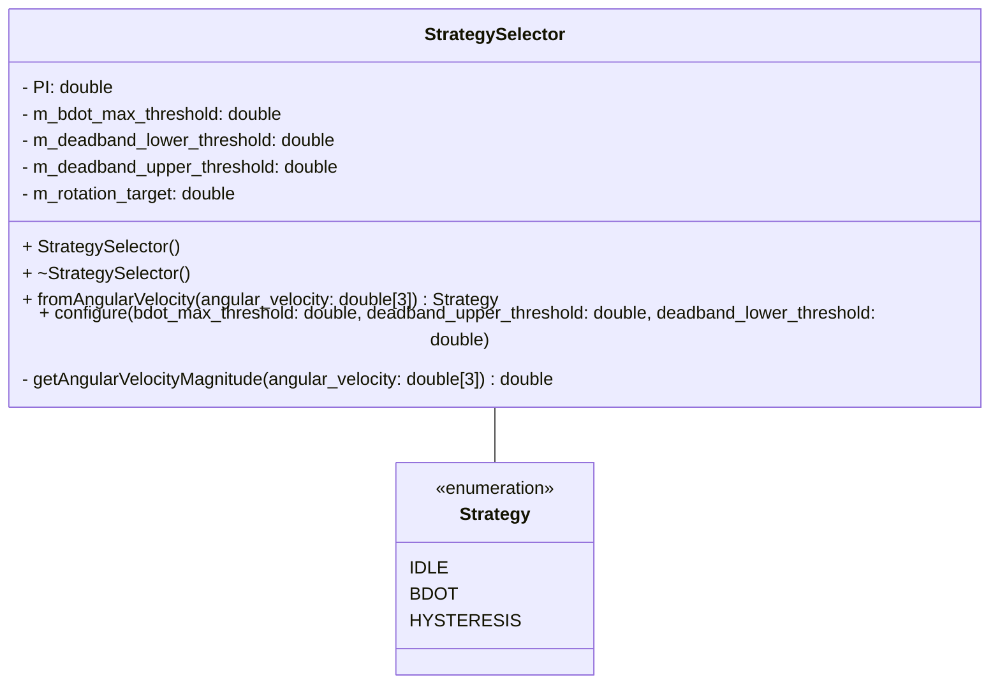
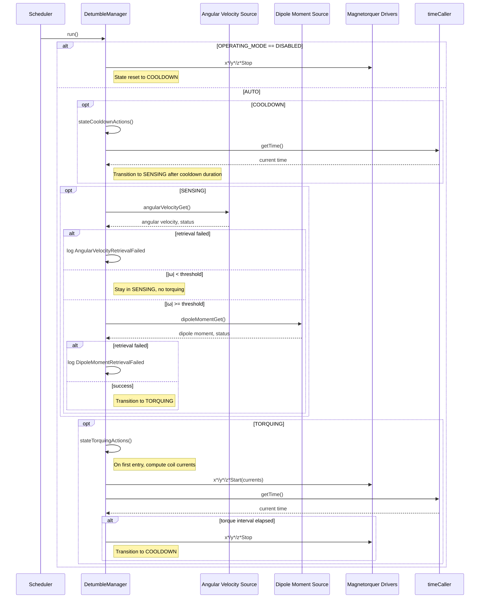

# Components::DetumbleManager

The Detumble Manager component implements a B-dot style detumbling controller. It coordinates angular-velocity measurements, dipole moment commands, and magnetorquer actuation to reduce the spacecraft rotation rate. The component operates as a scheduled passive component and drives a set of configured magnetorquer coils.

## Usage Examples

The Detumble Manager is designed to be scheduled periodically to drive its internal state machine:

- **COOLDOWN** – wait for sensors and the magnetic environment to settle after a torque command
- **SENSING** – read angular velocity, compare against a configurable threshold, and decide whether detumbling is required
- **TORQUING** – command magnetorquers using a dipole moment provided by an upstream controller

### Typical Usage

1. The component is instantiated and initialized during system startup.
2. Parameters are loaded (mode, thresholds, timing, coil properties).
3. The deployment calls `configure()` in the component configuration phase to cache coil parameters and publish related telemetry.
4. The scheduler periodically calls the `run` port.
5. On each run:
   - The component checks the operating mode (DISABLED or AUTO).
   - The state machine executes COOLDOWN, SENSING, or TORQUING actions.
   - When appropriate, it requests:
     - Angular velocity via `angularVelocityGet`.
     - Dipole moment command via `dipoleMomentGet`.
   - It starts or stops the magnetorquers via the `x*/y*/z*Start` and `x*/y*/z*Stop` ports.

## Class Diagram

### Helper Classes

#### BDot

#### Magnetorquer

#### StrategySelector

## Port Descriptions

| Name             | Type         | Description                                                        |
| ---------------- | ------------ | ------------------------------------------------------------------ |
| run              | sync input   | Scheduler port that advances the detumble state machine           |
| angularVelocityGet | output     | Requests current angular velocity vector                          |
| magneticFieldGet | output       | Requests current magnetic field vector (for upstream controller)  |
| dipoleMomentGet  | output       | Requests commanded dipole moment from a detumble controller       |
| xPlusStart       | output       | Command to start the X+ magnetorquer with a signed current value  |
| xPlusStop        | output       | Command to stop the X+ magnetorquer                               |
| xMinusStart      | output       | Command to start the X− magnetorquer with a signed current value  |
| xMinusStop       | output       | Command to stop the X− magnetorquer                               |
| yPlusStart       | output       | Command to start the Y+ magnetorquer with a signed current value  |
| yPlusStop        | output       | Command to stop the Y+ magnetorquer                               |
| yMinusStart      | output       | Command to start the Y− magnetorquer with a signed current value  |
| yMinusStop       | output       | Command to stop the Y− magnetorquer                               |
| zMinusStart      | output       | Command to start the Z− magnetorquer with a signed current value  |
| zMinusStop       | output       | Command to stop the Z− magnetorquer                               |
| timeCaller       | time get     | Requests current system time for timing COOLDOWN and TORQUING     |
| logTextOut       | text event   | Sends textual events                                               |
| logOut           | event        | Sends binary events                                                |
| tlmOut           | telemetry    | Sends telemetry channels                                           |
| prmGetOut        | param get    | Retrieves parameter values                                        |
| prmSetOut        | param set    | Updates parameter values                                          |
| cmdRegOut        | command reg  | Registers commands                                                 |
| cmdIn            | command recv | Receives commands                                                  |
| cmdResponseOut   | command resp | Sends command responses                                            |

## Parameters and Telemetry (Summary)

- **Mode and thresholds**
  - `OPERATING_MODE` (DetumbleMode): DISABLED or AUTO.
  - `ROTATIONAL_THRESHOLD` (F64): Angular-velocity threshold (deg/s) for enabling torquing.
  - `COOLDOWN_DURATION` (Fw.TimeIntervalValue): Time spent waiting after a torque command.
  - `TORQUE_DURATION` (Fw.TimeIntervalValue): Duration of a single torque actuation.

- **Coil configuration (per axis/coil)**
  - Voltage, resistance, number of turns, dimensions, and shape.
  - A full set exists for X+, X−, Y+, Y−, and Z− coils.

- **Key telemetry**
  - `Mode` (DetumbleMode): Current operating mode.
  - `State` (DetumbleState): COOLDOWN, SENSING, or TORQUING.
  - `BelowRotationalThreshold` (bool): Whether the angular-velocity magnitude is currently below the threshold.
  - `RotationalThreshold`, `CooldownDuration`, `TorqueDuration`.
  - Per-coil configuration telemetry for all coils (voltage, resistance, turns, geometry, shape).

- **Events**
  - `DipoleMomentRetrievalFailed`: Logged if `dipoleMomentGet` does not succeed.
  - `AngularVelocityRetrievalFailed`: Logged if `angularVelocityGet` does not succeed.

## Sequence Diagrams

### State Machine Overview (AUTO mode)

## Requirements

| Name                        | Description                                                                                               | Validation                                                   |
| --------------------------- | --------------------------------------------------------------------------------------------------------- | ------------------------------------------------------------ |
| Mode Control                | The component shall support DISABLED and AUTO modes via `OPERATING_MODE`.                                | Parameter set and telemetry `Mode` observed over GDS.        |
| Safe Disable                | When in DISABLED mode, all magnetorquer outputs shall be turned off and the internal state reset.       | Force DISABLED, verify all `*Stop` ports are called.         |
| Threshold-Based Activation  | Detumbling shall only be performed when the measured angular-velocity magnitude exceeds the configured threshold. | Sweep angular velocity values around `ROTATIONAL_THRESHOLD` and monitor transitions to TORQUING. |
| Cooldown Timing             | After TORQUING, the component shall remain in COOLDOWN for at least `COOLDOWN_DURATION` before SENSING. | Instrument time via `timeCaller` and observe state changes.  |
| Torque Duration             | During TORQUING, magnetorquers shall be active for at most `TORQUE_DURATION` before being stopped.      | Verify `*Start` followed by `*Stop` bracket the configured interval. |
| Coil Current Limiting       | Commanded coil currents shall not exceed the maximum allowable current derived from voltage and resistance. | Inject large commanded dipole moments and inspect computed currents. |
| Parameter Telemetry         | Coil configuration parameters shall be telemetered for all coils after configuration.                   | Call `configure()` and verify coil telemetry channels.       |
| Error Reporting             | The component shall emit warning events when angular velocity or dipole moment retrieval fails.         | Force non-success return codes and observe events.           |

## Change Log

| Date       | Description                                                                 |
| ---------- | --------------------------------------------------------------------------- |
| 2025-12-20 | Initial design document drafted for Detumble Manager component             |
