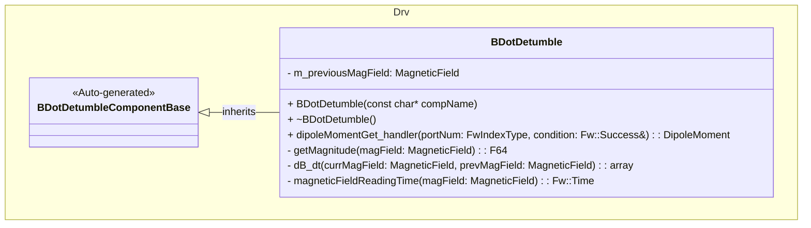

# Drv::BDotDetumble

The BDotDetumble component implements a B-dot–style detumbling controller. It computes a magnetic dipole moment vector based on the time derivative of the measured magnetic field and a configurable gain. This dipole moment is typically consumed by a higher-level manager (for example, DetumbleManager) that commands magnetorquer coils.

## Usage Examples

The component is typically used by a control loop manager that owns the scheduling and magnetorquer actuation.

### Typical Usage

1. The component is instantiated and initialized during system startup.
2. The manager connects BDotDetumble's `magneticFieldGet` output port to a magnetometer provider component.
3. On each control step, the manager calls the `dipoleMomentGet` input port.
4. BDotDetumble internally:
   - Fetches the previous magnetic field reading if uninitialized.
   - Requests the current magnetic field via `magneticFieldGet`.
   - Computes the magnetic field magnitude \(|B|\).
   - Computes the time derivative \(\dot{B}\) using the timestamps embedded in the magnetic field samples.
   - Reads the `Gain` parameter and telemeters it.
   - Computes a dipole moment vector proportional to \(\dot{B} / |B|\).
5. The dipole moment is returned as a `Drv::DipoleMoment` and passed to a downstream component (for example, DetumbleManager) that converts it to coil currents.

## Class Diagram



## Port Descriptions

| Name            | Type                             | Direction  | Description                                                                                           |
| --------------- | -------------------------------- | ---------- | ----------------------------------------------------------------------------------------------------- |
| dipoleMomentGet | Drv.DipoleMomentGet              | sync input | Computes and returns a `Drv::DipoleMoment` and sets a `Fw::Success` condition.                        |
| magneticFieldGet| Components.MagneticFieldGet      | output     | Requests the latest magnetic field measurement from a magnetometer provider component.                |
| timeCaller      | time get                         | time get   | Standard F Prime time port (not currently used directly in the implementation).                       |
| cmdRegOut       | command reg                      | output     | Standard command registration port (no custom commands defined).                                      |
| cmdIn           | command recv                     | input      | Standard command receive port (used only for parameter commands).                                     |
| cmdResponseOut  | command resp                     | output     | Standard command response port (used only for parameter commands).                                    |
| logTextOut      | text event                       | output     | Standard text event output (no custom events defined).                                                |
| logOut          | event                            | output     | Standard binary event output (no custom events defined).                                              |
| tlmOut          | telemetry                        | output     | Standard telemetry port used to emit the `Gain` telemetry channel.                                    |
| prmGetOut       | param get                        | output     | Standard parameter get port used for retrieving `Gain`.                                               |
| prmSetOut       | param set                        | output     | Standard parameter set port used for updating `Gain`.                                                 |

## Sequence Diagrams

### dipoleMomentGet

```mermaid
sequenceDiagram
    participant Manager
    participant BDot as BDotDetumble
    participant Mag as Magnetometer Provider

    Manager->>BDot: dipoleMomentGet(portNum, condition)
    alt previous magnetic field uninitialized
        BDot->>Mag: magneticFieldGet()
        Mag-->>BDot: previousMagField
        BDot->>BDot: store m_previousMagField
        BDot-->>Manager: condition = FAILURE, DipoleMoment(0,0,0)
    else previous magnetic field available
        BDot->>Mag: magneticFieldGet()
        Mag-->>BDot: currMagField
        BDot->>BDot: magnitude = getMagnitude(currMagField)
        alt |B| very small
            BDot-->>Manager: condition = FAILURE, DipoleMoment(0,0,0)
        else |B| above threshold
            BDot->>BDot: dt = magneticFieldReadingTime(currMagField) - magneticFieldReadingTime(m_previousMagField)
            alt dt == 0
                BDot-->>Manager: condition = FAILURE, DipoleMoment(0,0,0)
            else dt > 0
                BDot->>BDot: dB_dt = dB_dt(currMagField, m_previousMagField)
                BDot->>BDot: gain = paramGet_Gain(); tlmWrite_Gain(gain)
                BDot->>BDot: compute moment components proportional to dB_dt / |B|
                BDot->>BDot: m_previousMagField = currMagField
                BDot-->>Manager: condition = SUCCESS, DipoleMoment(mx,my,mz)
            end
        end
    end
```

## Parameters

| Name | Description                                  | Default |
| ---- | -------------------------------------------- | ------- |
| Gain | Gain constant used in the B-dot calculation | 1.0     |

The effective control law implemented is:

$$
m = k \cdot \frac{\dot{B}}{|B|}
$$

where:

- $m$ is the commanded magnetic dipole moment (A·m²),
- $k$ is the configurable `Gain` parameter,
- $\dot{B}$ is the time derivative of the magnetic field (computed per-axis),
- $|B|$ is the magnitude of the magnetic field.

## Commands

No custom commands are defined. The component uses the standard F Prime parameter set/get commands via `prmGetOut` and `prmSetOut` for configuring `Gain`.

## Events

No custom events are defined. Any logging uses the standard `logTextOut` and `logOut` ports if added in the future.

## Telemetry

| Name | Description                           | Type |
| ---- | ------------------------------------- | ---- |
| Gain | The gain used in the B-dot algorithm | F64  |

The computed dipole moment is returned on the `dipoleMomentGet` port and is not currently telemetered as a channel.

## Requirements

| Name               | Description                                                                                               | Validation                                                                                      |
| ------------------ | --------------------------------------------------------------------------------------------------------- | ----------------------------------------------------------------------------------------------- |
| BDot-001 B-dot Law | The component shall compute a dipole moment vector proportional to $\dot{B} / |B|$ using the `Gain` parameter. | Inject synthetic magnetic field sequences and verify dipole output scales with $\dot{B}$ and `Gain`. |
| BDot-002 Gain Param| The component shall allow configuration of the control gain `Gain` at runtime via parameters.             | Update the `Gain` parameter and verify the returned dipole moment scales accordingly.          |
| BDot-003 Robustness| The component shall return a zero dipole moment when $|B|$ is below a small threshold or when $\Delta t = 0$. | Provide small-field or zero-time-difference samples and verify a zero dipole result.           |
| BDot-004 Telemetry | The component shall telemeter the current `Gain` value on each computation.                               | Verify `Gain` telemetry updates when `dipoleMomentGet` is called and the parameter changes.    |

## Change Log

| Date       | Description                                      |
| ---------- | ------------------------------------------------ |
| 2025-12-20 | Initial BDotDetumble component.                  |
