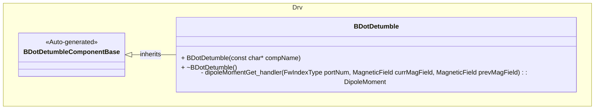
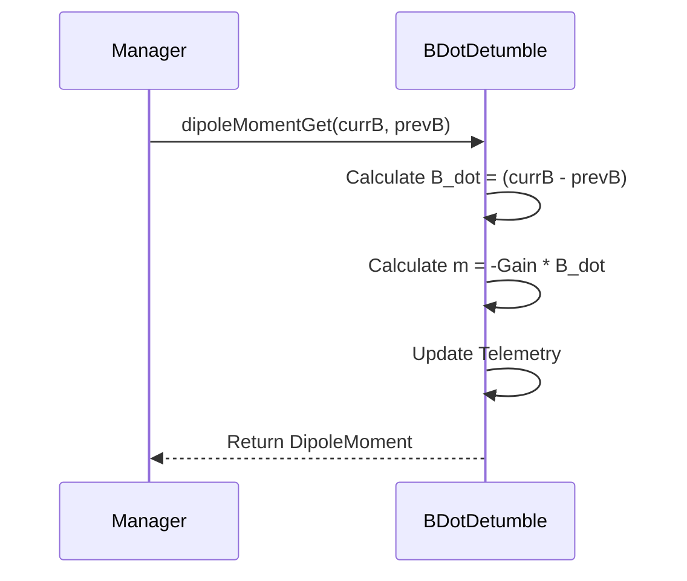

# Drv::BDotDetumble

The B-Dot Detumble component implements the B-Dot control law for detumbling a spacecraft. It calculates the required magnetic dipole moment to generate a torque that opposes the rotation of the spacecraft relative to the magnetic field.

## Usage Examples

The component is typically used by a control loop manager (e.g., `DetumbleManager`) which provides magnetic field readings.

### Typical Usage

1.  The component is initialized.
2.  A manager component obtains current and previous magnetic field readings.
3.  The manager calls `dipoleMomentGet` with these readings.
4.  The component calculates the rate of change of the magnetic field ($\dot{B}$).
5.  The component calculates the required dipole moment $m = -k \dot{B}$ where $k$ is the gain.
6.  The component returns the dipole moment and updates telemetry.

## Class Diagram

## Port Descriptions
| Name | Type | Description |
|---|---|---|
| dipoleMomentGet | sync input | Calculates and returns the dipole moment based on current and previous magnetic field readings. |

## Sequence Diagrams

### dipoleMomentGet

## Parameters
| Name | Description | Default |
|---|---|---|
| Gain | Gain constant ($k$) used for B-Dot algorithm | 1.0 |

## Commands
No specific commands defined. Uses standard parameter set/get commands.

## Events
No specific events defined.

## Telemetry
| Name | Description | Type |
|---|---|---|
| DipoleMoment | The calculated dipole moment | DipoleMoment |
| Gain | The gain used in B-Dot algorithm | F64 |

## Requirements
| Name | Description | Validation |
|---|---|---|
| B-Dot Calculation | The component shall calculate the magnetic dipole moment using the B-Dot control law $m = -k \dot{B}$ | Verify output against known inputs and gain |
| Gain Configuration | The component shall allow configuration of the control gain $k$ | Verify parameter updates change calculation result |
| Telemetry | The component shall report the calculated dipole moment and current gain | Verify telemetry output |

## Change Log
| Date | Description |
|---|---|
| 2025-12-08 | Initial Draft |
