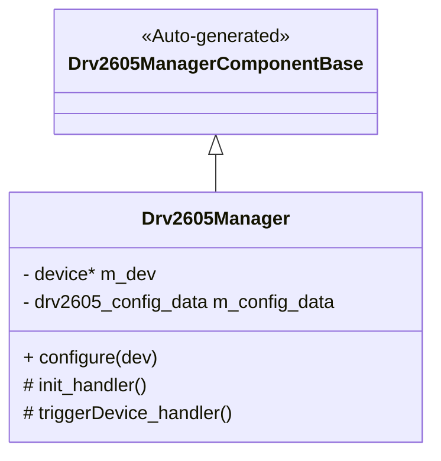
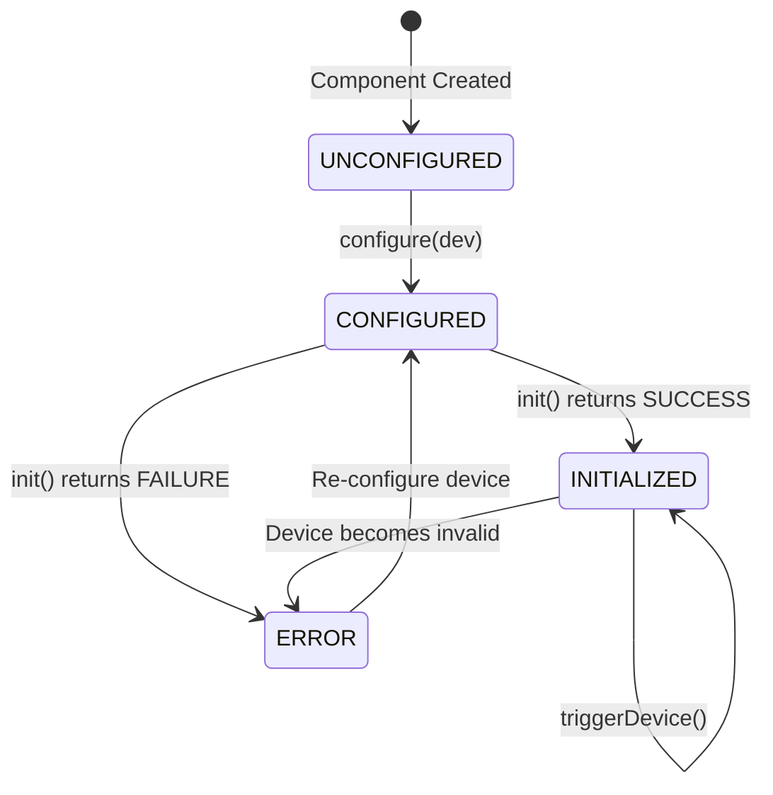
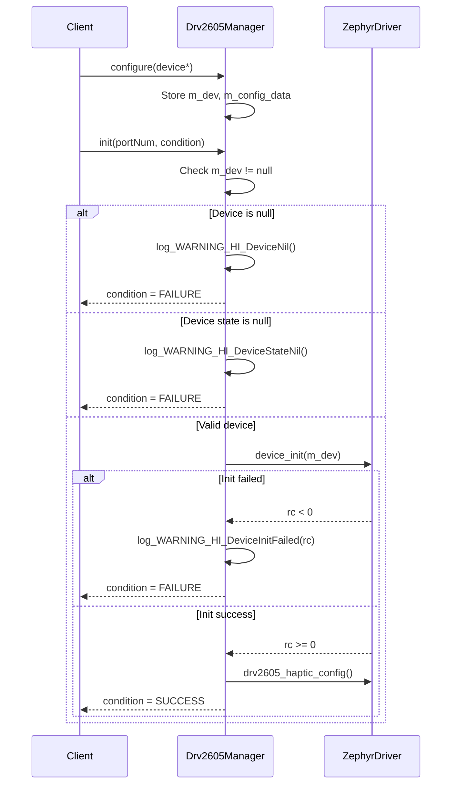
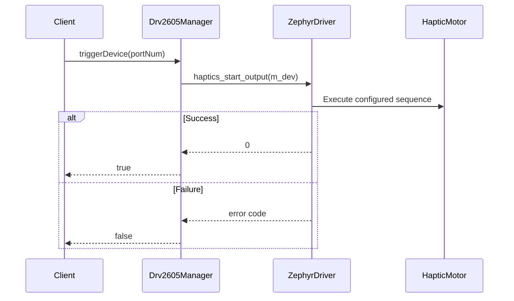

# Drv::Drv2605Manager

Component for F Prime FSW framework.

## Overview

The Drv2605Manager component provides a driver interface for the Texas Instruments DRV2605 haptic motor driver. This passive component manages initialization, configuration, and triggering of haptic feedback effects using the Zephyr RTOS haptics API.

## Usage Examples

### Typical Usage

The typical usage pattern for the Drv2605Manager component is:

1. **Configure the device**: Call `configure()` with a Zephyr device pointer during system initialization
2. **Initialize the device**: Invoke the `init` port to initialize the DRV2605 hardware
3. **Trigger haptic effects**: Call the `triggerDevice` port to activate the configured haptic sequence

## Class Diagram

## Port Descriptions

| Name          | Type                | Direction  | Description                                                                                                                                                 |
| ------------- | ------------------- | ---------- | ----------------------------------------------------------------------------------------------------------------------------------------------------------- |
| init          | Fw.SuccessCondition | sync input | Initializes the DRV2605 device. Must be called successfully before the device can be triggered. Returns SUCCESS or FAILURE based on initialization outcome. |
| triggerDevice | triggerDevice       | sync input | Triggers the DRV2605 to execute the configured haptic sequence. Returns true on success, false on failure.                                                  |

## Component States

| Name         | Description                                                       |
| ------------ | ----------------------------------------------------------------- |
| UNCONFIGURED | Component constructed but device not configured. `m_dev` is null. |
| CONFIGURED   | Device pointer set via `configure()` but device not initialized.  |
| INITIALIZED  | Device successfully initialized and ready for haptic triggers.    |
| ERROR        | Device initialization failed or device/state is nil.              |

## Sequence Diagrams

### Initialization Sequence

### Trigger Haptic Sequence

## Parameters

| Name | Description                   |
| ---- | ----------------------------- |
| N/A  | No runtime parameters defined |

## Commands

This component does not define any ground commands.

| Name | Description         |
| ---- | ------------------- |
| N/A  | No commands defined |

## Events

| Name             | Severity   | Throttle | Description                                                                                                          |
| ---------------- | ---------- | -------- | -------------------------------------------------------------------------------------------------------------------- |
| DeviceNotReady   | WARNING_HI | 5        | Emitted when the DRV2605 device is not ready for operation. Currently defined in FPP but not used in implementation. |
| DeviceInitFailed | WARNING_HI | 5        | Emitted when DRV2605 initialization fails. Includes the error return code from `device_init()`.                      |
| DeviceNil        | WARNING_HI | 5        | Emitted when the device pointer (`m_dev`) is null during initialization.                                             |
| DeviceStateNil   | WARNING_HI | 5        | Emitted when the device state pointer is null during initialization.                                                 |

## Telemetry

| Name | Description                   |
| ---- | ----------------------------- |
| N/A  | No telemetry channels defined |

## Requirements

| Name    | Description                                                          | Validation                                                         |
| ------- | -------------------------------------------------------------------- | ------------------------------------------------------------------ |
| DRV-001 | Component shall initialize DRV2605 device via Zephyr driver          | Test successful initialization, verify device_init called          |
| DRV-002 | Component shall configure DRV2605 for LRA mode with internal trigger | Verify drv2605_haptic_config called with correct parameters        |
| DRV-003 | Component shall trigger haptic output on demand                      | Test triggerDevice returns true when haptics_start_output succeeds |
| DRV-004 | Component shall report initialization failures                       | Verify DeviceInitFailed event emitted with error code              |
| DRV-005 | Component shall validate device pointer before use                   | Verify DeviceNil event when m_dev is null                          |
| DRV-006 | Component shall validate device state before use                     | Verify DeviceStateNil event when device state is null              |
| DRV-007 | Component shall throttle error events to prevent log spam            | Verify events limited to 5 occurrences per event type              |
| DRV-008 | Component shall support re-initialization                            | Verify device->state->initialized reset before device_init         |

## Change Log

| Date       | Description            |
| ---------- | ---------------------- |
| 2025-12-01 | Initial implementation |
