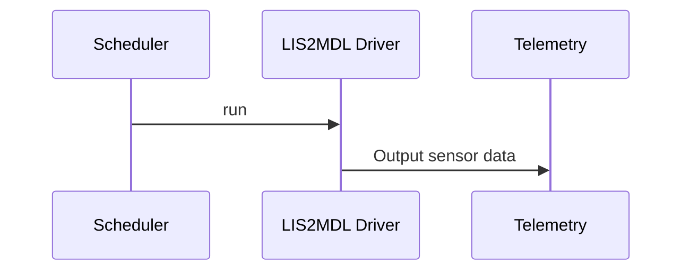
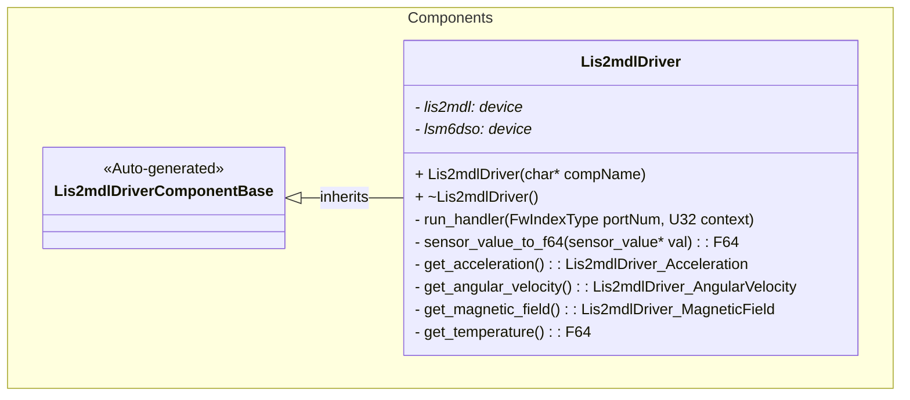

# Components::Lis2mdlDriver

The LIS2MDL Driver component provides sensor data related to motion and orientation of the craft. It interfaces with two sensors: the LIS2MDL magnetometer and the LSM6DSO accelerometer/gyroscope to provide acceleration, angular velocity, magnetic field, and temperature measurements.

## Usage Examples

The LIS2MDL Driver component is designed to be scheduled periodically to collect sensor data and output telemetry. It operates as a passive component that responds to scheduler calls.

### Diagrams

### Typical Usage

1. The component is instantiated and initialized during system startup
2. The scheduler calls the `run` port at regular intervals (configured at 12.5 Hz)
3. On each run call, the component:
   - Fetches fresh sensor samples from both LIS2MDL Driver sensors
   - Converts sensor data to F Prime data structures
   - Outputs telemetry for acceleration, angular velocity, magnetic field, and temperature

## Class Diagram

## Port Descriptions
| Name | Type | Description |
|---|---|---|
| run | sync input | Scheduler port that triggers sensor data collection and telemetry output |
| timeCaller | time get | Port for requesting current system time |
| tlmOut | telemetry | Port for sending telemetry data to downlink |

## Component States
| Name | Description |
|---|---|
| Initialized | Component has been constructed and both LIS2MDL Driver sensors are ready |
| Running | Component is actively collecting sensor data when scheduled |
| Error | One or both sensors failed initialization (assertion failure) |

## Sequence Diagrams
Add sequence diagrams here

## Telemetry
| Name | Description |
|---|---|
| Acceleration | Telemetry channel for acceleration in m/s^2 |
| AngularVelocity | Telemetry channel for angular velocity in rad/s |
| MagneticField | Telemetry channel for magnetic field in gauss |
| Temperature | Telemetry channel for temperature in degrees Celsius |

## Unit Tests
Add unit test descriptions in the chart below
| Name | Description | Output | Coverage |
|---|---|---|---|
|---|---|---|---|

## Requirements
Add requirements in the chart below
| Name | Description | Validation |
|---|---|---|
| AccelerationTelemetry | The component shall provide acceleration telemetry in m/s^2 | Verify telemetry output matches expected values from sensor datasheet |
| AngularVelocityTelemetry | The component shall provide angular velocity telemetry in rad/s | Verify telemetry output matches expected values from sensor datasheet |
| MagneticFieldTelemetry | The component shall provide magnetic field telemetry in gauss | Verify telemetry output matches expected values from sensor datasheet |
| TemperatureTelemetry | The component shall provide temperature telemetry in degrees Celsius | Verify telemetry output matches expected values from sensor datasheet |

## Change Log
| Date | Description |
|---|---|
| 2025-9-9 | Initial LIS2MDL Driver component |
