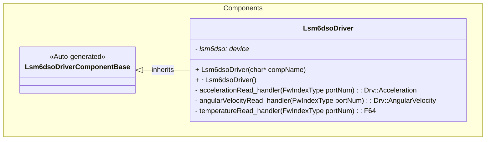
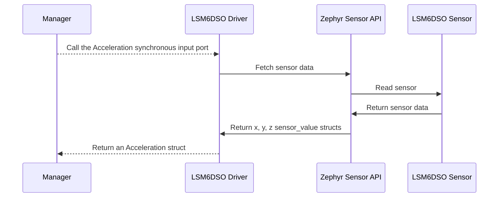
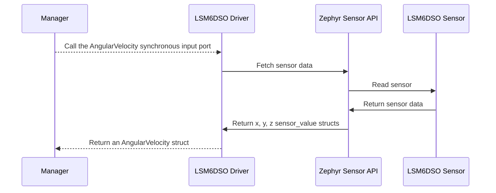
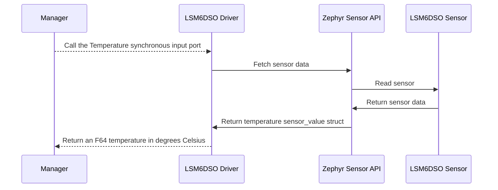

# Components::Lsm6dsoDriver

The LSM6DSO Driver component interfaces with the LIS2MDL magnetometer to provide acceleration, angular velocity, and temperature measurements.

## Usage Examples

The LSM6DSO Driver component is designed to be called periodically to collect and return sensor data. It operates as a passive component that responds to manager calls.

### Typical Usage

1. The component is instantiated and initialized during system startup
2. A manager calls any of the input ports: `AccelerationRead`, `AngularVelocityRead`, or `TemperatureRead` (No faster than 12.5 Hz)
3. On each call, the component:
   - Fetches fresh sensor samples from the sensor
   - Converts sensor data to F Prime data structures
   - Returns data in SI units

## Class Diagram

## Port Descriptions
| Name | Type | Description |
|---|---|---|
| AccelerationRead | sync input | Triggers acceleration data collection and returns an Acceleration struct |
| AngularVelocityRead | sync input | Triggers angular velocity data collection and returns an AngularVelocity struct |
| TemperatureRead | sync input | Triggers temperature data collection and returns temperature in degrees Celsius |

## Sequence Diagrams

### AccelerationRead

### AngularVelocityRead

### TemperatureRead

## Requirements
Add requirements in the chart below
| Name | Description | Validation |
|---|---|---|
| AccelerationRead Port | The component shall provide access to acceleration sensor data and return in common Acceleration struct, readings will be in m/s^2 | Verify output matches expected values from sensor datasheet |
| AngularVelocityRead Port | The component shall provide access to angular velocity sensor data and return in common AngularVelocity struct, readings will be in rad/s | Verify output matches expected values from sensor datasheet |
| TemperatureRead Port | The component shall provide access to temperature sensor data and return in degrees Celsius | Verify output matches expected values from sensor datasheet |

## Change Log
| Date | Description |
|---|---|
| 2025-9-10 | Initial LSM6DSO Driver component |
| 2025-9-13 | Added error event for sensor not ready |
