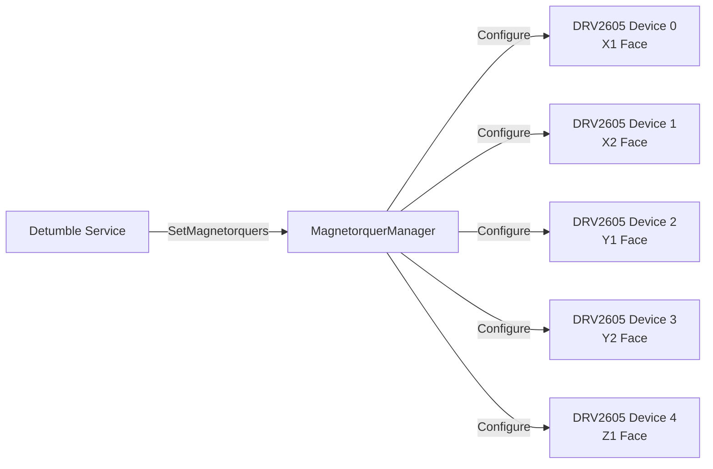
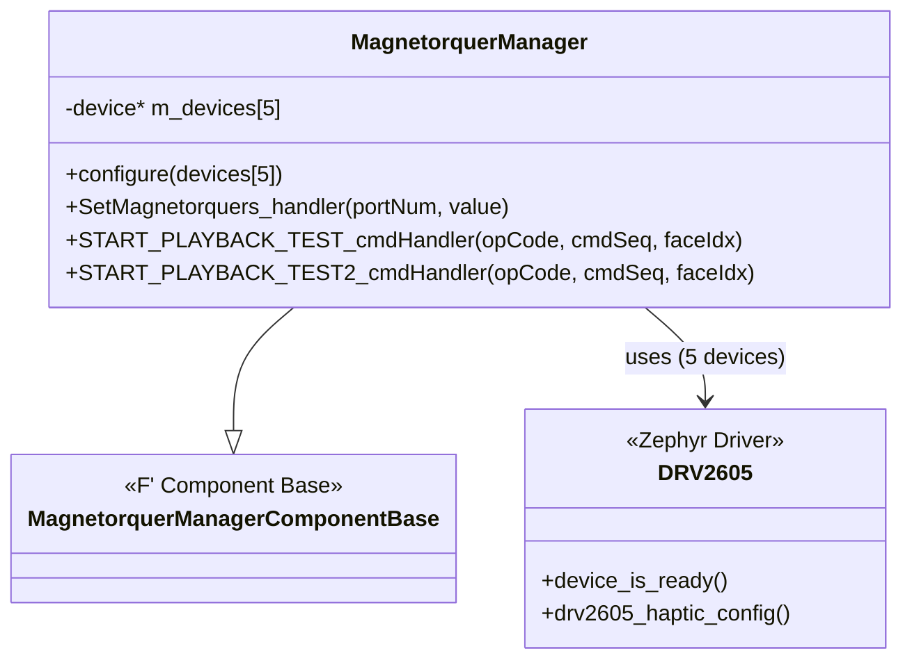
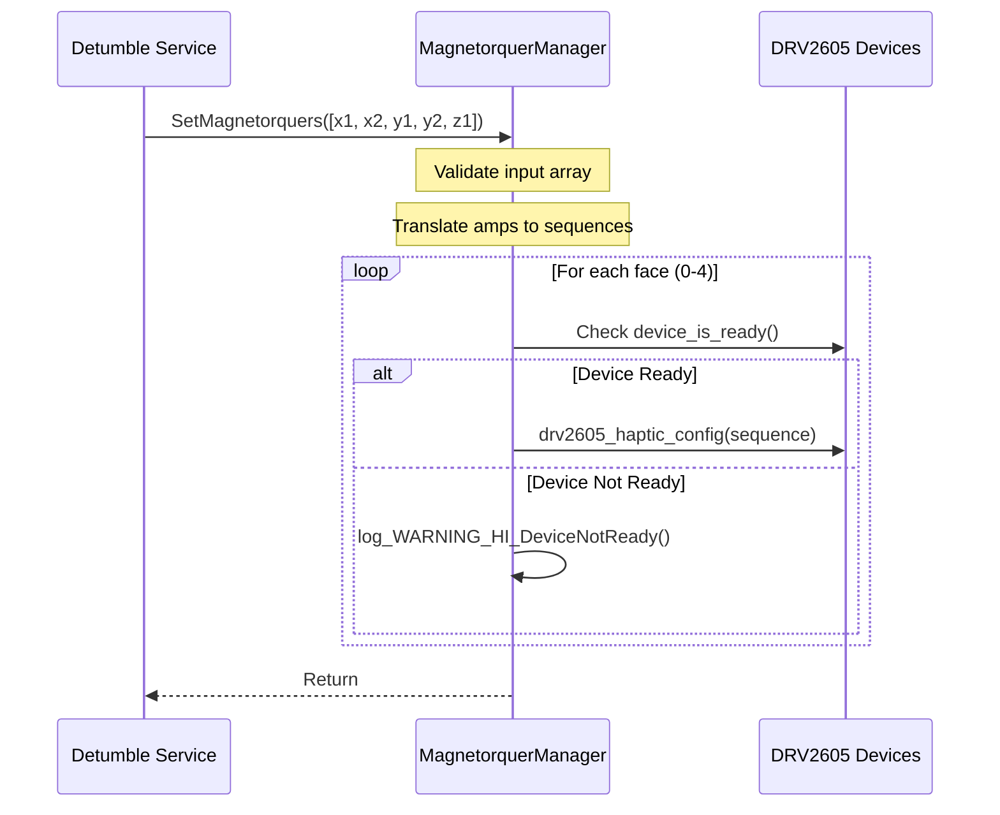
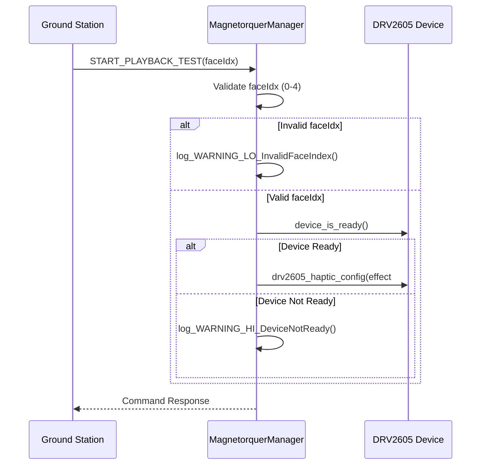

# Drv::MagnetorquerManager

The Magnetorquer Manager component interfaces with the five DRV2605 devices on a PROVES CubeSat to control the current of the magnetorquers.

## Usage Examples

This component is designed to be used by the detumble service to be able to detumble the cubesat when launched.

### Diagrams

### Typical Usage

1. The component is instantiated and initialized during system startup
2. The detumble service calls the `SetMagnetorquers` input port.
3. On each call, the component:
   - Takes in an `InputArray` parameter of 5 I32 for the amps for each face.
   - Translates the passed in values to a sequence value from the DRV2605 library.
   - Runs the sequence for each device.

## Class Diagram

## Port Descriptions

| Name             | Description                                                                                 |
| ---------------- | ------------------------------------------------------------------------------------------- |
| SetMagnetorquers | Input port that takes in an array (I32[5]) and applies each value to the corresponding face |

## Sequence Diagrams

### SetMagnetorquers Operation

### Test Command Operation

## Commands

| Name                 | Description                                                                                      |
| -------------------- | ------------------------------------------------------------------------------------------------ |
| START_PLAYBACK_TEST  | Start DRV2605 playback on a device with effect #47 on a specific face (faceIdx: 0-4). Test only. |
| START_PLAYBACK_TEST2 | Start DRV2605 playback on a device with effect #50 on a specific face (faceIdx: 0-4). Test only. |

## Events

| Name             | Description                                                                                                                                 |
| ---------------- | ------------------------------------------------------------------------------------------------------------------------------------------- |
| DeviceNotReady   | Output whenever a magnetorquer is attempted to be used while it is not initialized.                                                         |
| InvalidFaceIndex | Output whenever one of the manual test comamands are ran with an invalid face index (will be removed if/when the test commands are removed) |

## Requirements

Add requirements in the chart below
| Name | Description | Validation |
|---|---|---|
|---|---|---|

## Change Log

| Date       | Description   |
| ---------- | ------------- |
| 11/11/2025 | Initial Draft |
