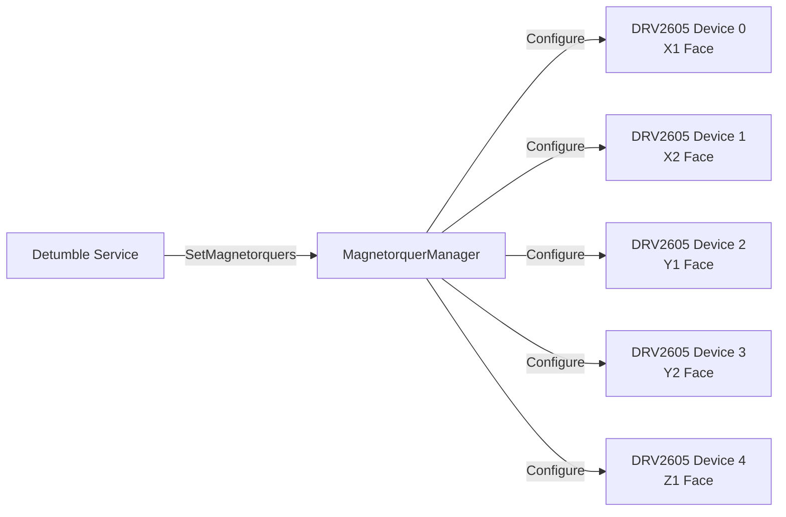
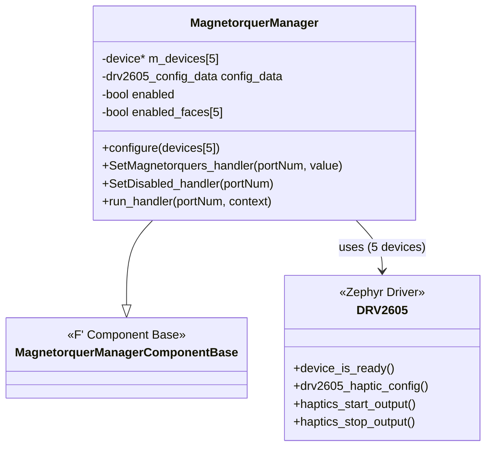
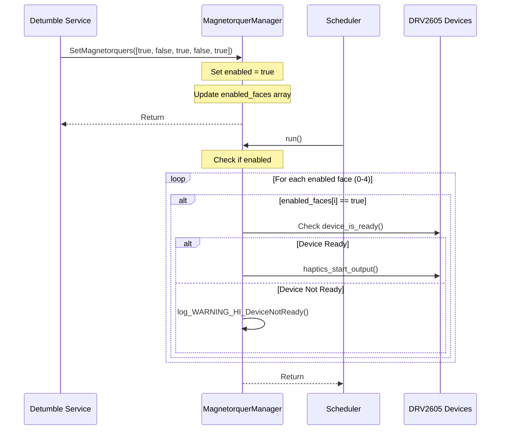
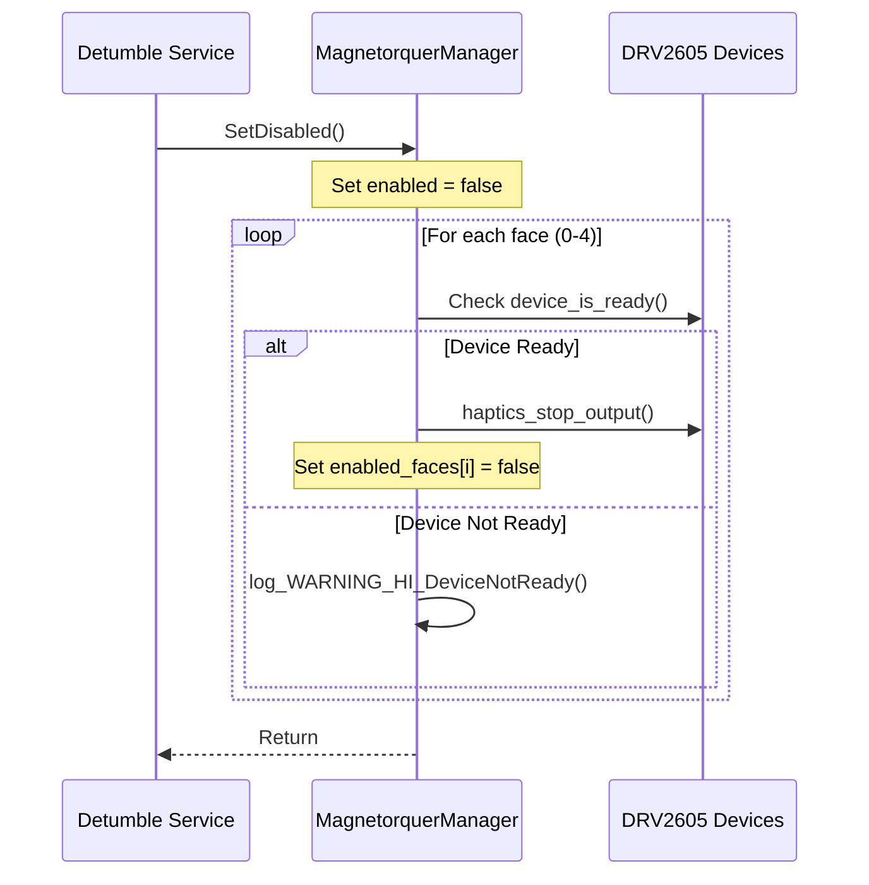

# Drv::MagnetorquerManager

The Magnetorquer Manager component interfaces with the five DRV2605 devices on a PROVES CubeSat to control the current of the magnetorquers.

## Usage Examples

This component is designed to be used by the detumble service to be able to detumble the cubesat when launched.

### Diagrams

### Typical Usage

1. The component is instantiated and initialized during system startup
2. The component is configured with the DRV2605 devices via the `configure()` method
3. The component is periodically called via the `run` scheduler port
4. The detumble service calls the `SetMagnetorquers` input port to enable/disable specific faces
5. On each `run` cycle:
   - The component checks which faces are enabled
   - For each enabled face, it starts haptic output on the corresponding device
6. When magnetorquers need to be disabled, the detumble service calls the `SetDisabled` input port

## Class Diagram

## Port Descriptions

| Name             | Description                                                                                  |
| ---------------- | -------------------------------------------------------------------------------------------- |
| SetMagnetorquers | Input port that takes in an array (bool[5]) to enable/disable each face (x1, x2, y1, y2, z1) |
| SetDisabled      | Input port to disable all magnetorquers and stop haptic output                               |
| run              | Scheduler port called periodically to start haptic output on enabled faces                   |

## Sequence Diagrams

### SetMagnetorquers Operation

### SetDisabled Operation

## Commands

This component does not define any commands.

## Events

| Name           | Description                                                                   |
| -------------- | ----------------------------------------------------------------------------- |
| DeviceNotReady | Output whenever a magnetorquer is attempted to be used while it is not ready. |

## Requirements

Add requirements in the chart below
| Name | Description | Validation |
|---|---|---|
|---|---|---|

## Change Log

| Date       | Description            |
| ---------- | ---------------------- |
| 11/25/2025 | Initial implementation |
