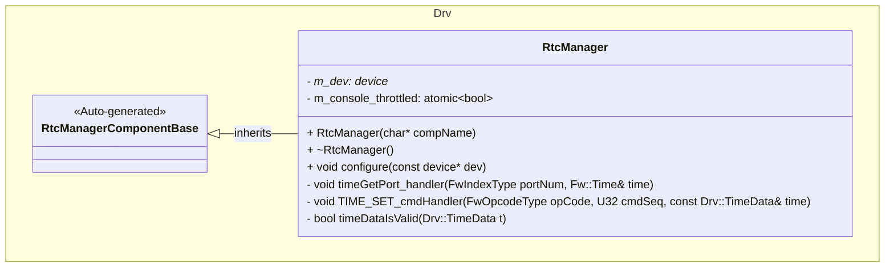
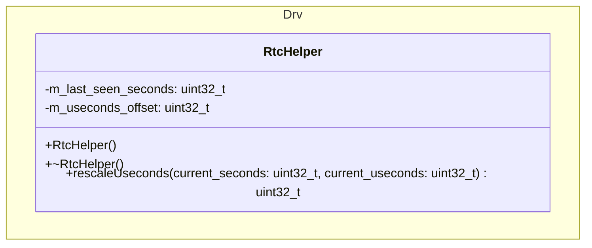
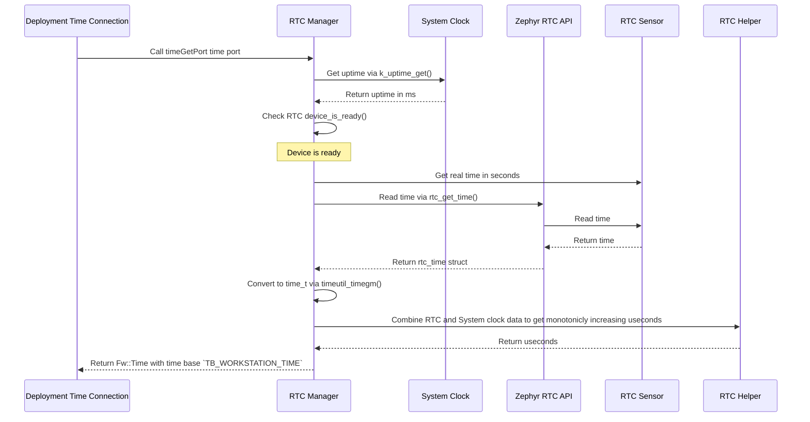
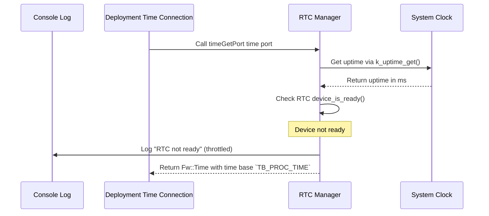
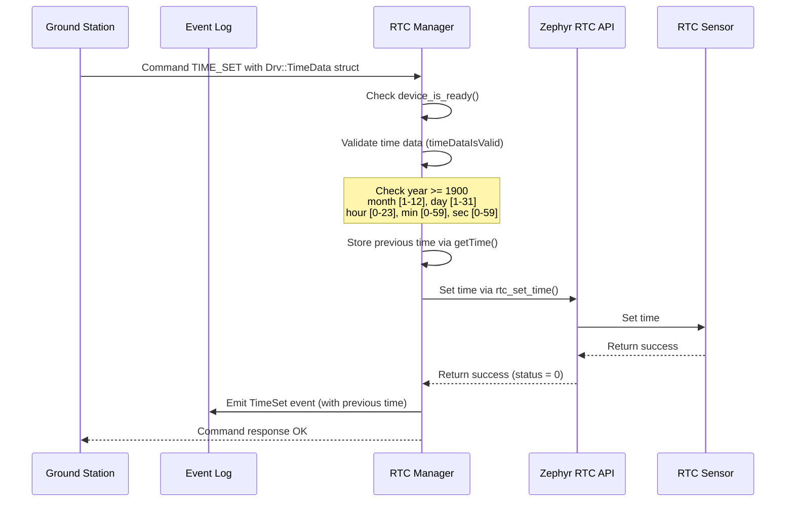
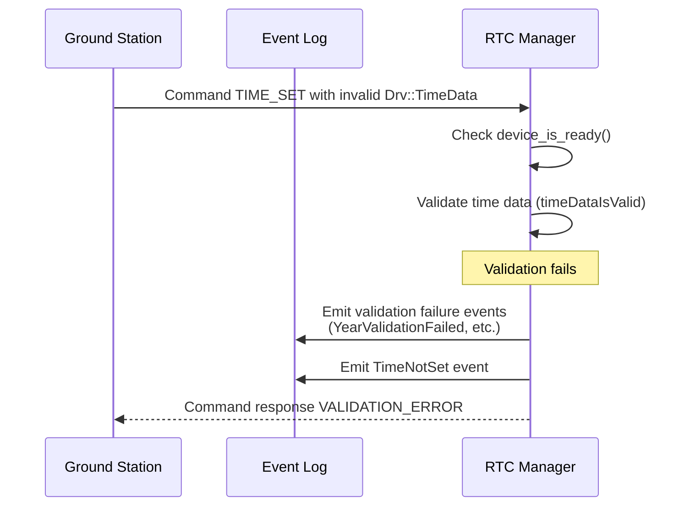
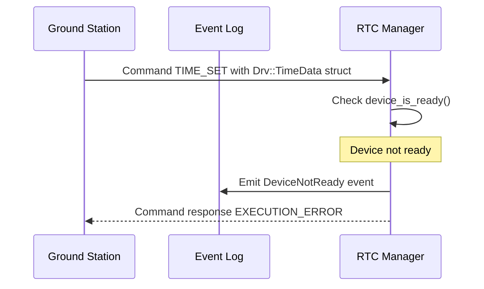
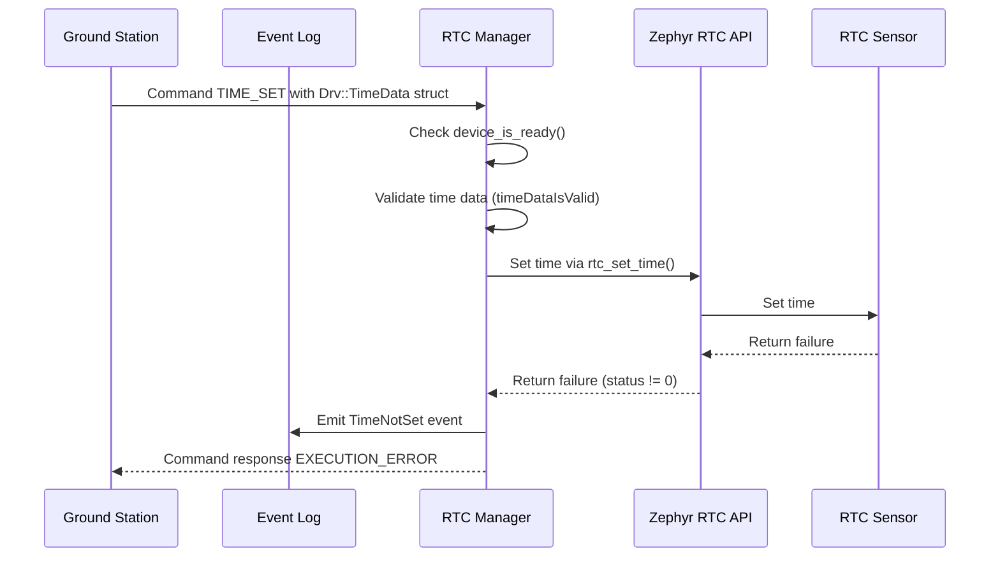

# Components::RtcManager

The RTC Manager component interfaces with the Real Time Clock (RTC) to provide time measurements. When the RTC is unavailable, the component automatically fails over to monotonic time (uptime since boot) to ensure continuous system operation.

### Typical Usage

#### `TIME_SET` Command Usage
1. The component is instantiated and initialized during system startup
2. A ground station sends a `TIME_SET` command with the desired time
3. On each command, the component:
    - Validates the time data (year >= 1900, month [1-12], day [1-31], hour [0-23], minute [0-59], second [0-59])
    - Emits validation failure events if any field is invalid
    - Sets the time on the RTC if validation passes
    - Emits a `TimeSet` event with the previous time if the time is set successfully
    - Emits a `TimeNotSet` event if the time is not set successfully
    - Emits a `DeviceNotReady` event if the device is not ready

#### `timeGetPort` Port Usage
1. The component is instantiated and initialized during system startup
2. In a deployment topology, a `time connection` relation is made to sync FPrime's internal clock
3. On each call, the component:
    - Checks if the RTC device is ready
    - If the RTC is ready:
        - Fetches time from the RTC hardware
        - Computes a rescaled microsecond value using the system cycle counter
        - Returns time with `TB_WORKSTATION_TIME` time base
    - If the RTC is not ready (failover mode):
        - Logs a warning message (throttled to prevent console flooding)
        - Fetches monotonic uptime from the system
        - Computes a rescaled microsecond value using the system cycle counter
        - Returns time with `TB_PROC_TIME` time base (uptime since boot)
    - Uses an internal offset and modulo arithmetic to keep microseconds in `[0, 999_999]` while ensuring sub-second monotonicity for each time base

### Sub-second Monotonicity Behavior

To ensure that `Fw::Time` always has a valid, non-decreasing microsecond field:

- On the first call to the `timeGetPort` for any one second of time passed on the real time clock:
  - Captures microseconds since boot value derived from the hardware cycle counter
  - Stores this as `m_offset_useconds`
- For each subsequent `timeGetPort` call during the same second:
  - Reads the current microseconds since boot from the cycle counter
  - Forms an adjusted value `(current_useconds - m_offset_useconds)` and applies modulo `1_000_000`
  - Uses the result as the `useconds` field in `Fw::Time`

This guarantees:

- `0 <= useconds <= 999_999` for all returned times (satisfies `FW_ASSERT(useconds < 1000000, ...)`)
- No backward jumps in the sub-second field for a given time base, until natural wrap at one second

This logic applies both when using the RTC (`TB_WORKSTATION_TIME`) and when in failover mode using uptime (`TB_PROC_TIME`).

## Requirements
| Name | Description | Validation |
|---|---|---|
| RtcManager-001 | The RTC Manager has a command that sets the time on the RTC | Integration test |
| RtcManager-002 | The RTC Manager has a port which, when called, returns the time from the RTC or uptime | Integration test |
| RtcManager-003 | The RTC Manager logs a warning when the RTC is not ready and falls back to monotonic time | Integration test |
| RtcManager-004 | A time set event is emitted if the time is set successfully, including the previous time | Integration test |
| RtcManager-005 | A time not set event is emitted if the time is not set successfully | Integration test |
| RtcManager-006 | The RTC Manager validates time data and emits validation failure events for invalid fields | Integration test |
| RtcManager-007 | The RTC Manager provides uptime when the RTC device is unavailable | Integration test |
| RtcManager-008 | Time increments continuously regardless of RTC availability | Integration test |
| RtcManager-009 | The sub-second microseconds field is always in the range [0, 999999] | Unit tests |
| RtcManager-010 | Time is monotonic | Integration test |

## Port Descriptions
| Name | Description |
|---|---|
| timeGetPort | Time port for FPrime topology connection to get the time from the RTC |

## Commands
| Name | Description |
|---|---|
| TIME_SET | Sets the time on the RTC with validation of all time fields |

## Events
| Name | Description |
|---|---|
| DeviceNotReady | Emitted when the RTC device is not ready during TIME_SET command |
| TimeSet | Emitted on successful time set, includes previous time (seconds and microseconds) |
| TimeNotSet | Emitted on unsuccessful time set |
| YearValidationFailed | Emitted when provided year is invalid (should be >= 1900) |
| MonthValidationFailed | Emitted when provided month is invalid (should be [1-12]) |
| DayValidationFailed | Emitted when provided day is invalid (should be [1-31]) |
| HourValidationFailed | Emitted when provided hour is invalid (should be [0-23]) |
| MinuteValidationFailed | Emitted when provided minute is invalid (should be [0-59]) |
| SecondValidationFailed | Emitted when provided second is invalid (should be [0-59]) |

## Class Diagram

### RTC Manager Class Diagram

### RTC Helper Class Diagram

## Sequence Diagrams

### `timeGetPort` port

The `timeGetPort` port is called from a `time connection` in a deployment topology to sync the RTC's time with FPrime's internal clock. The component automatically falls back to uptime if the RTC is unavailable.

#### Success (RTC Available)

#### Failover to Monotonic Time (RTC Unavailable)

### `TIME_SET` Command

The `TIME_SET` command is called to set the current time on the RTC. The component validates all time fields before attempting to set the time.

#### Success

#### Validation Failure

#### Device Not Ready

#### Time Not Set (RTC Failure)

## Change Log

| Date | Description |
|---|---|
| 2025-9-18 | Initial RTC Manager component |
| 2025-11-14 | Added monotonic time failover when RTC unavailable, input validation for TIME_SET command, TEST_UNCONFIGURE_DEVICE test command, and console logging for device not ready conditions |
| 2025-12-26 | Ensured sub-second time is monotonic; added unit tests for sub-second time calculation; removed TEST_UNCONFIGURE_DEVICE |
