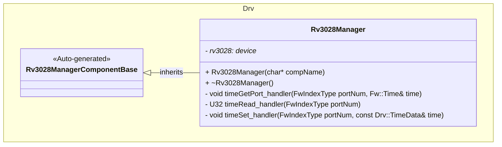
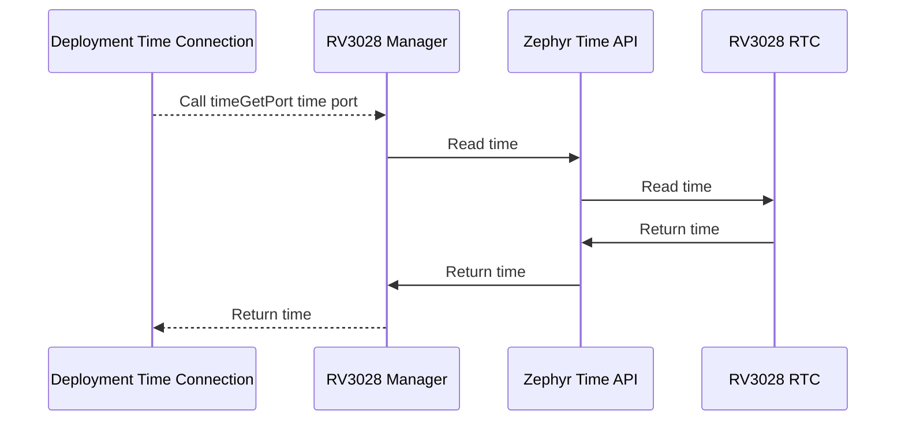
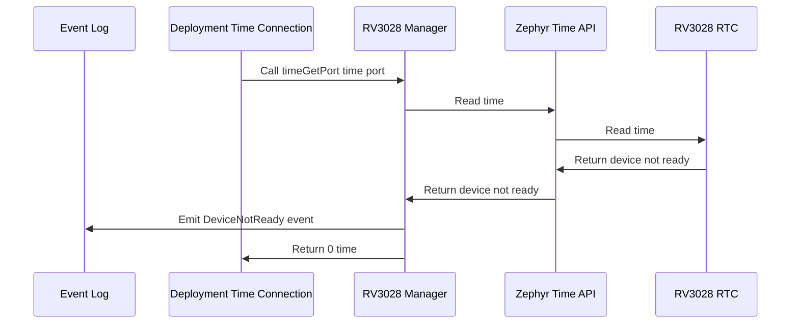
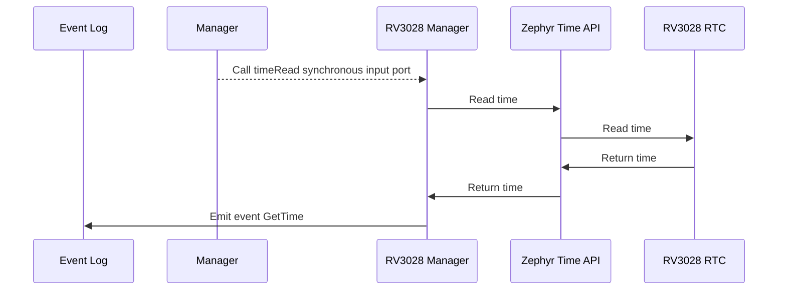
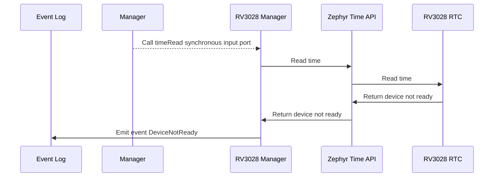
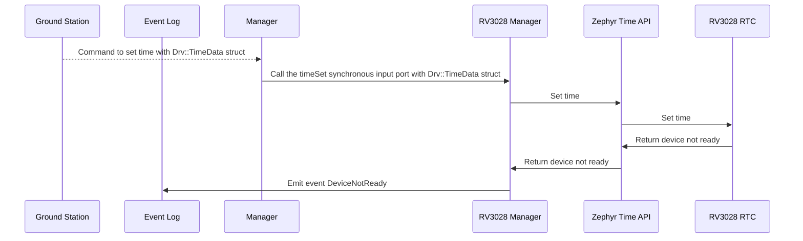
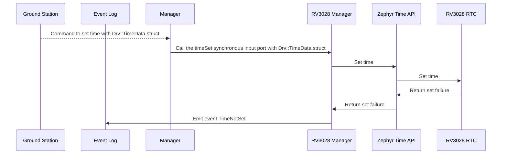

# Components::Rv3028Manager

The RV3028 Manager component interfaces with the RV3028 Real Time Clock (RTC) to provide time measurements.

### Typical Usage

#### `timeGetPort` Port Usage
1. The component is instantiated and initialized during system startup
2. In a deployment topology, a `time connection` is made to the component's `timeGetPort` port

#### `timeRead` Port Usage
1. The component is instantiated and initialized during system startup
2. A manager calls the `timeRead` ports
3. On each call, the component:
    - Fetches and returns the time from the RV3028 RTC
    - Emits a `DeviceNotReady` event if the device is not ready

#### `timeSet` Port Usage
1. The component is instantiated and initialized during system startup
2. A manager calls the `timeSet` ports
3. On each call, the component:
    - Sets the time on the RV3028 RTC
    - Emits a `TimeSet` event if the time is set successfully
    - Emits a `TimeNotSet` event if the time is not set successfully
    - Emits a `DeviceNotReady` event if the device is not ready

## Requirements
| Name | Description | Validation |
|---|---|---|
| Rv3028Manager-001 | Time can be set on the RV3028 through a port | Manual |
| Rv3028Manager-002 | Time can be read from the RV3028 through a port | Manual |
| Rv3028Manager-003 | A device not ready event is emitted if the RV3028 is not ready | Manual |
| Rv3028Manager-004 | A time set event is emitted if the time is set successfully | Manual |
| Rv3028Manager-005 | A time not set event is emitted if the time is not set successfully | Manual |

## Port Descriptions
| Name | Description |
|---|---|
| timeGetPort | Time port for FPrime topology connection to get the time from the RV3028 |
| timeSet | Input port sets the time on the RV3028 |
| timeRead | Input port reads the time from the RV3028 |

## Events
| Name | Description |
|---|---|
| DeviceNotReady | Emits on unsuccessful device connection |
| TimeSet | Emits on successful time set |
| TimeNotSet | Emits on unsuccessful time set |

## Class Diagram

## Sequence Diagrams

### `timeGetPort` port

The `timeGetPort` port is called from a `time connection` in a deployment topology to sync the RTC's time with FPrime's internal clock.

#### Success

#### Device Not Ready

### `timeRead` port

The `timeRead` port is called from a manager component to get the current time from the RTC.

#### Success

#### Device Not Ready

### `timeSet` port

The `timeSet` port is called from a manager component to set the current time on the RTC.

#### Success

#### Device Not Ready

#### Time Not Set

## Change Log
| Date | Description |
|---|---|
| 2025-9-18 | Initial RV3028 Manager component |
