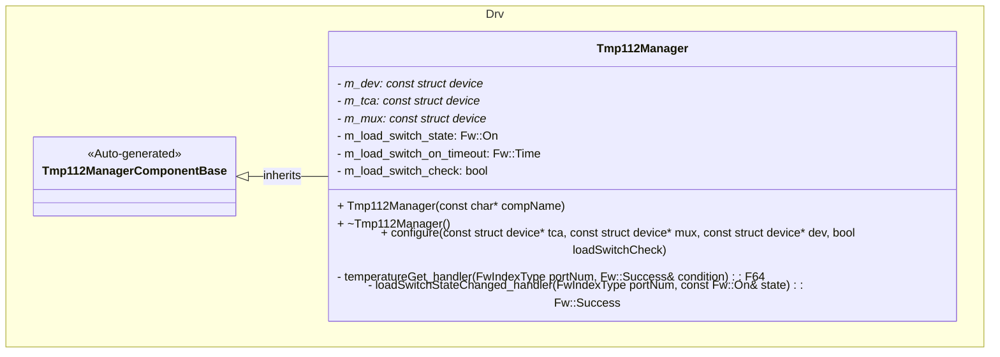
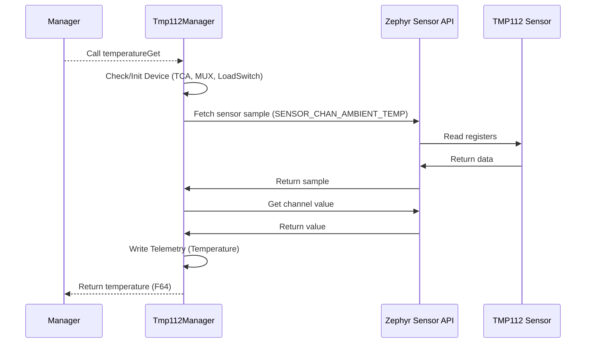

# Drv::Tmp112Manager

The TMP112 Manager component interfaces with the TMP112 sensor to provide ambient temperature measurements.

## Usage Examples

The TMP112 Manager component is designed to be called periodically or on demand to collect and return sensor data. It operates as a passive component that responds to manager calls.

### Typical Usage

1. The component is instantiated and initialized during system startup.
2. A manager calls the input port: `temperatureGet`.
3. On each call, the component:
   - Checks if the device is initialized and ready (including TCA, MUX, and Load Switch status).
   - Fetches fresh sensor samples.
   - Writes telemetry data.
   - Returns the temperature value in degrees Celsius.

## Class Diagram

## Port Descriptions
| Name | Type | Description |
|---|---|---|
| temperatureGet | sync input | Reads the temperature in degrees Celsius. |
| loadSwitchStateChanged | sync input | Initializes and deinitializes the TMP112 device on load switch state change. |

## Sequence Diagrams

### temperatureGet

## Events
| Name | Description |
|---|---|
| DeviceNotReady | TMP112 device not ready |
| DeviceInitFailed | TMP112 initialization failed |
| DeviceNil | TMP112 device is nil |
| DeviceStateNil | TMP112 device state is nil |
| TcaUnhealthy | TMP112 TCA device is unhealthy |
| MuxUnhealthy | TMP112 MUX device is unhealthy |
| LoadSwitchNotReady | TMP112 Load Switch is not ready |
| SensorSampleFetchFailed | TMP112 sensor fetch failed |
| SensorChannelGetFailed | TMP112 sensor channel get failed |

## Telemetry
| Name | Description |
|---|---|
| Temperature | Temperature in degrees Celsius |

## Requirements
| Name | Description | Validation |
|---|---|---|
| TemperatureGet Port | The component shall provide access to temperature sensor data and return in degrees Celsius | Verify output matches expected values from sensor datasheet |
| LoadSwitchStateChanged Port | The component shall manage device initialization based on load switch state | Verify device initializes when switch is ON and deinitializes when OFF |

## Change Log
| Date | Description |
|---|---|
| 2025-12-04 | Initial TMP112 Manager component SDD |
