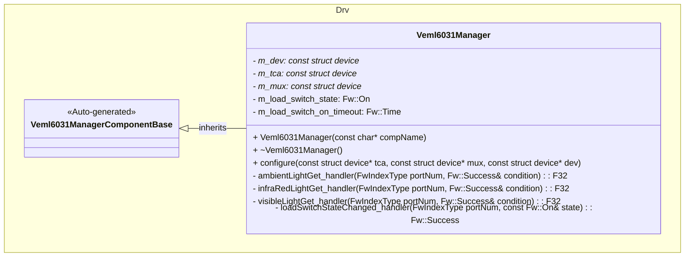
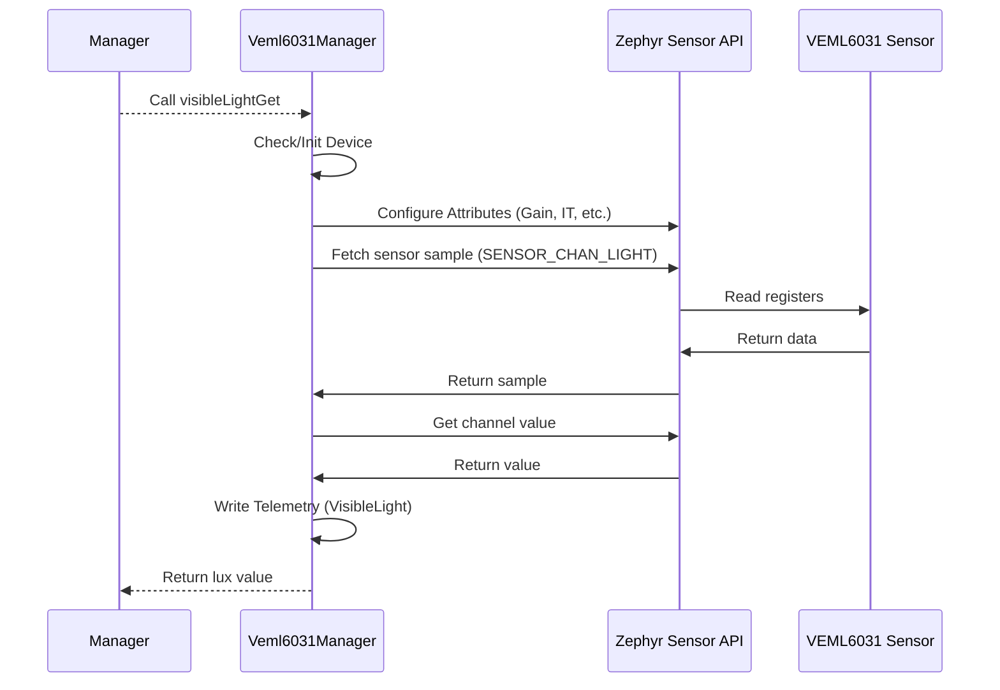

# Drv::Veml6031Manager

The VEML6031 Manager component interfaces with the VEML6031 sensor to provide visible light, infrared light, and ambient light measurements.

## Usage Examples

The VEML6031 Manager component is designed to be called periodically or on demand to collect and return sensor data. It operates as a passive component that responds to manager calls.

### Typical Usage

1. The component is instantiated and initialized during system startup.
2. A manager calls any of the input ports: `visibleLightGet`, `infraRedLightGet`, or `ambientLightGet`.
3. On each call, the component:
   - Checks if the device is initialized and ready.
   - Configures sensor attributes (Gain, Integration Time, etc.) based on parameters.
   - Fetches fresh sensor samples.
   - Writes telemetry data.
   - Returns the light value in lux.

## Class Diagram

## Port Descriptions
| Name | Type | Description |
|---|---|---|
| visibleLightGet | sync input | Reads the illuminance in visible spectrum, in lux. |
| infraRedLightGet | sync input | Reads the illuminance in infra-red spectrum, in lux. |
| ambientLightGet | sync input | Reads the ambient illuminance in visible spectrum, in lux. |
| loadSwitchStateChanged | sync input | Initializes and deinitializes the VEML6031 device on load switch state change. |

## Sequence Diagrams

### visibleLightGet

## Parameters
| Name | Description |
|---|---|
| GAIN | Gain settings for VEML6031 sensor |
| INTEGRATION_TIME | Integration time settings (IT) |
| EFFECTIVE_PHOTODIODE_SIZE | Effective photodiode size (DIV4) |
| ALS_PERSISTENCE_PROTECT_NUMBER | Ambient Light Sensor (ALS) persistence protect number (PERS) |

## Commands
| Name | Description |
|---|---|
| GetVisibleLight | Command to get the visible light measurement in lux |
| GetInfraRedLight | Command to get the infra-red light measurement in lux |
| GetAmbientLight | Command to get the ambient light measurement in lux |

## Events
| Name | Description |
|---|---|
| DeviceNotReady | VEML6031 device not ready |
| DeviceInitFailed | VEML6031 initialization failed |
| DeviceNil | VEML6031 device is nil |
| DeviceStateNil | VEML6031 device state is nil |
| TcaUnhealthy | VEML6031 TCA device is unhealthy |
| MuxUnhealthy | VEML6031 MUX device is unhealthy |
| LoadSwitchNotReady | VEML6031 Load Switch is not ready |
| SensorSampleFetchFailed | VEML6031 sensor fetch failed |
| SensorChannelGetFailed | VEML6031 sensor channel get failed |
| InvalidGainParam | VEML6031 invalid gain parameter |
| InvalidIntegrationTimeParam | VEML6031 invalid integration time parameter |
| InvalidDiv4Param | VEML6031 invalid effective photodiode size parameter |
| SensorAttrSetFailed | VEML6031 sensor attribute set failed |
| VisibleLightLux | VEML6031 visible light measured in lux |
| InfraRedLightLux | VEML6031 infra-red light measured in lux |
| AmbientLightLux | VEML6031 ambient light measured in lux |

## Telemetry
| Name | Description |
|---|---|
| VisibleLight | Illuminance in the visible spectrum, in lux |
| InfraRedLight | Illuminance in the infra-red spectrum, in lux |
| AmbientLight | Ambient illuminance in visible spectrum, in lux |

## Requirements
| Name | Description | Validation |
|---|---|---|
| VisibleLightGet Port | The component shall provide access to visible light sensor data and return in lux | Verify output matches expected values from sensor datasheet |
| InfraRedLightGet Port | The component shall provide access to infra-red light sensor data and return in lux | Verify output matches expected values from sensor datasheet |
| AmbientLightGet Port | The component shall provide access to ambient light sensor data and return in lux | Verify output matches expected values from sensor datasheet |
| LoadSwitchStateChanged Port | The component shall manage device initialization based on load switch state | Verify device initializes when switch is ON and deinitializes when OFF |

## Change Log
| Date | Description |
|---|---|
| 2025-12-04 | Initial VEML6031 Manager component SDD |
