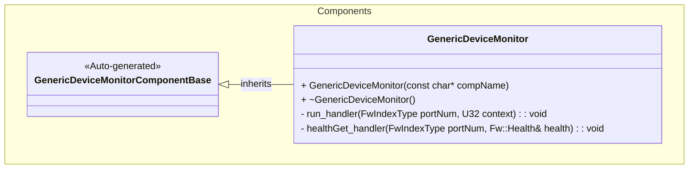
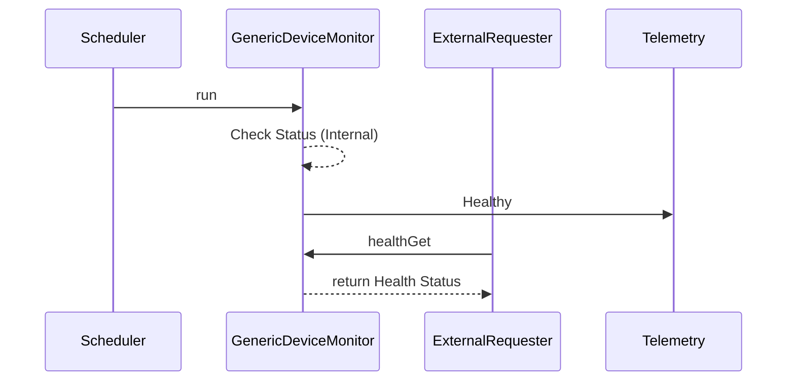

# Components::GenericDeviceMonitor

Generic Device Health Reporter

## Usage Examples

The GenericDeviceMonitor component is designed to monitor and report the health status of simple devices that do not require complex interactivity. It can be scheduled to periodically check or report status, and it provides a port for external components to query its health.

### Typical Usage

1.  The component is instantiated and connected to a rate group and/or a health monitoring service.
2.  The scheduler calls the `run` port.
3.  External components can call the `healthGet` port to retrieve the current health status.
4.  The component emits telemetry indicating its health status (`Healthy`).
5.  If the device is not ready, it emits a `DeviceNotReady` event.

## Class Diagram

## Port Descriptions
| Name | Type | Description |
|---|---|---|
| run | sync input | Port receiving calls from the rate group |
| healthGet | sync input | Port receiving calls to request device health |
| timeCaller | time get | Port for requesting the current time |
| logTextOut | text event | Port for sending textual representation of events |
| logOut | event | Port for sending events to downlink |
| tlmOut | telemetry | Port for sending telemetry channels to downlink |

## Component States
The component is stateless in terms of FSM, but tracks the health status of the monitored device.

## Sequence Diagrams

## Parameters
None

## Commands
None

## Events
| Name | Description |
|---|---|
| DeviceNotReady | Event indicating device not ready |

## Telemetry
| Name | Description |
|---|---|
| Healthy | Telemetry showing device health |

## Unit Tests
| Name | Description |
|---|---|
| TestHealthReporting | Verify health status reporting via telemetry |

## Requirements
| Name | Description | Validation |
|---|---|---|
| Health Reporting | The component shall report the health status of the monitored device via telemetry | Verify `Healthy` telemetry channel |
| Health Query | The component shall respond to health queries via the `healthGet` port | Verify `healthGet` port return value |
| Error Reporting | The component shall emit an event if the device is not ready | Verify `DeviceNotReady` event |

## Change Log
| Date | Description |
|---|---|
| 2025-11-30 | Initial Draft |
