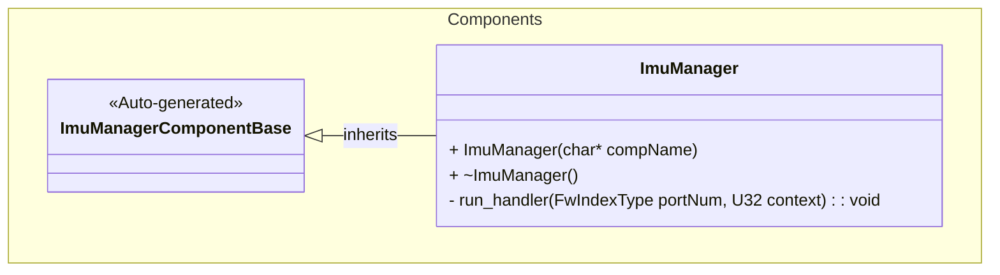
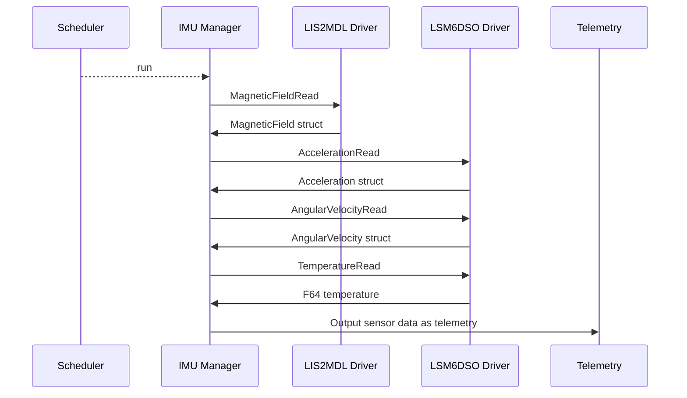

# Components::ImuManager

The IMU Manager (Inertial Measurement Unit) component provides sensor data related to motion and orientation of the craft. It interfaces with two drivers: the LIS2MDL Driver and the LSM6DSO Driver which provide acceleration, angular velocity, magnetic field, and temperature measurements.

## Usage Examples

The IMU Manager component is designed to be scheduled periodically to collect sensor data and output telemetry. It operates as a passive component that responds to scheduler calls.

### Typical Usage

1. The component is instantiated and initialized during system startup
2. The scheduler calls the `run` port at regular intervals
3. On each run call, the component:
   - Fetches sensor data from both the LIS2MDL Driver and LSM6DSO Driver
   - Outputs telemetry for acceleration, angular velocity, magnetic field, and temperature

## Class Diagram

## Port Descriptions
| Name | Type | Description |
|---|---|---|
| run | sync input | Scheduler port that triggers sensor data collection and telemetry output |
| timeCaller | time get | Port for requesting current system time |
| tlmOut | telemetry | Port for sending telemetry data to downlink |

## Sequence Diagrams

## Telemetry
| Name | Description |
|---|---|
| Acceleration | Telemetry channel for acceleration in m/s^2 |
| AngularVelocity | Telemetry channel for angular velocity in rad/s |
| MagneticField | Telemetry channel for magnetic field in gauss |
| Temperature | Telemetry channel for temperature in degrees Celsius |

## Requirements
Add requirements in the chart below
| Name | Description | Validation |
|---|---|---|
| Acceleration Telemetry | The component shall provide acceleration telemetry in m/s^2 | Verify telemetry output matches expected values from sensor datasheet |
| Angular Velocity Telemetry | The component shall provide angular velocity telemetry in rad/s | Verify telemetry output matches expected values from sensor datasheet |
| Magnetic Field Telemetry | The component shall provide magnetic field telemetry in gauss | Verify telemetry output matches expected values from sensor datasheet |
| Temperature Telemetry | The component shall provide temperature telemetry in degrees Celsius | Verify telemetry output matches expected values from sensor datasheet |

## Change Log
| Date | Description |
|---|---|
| 2025-9-9 | Initial IMU Manager component |
| 2025-9-18 | Extracted Zephyr calls to discrete LIS2MDL Driver and LSM6DSO Driver |
