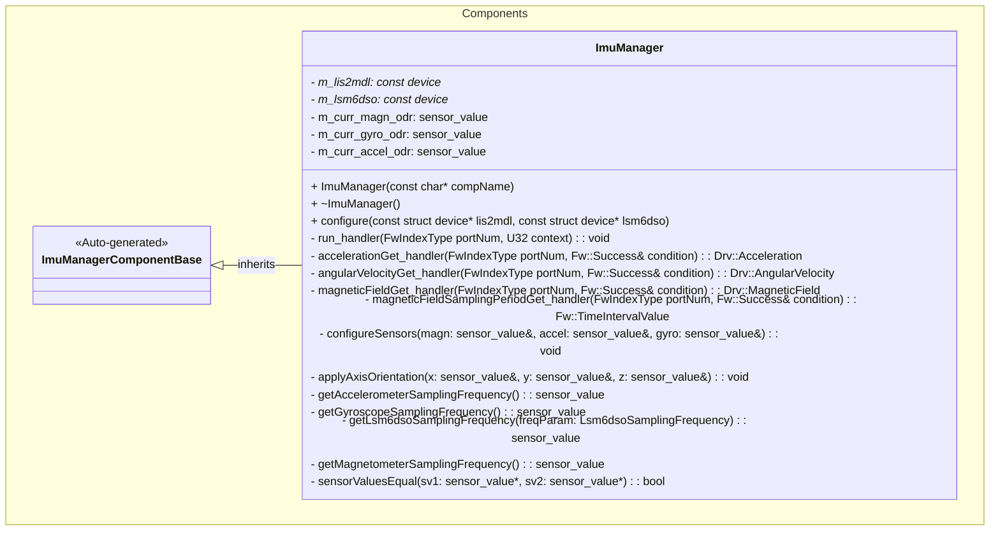

# Components::ImuManager

The IMU Manager (Inertial Measurement Unit) component provides sensor data related to motion and orientation of the craft. It interfaces with the LIS2MDL and LSM6DSO sensors via Zephyr drivers to provide acceleration, angular velocity, and magnetic field measurements. It also supports configuration of sampling frequencies and axis orientation.

## Usage Examples

The IMU Manager component is designed to be scheduled periodically to trigger collection of sensor data and telemetering. It operates as a passive component that responds to scheduler calls.

### Typical Usage

1. The component is instantiated and initialized during system startup.
2. The component is configured with pointers to the Zephyr devices for LIS2MDL and LSM6DSO.
3. The scheduler calls the `run` port at regular intervals.
4. On each run call, the component:
   - Fetches sensor data from the sensors.
   - Applies axis orientation corrections.
   - Outputs telemetry for acceleration, angular velocity, and magnetic field.

## Class Diagram

## Port Descriptions

| Name                        | Type        | Description                                                |
| --------------------------- | ----------- | ---------------------------------------------------------- |
| run                         | sync input  | Scheduler port that triggers sensor data collection        |
| accelerationGet             | sync input  | Port to read the current acceleration                      |
| angularVelocityGet          | sync input  | Port to read the current angular velocity                  |
| magneticFieldGet            | sync input  | Port to read the current magnetic field                    |
| magneticFieldSamplingPeriodGet | sync input | Port to get the time between magnetic field reads       |
| acceleration                | output      | Port for sending accelerationGet calls to the LSM6DSO Driver |
| angularVelocity             | output      | Port for sending angularVelocityGet calls to the LSM6DSO Driver |
| magneticField               | output      | Port for sending magneticFieldGet calls to the LIS2MDL Manager |
| timeCaller         | time get   | Port for requesting current system time                    |
| cmdRegOut          | command reg| Port for sending command registrations                     |
| cmdIn              | command recv| Port for receiving commands                               |
| cmdResponseOut     | command resp| Port for sending command responses                        |
| logTextOut         | text event | Port for sending textual representation of events          |
| logOut             | event      | Port for sending events to downlink                        |
| tlmOut             | telemetry  | Port for sending telemetry channels to downlink            |
| prmGetOut          | param get  | Port to return the value of a parameter                    |
| prmSetOut          | param set  | Port to set the value of a parameter                       |

## Parameters

| Name | Type | Description |
| --- | --- | --- |
| ACCELEROMETER_SAMPLING_FREQUENCY | Lsm6dsoSamplingFrequency | Sampling frequency for the accelerometer |
| GYROSCOPE_SAMPLING_FREQUENCY | Lsm6dsoSamplingFrequency | Sampling frequency for the gyroscope |
| MAGNETOMETER_SAMPLING_FREQUENCY | Lis2mdlSamplingFrequency | Sampling frequency for the magnetometer |
| AXIS_ORIENTATION | AxisOrientation | Orientation of the sensor axes (Standard, Rotated 90 CW, Rotated 90 CCW, Rotated 180) |

## Telemetry

| Name                         | Type                    | Description |
| ---                          | ---                     | --- |
| AxisOrientation              | AxisOrientation         | Current axis orientation setting |
| Acceleration                 | Drv.Acceleration        | Current acceleration in m/s^2 |
| AngularVelocity              | Drv.AngularVelocity     | Current angular velocity in rad/s |
| MagneticField                | Drv.MagneticField       | Current magnetic field in gauss |
| AccelerometerSamplingFrequency | Lsm6dsoSamplingFrequency | Current accelerometer sampling frequency |
| GyroscopeSamplingFrequency   | Lsm6dsoSamplingFrequency | Current gyroscope sampling frequency |
| MagnetometerSamplingFrequency | Lis2mdlSamplingFrequency | Current magnetometer sampling frequency |

## Events

| Name                                | Severity      | Description |
| ---                                 | ---           | --- |
| Lis2mdlDeviceNotReady               | WARNING_HIGH  | LIS2MDL device not ready |
| Lsm6dsoDeviceNotReady               | WARNING_HIGH  | LSM6DSO device not ready |
| AccelerometerSamplingFrequencyNotConfigured | WARNING_HIGH  | LSM6DSO accelerometer sampling frequency not configured |
| GyroscopeSamplingFrequencyNotConfigured     | WARNING_HIGH  | LSM6DSO gyroscope sampling frequency not configured |
| MagnetometerSamplingFrequencyNotConfigured  | WARNING_HIGH  | LIS2MDL magnetometer sampling frequency not configured |
| MagnetometerSamplingFrequencyGetFailed      | WARNING_LOW   | Failed to retrieve LIS2MDL magnetometer sampling frequency |
| MagnetometerSamplingFrequencyZeroHz         | WARNING_LOW   | LIS2MDL magnetometer sampling frequency is set to 0 Hz |

## Requirements

| Name                   | Description                                                                                          | Validation                                             |
| ---------------------- | ---------------------------------------------------------------------------------------------------- | ------------------------------------------------------ |
| Sensor Data Collection | The component shall trigger data collection from both LSM6DSO and LIS2MDL sensors when run is called | Verify telemetry output updates on run call            |
| Periodic Operation     | The component shall operate as a scheduled component responding to scheduler calls                   | Verify component responds correctly to scheduler input |
| Configuration          | The component shall allow configuration of sampling frequencies and axis orientation via parameters  | Verify parameters affect sensor configuration and data |

## Change Log

| Date      | Description                                                           |
| --------- | --------------------------------------------------------------------- |
| 2025-9-9  | Initial IMU Manager component                                         |
| 2025-9-18 | Extracted Zephyr calls to discrete LIS2MDL Manager and LSM6DSO Driver |
| 2025-12-12| Added configuration parameters for sampling rates and axis orientation; moved responsibilities from LIS2MDL Manager and LIS2MDL Manager components into the IMU Manager |
