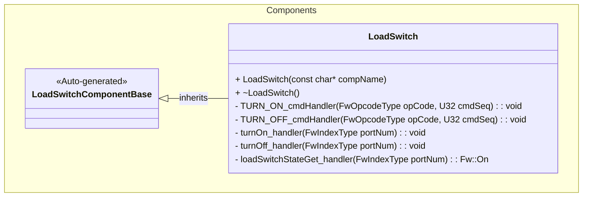

# Components::LoadSwitch

## Overview

The `LoadSwitch` component is an active F' component that controls a single load switch output
through the `gpioSet` output port (connected to the platform's GPIO driver). It exposes two
async commands to turn the switch on and off, telemetry reporting the current state. It also provides ports
to control the switch and query its state from other components.

## Responsibility

- Control the power rail for a connected peripheral by asserting/deasserting a GPIO.
- Report state changes via an event and telemetry channel.
- Provide an interface for other components to control and query the switch state.

## Class Diagram

## External interface

### Commands

| Name | Description | Implementation notes |
|---|---|---|
| TURN_ON | Turn on the associated power rail | `TURN_ON_cmdHandler` sets the gpio via `gpioSet_out(0, Fw::Logic::HIGH)`, emits `StatusChanged` (ON), updates `IsOn` telemetry, replies OK. |
| TURN_OFF | Turn off the associated power rail | `TURN_OFF_cmdHandler` sets the gpio via `gpioSet_out(0, Fw::Logic::LOW)`, emits `StatusChanged` (OFF), updates `IsOn` telemetry, replies OK. |

### Telemetry

| Name | Type | Description |
|---|---:|---|
| IsOn | Fw.On | Current power state; written after commands. Note: Reports ON only after a stabilization delay (default 1s) following the turn-on command. |

### Events

| Name | Severity | ID | Format |
|---|---|---:|---|
| StatusChanged | activity high | 1 | "Load switch state changed to {}" |

The component logs the `StatusChanged` event whenever the switch transitions due to a command.

### Ports

| Port name | Direction | Port type | Notes |
|---|---|---|---|
| gpioSet | output | Drv.GpioWrite | Used to write the physical GPIO. Implementation always uses index 0 (`gpioSet_out(0, ...)`). |
| gpioGet | output | Drv.GpioRead | Used to read the physical GPIO state. |
| turnOn | input (sync) | Fw.Signal | Turns on the load switch. |
| turnOff | input (sync) | Fw.Signal | Turns off the load switch. |
| loadSwitchStateGet | input (sync) | loadSwitchStateGet | Returns the current state of the load switch (Fw::On). Note: Returns ON only after a stabilization delay (default 1s) following the turn-on command. |

## Requirements

| Name | Description | Validation |
|---|---|---|
| Control via Command | The component shall allow turning the load switch on and off via ground commands `TURN_ON` and `TURN_OFF`. | Integration test |
| Control via Port | The component shall allow turning the load switch on and off via input ports `turnOn` and `turnOff`. | Verify `turnOn` and `turnOff` port calls change the GPIO state and telemetry. |
| State Telemetry | The component shall report the current state of the load switch via the `IsOn` telemetry channel. | Integration test |
| State Event | The component shall emit a `StatusChanged` event when the load switch state changes. | Verify `StatusChanged` event is emitted upon state transitions. |
| State Query | The component shall provide the current state of the load switch via the `loadSwitchStateGet` port. The state shall report ON only after a configured stabilization delay. | Downstream component testing |
| GPIO Control | The component shall control the physical GPIO pin corresponding to the load switch using the `gpioSet` port. | Downstream component testing |

## Change Log

| Date | Description |
|---|---|
| 10-22-2025 | Sarah, Kevin, and MoMata's first commit |
| 11-07-2025 | Updated SDD to match implementation in `LoadSwitch.cpp/.hpp/.fpp` (commands, telemetry, event, ports, reset behavior). |
| 11-30-2025 | Added `loadSwitchStateGet` port and updated class diagram. Removed Reset capability. Added note about stabilization delay for state reporting. |
