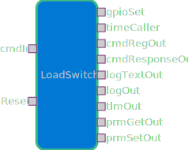

# Components::LoadSwitch

## Overview

The `LoadSwitch` component is an active F' component that controls a single load switch output
through the `gpioSet` output port (connected to the platform's GPIO driver). It exposes two
async commands to turn the switch on and off, telemetry reporting the current state, and an
async `Reset` input which toggles the switch (off, short delay, on).

## Responsibility

- Control the power rail for a connected peripheral by asserting/deasserting a GPIO.
- Report state changes via an event and telemetry channel.

## External interface

### Commands

| Name     | Description                        | Implementation notes                                                                                                                         |
| -------- | ---------------------------------- | -------------------------------------------------------------------------------------------------------------------------------------------- |
| TURN_ON  | Turn on the associated power rail  | `TURN_ON_cmdHandler` sets the gpio via `gpioSet_out(0, Fw::Logic::HIGH)`, emits `StatusChanged` (ON), updates `IsOn` telemetry, replies OK.  |
| TURN_OFF | Turn off the associated power rail | `TURN_OFF_cmdHandler` sets the gpio via `gpioSet_out(0, Fw::Logic::LOW)`, emits `StatusChanged` (OFF), updates `IsOn` telemetry, replies OK. |

### Telemetry

| Name |  Type | Description                                                        |
| ---- | ----: | ------------------------------------------------------------------ |
| IsOn | Fw.On | Current power state; written after commands and on Reset handling. |

### Events

| Name          | Severity      |  ID | Format                            |
| ------------- | ------------- | --: | --------------------------------- |
| StatusChanged | activity high |   1 | "Load switch state changed to {}" |

The component logs the `StatusChanged` event whenever the switch transitions due to a command or a Reset.

### Ports

| Port name | Direction     | Port type     | Notes                                                                                        |
| --------- | ------------- | ------------- | -------------------------------------------------------------------------------------------- |
| gpioSet   | output        | Drv.GpioWrite | Used to write the physical GPIO. Implementation always uses index 0 (`gpioSet_out(0, ...)`). |
| Reset     | input (async) | Fw.Signal     | Causes the component to perform a hardware reset sequence: LOW -> wait 100ms -> HIGH.        |

## Change Log

| Date       | Description                                                                                                            |
| ---------- | ---------------------------------------------------------------------------------------------------------------------- |
| 10-22-2025 | Sarah, Kevin, and MoMata's first commit                                                                                |
| 11-07-2025 | Updated SDD to match implementation in `LoadSwitch.cpp/.hpp/.fpp` (commands, telemetry, event, ports, reset behavior). |
