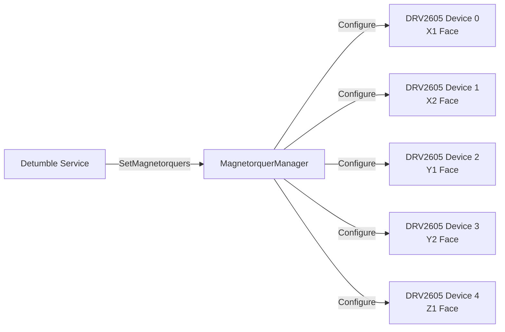
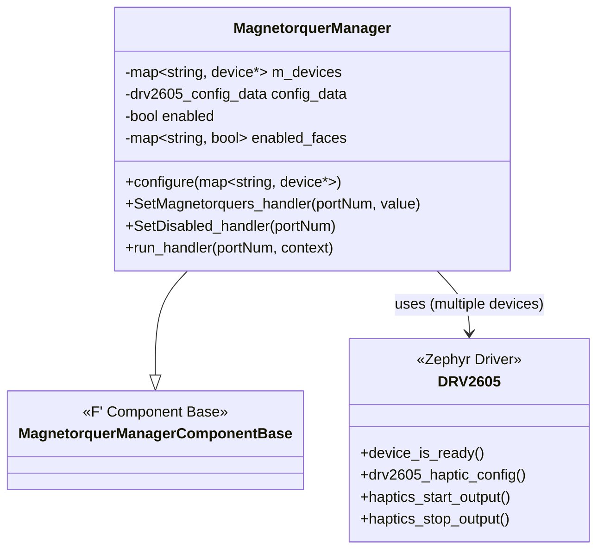
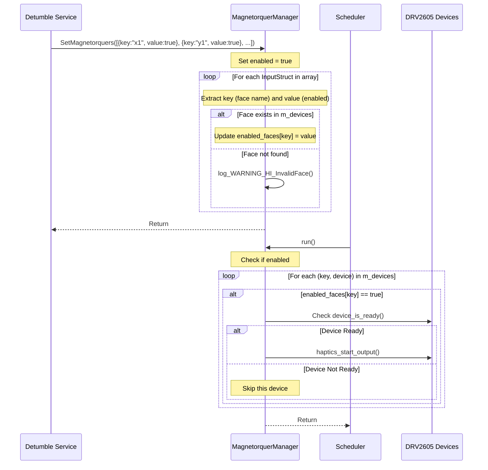
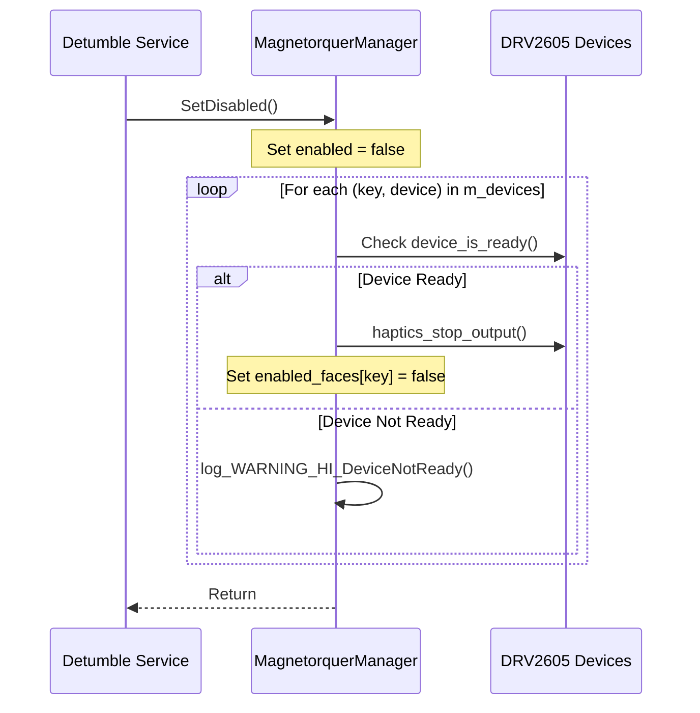

# Drv::MagnetorquerManager

The Magnetorquer Manager component interfaces with the five DRV2605 devices on a PROVES CubeSat to control the current of the magnetorquers.

## Usage Examples

This component is designed to be used by the detumble service to be able to detumble the cubesat when launched.

### Diagrams

### Typical Usage

1. The component is instantiated and initialized during system startup
2. The component is configured with a map of DRV2605 devices (face name -> device pointer) via the `configure()` method
3. The component is periodically called via the `run` scheduler port
4. The detumble service calls the `SetMagnetorquers` input port with an array of key-value pairs to enable/disable specific faces
5. On each `run` cycle:
   - The component checks if enabled
   - The component iterates through the device map
   - For each face that is enabled in `enabled_faces`, it starts haptic output on the corresponding device
6. When magnetorquers need to be disabled, the detumble service calls the `SetDisabled` input port

## Class Diagram

## Port Descriptions

| Name             | Description                                                                                                                                                                                        |
| ---------------- | -------------------------------------------------------------------------------------------------------------------------------------------------------------------------------------------------- |
| SetMagnetorquers | Input port that takes in an InputArray (array of InputStruct) with key-value pairs where key=face name (string) and value=enabled status (bool). Supports up to 10 face entries for flexibility. |
| SetDisabled      | Input port to disable all magnetorquers and stop haptic output                                                                                                                                     |
| run              | Scheduler port called periodically to start haptic output on enabled faces                                                                                                                         |

## Sequence Diagrams

### SetMagnetorquers Operation

### SetDisabled Operation

## Commands

This component does not define any commands.

## Events

| Name                | Description                                                                     |
| ------------------- | ------------------------------------------------------------------------------- |
| DeviceNotReady      | Output whenever a magnetorquer is attempted to be used while it is not ready.   |
| DeviceNotInitialized | Output when a DRV2605 device fails to initialize during configuration.         |
| InvalidFace         | Output when SetMagnetorquers receives a face name that doesn't exist in m_devices. |

## Requirements

| Name                    | Description                                                                                       | Validation       |
| ----------------------- | ------------------------------------------------------------------------------------------------- | ---------------- |
| MagnetorquerManager-001 | The Magnetorquer Manager configures all DRV2605 devices on initialization                         | Integration Test |
| MagnetorquerManager-002 | The SetMagnetorquers port allows other components to configure the on/off state of specific faces | Integration Test |
| MagnetorquerManager-003 | The SetDisabled port disables all magnetorquers and stops haptic output                           | Integration Test |
| MagnetorquerManager-004 | The run handler is called on a rate group to start haptic output on enabled faces                 | ?                |

## Change Log

| Date       | Description            |
| ---------- | ---------------------- |
| 11/30/2025 | Initial implementation |
