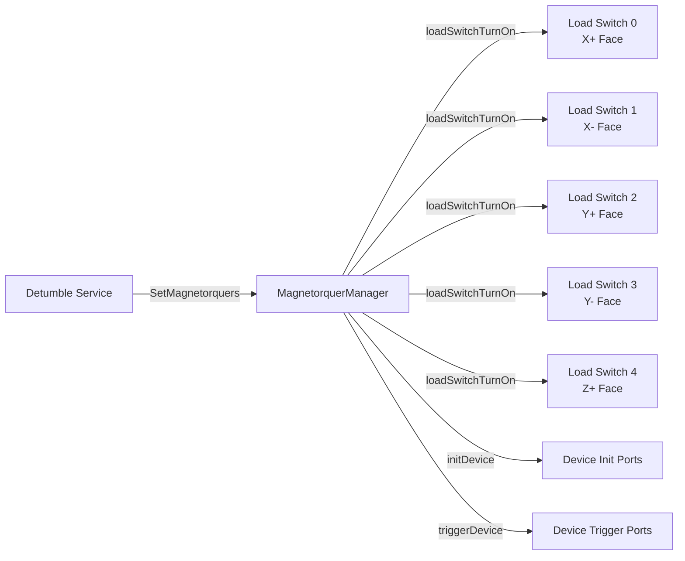
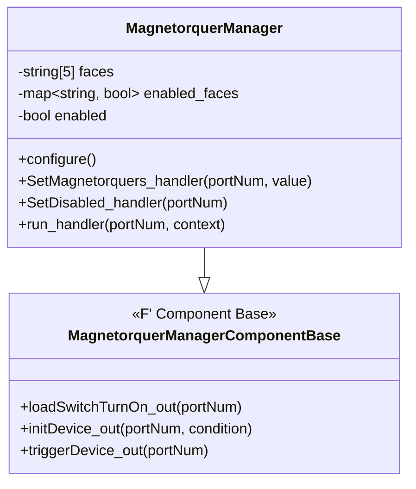
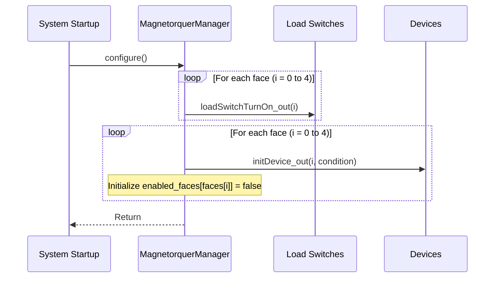
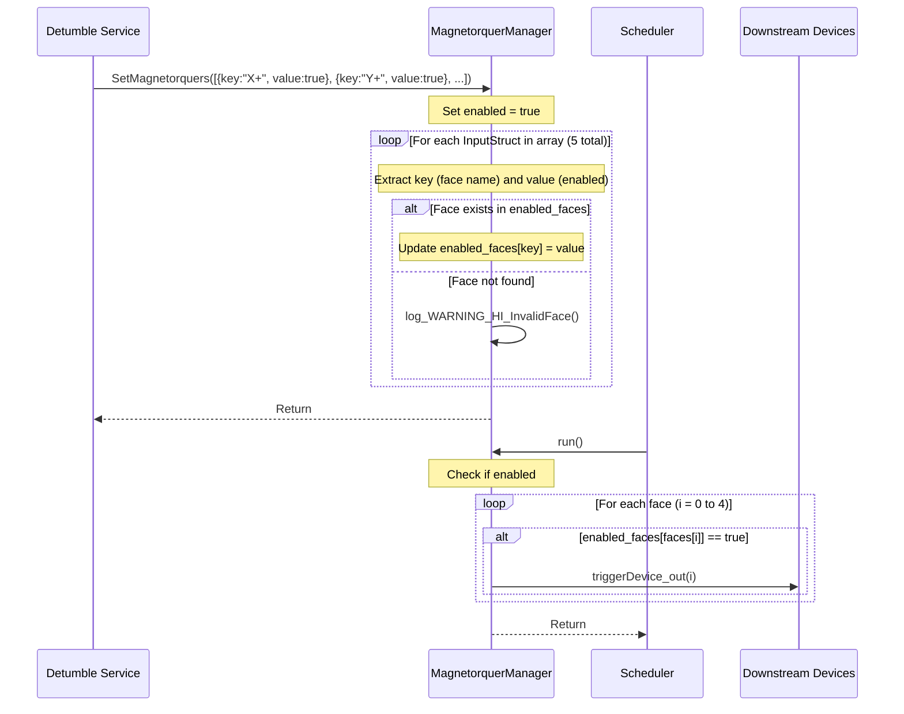
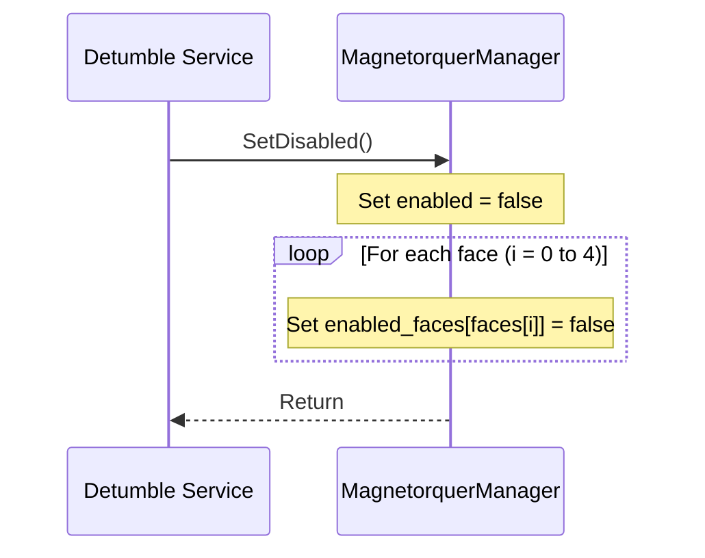

# Components::MagnetorquerManager

The Magnetorquer Manager component coordinates the control of five magnetorquer faces on a PROVES CubeSat through output ports.

## Usage Examples

This component is designed to be used by the detumble service to be able to detumble the cubesat when launched.

### Diagrams

### Typical Usage

1. The component is instantiated and initialized during system startup
2. The component's `configure()` method is called, which:
   - Enables all 5 load switches via `loadSwitchTurnOn` output ports
   - Initializes all 5 devices via `initDevice` output ports
   - Initializes the `enabled_faces` map with all faces set to false
3. The component is periodically called via the `run` scheduler port
4. The detumble service calls the `SetMagnetorquers` input port with an array of 5 key-value pairs to enable/disable specific faces (X+, X-, Y+, Y-, Z+)
5. On each `run` cycle:
   - The component checks if enabled
   - For each face that is enabled in `enabled_faces`, it calls the corresponding `triggerDevice` output port
6. When magnetorquers need to be disabled, the detumble service calls the `SetDisabled` input port

## Class Diagram

## Port Descriptions

### Input Ports

| Name             | Type             | Description                                                                                                                                                                  |
| ---------------- | ---------------- | ---------------------------------------------------------------------------------------------------------------------------------------------------------------------------- |
| SetMagnetorquers | SetMagnetorquers | Input port that takes in an InputArray (array of 5 InputStruct) with key-value pairs where key=face name (string) and value=enabled status (bool). Faces: X+, X-, Y+, Y-, Z+ |
| SetDisabled      | SetDisabled      | Input port to disable all magnetorquers                                                                                                                                      |
| run              | Svc.Sched        | Scheduler port called periodically to trigger enabled magnetorquer devices                                                                                                   |

### Output Ports

| Name             | Type                | Count | Description                                                   |
| ---------------- | ------------------- | ----- | ------------------------------------------------------------- |
| loadSwitchTurnOn | Fw.Signal           | 5     | Output port for turning on load switches for each face        |
| initDevice       | Fw.SuccessCondition | 5     | Output port for initializing each device and receiving status |
| triggerDevice    | Drv.triggerDevice   | 5     | Output port for triggering haptic output on each device       |

## Sequence Diagrams

### Configure Operation

### SetMagnetorquers Operation

### SetDisabled Operation

## Commands

This component does not define any commands.

## Events

| Name        | Severity     | Description                                                                                                              |
| ----------- | ------------ | ------------------------------------------------------------------------------------------------------------------------ |
| InvalidFace | Warning High | Output when SetMagnetorquers receives a face name that doesn't exist in enabled_faces (valid faces: X+, X-, Y+, Y-, Z+). |

## Requirements

| Name                    | Description                                                                                                            | Validation       |
| ----------------------- | ---------------------------------------------------------------------------------------------------------------------- | ---------------- |
| MagnetorquerManager-001 | The Magnetorquer Manager enables all load switches and initializes all 5 devices during configuration                  | Integration Test |
| MagnetorquerManager-002 | The SetMagnetorquers port allows other components to configure the on/off state of specific faces (X+, X-, Y+, Y-, Z+) | Integration Test |
| MagnetorquerManager-003 | The SetDisabled port disables all magnetorquers by setting enabled to false and clearing enabled_faces                 | Integration Test |
| MagnetorquerManager-004 | The run handler is called on a rate group to trigger devices for enabled faces via triggerDevice output ports          | Integration Test |
| MagnetorquerManager-005 | The component logs InvalidFace event when an unknown face name is provided to SetMagnetorquers                         | Unit Test        |

## Change Log

| Date       | Description            |
| ---------- | ---------------------- |
| 12/01/2025 | Initial implementation |
