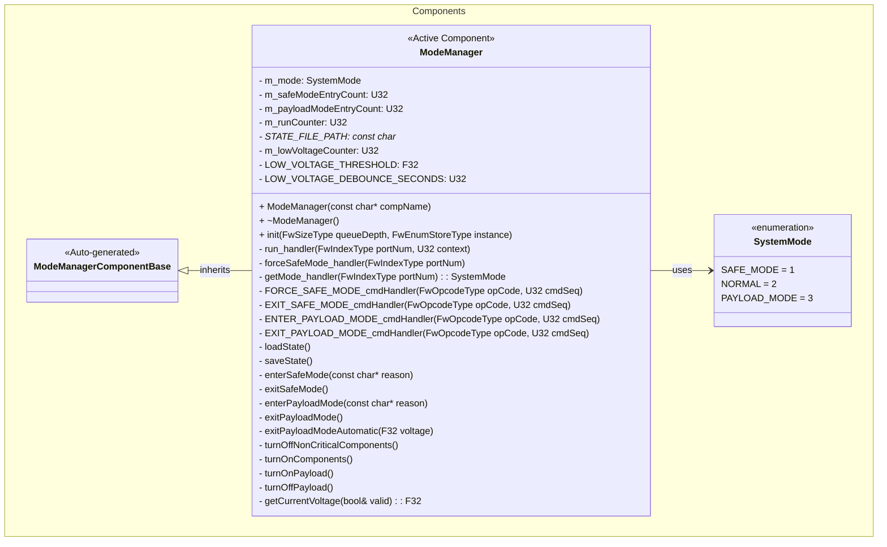
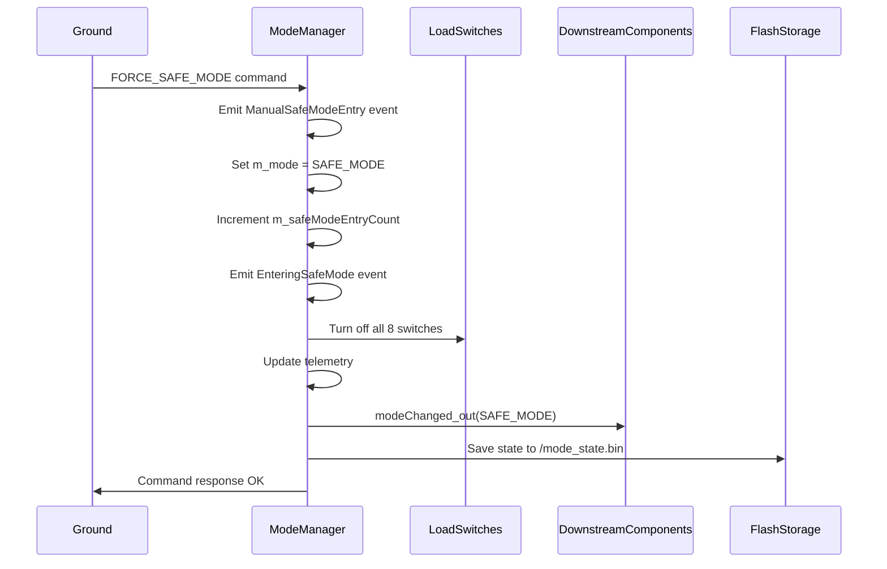
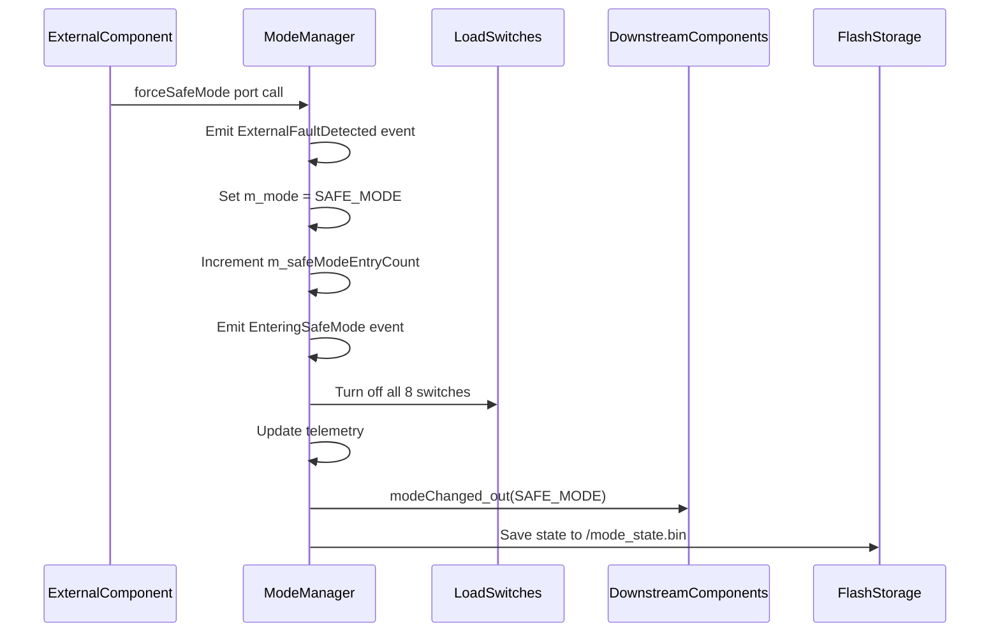
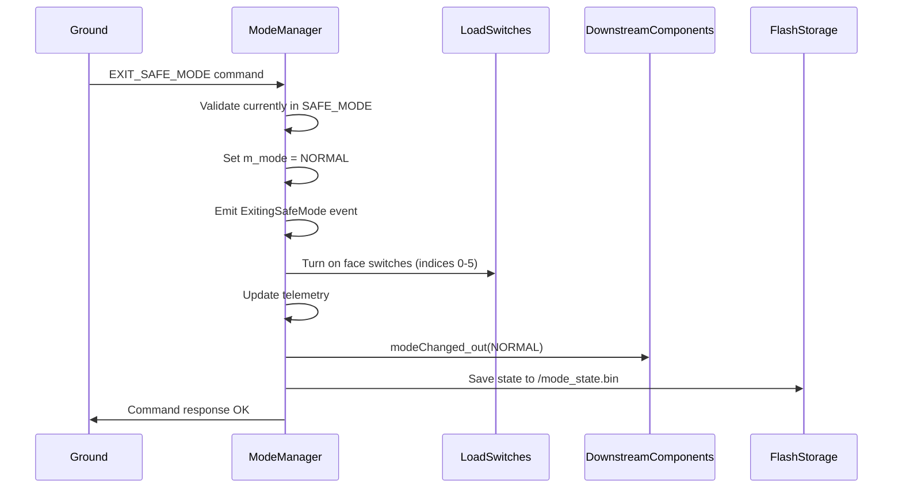
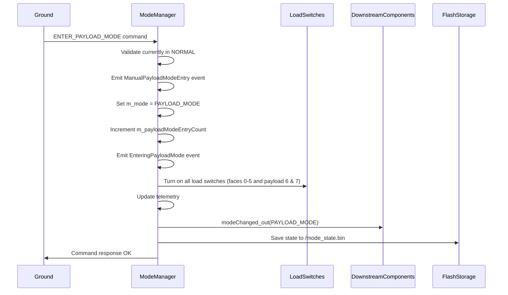
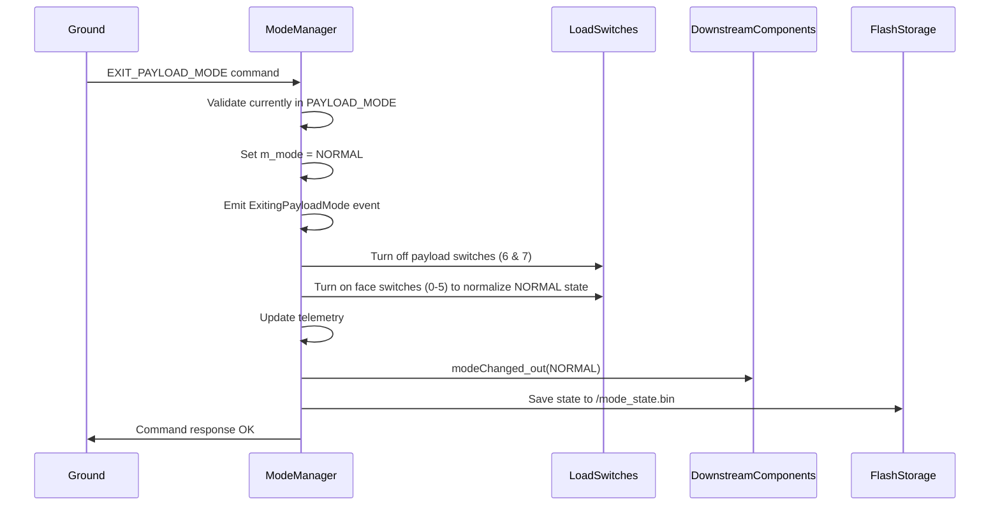
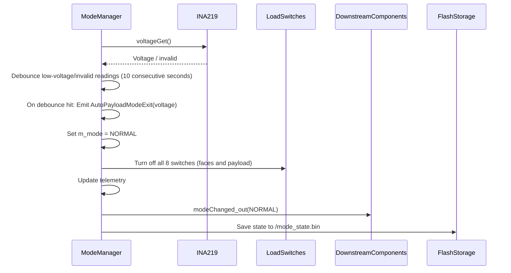
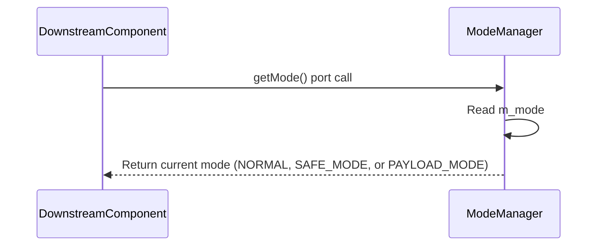
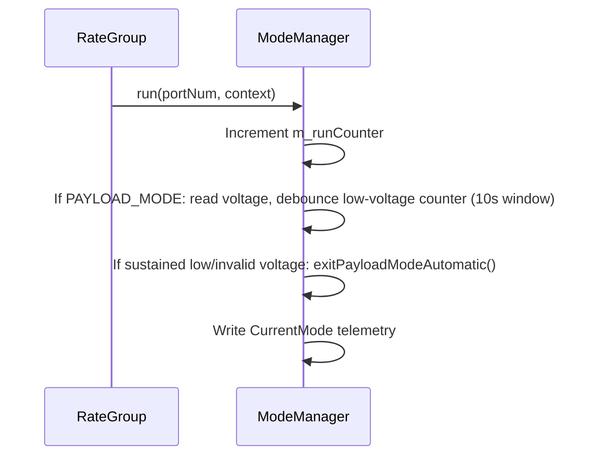

# Components::ModeManager

The ModeManager component manages system operational modes and orchestrates transitions across NORMAL, SAFE_MODE, and PAYLOAD_MODE. It evaluates watchdog faults and communication timeouts to make mode decisions, controls power to non‑critical subsystems during transitions, and maintains/persists mode state across reboots to ensure consistent post‑recovery behavior.

Future work: a HIBERNATION mode remains planned; it will follow the same persistence and validation patterns once implemented.

## Requirements
| Name | Description | Validation |
|---|---|---|
| MM0001 | The ModeManager shall maintain three operational modes: NORMAL, SAFE_MODE, and PAYLOAD_MODE | Integration Testing |
| MM0002 | The ModeManager shall enter safe mode when commanded manually via FORCE_SAFE_MODE command | Integration Testing |
| MM0003 | The ModeManager shall enter safe mode when requested by external components via forceSafeMode port | Integration Testing |
| MM0004 | The ModeManager shall exit safe mode only via explicit EXIT_SAFE_MODE command | Integration Testing |
| MM0005 | The ModeManager shall prevent exit from safe mode when not currently in safe mode | Integration Testing |
| MM0006 | The ModeManager shall turn off all 8 load switches when entering safe mode | Integration Testing |
| MM0007 | The ModeManager shall turn on face load switches (indices 0-5) when exiting safe mode; payload switches remain off until payload mode | Integration Testing |
| MM0008 | The ModeManager shall persist current mode and safe mode entry count to non-volatile storage | Integration Testing |
| MM0009 | The ModeManager shall restore mode state from persistent storage on initialization | Integration Testing |
| MM0010 | The ModeManager shall track and report the number of times safe mode has been entered | Integration Testing |
| MM0011 | The ModeManager shall allow downstream components to query the current mode via getMode port | Unit Testing |
| MM0012 | The ModeManager shall notify downstream components of mode changes with the new mode value | Unit Testing |
| MM0013 | The ModeManager shall enter payload mode when commanded via ENTER_PAYLOAD_MODE while in NORMAL and reject entry from SAFE_MODE | Integration Testing |
| MM0014 | The ModeManager shall exit payload mode only via explicit EXIT_PAYLOAD_MODE command and reject exit when not in payload mode | Integration Testing |
| MM0016 | The ModeManager shall turn on all load switches (faces 0-5 and payload 6-7) when entering payload mode and turn off payload load switches when exiting payload mode | Integration Testing |
| MM0017 | The ModeManager shall track and report the number of times payload mode has been entered | Integration Testing |
| MM0018 | The ModeManager shall persist payload mode state and payload mode entry count to non-volatile storage and restore them on initialization | Integration Testing |
| MM0019 | The ModeManager shall reject FORCE_SAFE_MODE from payload mode (must exit payload mode first for sequential transitions) | Integration Testing |
| MM0020 | While in payload mode, the ModeManager shall monitor bus voltage once per second and automatically exit payload mode after 10 consecutive seconds below 7.2V or upon invalid voltage readings | Integration Testing (manual + debounced behavior) |
| MM0021 | Automatic payload mode exit shall emit AutoPayloadModeExit and turn off all 8 load switches | Integration Testing (manual) |

## Usage Examples

The ModeManager component operates as an active component that manages system-wide operational modes. It runs at 1Hz via the rate group and responds to commands and external fault conditions.

### Typical Usage

1. **System Initialization**
   - Component is instantiated during system startup
   - Loads previous mode state from `/mode_state.bin`
   - Configures load switches to match restored mode
   - Begins 1Hz periodic execution via rate group

2. **Normal Operation**
   - Updates telemetry channels (CurrentMode, SafeModeEntryCount, PayloadModeEntryCount)
   - Responds to mode query requests from downstream components
   - Keeps payload load switches (indices 6 and 7) off unless payload mode is explicitly entered

3. **Safe Mode Entry**
   - Can be triggered by (only from NORMAL mode - sequential transitions enforced):
     - Ground command: `FORCE_SAFE_MODE`
     - External component request via `forceSafeMode` port
   - Actions performed:
     - Transitions mode to SAFE_MODE
     - Increments safe mode entry counter
     - Emits `EnteringSafeMode` event with reason
     - Turns off all 8 load switches
     - Notifies downstream components via `modeChanged` port
     - Persists state to flash storage

4. **Payload Mode Entry**
   - Triggered by ground command: `ENTER_PAYLOAD_MODE` (only allowed from NORMAL)
   - Actions performed:
     - Transitions mode to PAYLOAD_MODE
     - Increments payload mode entry counter
     - Emits `EnteringPayloadMode` event and, for commands, `ManualPayloadModeEntry`
     - Turns on **all load switches** (faces 0-5 and payload 6-7) to ensure consistent power state even after fault exits
     - Notifies downstream components via `modeChanged` port
     - Updates telemetry (CurrentMode, PayloadModeEntryCount)
     - Persists state to flash storage

5. **Payload Mode Exit**
   - Triggered by ground command: `EXIT_PAYLOAD_MODE`
   - Validates currently in payload mode before allowing exit
   - Actions performed:
     - Transitions mode to NORMAL
     - Emits `ExitingPayloadMode` event
     - Turns off payload load switches (indices 6 and 7)
     - Ensures face load switches (0-5) are turned ON for NORMAL mode
     - Notifies downstream components via `modeChanged` port
     - Updates telemetry
     - Persists state to flash storage

6. **Automatic Payload Mode Exit (Low Voltage)**
   - Triggered when in PAYLOAD_MODE and bus voltage is below 7.2V (or invalid) for 10 consecutive 1Hz checks
   - Actions performed:
     - Emits `AutoPayloadModeExit` with measured/0.0V value
     - Transitions mode to NORMAL
     - Turns off **all 8 load switches** (faces and payload) aggressively
     - Notifies downstream components via `modeChanged` port
     - Updates telemetry and persists state

7. **Safe Mode Exit**
   - Triggered only by ground command: `EXIT_SAFE_MODE`
   - Validates currently in safe mode before allowing exit
   - Actions performed:
     - Transitions mode to NORMAL
     - Emits `ExitingSafeMode` event
     - Turns on face load switches (indices 0-5); payload switches remain off until explicitly entering payload mode
     - Notifies downstream components via `modeChanged` port
     - Persists state to flash storage

7. **Mode Queries**
   - Downstream components can call `getMode` port to query current mode
   - Returns immediate synchronous response with current mode

## Class Diagram

## Port Descriptions

### Input Ports
| Name | Type | Kind | Description |
|---|---|---|---|
| run | Svc.Sched | sync | Receives periodic calls from rate group (1Hz) for telemetry updates and low-voltage monitoring while in PAYLOAD_MODE |
| forceSafeMode | Fw.Signal | async | Receives safe mode requests from external components detecting faults |
| getMode | Components.GetSystemMode | sync | Allows downstream components to query current system mode |

### Output Ports
| Name | Type | Kind | Description |
|---|---|---|---|
| modeChanged | Components.SystemModeChanged | output | Notifies downstream components of mode changes with new mode value |
| loadSwitchTurnOn | Fw.Signal [8] | output | Signals to turn on each of 8 load switches (faces 0-5, payload power, payload battery) |
| loadSwitchTurnOff | Fw.Signal [8] | output | Signals to turn off each of 8 load switches |
| voltageGet | Drv.VoltageGet | output | Queries INA219 manager for current system voltage |

## Component States

| Name | Type | Description |
|---|---|---|
| m_mode | SystemMode | Current operational mode (NORMAL, SAFE_MODE, or PAYLOAD_MODE) |
| m_safeModeEntryCount | U32 | Number of times safe mode has been entered since initial deployment |
| m_payloadModeEntryCount | U32 | Number of times payload mode has been entered since initial deployment |
| m_runCounter | U32 | Counter for 1Hz run handler calls |
| m_lowVoltageCounter | U32 | Debounce counter for consecutive low/invalid voltage readings while in PAYLOAD_MODE |

### Persistent State
The component persists the following state to `/mode_state.bin`:
- Current mode (U8)
- Safe mode entry count (U32)
- Payload mode entry count (U32)

This state is loaded on initialization and saved on every mode transition.

## Sequence Diagrams

### Safe Mode Entry (Command)

### Safe Mode Entry (External Request)

### Safe Mode Exit

### Payload Mode Entry (Command)

### Payload Mode Exit (Command)

### Automatic Payload Mode Exit (Low Voltage)

### Mode Query

### Periodic Execution (1Hz)

## Commands

| Name | Arguments | Description |
|---|---|---|
| FORCE_SAFE_MODE | None | Forces the system into safe mode. Only allowed from NORMAL mode (rejects from PAYLOAD_MODE with validation error). Emits ManualSafeModeEntry event. Idempotent when already in safe mode. |
| EXIT_SAFE_MODE | None | Exits safe mode and returns to normal operation. Fails with CommandValidationFailed if not currently in safe mode. |
| ENTER_PAYLOAD_MODE | None | Enters payload mode from NORMAL. Fails with CommandValidationFailed if issued from SAFE_MODE or if already in payload mode (idempotent success when already in payload). Emits ManualPayloadModeEntry event. |
| EXIT_PAYLOAD_MODE | None | Exits payload mode and returns to normal operation. Fails with CommandValidationFailed if not currently in payload mode. |

## Events

| Name | Severity | Arguments | Description |
|---|---|---|---|
| EnteringSafeMode | WARNING_HI | reason: string size 100 | Emitted when entering safe mode, includes reason (e.g., "Ground command", "External component request") |
| ExitingSafeMode | ACTIVITY_HI | None | Emitted when exiting safe mode and returning to normal operation |
| ManualSafeModeEntry | ACTIVITY_HI | None | Emitted when safe mode is manually commanded via FORCE_SAFE_MODE |
| ExternalFaultDetected | WARNING_HI | None | Emitted when an external component triggers safe mode via forceSafeMode port |
| EnteringPayloadMode | ACTIVITY_HI | reason: string size 100 | Emitted when entering payload mode, includes reason (e.g., "Ground command") |
| ExitingPayloadMode | ACTIVITY_HI | None | Emitted when exiting payload mode and returning to normal operation |
| ManualPayloadModeEntry | ACTIVITY_HI | None | Emitted when payload mode is manually commanded via ENTER_PAYLOAD_MODE |
| AutoPayloadModeExit | WARNING_HI | voltage: F32 | Emitted when automatically exiting payload mode due to low/invalid voltage (voltage value reported; 0.0 if invalid) |
| CommandValidationFailed | WARNING_LO | cmdName: string size 50 reason: string size 100 | Emitted when a command fails validation (e.g., EXIT_SAFE_MODE when not in safe mode) |
| StatePersistenceFailure | WARNING_LO | operation: string size 20 status: I32 | Emitted when state save/load operations fail |

## Telemetry

| Name | Type | Update Rate | Description |
|---|---|---|---|
| CurrentMode | U8 | 1Hz | Current system mode (1 = SAFE_MODE, 2 = NORMAL, 3 = PAYLOAD_MODE) |
| SafeModeEntryCount | U32 | On change | Number of times safe mode has been entered (persists across reboots) |
| PayloadModeEntryCount | U32 | On change | Number of times payload mode has been entered (persists across reboots) |

## Load Switch Mapping

The ModeManager controls 8 load switches that power non-critical satellite subsystems:

| Index | Subsystem | NORMAL State | SAFE_MODE State | PAYLOAD_MODE State |
|---|---|---|---|---|
| 0 | Satellite Face 0 | ON | OFF | ON |
| 1 | Satellite Face 1 | ON | OFF | ON |
| 2 | Satellite Face 2 | ON | OFF | ON |
| 3 | Satellite Face 3 | ON | OFF | ON |
| 4 | Satellite Face 4 | ON | OFF | ON |
| 5 | Satellite Face 5 | ON | OFF | ON |
| 6 | Payload Power | OFF | OFF | ON |
| 7 | Payload Battery | OFF | OFF | ON |

> **Notes:** PAYLOAD_MODE can only be entered from NORMAL mode (not from SAFE_MODE). When restoring PAYLOAD_MODE from persistent storage after a reboot, both face switches (0-5) and payload switches (6-7) are explicitly turned ON to ensure consistent state. Automatic payload exits (low/invalid voltage) aggressively turn **all** switches OFF; manual payload exits leave faces ON and only shed payload loads.
## Integration Tests

See `FprimeZephyrReference/test/int/mode_manager_test.py` and `FprimeZephyrReference/test/int/payload_mode_test.py` for comprehensive integration tests covering:

| Test | Description | Coverage |
|---|---|---|
| test_01_initial_telemetry | Verifies initial telemetry can be read | Basic functionality |
| test_04_force_safe_mode_command | Tests FORCE_SAFE_MODE command enters safe mode | Safe mode entry |
| test_06_safe_mode_turns_off_load_switches | Verifies all load switches turn off in safe mode | Power management |
| test_14_exit_safe_mode_success | Tests successful safe mode exit | Safe mode exit |
| test_19_safe_mode_state_persists | Verifies safe mode persistence to flash | State persistence |
| test_payload_01_enter_exit_payload_mode | Validates payload mode entry/exit, events, telemetry, payload load switches | Payload mode entry/exit |
| test_payload_02_cannot_enter_from_safe_mode | Ensures ENTER_PAYLOAD_MODE fails from SAFE_MODE | Command validation |
| test_payload_03_safe_mode_rejected_from_payload | Ensures FORCE_SAFE_MODE is rejected from payload mode (sequential transitions) | Command validation |
| test_payload_04_state_persists | Verifies payload mode and counters persist | Payload persistence |
| test_payload_05_manual_exit_face_switches_remain_on | Verifies manual payload exit leaves faces ON and payload OFF | Payload exit power behavior |
| test_payload_06_voltage_monitoring_active | Verifies voltage telemetry is present in payload mode and no false auto-exit when voltage healthy | Low-voltage monitoring sanity |
| test_payload_07_auto_exit_low_voltage (manual) | Manual test to validate debounced low-voltage auto-exit, AutoPayloadModeExit event, and full load-shed | Low-voltage protection |

## Design Decisions

### Hybrid Mode Query/Notification Approach
The component provides both pull-based (getMode port) and push-based (modeChanged port) mechanisms for mode awareness:

- **getMode port (pull)**: Allows components to query current mode on-demand, useful for:
  - Component initialization
  - Recovery from faults
  - Periodic mode checks

- **modeChanged port (push)**: Notifies components immediately when mode changes with the new mode value, useful for:
  - Reactive behavior
  - Real-time mode tracking
  - Avoiding polling overhead

This dual approach ensures downstream components can reliably track system mode even if they miss a transition notification.

### State Persistence
Mode state is persisted to `/mode_state.bin` to maintain operational context across:
- Intentional reboots
- Watchdog resets
- Power cycles

This ensures the system resumes in the correct mode after recovery.

### Low-Voltage Payload Protection
Payload mode is protected by a debounced low-voltage monitor:
- Voltage sampled at 1Hz while in PAYLOAD_MODE via `voltageGet`
- Threshold: 7.2V; invalid readings are treated as faults to avoid masking brownouts
- Debounce: 10 consecutive low/invalid readings before acting
- Action: emit `AutoPayloadModeExit`, set mode to NORMAL, and turn off all 8 load switches
- Re-entering payload mode re-powers faces and payload switches to restore a consistent state

### Sequential Mode Transitions
Mode transitions follow a +1/-1 sequential pattern: SAFE_MODE(1) ↔ NORMAL(2) ↔ PAYLOAD_MODE(3). Direct jumps (e.g., PAYLOAD→SAFE) are not allowed - users must exit payload mode first before entering safe mode. FORCE_SAFE_MODE is idempotent when already in safe mode.

## Change Log
| Date | Description |
|---|---|
| 2025-11-29 | Added low-voltage monitoring with debounced automatic payload exit, AutoPayloadModeExit event, and documentation/tests for aggressive load shed and manual exit power state |
| 2025-11-26 | Reordered enum values (SAFE=1, NORMAL=2, PAYLOAD=3) for sequential +1/-1 transitions; FORCE_SAFE_MODE now rejected from payload mode |
| 2025-11-26 | Removed forcePayloadMode port - payload mode now only entered via ENTER_PAYLOAD_MODE ground command |
| 2025-11-25 | Added PAYLOAD_MODE (commands, events, telemetry, persistence, payload load switch control) and documented payload integration tests |
| 2025-11-19 | Added getMode query port and enhanced modeChanged to carry mode value |
