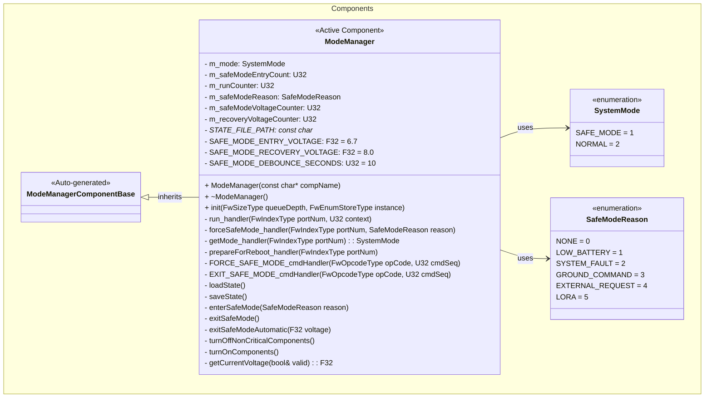
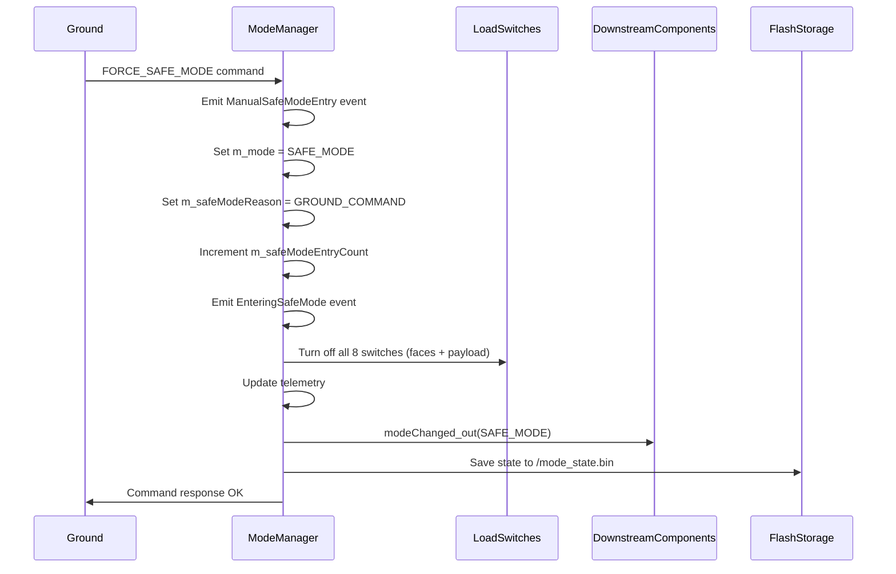
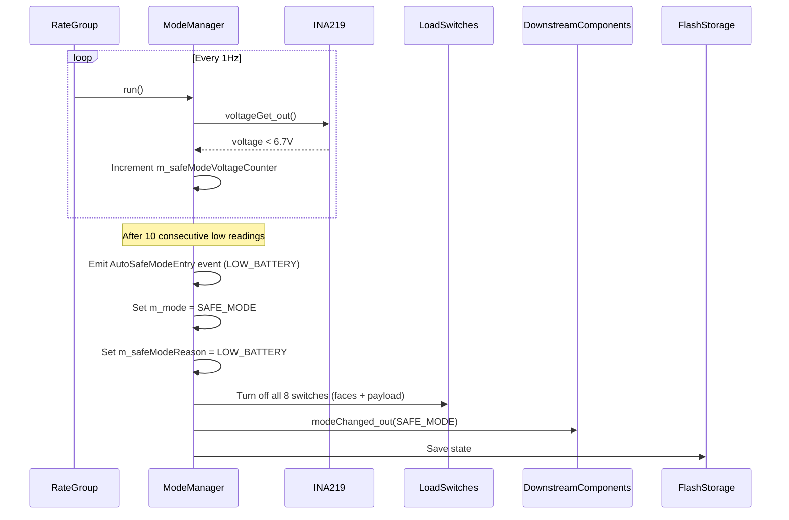
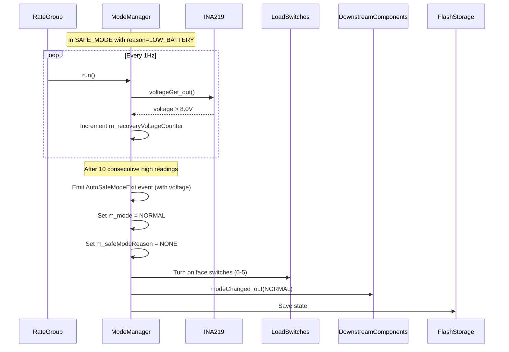
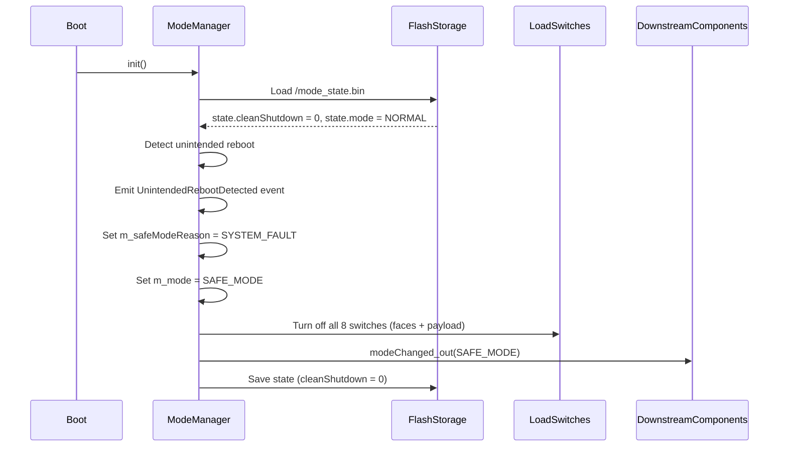
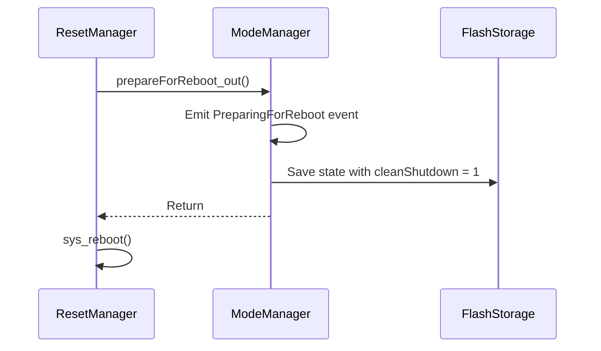
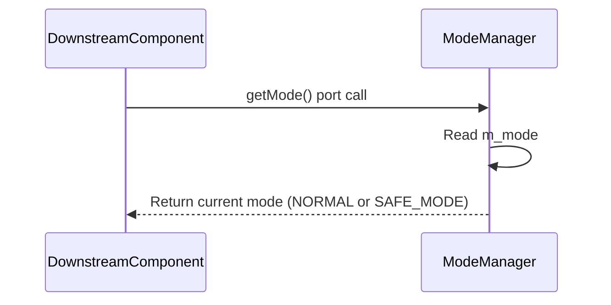

# Components::ModeManager

The ModeManager component manages system operational modes and orchestrates transitions between NORMAL and SAFE_MODE. It evaluates voltage conditions and detects unintended reboots to make mode decisions, controls power to non‑critical subsystems during transitions, and maintains/persists mode state across reboots to ensure consistent post‑recovery behavior.

## Requirements
| Name | Description | Validation |
|---|---|---|
| MM0001 | The ModeManager shall maintain two operational modes: NORMAL and SAFE_MODE | Integration Testing |
| MM0002 | The ModeManager shall enter safe mode when commanded manually via FORCE_SAFE_MODE command | Integration Testing |
| MM0003 | The ModeManager shall enter safe mode when requested by external components via forceSafeMode port | Integration Testing |
| MM0004 | The ModeManager shall exit safe mode only via explicit EXIT_SAFE_MODE command or automatic voltage recovery | Integration Testing |
| MM0005 | The ModeManager shall prevent exit from safe mode when not currently in safe mode | Integration Testing |
| MM0006 | The ModeManager shall turn off all 8 load switches (faces 0-5 + payload 6-7) when entering safe mode | Integration Testing |
| MM0007 | The ModeManager shall turn on face load switches (indices 0-5) when exiting safe mode; payload switches (6-7) remain off | Integration Testing |
| MM0008 | The ModeManager shall persist current mode, safe mode entry count, safe mode reason, and clean shutdown flag to non-volatile storage | Integration Testing |
| MM0009 | The ModeManager shall restore mode state from persistent storage on initialization | Integration Testing |
| MM0010 | The ModeManager shall track and report the number of times safe mode has been entered | Integration Testing |
| MM0011 | The ModeManager shall allow downstream components to query the current mode via getMode port | Code Review |
| MM0012 | The ModeManager shall notify downstream components of mode changes with the new mode value | Code Review |
| MM0020 | The ModeManager shall automatically enter safe mode when voltage drops below 6.7V for 10 consecutive seconds | Integration Testing |
| MM0021 | The ModeManager shall automatically exit safe mode when voltage recovers above 8.0V for 10 consecutive seconds (only if reason is LOW_BATTERY) | Integration Testing |
| MM0022 | The ModeManager shall track safe mode reason (NONE, LOW_BATTERY, SYSTEM_FAULT, GROUND_COMMAND, EXTERNAL_REQUEST, LORA) | Integration Testing |
| MM0023 | The ModeManager shall detect unintended reboots and enter safe mode with reason SYSTEM_FAULT | Integration Testing |
| MM0024 | The ModeManager shall set clean shutdown flag when prepareForReboot port is called | Integration Testing |

## Usage Examples

The ModeManager component operates as an active component that manages system-wide operational modes. It runs at 1Hz via the rate group and responds to commands, voltage conditions, and external fault conditions.

### Typical Usage

1. **System Initialization**
   - Component is instantiated during system startup
   - Loads previous mode state from `/mode_state.bin`
   - Detects unintended reboots via clean shutdown flag
   - Configures load switches to match restored mode
   - Begins 1Hz periodic execution via rate group

2. **Normal Operation**
   - Updates telemetry channels (CurrentMode, SafeModeEntryCount, CurrentSafeModeReason)
   - Monitors system voltage for automatic safe mode entry
   - Responds to mode query requests from downstream components

3. **Safe Mode Entry**
   - Can be triggered by:
     - Ground command: `FORCE_SAFE_MODE` (reason: GROUND_COMMAND)
     - External component request via `forceSafeMode` port with specified reason (e.g., LORA, EXTERNAL_REQUEST)
     - Low voltage condition < 6.7V for 10 seconds (reason: LOW_BATTERY)
     - Unintended reboot detection (reason: SYSTEM_FAULT)
   - Actions performed:
     - Transitions mode to SAFE_MODE
     - Sets safe mode reason
     - Increments safe mode entry counter
     - Emits appropriate event (EnteringSafeMode, AutoSafeModeEntry, UnintendedRebootDetected)
     - Turns off all 8 load switches (faces 0-5 + payload 6-7)
     - Notifies downstream components via `modeChanged` port
     - Persists state to flash storage

4. **Safe Mode Exit (Manual)**
   - Triggered by ground command: `EXIT_SAFE_MODE`
   - Validates currently in safe mode before allowing exit
   - Actions performed:
     - Transitions mode to NORMAL
     - Clears safe mode reason to NONE
     - Emits `ExitingSafeMode` event
     - Turns on face load switches (indices 0-5)
     - Notifies downstream components via `modeChanged` port
     - Persists state to flash storage

5. **Safe Mode Exit (Automatic)**
   - Only triggers when safe mode reason is LOW_BATTERY
   - Requires voltage > 8.0V for 10 consecutive seconds
   - Actions performed:
     - Transitions mode to NORMAL
     - Clears safe mode reason to NONE
     - Emits `AutoSafeModeExit` event with recovered voltage
     - Turns on face load switches (indices 0-5)
     - Notifies downstream components via `modeChanged` port
     - Persists state to flash storage

6. **Mode Queries**
   - Downstream components can call `getMode` port to query current mode
   - Returns immediate synchronous response with current mode

## Class Diagram

## Port Descriptions

### Input Ports
| Name | Type | Kind | Description |
|---|---|---|---|
| run | Svc.Sched | sync | Receives periodic calls from rate group (1Hz) for telemetry updates and voltage monitoring |
| forceSafeMode | Components.ForceSafeModeWithReason | async | Receives safe mode requests from external components with reason (NONE defaults to EXTERNAL_REQUEST) |
| getMode | Components.GetSystemMode | sync | Allows downstream components to query current system mode |
| prepareForReboot | Fw.Signal | sync | Called by ResetManager before intentional reboot to set clean shutdown flag |

### Output Ports
| Name | Type | Kind | Description |
|---|---|---|---|
| modeChanged | Components.SystemModeChanged | output | Notifies downstream components of mode changes with new mode value |
| loadSwitchTurnOn | Fw.Signal [8] | output | Signals to turn on load switches (faces 0-5, payload power 6, payload battery 7) |
| loadSwitchTurnOff | Fw.Signal [8] | output | Signals to turn off load switches (faces 0-5, payload power 6, payload battery 7) |
| voltageGet | Drv.VoltageGet | output | Queries INA219 manager for current system voltage |

## Component States

| Name | Type | Description |
|---|---|---|
| m_mode | SystemMode | Current operational mode (NORMAL or SAFE_MODE) |
| m_safeModeEntryCount | U32 | Number of times safe mode has been entered since initial deployment |
| m_safeModeReason | SafeModeReason | Current reason for being in safe mode (or NONE if not in safe mode) |
| m_runCounter | U32 | Counter for 1Hz run handler calls |
| m_safeModeVoltageCounter | U32 | Debounce counter for low voltage detection (in NORMAL mode) |
| m_recoveryVoltageCounter | U32 | Debounce counter for voltage recovery detection (in SAFE_MODE) |

### Persistent State
The component persists the following state to `/mode_state.bin`:
- Current mode (U8)
- Safe mode entry count (U32)
- Safe mode reason (U8)
- Clean shutdown flag (U8)

This state is loaded on initialization and saved on every mode transition.

## Voltage Thresholds

| Threshold | Value | Description |
|---|---|---|
| SAFE_MODE_ENTRY_VOLTAGE | 6.7V | Voltage below which safe mode is entered from NORMAL |
| SAFE_MODE_RECOVERY_VOLTAGE | 8.0V | Voltage above which safe mode can be exited automatically |
| SAFE_MODE_DEBOUNCE_SECONDS | 10 | Consecutive seconds required for voltage-based transitions |

## Sequence Diagrams

### Safe Mode Entry (Command)

### Safe Mode Entry (Low Voltage)

### Safe Mode Exit (Automatic Voltage Recovery)

### Unintended Reboot Detection

### Prepare For Reboot (Clean Shutdown)

### Mode Query

## Commands

| Name | Arguments | Description |
|---|---|---|
| FORCE_SAFE_MODE | None | Forces the system into safe mode with reason GROUND_COMMAND. Emits ManualSafeModeEntry event. Idempotent when already in safe mode. |
| EXIT_SAFE_MODE | None | Exits safe mode and returns to normal operation. Fails with CommandValidationFailed if not currently in safe mode. Clears safe mode reason to NONE. |

## Events

| Name | Severity | Arguments | Description |
|---|---|---|---|
| EnteringSafeMode | WARNING_HI | reason: string size 100 | Emitted when entering safe mode, includes reason string |
| ExitingSafeMode | ACTIVITY_HI | None | Emitted when manually exiting safe mode |
| ManualSafeModeEntry | ACTIVITY_HI | None | Emitted when safe mode is manually commanded via FORCE_SAFE_MODE |
| ExternalFaultDetected | WARNING_HI | None | Emitted when an external component triggers safe mode via forceSafeMode port |
| AutoSafeModeEntry | WARNING_HI | reason: SafeModeReason, voltage: F32 | Emitted when automatically entering safe mode due to low voltage |
| AutoSafeModeExit | ACTIVITY_HI | voltage: F32 | Emitted when automatically exiting safe mode due to voltage recovery |
| UnintendedRebootDetected | WARNING_HI | None | Emitted when an unintended reboot is detected on startup |
| PreparingForReboot | ACTIVITY_HI | None | Emitted when prepareForReboot is called before intentional reboot |
| CommandValidationFailed | WARNING_LO | cmdName: string size 50, reason: string size 100 | Emitted when a command fails validation |
| StatePersistenceFailure | WARNING_LO | operation: string size 20, status: I32 | Emitted when state save/load operations fail |

## Telemetry

| Name | Type | Update Rate | Description |
|---|---|---|---|
| CurrentMode | U8 | 1Hz | Current system mode (1 = SAFE_MODE, 2 = NORMAL) |
| SafeModeEntryCount | U32 | On change | Number of times safe mode has been entered (persists across reboots) |
| CurrentSafeModeReason | SafeModeReason | 1Hz | Current reason for safe mode (NONE if not in safe mode) |

## Load Switch Mapping

The ModeManager controls 8 load switches that power satellite subsystems:

| Index | Subsystem | NORMAL State | SAFE_MODE State |
|---|---|---|---|
| 0 | Satellite Face 4 | ON | OFF |
| 1 | Satellite Face 0 | ON | OFF |
| 2 | Satellite Face 1 | ON | OFF |
| 3 | Satellite Face 2 | ON | OFF |
| 4 | Satellite Face 3 | ON | OFF |
| 5 | Satellite Face 5 | ON | OFF |
| 6 | Payload Power | OFF | OFF |
| 7 | Payload Battery | OFF | OFF |

> **Note:** When entering SAFE_MODE, all 8 switches are turned OFF. When exiting to NORMAL mode, only face switches (0-5) are turned ON. Payload switches (6-7) remain OFF and must be controlled separately.

## Safe Mode Reason Logic

| Reason | Trigger | Auto-Recovery | Manual Exit |
|---|---|---|---|
| LOW_BATTERY | Voltage < 6.7V for 10s | Yes (when voltage > 8.0V for 10s) | Yes |
| SYSTEM_FAULT | Unintended reboot detected | No | Yes |
| GROUND_COMMAND | FORCE_SAFE_MODE command | No | Yes |
| EXTERNAL_REQUEST | forceSafeMode port call | No | Yes |
| LORA | LoRa communication timeout or fault | No | Yes |

## Integration Tests

See `FprimeZephyrReference/test/int/safe_mode_test.py` for comprehensive integration tests covering:

| Test | Description | Coverage |
|---|---|---|
| test_safe_01_initial_safe_mode_reason_is_none | Verifies CurrentSafeModeReason is NONE in NORMAL mode | Telemetry |
| test_safe_02_ground_command_sets_reason | Tests FORCE_SAFE_MODE sets reason to GROUND_COMMAND | Safe mode entry |
| test_safe_03_exit_clears_reason | Verifies EXIT_SAFE_MODE clears reason to NONE | Safe mode exit |
| test_safe_04_no_auto_recovery_for_ground_command | Ensures no auto-recovery when reason is GROUND_COMMAND | Auto-recovery logic |
| test_safe_05_auto_entry_low_voltage | Tests automatic safe mode entry due to low voltage | Voltage monitoring |
| test_safe_06_auto_recovery_voltage | Tests automatic safe mode exit due to voltage recovery | Voltage monitoring |
| test_safe_07_unintended_reboot_detection | Tests unintended reboot detection and SYSTEM_FAULT | Reboot detection |
| test_safe_08_clean_reboot_no_safe_mode | Verifies clean reboot does not trigger safe mode | Reboot handling |

## Design Decisions

### Hybrid Mode Query/Notification Approach
The component provides both pull-based (getMode port) and push-based (modeChanged port) mechanisms for mode awareness:

- **getMode port (pull)**: Allows components to query current mode on-demand, useful for:
  - Component initialization
  - Recovery from faults
  - Periodic mode checks

- **modeChanged port (push)**: Notifies components immediately when mode changes with the new mode value, useful for:
  - Reactive behavior
  - Real-time mode tracking
  - Avoiding polling overhead

### State Persistence
Mode state is persisted to `/mode_state.bin` to maintain operational context across:
- Intentional reboots (clean shutdown flag set)
- Watchdog resets (unintended reboot detection)
- Power cycles (unintended reboot detection)

### Voltage-Based Auto-Transitions
The ModeManager implements hysteresis in voltage-based transitions:
- Entry threshold: 6.7V (lower)
- Recovery threshold: 8.0V (higher)
- Debounce: 10 consecutive 1Hz samples

This prevents oscillation between modes when voltage is near thresholds.

### Safe Mode Reason Tracking
The reason for entering safe mode is tracked to enable intelligent recovery:
- LOW_BATTERY: Auto-recovery allowed when voltage recovers
- Other reasons: Manual EXIT_SAFE_MODE command required

## Change Log
| Date | Description |
|---|---|
| 2025-11-30 | Changed forceSafeMode port to accept SafeModeReason parameter (defaults to EXTERNAL_REQUEST if NONE) |
| 2025-11-30 | Added LORA SafeModeReason for LoRa communication timeout/fault |
| 2025-11-30 | Removed payload mode (PAYLOAD_MODE enum, commands, events, telemetry, load switch connections) |
| 2025-11-30 | Added safe mode auto-entry/exit based on voltage thresholds (6.7V entry, 8.0V recovery) |
| 2025-11-30 | Added SafeModeReason tracking (LOW_BATTERY, SYSTEM_FAULT, GROUND_COMMAND, EXTERNAL_REQUEST) |
| 2025-11-30 | Added unintended reboot detection via clean shutdown flag |
| 2025-11-30 | Added prepareForReboot port for ResetManager integration |
| 2025-11-26 | Initial implementation with NORMAL and SAFE_MODE |
