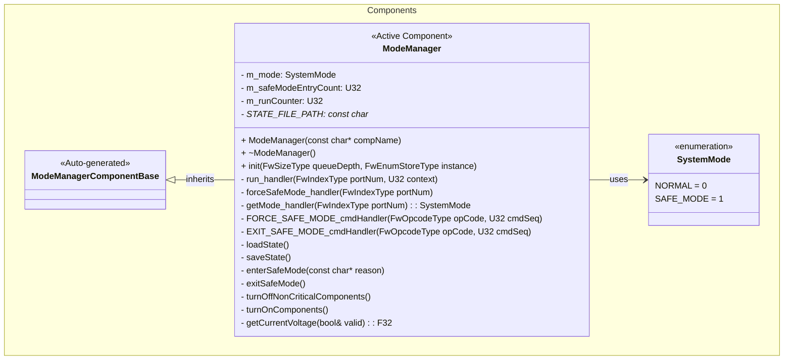
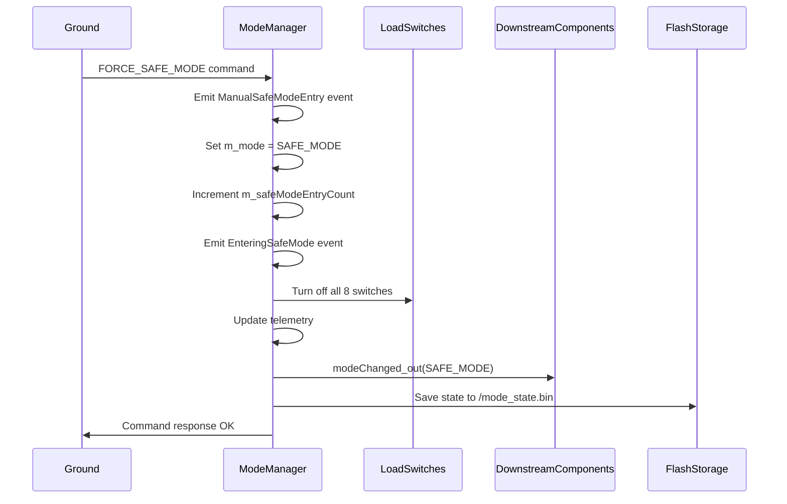
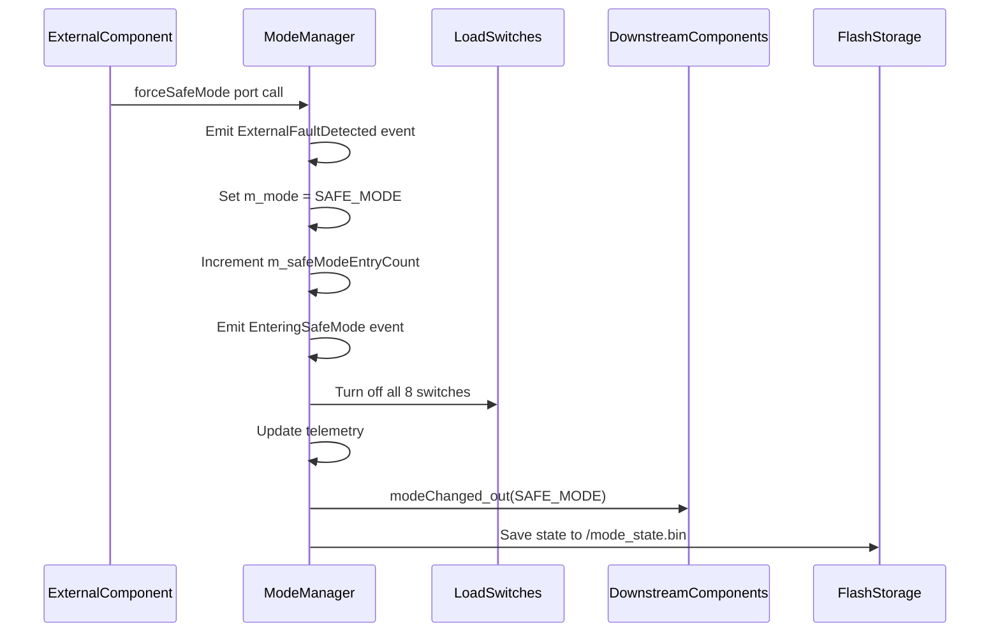
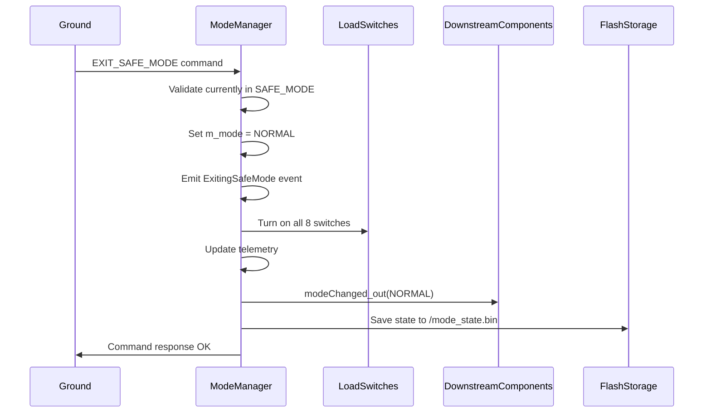
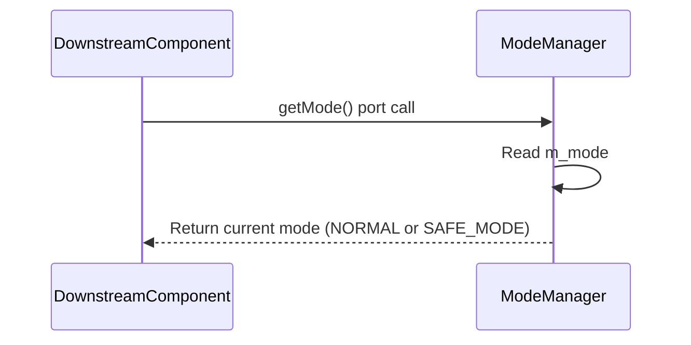
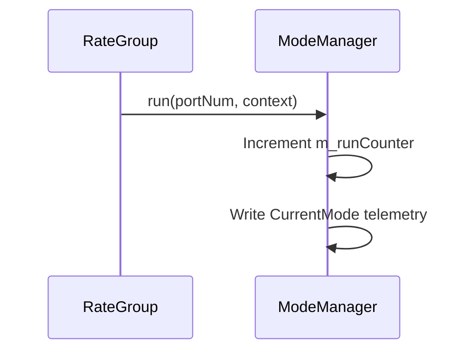

# Components::ModeManager

The ModeManager component manages system operational modes and orchestrates transitions (NORMAL, SAFE_MODE, and planned PAYLOAD and HIBERNATION modes). It evaluates watchdog faults and communication timeouts to make mode decisions, controls power to non‑critical subsystems during transitions, and maintains/persists mode state across reboots to ensure consistent post‑recovery behavior.

Planned additions:
- PAYLOAD mode — A mid‑power operational mode that prioritizes payload activity while limiting non‑critical subsystems; intended for mission operations when power is constrained but payload operation must continue.
- HIBERNATION mode — A deep low‑power state for long‑term battery preservation, with strict wake conditions (e.g., RTC alarm, hardware wake interrupt); minimal subsystems remain active.
- ModeManager will extend its API and telemetry: new commands (ENTER/EXIT_PAYLOAD, ENTER/EXIT_HIBERNATION), an expanded SystemMode enumeration, modeChanged notifications reflecting new modes, and getMode support for queries.
- Persistence and validation: new modes will be persisted like existing modes, restored on boot, and have explicit validation for entry/exit (e.g., exit from HIBERNATION requires approved wake condition).

These mode additions will be integrated incrementally with corresponding telemetry, events, commands, unit tests, and integration tests to verify correct behavior, power control, and persistence semantics.

## Requirements
| Name | Description | Validation |
|---|---|---|
| MM0001 | The ModeManager shall maintain two distinct operational modes: NORMAL and SAFE_MODE | Integration Testing |
| MM0002 | The ModeManager shall enter safe mode when commanded manually via FORCE_SAFE_MODE command | Integration Testing |
| MM0003 | The ModeManager shall enter safe mode when requested by external components via forceSafeMode port | Integration Testing |
| MM0004 | The ModeManager shall exit safe mode only via explicit EXIT_SAFE_MODE command | Integration Testing |
| MM0005 | The ModeManager shall prevent exit from safe mode when not currently in safe mode | Integration Testing |
| MM0006 | The ModeManager shall turn off all 8 load switches when entering safe mode | Integration Testing |
| MM0007 | The ModeManager shall turn on all 8 load switches when exiting safe mode | Integration Testing |
| MM0008 | The ModeManager shall persist current mode and safe mode entry count to non-volatile storage | Integration Testing |
| MM0009 | The ModeManager shall restore mode state from persistent storage on initialization | Integration Testing |
| MM0010 | The ModeManager shall track and report the number of times safe mode has been entered | Integration Testing |
| MM0011 | The ModeManager shall allow downstream components to query the current mode via getMode port | Unit Testing |
| MM0012 | The ModeManager shall notify downstream components of mode changes with the new mode value | Unit Testing |

## Usage Examples

The ModeManager component operates as an active component that manages system-wide operational modes. It runs at 1Hz via the rate group and responds to commands and external fault conditions.

### Typical Usage

1. **System Initialization**
   - Component is instantiated during system startup
   - Loads previous mode state from `/mode_state.bin`
   - Configures load switches to match restored mode
   - Begins 1Hz periodic execution via rate group

2. **Normal Operation**
   - Updates telemetry channels (CurrentMode, SafeModeEntryCount)
   - Responds to mode query requests from downstream components

3. **Safe Mode Entry**
   - Can be triggered by:
     - Ground command: `FORCE_SAFE_MODE`
     - External component request via `forceSafeMode` port
   - Actions performed:
     - Transitions mode to SAFE_MODE
     - Increments safe mode entry counter
     - Emits `EnteringSafeMode` event with reason
     - Turns off all 8 load switches
     - Notifies downstream components via `modeChanged` port
     - Persists state to flash storage

4. **Safe Mode Exit**
   - Triggered only by ground command: `EXIT_SAFE_MODE`
   - Validates currently in safe mode before allowing exit
   - Actions performed:
     - Transitions mode to NORMAL
     - Emits `ExitingSafeMode` event
     - Turns on all 8 load switches
     - Notifies downstream components via `modeChanged` port
     - Persists state to flash storage

5. **Mode Queries**
   - Downstream components can call `getMode` port to query current mode
   - Returns immediate synchronous response with current mode

## Class Diagram

## Port Descriptions

### Input Ports
| Name | Type | Kind | Description |
|---|---|---|---|
| run | Svc.Sched | sync | Receives periodic calls from rate group (1Hz) for telemetry updates |
| forceSafeMode | Fw.Signal | async | Receives safe mode requests from external components detecting faults |
| getMode | Components.GetSystemMode | sync | Allows downstream components to query current system mode |

### Output Ports
| Name | Type | Kind | Description |
|---|---|---|---|
| modeChanged | Components.SystemModeChanged | output | Notifies downstream components of mode changes with new mode value |
| loadSwitchTurnOn | Fw.Signal [8] | output | Signals to turn on each of 8 load switches (faces 0-5, payload power, payload battery) |
| loadSwitchTurnOff | Fw.Signal [8] | output | Signals to turn off each of 8 load switches |
| voltageGet | Drv.VoltageGet | output | Queries INA219 manager for current system voltage |

## Component States

| Name | Type | Description |
|---|---|---|
| m_mode | SystemMode | Current operational mode (NORMAL or SAFE_MODE) |
| m_safeModeEntryCount | U32 | Number of times safe mode has been entered since initial deployment |
| m_runCounter | U32 | Counter for 1Hz run handler calls |

### Persistent State
The component persists the following state to `/mode_state.bin`:
- Current mode (U8)
- Safe mode entry count (U32)

This state is loaded on initialization and saved on every mode transition.

## Sequence Diagrams

### Safe Mode Entry (Command)

### Safe Mode Entry (External Request)

### Safe Mode Exit

### Mode Query

### Periodic Execution (1Hz)

## Commands

| Name | Arguments | Description |
|---|---|---|
| FORCE_SAFE_MODE | None | Forces the system into safe mode immediately. Emits ManualSafeModeEntry event. Can be called from any mode (idempotent). |
| EXIT_SAFE_MODE | None | Exits safe mode and returns to normal operation. Fails with CommandValidationFailed if not currently in safe mode. |

## Events

| Name | Severity | Arguments | Description |
|---|---|---|---|
| EnteringSafeMode | WARNING_HI | reason: string size 100 | Emitted when entering safe mode, includes reason (e.g., "Ground command", "External component request") |
| ExitingSafeMode | ACTIVITY_HI | None | Emitted when exiting safe mode and returning to normal operation |
| ManualSafeModeEntry | ACTIVITY_HI | None | Emitted when safe mode is manually commanded via FORCE_SAFE_MODE |
| ExternalFaultDetected | WARNING_HI | None | Emitted when an external component triggers safe mode via forceSafeMode port |
| CommandValidationFailed | WARNING_LO | cmdName: string size 50 reason: string size 100 | Emitted when a command fails validation (e.g., EXIT_SAFE_MODE when not in safe mode) |
| StatePersistenceFailure | WARNING_LO | operation: string size 20 status: I32 | Emitted when state save/load operations fail |

## Telemetry

| Name | Type | Update Rate | Description |
|---|---|---|---|
| CurrentMode | U8 | 1Hz | Current system mode (0 = NORMAL, 1 = SAFE_MODE) |
| SafeModeEntryCount | U32 | On change | Number of times safe mode has been entered (persists across reboots) |

## Load Switch Mapping

The ModeManager controls 8 load switches that power non-critical satellite subsystems:

| Index | Subsystem | Safe Mode State |
|---|---|---|
| 0 | Satellite Face 0 | OFF |
| 1 | Satellite Face 1 | OFF |
| 2 | Satellite Face 2 | OFF |
| 3 | Satellite Face 3 | OFF |
| 4 | Satellite Face 4 | OFF |
| 5 | Satellite Face 5 | OFF |
| 6 | Payload Power | OFF |
| 7 | Payload Battery | OFF |

## Integration Tests

See `FprimeZephyrReference/test/int/mode_manager_test.py` for comprehensive integration tests covering:

| Test | Description | Coverage |
|---|---|---|
| test_01_initial_telemetry | Verifies initial telemetry can be read | Basic functionality |
| test_04_force_safe_mode_command | Tests FORCE_SAFE_MODE command enters safe mode | Safe mode entry |
| test_05_safe_mode_increments_counter | Verifies SafeModeEntryCount increments | State tracking |
| test_06_safe_mode_turns_off_load_switches | Verifies all load switches turn off in safe mode | Power management |
| test_07_safe_mode_emits_event | Verifies EnteringSafeMode event with correct reason | Event emission |
| test_13_exit_safe_mode_fails_not_in_safe_mode | Tests EXIT_SAFE_MODE validation | Error handling |
| test_14_exit_safe_mode_success | Tests successful safe mode exit | Safe mode exit |
| test_18_force_safe_mode_idempotent | Tests FORCE_SAFE_MODE is idempotent | Edge cases |
| test_19_safe_mode_state_persists | Verifies mode persistence to flash | State persistence |

## Design Decisions

### Hybrid Mode Query/Notification Approach
The component provides both pull-based (getMode port) and push-based (modeChanged port) mechanisms for mode awareness:

- **getMode port (pull)**: Allows components to query current mode on-demand, useful for:
  - Component initialization
  - Recovery from faults
  - Periodic mode checks

- **modeChanged port (push)**: Notifies components immediately when mode changes with the new mode value, useful for:
  - Reactive behavior
  - Real-time mode tracking
  - Avoiding polling overhead

This dual approach ensures downstream components can reliably track system mode even if they miss a transition notification.

### State Persistence
Mode state is persisted to `/mode_state.bin` to maintain operational context across:
- Intentional reboots
- Watchdog resets
- Power cycles

This ensures the system resumes in the correct mode after recovery.

### Idempotent Safe Mode Entry
The FORCE_SAFE_MODE command can be called from any mode without error. If already in safe mode, it succeeds without re-entering. This simplifies fault handling logic in external components.

## Change Log
| Date | Description |
|---|---|
| 2025-11-19 | Added getMode query port and enhanced modeChanged to carry mode value |
