# Components::ModeManager

The ModeManager component manages system operational modes and orchestrates transitions across HIBERNATION_MODE, SAFE_MODE, NORMAL, and PAYLOAD_MODE. It evaluates watchdog faults and communication timeouts to make mode decisions, controls power to non-critical subsystems during transitions, and maintains/persists mode state across reboots to ensure consistent post-recovery behavior.

## Requirements
| Name | Description | Validation |
|---|---|---|
| MM0001 | The ModeManager shall maintain four operational modes: HIBERNATION_MODE, SAFE_MODE, NORMAL, and PAYLOAD_MODE | Integration Testing |
| MM0002 | The ModeManager shall enter safe mode when commanded manually via FORCE_SAFE_MODE command | Integration Testing |
| MM0003 | The ModeManager shall enter safe mode when requested by external components via forceSafeMode port | Integration Testing |
| MM0004 | The ModeManager shall exit safe mode only via explicit EXIT_SAFE_MODE command | Integration Testing |
| MM0005 | The ModeManager shall prevent exit from safe mode when not currently in safe mode | Integration Testing |
| MM0006 | The ModeManager shall turn off all 8 load switches when entering safe mode | Integration Testing |
| MM0007 | The ModeManager shall turn on face load switches (indices 0-5) when exiting safe mode; payload switches remain off until payload mode | Integration Testing |
| MM0008 | The ModeManager shall persist current mode and safe mode entry count to non-volatile storage | Integration Testing |
| MM0009 | The ModeManager shall restore mode state from persistent storage on initialization | Integration Testing |
| MM0010 | The ModeManager shall track and report the number of times safe mode has been entered | Integration Testing |
| MM0011 | The ModeManager shall allow downstream components to query the current mode via getMode port | Unit Testing |
| MM0012 | The ModeManager shall notify downstream components of mode changes with the new mode value | Unit Testing |
| MM0013 | The ModeManager shall enter payload mode when commanded via ENTER_PAYLOAD_MODE while in NORMAL and reject entry from SAFE_MODE | Integration Testing |
| MM0014 | The ModeManager shall exit payload mode only via explicit EXIT_PAYLOAD_MODE command and reject exit when not in payload mode | Integration Testing |
| MM0016 | The ModeManager shall turn on payload load switches (indices 6 and 7) when entering payload mode and turn them off when exiting payload mode | Integration Testing |
| MM0017 | The ModeManager shall track and report the number of times payload mode has been entered | Integration Testing |
| MM0018 | The ModeManager shall persist payload mode state and payload mode entry count to non-volatile storage and restore them on initialization | Integration Testing |
| MM0019 | The ModeManager shall reject FORCE_SAFE_MODE from payload mode (must exit payload mode first for sequential transitions) | Integration Testing |
| MM0020 | The ModeManager shall enter hibernation mode only from SAFE_MODE via ENTER_HIBERNATION command | Integration Testing |
| MM0021 | The ModeManager shall use RP2350 dormant mode with RTC alarm for ultra-low-power hibernation sleep cycles | Hardware Testing |
| MM0022 | The ModeManager shall support configurable sleep duration (default 3600s/60min) and wake window duration (default 60s/1min) | Integration Testing |
| MM0023 | The ModeManager shall track hibernation cycle count and total hibernation seconds (persisted across reboots) | Integration Testing |
| MM0024 | The ModeManager shall exit hibernation only via EXIT_HIBERNATION command during a wake window | Integration Testing |
| MM0025 | The ModeManager shall transition to SAFE_MODE when exiting hibernation | Integration Testing |
| MM0026 | The ModeManager shall emit HibernationWakeWindow event at start of each wake window | Integration Testing |
| MM0027 | The ModeManager shall emit HibernationSleepCycle event before entering each dormant sleep | Integration Testing |
| MM0028 | The ModeManager shall persist hibernation configuration (sleep/wake durations) across reboots to resume hibernation | Integration Testing |
| MM0029 | The ModeManager shall roll back hibernation counters if dormant sleep entry fails | Unit Testing |
| MM0030 | The ModeManager shall send command response BEFORE entering dormant sleep (since reboot prevents response) | Integration Testing |

## Usage Examples

The ModeManager component operates as an active component that manages system-wide operational modes. It runs at 1Hz via the rate group and responds to commands and external fault conditions.

### Typical Usage

1. **System Initialization**
   - Component is instantiated during system startup
   - Loads previous mode state from `/mode_state.bin`
   - If resuming from hibernation, automatically starts wake window
   - Configures load switches to match restored mode
   - Begins 1Hz periodic execution via rate group

2. **Normal Operation**
   - Updates telemetry channels (CurrentMode, SafeModeEntryCount, PayloadModeEntryCount, HibernationCycleCount, HibernationTotalSeconds)
   - Responds to mode query requests from downstream components
   - Keeps payload load switches (indices 6 and 7) off unless payload mode is explicitly entered

3. **Safe Mode Entry**
   - Can be triggered by (only from NORMAL mode - sequential transitions enforced):
     - Ground command: `FORCE_SAFE_MODE`
     - External component request via `forceSafeMode` port
   - Actions performed:
     - Transitions mode to SAFE_MODE
     - Increments safe mode entry counter
     - Emits `EnteringSafeMode` event with reason
     - Turns off all 8 load switches
     - Notifies downstream components via `modeChanged` port
     - Persists state to flash storage

4. **Payload Mode Entry**
   - Triggered by ground command: `ENTER_PAYLOAD_MODE` (only allowed from NORMAL)
   - Actions performed:
     - Transitions mode to PAYLOAD_MODE
     - Increments payload mode entry counter
     - Emits `EnteringPayloadMode` event and, for commands, `ManualPayloadModeEntry`
     - Turns on payload load switches (indices 6 and 7)
     - Notifies downstream components via `modeChanged` port
     - Updates telemetry (CurrentMode, PayloadModeEntryCount)
     - Persists state to flash storage

5. **Payload Mode Exit**
   - Triggered by ground command: `EXIT_PAYLOAD_MODE`
   - Validates currently in payload mode before allowing exit
   - Actions performed:
     - Transitions mode to NORMAL
     - Emits `ExitingPayloadMode` event
     - Turns off payload load switches (indices 6 and 7)
     - Notifies downstream components via `modeChanged` port
     - Updates telemetry
     - Persists state to flash storage

6. **Safe Mode Exit**
   - Triggered only by ground command: `EXIT_SAFE_MODE`
   - Validates currently in safe mode before allowing exit
   - Actions performed:
     - Transitions mode to NORMAL
     - Emits `ExitingSafeMode` event
     - Turns on face load switches (indices 0-5); payload switches remain off until explicitly entering payload mode
     - Notifies downstream components via `modeChanged` port
     - Persists state to flash storage

7. **Hibernation Mode Entry**
   - Triggered by ground command: `ENTER_HIBERNATION sleepDurationSec wakeDurationSec`
   - Only allowed from SAFE_MODE
   - Actions performed:
     - Validates currently in SAFE_MODE
     - Sends command response OK (BEFORE entering dormant - critical since reboot prevents response)
     - Emits `EnteringHibernation` event with reason and durations
     - Sets mode to HIBERNATION_MODE
     - Saves state to flash (including sleep/wake durations for resume)
     - Emits `HibernationSleepCycle` event
     - Enters RP2350 dormant mode with RTC alarm set for sleepDurationSec
     - System reboots when RTC alarm fires

8. **Hibernation Wake Window**
   - On reboot after dormant wake:
     - Loads state from flash, detects HIBERNATION_MODE
     - Increments hibernation cycle count and total seconds
     - Emits `HibernationWakeWindow` event
     - Starts wake window counter (1Hz ticks)
     - Only LoRa radio active, listens for EXIT_HIBERNATION command
   - At end of wake window (counter reaches wakeDurationSec):
     - Automatically re-enters dormant sleep for next cycle

9. **Hibernation Mode Exit**
   - Triggered by ground command: `EXIT_HIBERNATION` during wake window
   - Actions performed:
     - Validates currently in HIBERNATION_MODE wake window
     - Emits `ExitingHibernation` event with cycle count and total time
     - Transitions to SAFE_MODE
     - Persists state to flash storage
     - Ground can then issue EXIT_SAFE_MODE to return to NORMAL

10. **Mode Queries**
    - Downstream components can call `getMode` port to query current mode
    - Returns immediate synchronous response with current mode

## Class Diagram

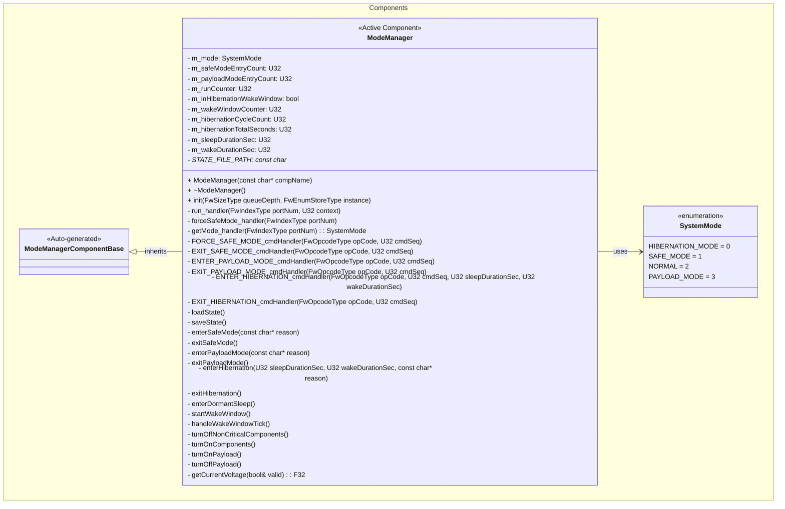

## Port Descriptions

### Input Ports
| Name | Type | Kind | Description |
|---|---|---|---|
| run | Svc.Sched | sync | Receives periodic calls from rate group (1Hz) for telemetry updates and wake window countdown |
| forceSafeMode | Fw.Signal | async | Receives safe mode requests from external components detecting faults |
| getMode | Components.GetSystemMode | sync | Allows downstream components to query current system mode |

### Output Ports
| Name | Type | Kind | Description |
|---|---|---|---|
| modeChanged | Components.SystemModeChanged | output | Notifies downstream components of mode changes with new mode value |
| loadSwitchTurnOn | Fw.Signal [8] | output | Signals to turn on each of 8 load switches (faces 0-5, payload power, payload battery) |
| loadSwitchTurnOff | Fw.Signal [8] | output | Signals to turn off each of 8 load switches |
| voltageGet | Drv.VoltageGet | output | Queries INA219 manager for current system voltage |

## Component States

| Name | Type | Description |
|---|---|---|
| m_mode | SystemMode | Current operational mode (HIBERNATION_MODE, SAFE_MODE, NORMAL, or PAYLOAD_MODE) |
| m_safeModeEntryCount | U32 | Number of times safe mode has been entered since initial deployment |
| m_payloadModeEntryCount | U32 | Number of times payload mode has been entered since initial deployment |
| m_runCounter | U32 | Counter for 1Hz run handler calls |
| m_inHibernationWakeWindow | bool | True when in hibernation wake window, false otherwise |
| m_wakeWindowCounter | U32 | Seconds elapsed in current wake window (counts up to wakeDurationSec) |
| m_hibernationCycleCount | U32 | Total number of hibernation sleep/wake cycles completed |
| m_hibernationTotalSeconds | U32 | Total seconds spent in hibernation sleep |
| m_sleepDurationSec | U32 | Configured sleep cycle duration (default 3600s = 60min) |
| m_wakeDurationSec | U32 | Configured wake window duration (default 60s = 1min) |

### Persistent State
The component persists the following state to `/mode_state.bin`:
- Current mode (U8)
- Safe mode entry count (U32)
- Payload mode entry count (U32)
- Hibernation cycle count (U32)
- Hibernation total seconds (U32)
- Sleep duration seconds (U32) - for hibernation resume
- Wake duration seconds (U32) - for hibernation resume

This state is loaded on initialization and saved on every mode transition. The hibernation configuration (sleep/wake durations) are persisted to enable resumption of hibernation cycles after each dormant wake.

## Sequence Diagrams

### Safe Mode Entry (Command)
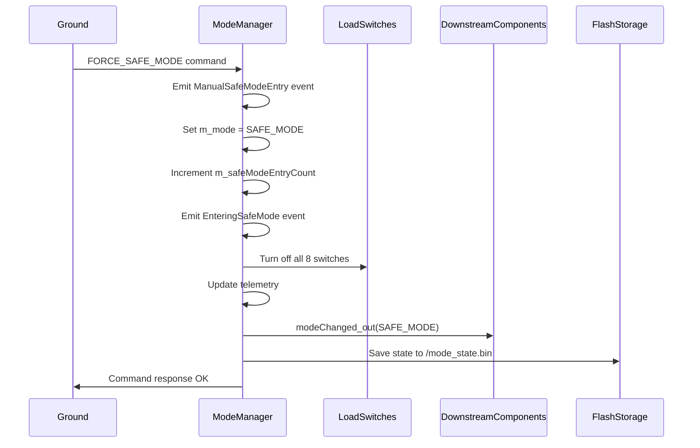

### Safe Mode Entry (External Request)
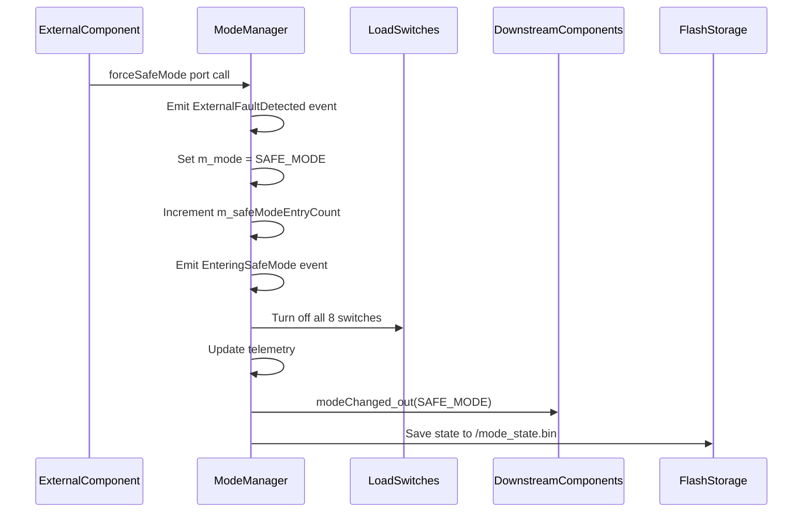

### Safe Mode Exit
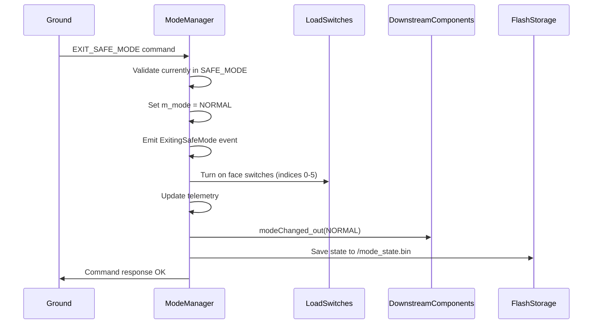

### Payload Mode Entry (Command)
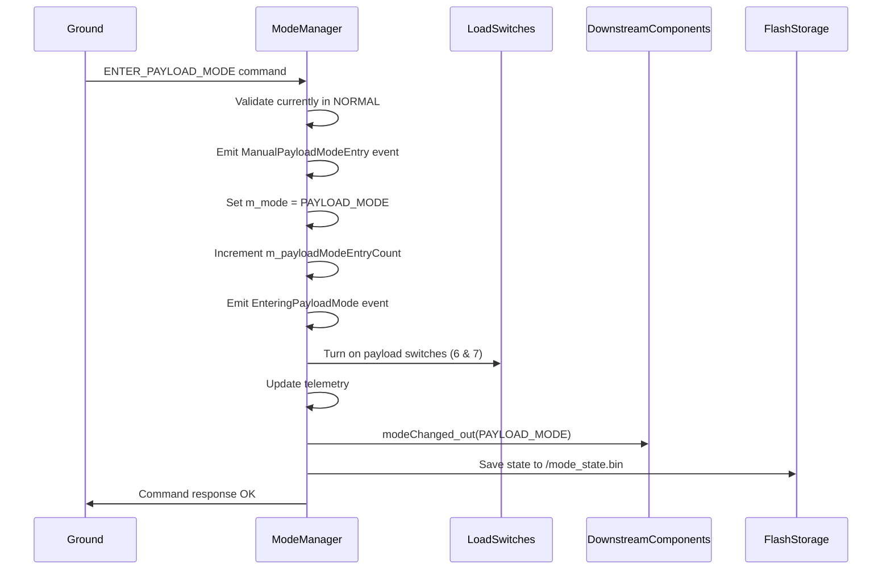

### Payload Mode Exit (Command)
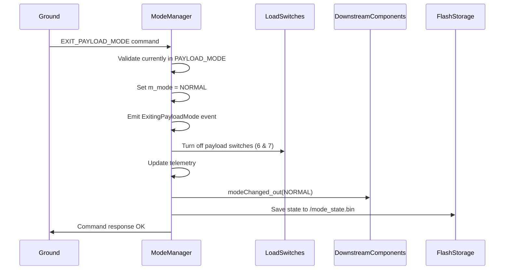

### Hibernation Mode Entry (Command)
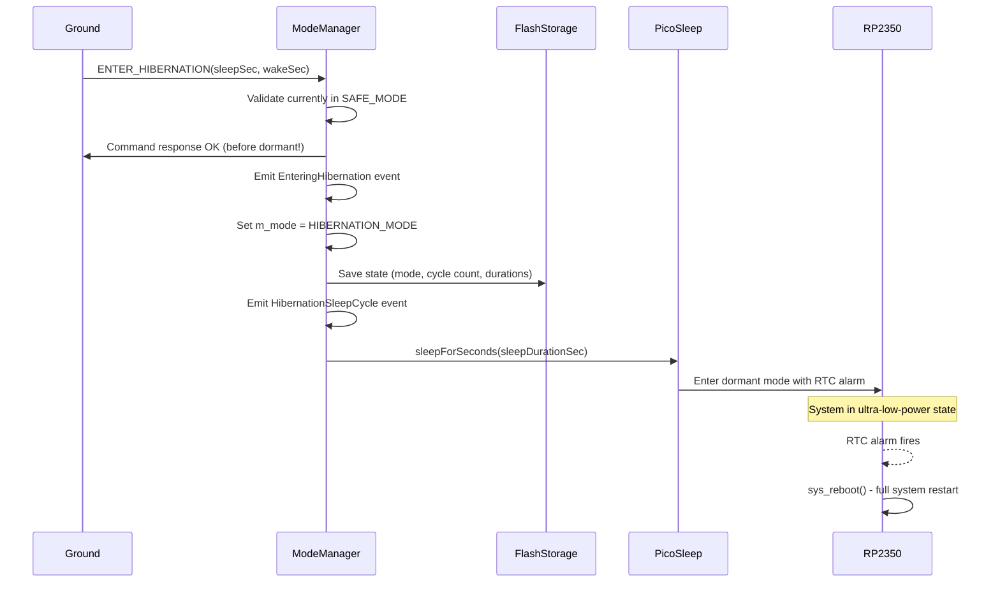

### Hibernation Wake Window
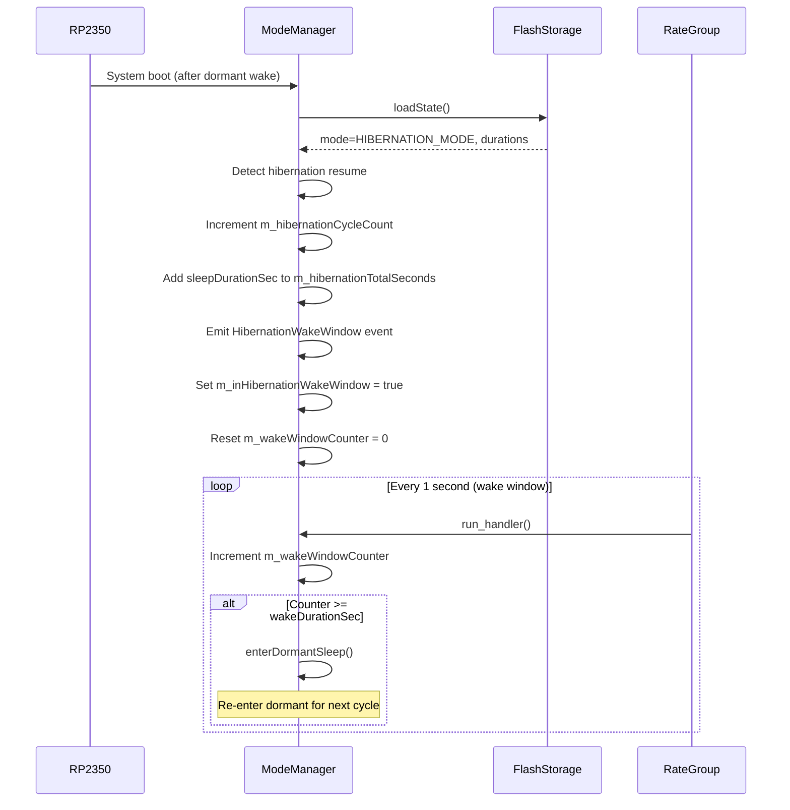

### Hibernation Mode Exit (Command)
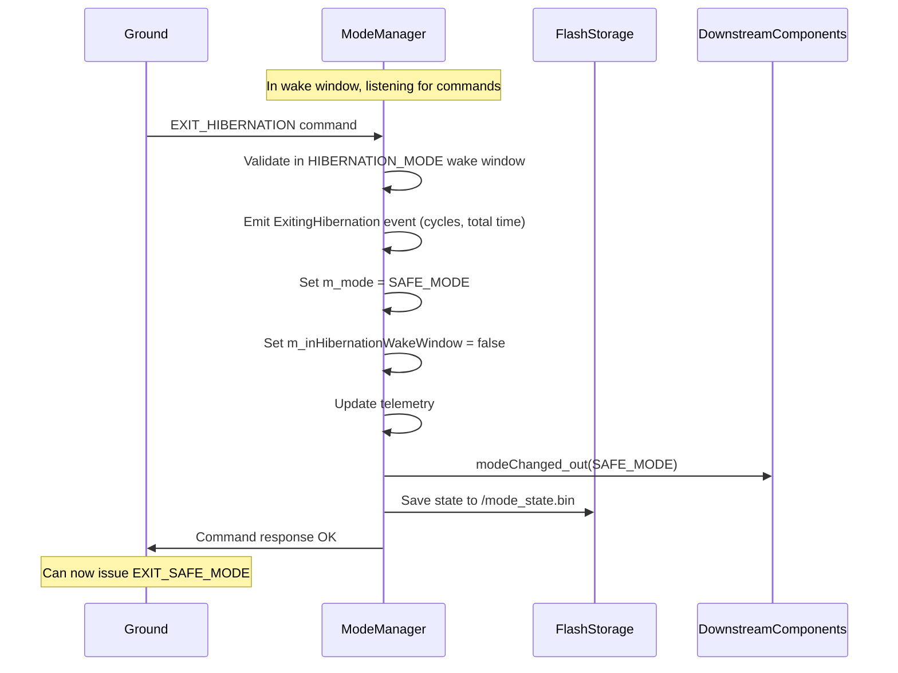

### Mode Query
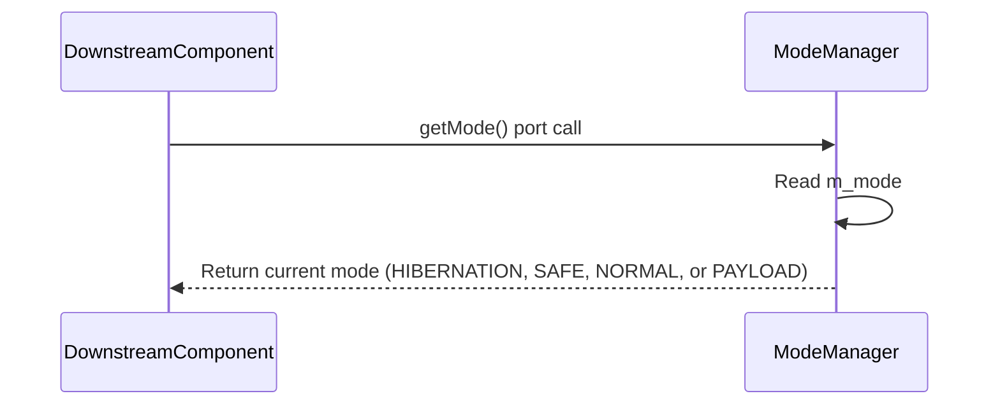

### Periodic Execution (1Hz)
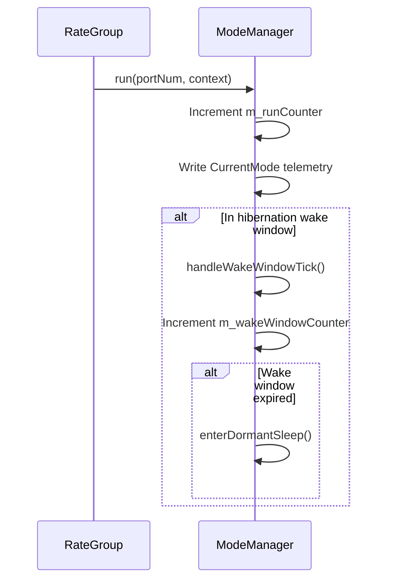

## Commands

| Name | Arguments | Description |
|---|---|---|
| FORCE_SAFE_MODE | None | Forces the system into safe mode. Only allowed from NORMAL mode (rejects from PAYLOAD_MODE with validation error). Emits ManualSafeModeEntry event. Idempotent when already in safe mode. |
| EXIT_SAFE_MODE | None | Exits safe mode and returns to normal operation. Fails with CommandValidationFailed if not currently in safe mode. |
| ENTER_PAYLOAD_MODE | None | Enters payload mode from NORMAL. Fails with CommandValidationFailed if issued from SAFE_MODE or if already in payload mode (idempotent success when already in payload). Emits ManualPayloadModeEntry event. |
| EXIT_PAYLOAD_MODE | None | Exits payload mode and returns to normal operation. Fails with CommandValidationFailed if not currently in payload mode. |
| ENTER_HIBERNATION | sleepDurationSec: U32 wakeDurationSec: U32 | Enters hibernation mode from SAFE_MODE. Uses RP2350 dormant mode with RTC alarm. sleepDurationSec=0 uses default 3600s (60min). wakeDurationSec=0 uses default 60s. Command response sent BEFORE entering dormant (since system reboots). Fails with CommandValidationFailed if not in SAFE_MODE. |
| EXIT_HIBERNATION | None | Exits hibernation mode during a wake window. Transitions to SAFE_MODE. Fails with CommandValidationFailed if not currently in hibernation wake window. |

## Events

| Name | Severity | Arguments | Description |
|---|---|---|---|
| EnteringSafeMode | WARNING_HI | reason: string size 100 | Emitted when entering safe mode, includes reason (e.g., "Ground command", "External component request") |
| ExitingSafeMode | ACTIVITY_HI | None | Emitted when exiting safe mode and returning to normal operation |
| ManualSafeModeEntry | ACTIVITY_HI | None | Emitted when safe mode is manually commanded via FORCE_SAFE_MODE |
| ExternalFaultDetected | WARNING_HI | None | Emitted when an external component triggers safe mode via forceSafeMode port |
| EnteringPayloadMode | ACTIVITY_HI | reason: string size 100 | Emitted when entering payload mode, includes reason (e.g., "Ground command") |
| ExitingPayloadMode | ACTIVITY_HI | None | Emitted when exiting payload mode and returning to normal operation |
| ManualPayloadModeEntry | ACTIVITY_HI | None | Emitted when payload mode is manually commanded via ENTER_PAYLOAD_MODE |
| CommandValidationFailed | WARNING_LO | cmdName: string size 50 reason: string size 100 | Emitted when a command fails validation (e.g., EXIT_SAFE_MODE when not in safe mode) |
| StatePersistenceFailure | WARNING_LO | operation: string size 20 status: I32 | Emitted when state save/load operations fail |
| EnteringHibernation | WARNING_HI | reason: string size 100 sleepDurationSec: U32 wakeDurationSec: U32 | Emitted when entering hibernation mode, includes reason and configured durations |
| ExitingHibernation | ACTIVITY_HI | cycleCount: U32 totalSeconds: U32 | Emitted when exiting hibernation, includes total cycles completed and time spent |
| HibernationWakeWindow | ACTIVITY_LO | cycleNumber: U32 | Emitted at start of each wake window after dormant wake |
| HibernationSleepCycle | ACTIVITY_LO | cycleNumber: U32 | Emitted before entering each dormant sleep cycle |
| HibernationEntryFailed | WARNING_HI | reason: string size 100 | **CRITICAL:** Emitted when dormant sleep entry fails AFTER command was ack'd OK. Ground sees OK response but system is actually in SAFE_MODE. Counters rolled back. |

## Telemetry

| Name | Type | Update Rate | Description |
|---|---|---|---|
| CurrentMode | U8 | 1Hz | Current system mode (0=HIBERNATION, 1=SAFE_MODE, 2=NORMAL, 3=PAYLOAD_MODE) |
| SafeModeEntryCount | U32 | On change | Number of times safe mode has been entered (persists across reboots) |
| PayloadModeEntryCount | U32 | On change | Number of times payload mode has been entered (persists across reboots) |
| HibernationCycleCount | U32 | On change | Number of hibernation sleep/wake cycles completed (persists across reboots) |
| HibernationTotalSeconds | U32 | On change | Total time spent in hibernation sleep in seconds (persists across reboots) |

## Load Switch Mapping

The ModeManager controls 8 load switches that power non-critical satellite subsystems:

| Index | Subsystem | HIBERNATION State | SAFE_MODE State | NORMAL State | PAYLOAD_MODE State |
|---|---|---|---|---|---|
| 0 | Satellite Face 0 | OFF | OFF | ON | ON |
| 1 | Satellite Face 1 | OFF | OFF | ON | ON |
| 2 | Satellite Face 2 | OFF | OFF | ON | ON |
| 3 | Satellite Face 3 | OFF | OFF | ON | ON |
| 4 | Satellite Face 4 | OFF | OFF | ON | ON |
| 5 | Satellite Face 5 | OFF | OFF | ON | ON |
| 6 | Payload Power | OFF | OFF | OFF | ON |
| 7 | Payload Battery | OFF | OFF | OFF | ON |

> **Note:** HIBERNATION_MODE can only be entered from SAFE_MODE. PAYLOAD_MODE can only be entered from NORMAL mode. When restoring PAYLOAD_MODE from persistent storage after a reboot, both face switches (0-5) and payload switches (6-7) are explicitly turned ON to ensure consistent state.

## Mode State Machine

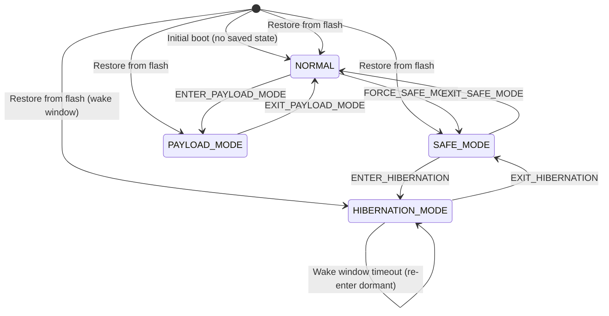

## Integration Tests

See `FprimeZephyrReference/test/int/mode_manager_test.py`, `FprimeZephyrReference/test/int/payload_mode_test.py`, and `FprimeZephyrReference/test/int/hibernation_mode_test.py` for comprehensive integration tests covering:

### Safe Mode & Normal Mode Tests (mode_manager_test.py)

| Test | Description | Coverage |
|---|---|---|
| test_01_initial_telemetry | Verifies initial telemetry can be read | Basic functionality |
| test_04_force_safe_mode_command | Tests FORCE_SAFE_MODE command enters safe mode | Safe mode entry |
| test_06_safe_mode_turns_off_load_switches | Verifies all load switches turn off in safe mode | Power management |
| test_14_exit_safe_mode_success | Tests successful safe mode exit | Safe mode exit |
| test_19_safe_mode_state_persists | Verifies safe mode persistence to flash | State persistence |

### Payload Mode Tests (payload_mode_test.py)

| Test | Description | Coverage |
|---|---|---|
| test_payload_01_enter_exit_payload_mode | Validates payload mode entry/exit, events, telemetry, payload load switches | Payload mode entry/exit |
| test_payload_02_cannot_enter_from_safe_mode | Ensures ENTER_PAYLOAD_MODE fails from SAFE_MODE | Command validation |
| test_payload_03_safe_mode_rejected_from_payload | Ensures FORCE_SAFE_MODE is rejected from payload mode (sequential transitions) | Command validation |
| test_payload_04_state_persists | Verifies payload mode and counters persist | Payload persistence |

### Hibernation Mode Tests (hibernation_mode_test.py)

| Test | Description | CI Coverage |
|---|---|---|
| test_hibernation_01_enter_fails_from_normal | Verifies ENTER_HIBERNATION fails from NORMAL mode | Normal CI |
| test_hibernation_02_enter_fails_from_payload | Verifies ENTER_HIBERNATION fails from PAYLOAD_MODE | Normal CI |
| test_hibernation_03_exit_fails_from_normal | Verifies EXIT_HIBERNATION fails when not in hibernation | Normal CI |
| test_hibernation_04_exit_fails_from_safe | Verifies EXIT_HIBERNATION fails from SAFE_MODE | Normal CI |
| test_hibernation_05_telemetry_channels_exist | Verifies hibernation telemetry channels exist and are readable | Normal CI |
| test_hibernation_06_dormant_entry_failure_handling | Verifies failure path: HibernationEntryFailed event, counter rollback, mode reversion | Normal CI (native/sim) |
| test_hibernation_07_enter_reboot_success | Verifies successful hibernation entry on real hardware | --run-reboot |
| test_hibernation_08_exit_during_wake_window | Verifies EXIT_HIBERNATION during wake window | --run-reboot |
| test_hibernation_09_wake_window_timeout | Verifies automatic re-sleep when wake window expires | --run-reboot |

> **Testing Strategy:** On native/simulation builds, `PicoSleep::sleepForSeconds()` returns false (dormant not supported), which exercises the failure handling path in normal CI. This tests the HibernationEntryFailed event emission, counter rollback, and mode reversion to SAFE_MODE. Tests requiring actual reboots (07-09) need the `--run-reboot` flag for hardware testing.

## Design Decisions

### Hybrid Mode Query/Notification Approach
The component provides both pull-based (getMode port) and push-based (modeChanged port) mechanisms for mode awareness:

- **getMode port (pull)**: Allows components to query current mode on-demand, useful for:
  - Component initialization
  - Recovery from faults
  - Periodic mode checks

- **modeChanged port (push)**: Notifies components immediately when mode changes with the new mode value, useful for:
  - Reactive behavior
  - Real-time mode tracking
  - Avoiding polling overhead

This dual approach ensures downstream components can reliably track system mode even if they miss a transition notification.

### State Persistence
Mode state is persisted to `/mode_state.bin` to maintain operational context across:
- Intentional reboots
- Watchdog resets
- Power cycles
- **Hibernation dormant wake cycles** (critical for hibernation resumption)

This ensures the system resumes in the correct mode after recovery. For hibernation, the sleep/wake durations are also persisted to enable automatic continuation of hibernation cycles.

### Sequential Mode Transitions
Mode transitions follow a sequential pattern: HIBERNATION_MODE(0) ↔ SAFE_MODE(1) ↔ NORMAL(2) ↔ PAYLOAD_MODE(3). Direct jumps (e.g., PAYLOAD→SAFE, NORMAL→HIBERNATION) are not allowed - users must follow the transition paths:
- To enter hibernation: Must be in SAFE_MODE
- To exit hibernation: Transitions to SAFE_MODE (then EXIT_SAFE_MODE for NORMAL)
- To enter payload: Must be in NORMAL
- To enter safe: Must be in NORMAL (not from PAYLOAD_MODE directly)

### Hibernation Implementation Strategy
The hibernation mode uses the RP2350's dormant mode with RTC alarm wake:

1. **Sleep Entry**: When entering dormant sleep, the system saves all state to flash (including cycle counts and durations), then calls `PicoSleep::sleepForSeconds()` which puts the RP2350 into ultra-low-power dormant state with an RTC alarm configured.

2. **Wake Mechanism**: When the RTC alarm fires, the RP2350 performs a full cold reboot via `sys_reboot()`. This is a hardware limitation - dormant wake triggers a reset.

3. **State Resumption**: On boot, `loadState()` detects HIBERNATION_MODE and automatically starts the wake window, resuming the hibernation cycle.

4. **Command Response Timing**: The `ENTER_HIBERNATION` command sends its OK response BEFORE entering dormant sleep. This is critical because the subsequent reboot would prevent the response from ever being sent, causing ground to see a timeout.

5. **Counter Rollback**: If dormant entry fails (e.g., hardware error), the pre-incremented counters are rolled back to maintain accurate statistics.

6. **Dormant Entry Failure Notification**: Because the OK response is sent before attempting dormant entry, ground cannot rely on command response to detect failure. If `PicoSleep::sleepForSeconds()` returns false (hardware/RTC error), a WARNING_HI `HibernationEntryFailed` event is emitted. Ground must monitor for this event after any ENTER_HIBERNATION command - if seen, the command actually failed despite the OK response, and the system has reverted to SAFE_MODE.

7. **Wake Window**: During the wake window, only essential subsystems (LoRa radio) are active. The 1Hz run handler counts down the wake window and automatically re-enters dormant sleep when expired.

## Change Log
| Date | Description |
|---|---|
| 2025-11-29 | Added HibernationEntryFailed (WARNING_HI) event for when dormant entry fails after OK response sent |
| 2025-11-29 | Added HIBERNATION_MODE with RP2350 dormant mode, RTC alarm wake, configurable sleep/wake durations, cycle tracking, and integration tests |
| 2025-11-26 | Reordered enum values (SAFE=1, NORMAL=2, PAYLOAD=3) for sequential +1/-1 transitions; FORCE_SAFE_MODE now rejected from payload mode |
| 2025-11-26 | Removed forcePayloadMode port - payload mode now only entered via ENTER_PAYLOAD_MODE ground command |
| 2025-11-25 | Added PAYLOAD_MODE (commands, events, telemetry, persistence, payload load switch control) and documented payload integration tests |
| 2025-11-19 | Added getMode query port and enhanced modeChanged to carry mode value |
