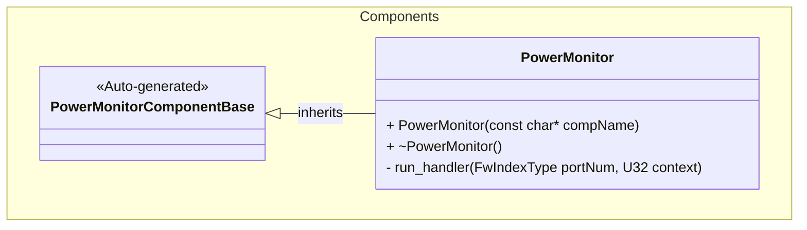
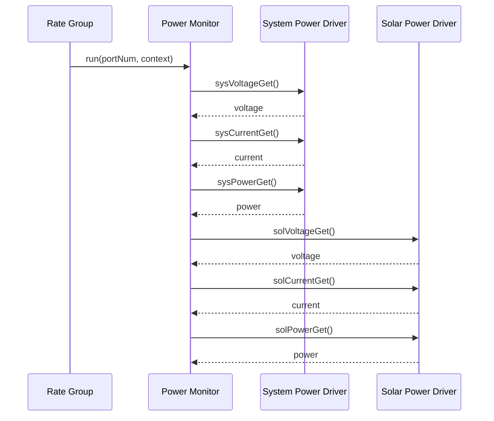

# Components::PowerMonitor

The Power Monitor component is a manager that coordinates power monitoring across multiple power sources. It periodically polls voltage, current, and power measurements from both system power and solar panel power sources.

## Usage Examples

The Power Monitor component is designed to run periodically via a rate group scheduler. It operates as a passive component that coordinates data collection from multiple power monitoring drivers.

### Typical Usage

1. The component is instantiated and initialized during system startup
2. The component is connected to:
   - A rate group scheduler (via the `run` input port)
   - System power monitoring driver (via `sys*` output ports)
   - Solar panel power monitoring driver (via `sol*` output ports)
3. On each scheduler cycle:
   - The component calls all six output ports to trigger measurements
   - Each connected driver fetches sensor data and writes telemetry
   - Power monitoring data becomes available system-wide

## Class Diagram

## Port Descriptions
| Name | Type | Description |
|---|---|---|
| run | sync input | Scheduler port that triggers periodic power monitoring cycle |
| sysVoltageGet | output | Requests voltage measurement from system power driver |
| sysCurrentGet | output | Requests current measurement from system power driver |
| sysPowerGet | output | Requests power measurement from system power driver |
| solVoltageGet | output | Requests voltage measurement from solar panel power driver |
| solCurrentGet | output | Requests current measurement from solar panel power driver |
| solPowerGet | output | Requests power measurement from solar panel power driver |

## Sequence Diagrams

### Run Cycle

## Requirements
| Name | Description | Validation |
|---|---|---|
| PWR-MON-REQ-001 | The component shall respond to scheduler calls via the run port | Integration test |
| PWR-MON-REQ-002 | The component shall request voltage measurements from the system power driver on each run cycle | Integration test |
| PWR-MON-REQ-003 | The component shall request current measurements from the system power driver on each run cycle | Integration test |
| PWR-MON-REQ-004 | The component shall request power measurements from the system power driver on each run cycle | Integration test |
| PWR-MON-REQ-005 | The component shall request voltage measurements from the solar panel power driver on each run cycle | Integration test |
| PWR-MON-REQ-006 | The component shall request current measurements from the solar panel power driver on each run cycle | Integration test |
| PWR-MON-REQ-007 | The component shall request power measurements from the solar panel power driver on each run cycle | Integration test |

## Change Log
| Date | Description |
|---|---|
| 2025-11-03 | Initial Power Monitor component |
