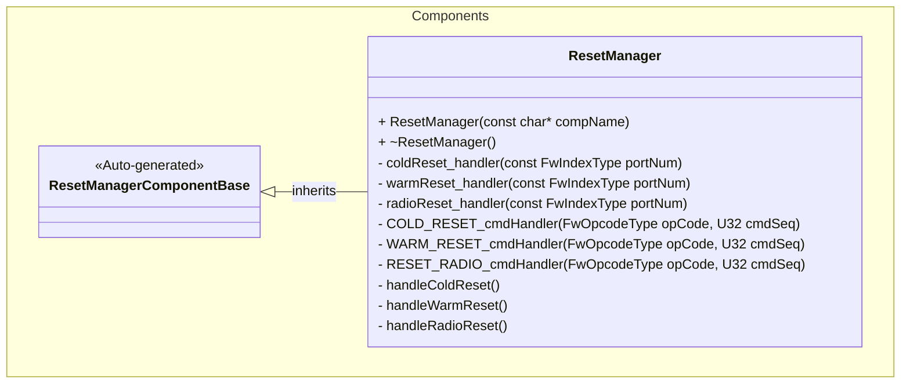
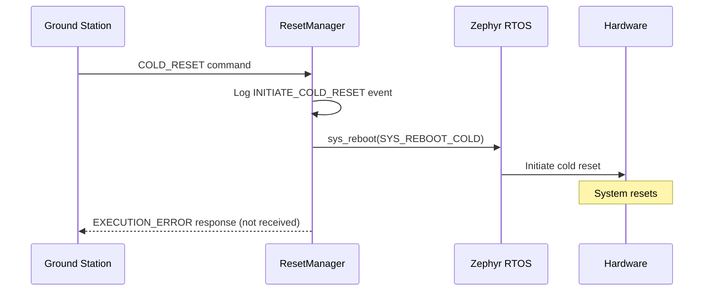
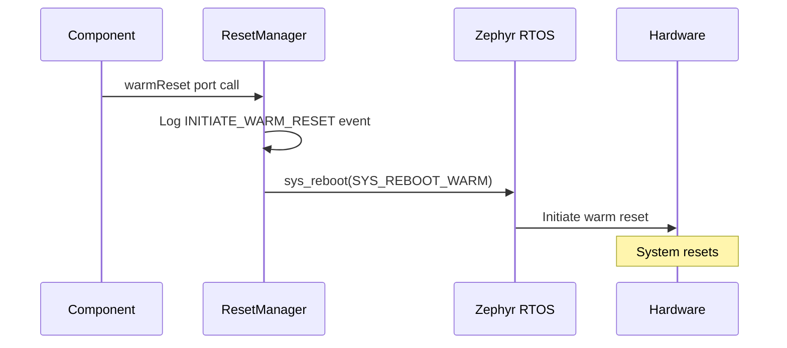
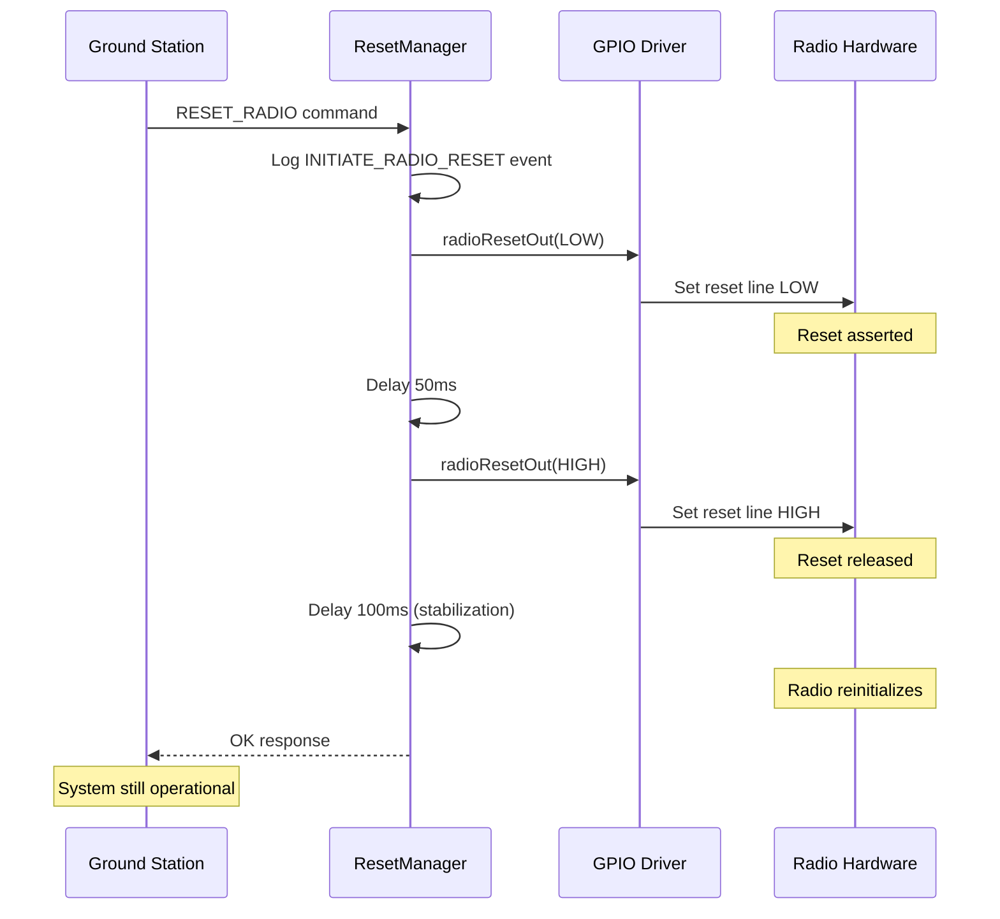
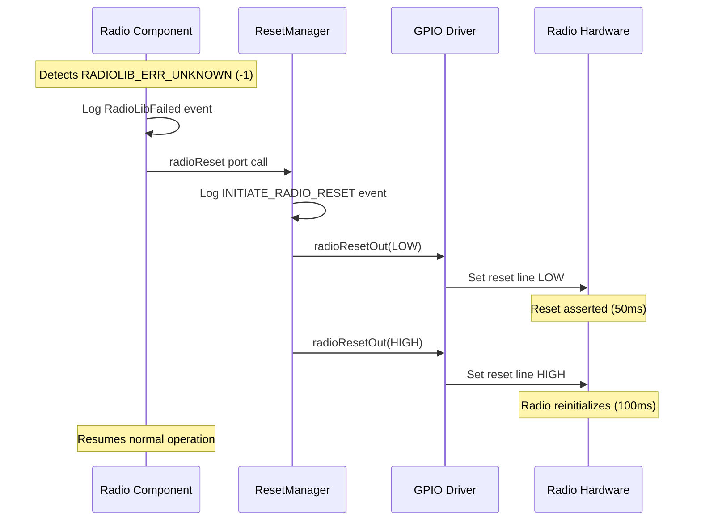

# Components::ResetManager

The ResetManager component provides system reset functionality, allowing the satellite to perform cold resets, warm resets, and radio-only resets through commands or direct port calls.

## Usage Examples

The ResetManager component can be triggered in two ways:
1. Through ground commands (`COLD_RESET`, `WARM_RESET`, or `RESET_RADIO`)
2. Through direct port calls (`coldReset`, `warmReset`, or `radioReset`)

### Typical Usage

1. The component is instantiated and initialized during system startup
2. When a reset is needed:
   - **Via Command**: Ground station sends `COLD_RESET`, `WARM_RESET`, or `RESET_RADIO` command
   - **Via Port**: Another component calls the `coldReset`, `warmReset`, or `radioReset` port
3. The component:
   - **For system resets** (cold/warm):
     - Logs the appropriate event (`INITIATE_COLD_RESET` or `INITIATE_WARM_RESET`)
     - Notifies ModeManager to set clean shutdown flag via `prepareForReboot` port
     - Calls the Zephyr `sys_reboot()` function with the appropriate reset type
     - System resets (command response is not received)
   - **For radio reset**:
     - Logs `INITIATE_RADIO_RESET` event
     - Toggles radio reset GPIO line (50ms LOW, then HIGH with 100ms stabilization)
     - Returns command response `OK` (system continues running)

**Note**:
- After initiating a cold or warm reset, the command response will indicate `EXECUTION_ERROR` since the system will reset before the response can be transmitted.
- Radio reset is **non-destructive** - the system remains operational and returns a normal `OK` response.

## Class Diagram



## Port Descriptions
| Name | Type | Kind | Description |
|---|---|---|---|
| coldReset | Fw.Signal | sync input | Triggers a cold reset of the system |
| warmReset | Fw.Signal | sync input | Triggers a warm reset of the system |
| radioReset | Fw.Signal | sync input | Triggers a radio reset without system reboot |
| prepareForReboot | Fw.Signal | output | Notifies ModeManager before system reboot to set clean shutdown flag |
| radioResetOut | Drv.GpioWrite | output | Controls radio reset GPIO line |

## Sequence Diagrams

### Cold Reset via Command


### Warm Reset via Port


### Radio Reset via Command


### Automatic Radio Reset (Fault Recovery)


## Commands
| Name | Description | Response |
|---|---|---|
| COLD_RESET | Command to initiate a cold reset (full hardware reset) | EXECUTION_ERROR (system reboots) |
| WARM_RESET | Command to initiate a warm reset (software reset, preserves some state) | EXECUTION_ERROR (system reboots) |
| RESET_RADIO | Command to reset radio module via GPIO without system reboot | OK (system continues) |

## Events
| Name | Severity | Description |
|---|---|---|
| INITIATE_COLD_RESET | ACTIVITY_HI | Event indicating that a cold reset has been initiated |
| INITIATE_WARM_RESET | ACTIVITY_HI | Event indicating that a warm reset has been initiated |
| INITIATE_RADIO_RESET | ACTIVITY_HI | Event indicating that a radio reset has been initiated |

## Requirements
| Name | Description | Validation |
|---|---|---|
| Cold Reset Command | The component shall provide a command to initiate a cold reset of the system | Verify system performs full hardware reset when command is issued |
| Warm Reset Command | The component shall provide a command to initiate a warm reset of the system | Verify system performs software reset when command is issued |
| Radio Reset Command | The component shall provide a command to reset the radio without system reboot | test_03_radio_reset: Verify RESET_RADIO returns OK and system stays operational |
| Cold Reset Port | The component shall provide a port to trigger a cold reset programmatically | Verify system resets when port is called |
| Warm Reset Port | The component shall provide a port to trigger a warm reset programmatically | Verify system resets when port is called |
| Radio Reset Port | The component shall provide a port to trigger a radio reset programmatically | Verify radio reset when port is called and system continues |
| Reset Event Logging | The component shall log an event before initiating any reset | Verify appropriate event is logged before reset occurs |
| Radio Reset Timing | The component shall assert radio reset line LOW for 50ms, then HIGH with 100ms stabilization | Measure GPIO timing with logic analyzer (50ms ± 10ms LOW, 100ms ± 20ms stabilization) |
| Radio Reset Non-Destructive | Radio reset shall not reboot the system | Verify system remains operational after RESET_RADIO command |
| Radio Reset GPIO Control | The component shall toggle GPIO line via radioResetOut port | Verify GPIO driver receives LOW then HIGH signals |
| Radio Reset Safety | The component shall gracefully handle missing GPIO connection | Verify reset works in test environment without hardware |
| Zephyr Integration | The component shall use Zephyr's `sys_reboot()` function for system reset operations | Verify `sys_reboot()` is called with correct parameters for cold/warm resets |
| Fault Recovery Integration | The component shall accept automatic reset requests from radio components | Verify radioReset port triggers same behavior as RESET_RADIO command |

## Radio Reset Technical Specifications

### Timing Requirements
- **Reset Assertion Time**: 50ms (LOW pulse)
- **Stabilization Time**: 100ms (after releasing HIGH)
- **Total Reset Cycle**: 150ms
- **Tolerance**: ±20% acceptable for most radio modules

### GPIO Signal Behavior
```
           ┌─────────────────────────────────────
           │
  HIGH ────┤
           │
           │
  LOW      └──────────┐
                     │
           ─────────────────────────────────────► Time
                   50ms      100ms
                  (assert)  (stabilize)
```

### Port Connection Safety
The implementation includes port connection checks to allow operation in test environments without hardware:
```cpp
if (this->isConnected_radioResetOut_OutputPort(0)) {
    // Perform GPIO operations
}
```
This ensures:
- Integration tests can run without GPIO hardware
- Component gracefully handles missing connections
- Hardware-in-the-loop testing works when GPIO is connected

### Integration with Radio Components
Radio components (e.g., SBand) can automatically request resets by:
1. Detecting fault conditions (e.g., RADIOLIB_ERR_UNKNOWN)
2. Calling `resetRequest` output port
3. ResetManager receives on `radioReset` input port
4. Executes same reset sequence as RESET_RADIO command

## Change Log
| Date | Description |
|---|---|
| 2025-11-12 | Initial ResetManager component |
| 2026-02-03 | Added RESET_RADIO command and automatic radio fault recovery (#109) |
