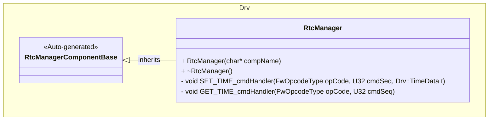
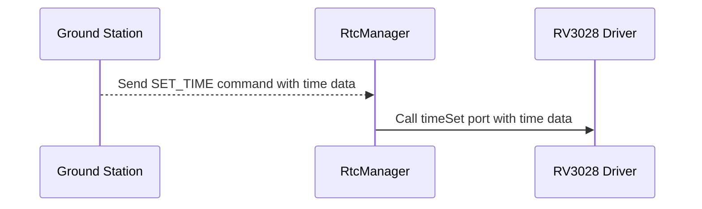
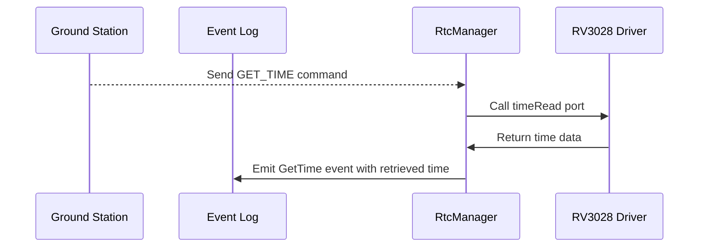

# Components::RtcManager

The RtcManager component manages interactions with a Real Time Clock (RTC) device. It interfaces with the Rv3028Manager component to set and get the current time.

### Typical Usage

#### `SET_TIME` Command Usage
1. The component is instantiated and initialized during system startup
2. A ground station sends a `SET_TIME` command with the desired time
3. On each command, the component:
    - Calls the `timeSet` port to set the time on the RTC device

#### `GET_TIME` Command Usage
1. The component is instantiated and initialized during system startup
2. A ground station sends a `GET_TIME` command
3. On each command, the component:
    - Calls the `timeRead` port to get the current time from the RTC device
    - Emits a `GetTime` event with the retrieved time

## Requirements
| Name | Description | Validation |
|---|---|---|
| RtcManager-001 | The RTC manager has a command that reads the time from the RTC | Manual |
| RtcManager-002 | An event with time information is emitted when time is read | Manual |
| RtcManager-003 | The RTC manager has a command that sets the time on the RTC | Manual |

## Port Descriptions
| Name | Description |
|---|---|
| timeSet | Output port to reach out to driver to set the time |
| TimeRead | Output port to reach out to driver to read the time |

## Commands
| Name | Description |
|---|---|
| SET_TIME | Sets the time on the RTC |
| GET_TIME | Gets the time from the RTC |

## Events
| Name | Description |
|---|---|
| GetTime | Event to log the time retrieved from the Rv3028Manager |

## Class Diagram

## Sequence Diagrams

### `SET_TIME` Command

### `GET_TIME` Command

## Change Log
| Date | Description |
|---|---|
| 2025-9-18 | Initial RTC Manager component |
