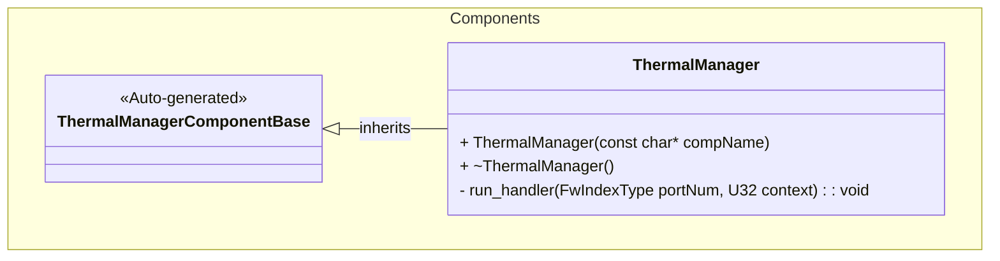
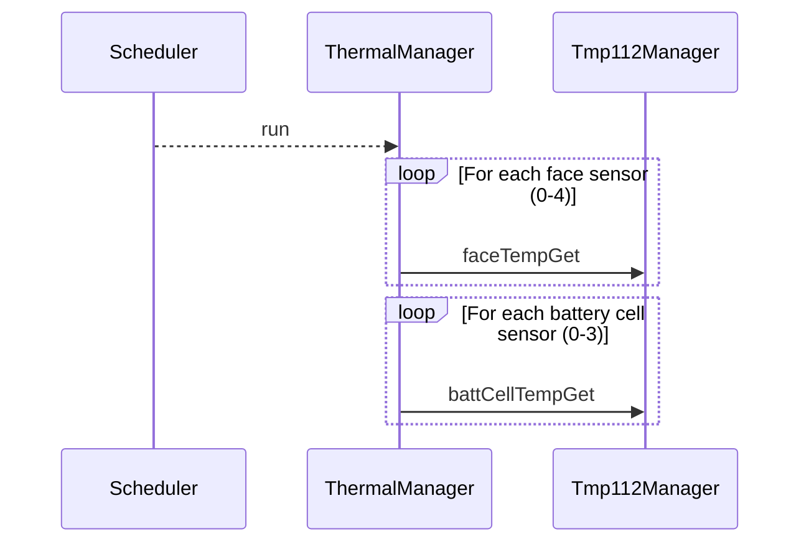

# Components::ThermalManager

The Thermal Manager component is responsible for orchestrating temperature sensor readings from multiple TMP112 sensors distributed across the spacecraft. It specifically manages sensors for the spacecraft faces and battery cells.

## Usage Examples

The Thermal Manager component is designed to be scheduled periodically to trigger collection of temperature data. It operates as a passive component that responds to scheduler calls.

### Typical Usage

1. The component is instantiated and initialized during system startup.
2. The scheduler calls the `run` port at regular intervals.
3. On each run call, the component:
   - Iterates through the connected face temperature sensor ports.
   - Iterates through the connected battery cell temperature sensor ports.
   - Triggers temperature readings for each connected sensor.

## Class Diagram

## Port Descriptions
| Name | Type | Description |
|---|---|---|
| run | sync input | Scheduler port that triggers temperature data collection |
| faceTempGet | output | Array of ports [5] for getting temperature data from face sensors |
| battCellTempGet | output | Array of ports [4] for getting temperature data from battery cell sensors |
| timeCaller | time get | Port for requesting current system time |
| tlmOut | telemetry | Port for emitting telemetry |
| logOut | event | Port for emitting events |
| logTextOut | text event | Port for emitting text events |

## Sequence Diagrams

## Requirements
| Name | Description | Validation |
|---|---|---|
| Face Temperature Collection | The component shall trigger data collection from connected face temperature sensors when run is called | Verify all connected face temperature output ports are called |
| Battery Temperature Collection | The component shall trigger data collection from connected battery cell temperature sensors when run is called | Verify all connected battery cell temperature output ports are called |
| Periodic Operation | The component shall operate as a scheduled component responding to scheduler calls | Verify component responds correctly to scheduler input |

## Change Log
| Date | Description |
|---|---|
| 2025-12-05 | Initial Thermal Manager component SDD |
