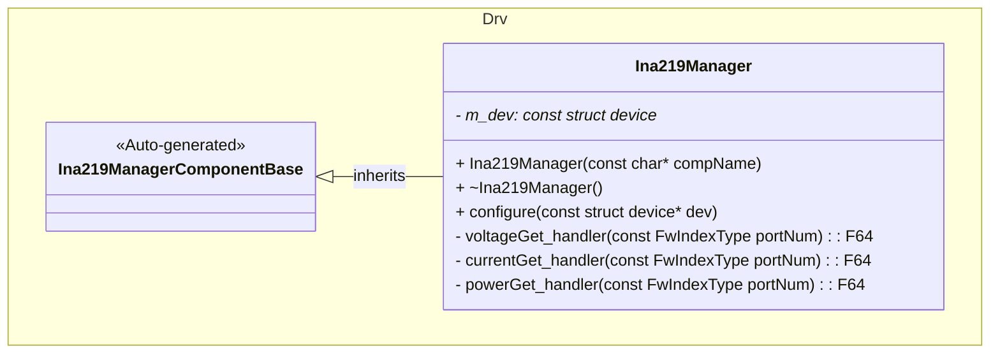
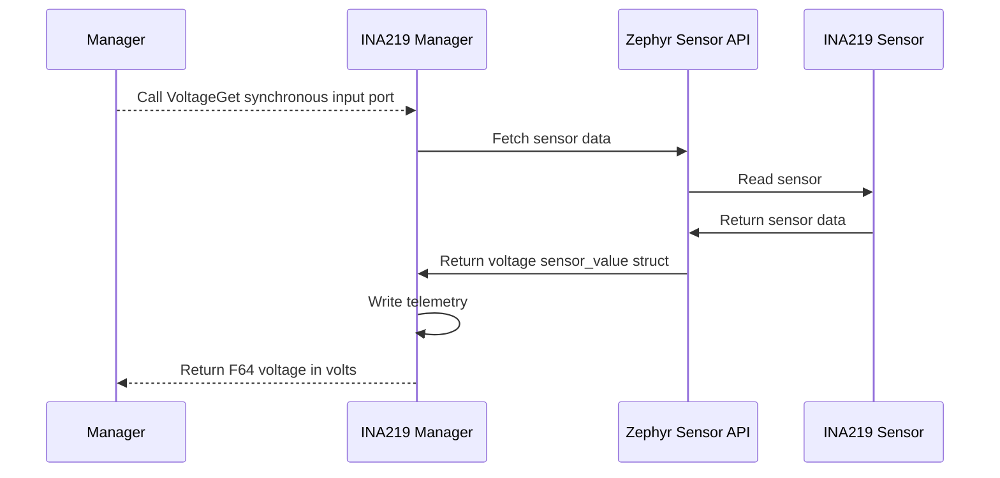
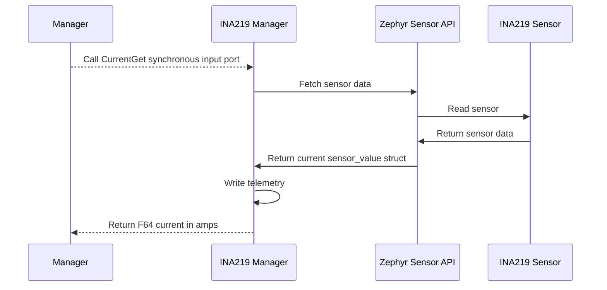

# Drv::Ina219Manager

The INA219 Manager component interfaces with the INA219 current/power monitor to provide voltage, current, and power measurements.

## Usage Examples

The INA219 Manager component is designed to be called periodically to collect and return sensor data. It operates as a passive component that responds to manager calls.

### Typical Usage

1. The component is instantiated and initialized during system startup
2. A manager calls any of the input ports: `VoltageGet`, `CurrentGet`, or `PowerGet`
3. On each call, the component:
   - Fetches fresh sensor samples from the sensor
   - Converts sensor data to double precision floating point
   - Writes telemetry data
   - Returns data in SI units

## Class Diagram

## Port Descriptions
| Name | Type | Description |
|---|---|---|
| VoltageGet | sync input | Triggers voltage data collection and returns voltage in volts |
| CurrentGet | sync input | Triggers current data collection and returns current in amps |
| PowerGet | sync input | Triggers power data collection and returns power in watts |

## Sequence Diagrams

### VoltageGet

### CurrentGet

### PowerGet

## Requirements
| Name | Description | Validation |
|---|---|---|
| VoltageGet Port | The component shall provide access to voltage sensor data and return in volts | Integration test |
| CurrentGet Port | The component shall provide access to current sensor data and return in amps | Integration test |
| PowerGet Port | The component shall provide access to power sensor data and return in watts | Integration test |
| DeviceNotReady Event | The component shall emit a throttled warning event when the device is not ready | Verify event is emitted and throttled to 5 occurrences |

## Change Log
| Date | Description |
|---|---|
| 2025-11-03 | Initial INA219 Manager component |
