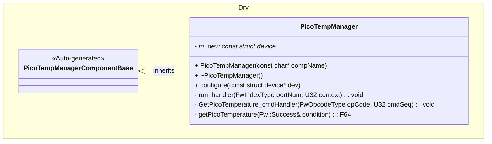
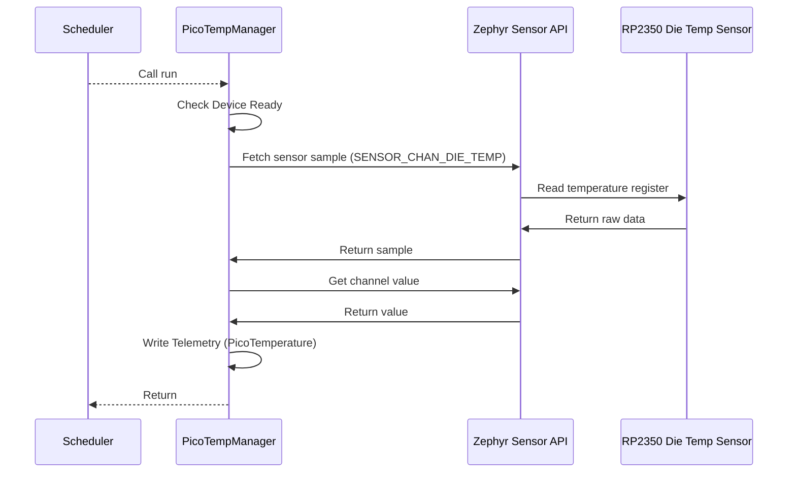
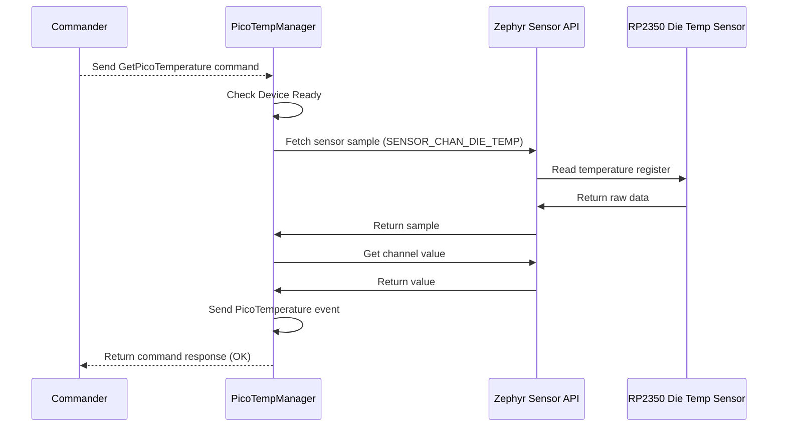

# Drv::PicoTempManager

The PicoTempManager component interfaces with the RP2350 microcontroller's built-in die temperature sensor to provide temperature measurements.

## Usage Examples

The PicoTempManager component is designed to be called periodically or on demand to collect and return sensor data. It operates as a passive component that responds to scheduler ticks and command requests.

### Typical Usage

1. The component is instantiated and initialized during system startup.
2. The scheduler calls the input port: `run` periodically.
3. On each call, the component:
   - Checks if the device is initialized and ready.
   - Fetches fresh sensor samples from the die temperature sensor.
   - Writes telemetry data.
   - Reports temperature via events.
4. Alternatively, the `GetPicoTemperature` command can be sent on demand to immediately fetch and report the current temperature.

## Class Diagram

## Port Descriptions

| Name           | Type         | Description                                                                                               |
| -------------- | ------------ | --------------------------------------------------------------------------------------------------------- |
| run            | sync input   | Scheduler port that triggers periodic temperature sampling. Called by the scheduler at regular intervals. |
| timeCaller     | time get     | Port for requesting the current time                                                                      |
| cmdRegOut      | command reg  | Port for sending command registrations                                                                    |
| cmdIn          | command recv | Port for receiving commands                                                                               |
| cmdResponseOut | command resp | Port for sending command responses                                                                        |
| logTextOut     | text event   | Port for sending textual representation of events                                                         |
| logOut         | event        | Port for sending events to downlink                                                                       |
| tlmOut         | telemetry    | Port for sending telemetry channels to downlink                                                           |

## Sequence Diagrams

### Periodic Temperature Reading (run port)

### GetPicoTemperature command

## Commands

| Name               | Description                                           |
| ------------------ | ----------------------------------------------------- |
| GetPicoTemperature | Command to get the die temperature in degrees Celsius |

## Events

| Name                    | Description                                |
| ----------------------- | ------------------------------------------ |
| DeviceNotReady          | Die temperature device not ready           |
| DeviceInitFailed        | Die temperature initialization failed      |
| DeviceNil               | Die temperature device is nil              |
| DeviceStateNil          | Die temperature device state is nil        |
| SensorSampleFetchFailed | Die temperature sensor sample fetch failed |
| SensorChannelGetFailed  | Die temperature sensor channel get failed  |
| PicoTemperature         | Die temperature reading in degrees Celsius |

## Telemetry

| Name            | Description                        |
| --------------- | ---------------------------------- |
| PicoTemperature | Die temperature in degrees Celsius |

## Requirements

| Name                          | Description                                                                           | Validation                                                                                     |
| ----------------------------- | ------------------------------------------------------------------------------------- | ---------------------------------------------------------------------------------------------- |
| Periodic Temperature Reading  | The component shall read the die temperature sensor on each scheduler tick (run port) | Verify telemetry is updated periodically as expected                                           |
| On-Demand Temperature Reading | The component shall provide a command interface to read temperature on demand         | Verify GetPicoTemperature command returns current temperature                                  |
| Temperature Units             | The component shall return temperature in degrees Celsius                             | Verify output matches sensor datasheet specifications                                          |
| Error Handling                | The component shall log appropriate error events when sensor operations fail          | Verify events are logged for device not ready, sample fetch failures, and channel get failures |

## Change Log

| Date       | Description                             |
| ---------- | --------------------------------------- |
| 2026-03-30 | Initial Pico Temp Manager component SDD |
