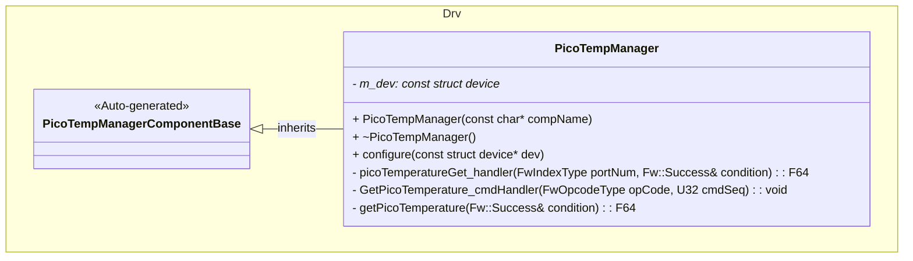
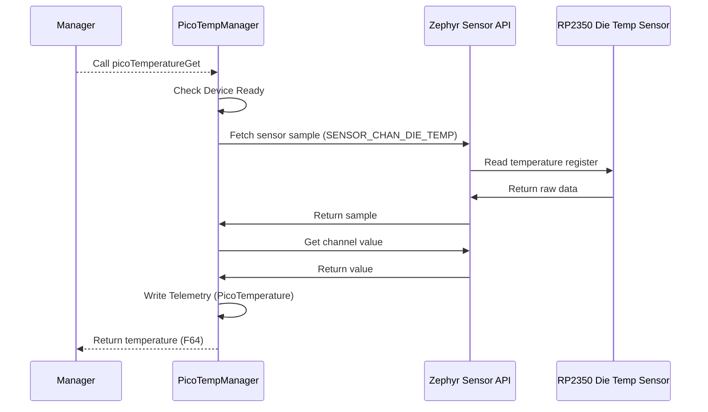

# Drv::PicoTempManager

The PicoTempManager component interfaces with the RP2350 microcontroller's built-in die temperature sensor to provide temperature measurements.

## Usage Examples

The PicoTempManager component is designed to be called on-demand to return die temperature sensor data. It operates as a passive component that responds to input port calls.

### Typical Usage

1. The component is instantiated and initialized during system startup.
2. A manager (such as ThermalManager) calls the input port: `picoTemperatureGet`.
3. On each call, the component:
   - Checks if the device is initialized and ready.
   - Fetches fresh sensor samples from the die temperature sensor.
   - Writes telemetry data.
   - Returns the temperature value in degrees Celsius via the output.
4. Alternatively, the `GetPicoTemperature` command can be sent to immediately fetch and report the current temperature.

## Class Diagram

## Port Descriptions

| Name               | Type         | Description                                                                                                |
| ------------------ | ------------ | ---------------------------------------------------------------------------------------------------------- |
| picoTemperatureGet | sync input   | Port to read the die temperature in degrees Celsius. Returns F64 temperature and Success condition output. |
| timeCaller         | time get     | Port for requesting the current time                                                                       |
| cmdRegOut          | command reg  | Port for sending command registrations                                                                     |
| cmdIn              | command recv | Port for receiving commands                                                                                |
| cmdResponseOut     | command resp | Port for sending command responses                                                                         |
| logTextOut         | text event   | Port for sending textual representation of events                                                          |
| logOut             | event        | Port for sending events to downlink                                                                        |
| tlmOut             | telemetry    | Port for sending telemetry channels to downlink                                                            |

## Sequence Diagrams

### On-Demand Temperature Reading (picoTemperatureGet port)

## Commands

| Name               | Description                                           |
| ------------------ | ----------------------------------------------------- |
| GetPicoTemperature | Command to get the die temperature in degrees Celsius |

## Events

| Name                    | Description                                |
| ----------------------- | ------------------------------------------ | --- |
| DeviceNotReady          | Die temperature device not ready           |     |
| SensorSampleFetchFailed | Die temperature sensor sample fetch failed |
| SensorChannelGetFailed  | Die temperature sensor channel get failed  |
| PicoTemperature         | Die temperature reading in degrees Celsius |

## Telemetry

| Name            | Description                        |
| --------------- | ---------------------------------- |
| PicoTemperature | Die temperature in degrees Celsius |

## Requirements

| Name                        | Description                                                                                | Validation                                                           |
| --------------------------- | ------------------------------------------------------------------------------------------ | -------------------------------------------------------------------- |
| On-Demand Temperature Read  | The component shall read die temperature when picoTemperatureGet port is called            | Verify output matches sensor datasheet specifications                |
| Command Temperature Reading | The component shall provide a command interface to read temperature on demand              | Verify GetPicoTemperature command returns current temperature        |
| Temperature Units           | The component shall return temperature in degrees Celsius                                  | Verify output matches sensor datasheet specifications                |
| Error Handling              | The component shall log appropriate error events when sensor operations fail               | Verify events logged for device not ready, sample fetch, channel get |
| Port Return Value           | The component shall return the temperature value and success condition via the output port | Verify return value is used by calling component                     |

## Change Log

| Date       | Description                             |
| ---------- | --------------------------------------- |
| 2026-03-30 | Initial Pico Temp Manager component SDD |
