# Components::RtcManager

The RTC Manager component supplies spacecraft time from the Real Time Clock (RTC). Spacecraft time is uptime plus a time offset. The RTC update interrupt corrects the time offset once per second. The `timeGetPort` does not access the RTC hardware. If the RTC was never read successfully, the component returns uptime.

> [!IMPORTANT]
> The code executed by the RTC Manager’s `timeGetPort` must never call into the eventing system. The timeGetPort is invoked frequently across F Prime and is used by the eventing system itself, any handler code must not use event ports, commands, or telemetry — doing so can cause deadlocks. Log any errors from the `timeGetPort` handler to the console with throttling to prevent flooding and do not allow those errors to cause the handler to fail. If the RTC is unavailable or an error occurs while retrieving time, the component must gracefully fall back to returning a monotonic uptime.
>
> The RTC update callback runs on the system workqueue thread, not on the time port, and may emit events and telemetry; it must not emit while holding the spinlock.

### Typical Usage

#### `TIME_SET` Command Usage
1. The component is instantiated and initialized during system startup
2. A ground station sends a `TIME_SET` command with the desired time
3. On each command, the component:
    - Cancels any running sequences
    - Validates the time data (year >= 1900, month [1-12], day [1-31], hour [0-23], minute [0-59], second [0-59])
    - Emits validation failure events if any field is invalid
    - Sets the time on the RTC if validation passes
    - Seeds the time offset from the new time. Reported time can step backward one time
    - Emits a `TimeSet` event with the previous time if the time is set successfully
    - Emits a `TimeNotSet` event if the time is not set successfully
    - Emits a `DeviceNotReady` event if the device is not ready

#### `TIMEBASE` Parameter Usage
1. A ground station sends `TIMEBASE_PRM_SET` with `TB_PROC_TIME` or `TB_SC_TIME`, and `TIMEBASE_PRM_SAVE` to persist the choice across boots
2. When the parameter is updated the component:
    - Cancels any running sequences, since the change in reported time may affect them
    - Emits a `TimeBaseChanged` event with the timebase now in use
3. On each `timeGetPort` call, if the parameter is `TB_PROC_TIME` the component returns uptime without touching the RTC

The parameter uses `Rtc.TimeBase`, a component-local copy of the upstream F Prime `TimeBase` enum carrying only the bases this component can source (`TB_PROC_TIME` and `TB_SC_TIME`). It lives in its own `Rtc` module because a `Drv.TimeBase` would shadow the global `TimeBase` enum inside generated `Drv` code. The default is `TB_SC_TIME`.

#### Alarm Interrupt Path
The RV3028 signals an alarm on its `~INT` pin. `~INT` is open-drain and active low. An external 10 kΩ resistor (R5) pulls it up. The device tree declares the pin `GPIO_ACTIVE_LOW`. On the falling edge, the Zephyr driver reads the RTC status and calls the alarm callback.

The RV3028 keeps its alarm flag (`AF`) through a processor reset. If `AF` is stale, the next alarm triggers immediately when its callback is registered. The component clears `AF` with `rtc_alarm_is_pending()`:
- In `configure()`, before any alarm callback is registered.
- In `ALARM_SET`, before the alarm time is written. This also covers a failed clear in `configure()`.
- In `ALARM_CANCEL`, as part of disarming the alarm.
- After an alarm triggers, as part of disarming the alarm.

The driver disables the alarm interrupt at init. Only the callback registration in `ALARM_SET` enables it. Thus a stale `AF` cannot hold `~INT` low before a callback exists.

The component disarms the alarm on `ALARM_CANCEL` and after an alarm triggers. Disarming happens in this order:
1. Unregister the callback with `rtc_alarm_set_callback(dev, 0, NULL, NULL)`. This also disables the alarm interrupt.
2. Write the disabled alarm with `rtc_alarm_set_time()` and a mask of 0.
3. Clear `AF` with `rtc_alarm_is_pending()`.

This order matters. Writing the disabled alarm in step 2 can set `AF` on the RV3028. If the alarm interrupt is still enabled at that point, this raises a false `AlarmTriggered` event. Disabling the interrupt first, in step 1, prevents this.

> [!NOTE]
> The RV3028 alarm has minute resolution. An alarm set for a later second in the current minute triggers immediately (issue #521).

#### `ALARM_SET` Command Usage
1. The component is instantiated and initialized during system startup
2. A ground station sends a `ALARM_SET` command with the desired time
3. On each command, the component:
    - Validates that the alarm is at a future date
    - Emits 'AlarmNotSet' if time is not valid or if an alarm is already present
    - Clears a stale alarm flag with `rtc_alarm_is_pending()`. If this fails, emits `AlarmHardwareError` and responds `EXECUTION_ERROR`
    - Sets the time to the RTC alarm if validation passes
    - Emits a `AlarmSet` event with the previous time if the alarm is set successfully
    - Emits a `AlarmNotSet` event if the alarm is not set successfully

#### `ALARM_CANCEL` Command Usage
1. A ground station sends a `ALARM_CANCEL` command with the desired alarm ID to cancel
2. On each command, the component:
    - Validates that an alarm exists
    - Emits 'AlarmNotCanceled' if an alarm is already present
    - Cancels the present alarm if it is present on the system
    - Disarms the alarm: unregisters the callback, writes the disabled alarm (mask 0), then clears a stale alarm flag with `rtc_alarm_is_pending()`. If any step fails, emits `AlarmHardwareError` and responds `EXECUTION_ERROR`
    - Emits a `AlarmCanceled` event with the previous time if the alarm is canceled successfully
    - Emits a `AlarmNotCanceled` event if the alarm is not canceled successfully

#### `ALARM_LIST` Command Usage
1. A ground station sends a `ALARM_LIST` command
2. On each command, the component:
    - Validates that an alarm exists
    - Emits 'AlarmNotSet' if no alarm is present
    - Emits 'AlarmSet' if an alarm is present and returns it's information to the ground station

#### `timeGetPort` Port Usage
1. The component is instantiated and initialized during system startup
2. In a deployment topology, a `time connection` relation is made to sync FPrime's internal clock
3. On each call, the component:
    - Returns uptime with the `TB_PROC_TIME` time base if the `TIMEBASE` parameter is `TB_PROC_TIME`
    - Reads uptime from `k_uptime_ticks()`, in microseconds
    - Locks the spinlock, calls `TimeDiscipline::read()`, and unlocks
    - If the time offset is seeded: returns uptime plus time offset with the `TB_SC_TIME` time base
    - If the time offset is not seeded: logs `RtcNotDisciplined` to the console (throttled) and returns uptime with the `TB_PROC_TIME` time base
    - Does not access the RTC hardware, and does not emit events or telemetry

### Time Discipline

#### Terms
| Term | Meaning |
|---|---|
| Uptime | Time since boot from `k_uptime_ticks()`, in microseconds. Uptime never decreases |
| Time offset | RTC time minus uptime, in microseconds |
| Seed | Set the time offset from one RTC read. Occurs at boot and on `TIME_SET` |
| Correction | New time offset minus old time offset, at one RTC update interrupt |
| Step | A correction with a magnitude of more than 100 ms |

#### Rules
1. Reported time = uptime + time offset. The microseconds field is reported time modulo 1 000 000.
2. The RV3028 sets its update flag (`UF`) at each RTC second edge. The update callback reads the RTC one time. It calculates a new time offset: RTC seconds × 1 000 000 − uptime at callback entry.
3. If the RTC seconds did not increase since the last seed or applied correction, the callback ignores the sample. The driver gives one such sample when the callback is registered. A rejected sample does not change the last RTC seconds. Thus one bad far-future sample cannot cause the component to ignore good samples.
4. If no seed exists, the first correction seeds the time offset.
5. If the correction magnitude is 100 ms or less, the component applies it. Reported time does not decrease. After a backward correction, reported time stays at the last reported value until uptime + time offset is more than that value.
6. If the correction magnitude is more than 100 ms, the component rejects the sample. It applies the step only if the next sample also has a correction of more than 100 ms, the two corrections differ by 100 ms or less, and the RTC seconds increased. This rule is the same for forward and backward corrections. A late callback gives a false backward correction. A bad RTC read (for example, year 2099) gives a false correction in either direction. Measured drift is approximately 0.5 ms per second (bench, 2026-09-22; issue #522), far below the 100 ms step threshold.
7. A rejected sample does not change the time offset. After a step, the component emits `TimeStepped`. After a backward step, reported time can decrease one time.
8. If the RTC read fails, or the RTC seconds are outside the RV3028 range (years 2000 to 2099), the callback does not change the time offset. The callback increments `DisciplineReadFaults` and emits `DisciplineReadFailed` or `DisciplineSampleImplausible`. The boot seed and `TIME_SET` use the same range check.
9. `TIME_SET` seeds the time offset from the new time. The RV3028 resets its sub-second divider when the seconds are written. Thus this seed has no sub-second error.
10. The boot seed has an error in [0, 1) s, because the sub-second position at boot is not known. If the error is 100 ms or less, the first correction removes it. If the error is more than 100 ms, the first correction is rejected and the second correction applies it as a forward step.

#### Structure
- `TimeDiscipline` holds the time offset, the last reported time, the last RTC seconds, and the pending step candidate. It is plain C++ with no Zephyr or F Prime includes. The unit tests use it directly.
- `RtcManager` protects `TimeDiscipline` with a `k_spinlock`. The `timeGetPort` holds the lock only for `read()`. The update callback holds the lock only for `correct()`. The callback emits telemetry and events after it releases the lock.

#### Limits
- Reported time is late by the callback delay after the RTC second edge. Bench measurement: approximately 3 ms, jitter ±0.35 ms.
- Before each correction, processor drift adds up to approximately 0.5 ms more. The driver calls the alarm callback before the update callback for the same edge. Thus an event raised by an alarm at a second edge can have a time stamp up to approximately 1 ms before that second.
- The v5c, v5d, and v5e boards enable `CONFIG_RTC_UPDATE`. On other boards, or if `rtc_update_set_callback()` fails, the component logs this to the console and makes no corrections. The time offset stays at the seed value and drifts with the processor clock.
- On orbit, the `TIMEBASE` parameter set to `TB_PROC_TIME` bypasses the RTC and the time offset.
- Processor uptime runs approximately 500 ppm slow against the RV3028 on the V5e (issue #522). The time offset absorbs this with a forward correction of approximately 0.5 ms each second.

## Requirements
| Name | Description | Validation |
|---|---|---|
| RtcManager-001 | The RTC Manager has a command that sets the time on the RTC | Integration test |
| RtcManager-002 | The `timeGetPort` returns spacecraft time (`TB_SC_TIME`) or uptime (`TB_PROC_TIME`) | Integration test |
| RtcManager-003 | If the RTC was never read successfully, the `timeGetPort` returns uptime. A later RTC read failure does not change the time offset | Unit tests and code review |
| RtcManager-004 | A time set event is emitted if the time is set successfully, including the previous time | Integration test |
| RtcManager-005 | A time not set event is emitted if the time is not set successfully | Integration test |
| RtcManager-006 | The RTC Manager validates time data and emits validation failure events for invalid fields | Integration test |
| RtcManager-007 | Time increments continuously regardless of RTC availability | Integration test |
| RtcManager-008 | The microseconds field is always in [0, 999999] | Unit tests |
| RtcManager-009 | Reported time never decreases, except after `TIME_SET` (026) or a step (025) | Unit tests and integration test |
| RtcManager-010 | During a time set command, before the new time is set, RTC Manager informs a sequence cancellation port | Integration test |
| RtcManager-011 | An alarm set for a future minute triggers through the RTC interrupt line and emits an event | Integration test |
| RtcManager-012 | An alarm is set and then canceled, an event is emitted when the alarm is canceled | Integration test |
| RtcManager-013 | An alarm cancel command is sent when no alarm is present and an event is emitted | Integration test |
| RtcManager-014 | Alarm list is tested before and after an alarm is set to ensure proper behavior | Integration test |
| RtcManager-015 | Alarm is set with an impossible time and an event is emitted, the alarm is not set | Integration test |
| RtcManager-016 | Alarm is set and then another alarm is set. An event is emitted and the second alarm is not set | Integration test |
| RtcManager-017 | Errors occurring during timeGetPort calls are logged to the console with throttling to prevent flooding | Manual testing and code review |
| RtcManager-018 | Spacecraft switches between RTC time and PROC time and listens for event emission | Integration test |
| RtcManager-019 | A stale alarm flag is cleared at init, on `ALARM_SET`, and on `ALARM_CANCEL`. A new alarm does not trigger early | Manual testing (see [Manual Test: Stale Alarm Flag](#manual-test-stale-alarm-flag)) |
| RtcManager-020 | `ALARM_CANCEL` does not emit `AlarmTriggered`. A triggered alarm emits `AlarmTriggered` one time | Integration test |
| RtcManager-021 | The `timeGetPort` does not access the RTC hardware | Code review |
| RtcManager-022 | Spacecraft time = uptime + time offset. The RTC update interrupt corrects the time offset once per second. If no seed exists, the first correction seeds the time offset | Unit tests, integration test, and manual testing (see [Manual Test: Time Discipline](#manual-test-time-discipline)) |
| RtcManager-023 | A correction whose RTC seconds did not increase since the last seed or applied correction is ignored. A rejected sample does not cause later samples to be ignored | Unit tests |
| RtcManager-024 | A backward correction of 100 ms or less does not decrease reported time | Unit tests |
| RtcManager-025 | A correction of more than 100 ms is applied as a step, and a throttled `TimeStepped` event is emitted. A step in either direction needs two sequential corrections of more than 100 ms that differ by 100 ms or less | Unit tests |
| RtcManager-026 | `TIME_SET` seeds the time offset. Reported time can step backward one time | Unit tests and integration test |
| RtcManager-027 | The correction is written to telemetry each second | Integration test |
| RtcManager-028 | One late update callback does not step reported time | Unit tests |
| RtcManager-029 | One bad RTC read does not step reported time. RTC seconds outside years 2000 to 2099 are not used | Unit tests |
| RtcManager-030 | A failed or implausible update callback read increments `DisciplineReadFaults` and emits a throttled warning. A rejected sample increments `DisciplineRejects` | Code review |

## Port Descriptions
| Name | Description |
|---|---|
| timeGetPort | Time port for FPrime topology connection to get the time from the RTC |
| alarmTriggered | Output port to keep track of when an alarm triggers |

## Commands
| Name | Description |
|---|---|
| TIME_SET | Sets the time on the RTC with validation of all time fields |
| ALARM_SET | Sets the RTC alarm with as much precision as hardware allows |
| ALARM_CANCEL | Cancels the current alarm |
| ALARM_LIST | Responds with info about the current set alarm |

## Parameters
| Name | Description | Type | Default |
|---|---|---|---|
| TIMEBASE | Decides the timebase that timeGetPort reports | Rtc.TimeBase | TB_SC_TIME |

## Telemetry
| Name | Type | Description |
|---|---|---|
| TimeCorrectionUs | I64 | Last correction of the time offset, in microseconds. A positive value moves reported time forward. Written for each applied or stepped correction (1 Hz). Not written for an ignored or rejected correction, or when the RTC read fails. Thus a stale value is possible: check `DisciplineReadFaults` and `DisciplineRejects`. Sent in the `Timing` packet (id 23, group 5). Downlink rate depends on `telemetryDelay` |
| DisciplineReadFaults | U32 | Count of update callback RTC reads that failed or gave seconds outside years 2000 to 2099. Written at each increment. Sent in the `Timing` packet |
| DisciplineRejects | U32 | Count of update callback samples rejected as an unconfirmed step (more than 100 ms). One or two at boot are normal (rule 10). Written at each increment. Sent in the `Timing` packet |

## Events
| Name | Description |
|---|---|
| DeviceNotReady | Emitted when the RTC device is not ready during TIME_SET command |
| TimeSet | Emitted on successful time set, includes previous time (seconds and microseconds) |
| TimeNotSet | Emitted on unsuccessful time set or if one exists when alarm list is run |
| TimeBaseChanged | Emitted when the TimeBase param is updated to signal the current TimeBase |
| TimeStepped | Emitted when a correction of more than 100 ms is applied as a step. Includes the correction in microseconds. Throttled to 5 |
| DisciplineReadFailed | Emitted when an update callback RTC read fails. Includes the driver return code. Throttled to 5, throttle resets after 60 s |
| DisciplineSampleImplausible | Emitted when an update callback RTC read gives seconds outside years 2000 to 2099. Includes the seconds, or −1 if the conversion failed. Throttled to 5, throttle resets after 60 s |
| AlarmSet | Emitted when alarm is successfully set |
| AlarmNotSet | Emitted when alarm cannot be set or if it is not set when alarm list is run |
| AlarmTriggered | Emitted when an alarm fires |
| AlarmCanceled | Emitted when an alarm is canceled |
| AlarmNotCanceled | Emitted when an alarm cannot be canceled |
| AlarmHardwareError | Emitted when the RTC driver returns an error for an alarm operation, including the stale alarm flag clear |
| YearValidationFailed | Emitted when provided year is invalid (should be >= 1900) |
| MonthValidationFailed | Emitted when provided month is invalid (should be [1-12]) |
| DayValidationFailed | Emitted when provided day is invalid (should be [1-31]) |
| HourValidationFailed | Emitted when provided hour is invalid (should be [0-23]) |
| MinuteValidationFailed | Emitted when provided minute is invalid (should be [0-59]) |
| SecondValidationFailed | Emitted when provided second is invalid (should be [0-59]) |

## Class Diagram

### RTC Manager Class Diagram
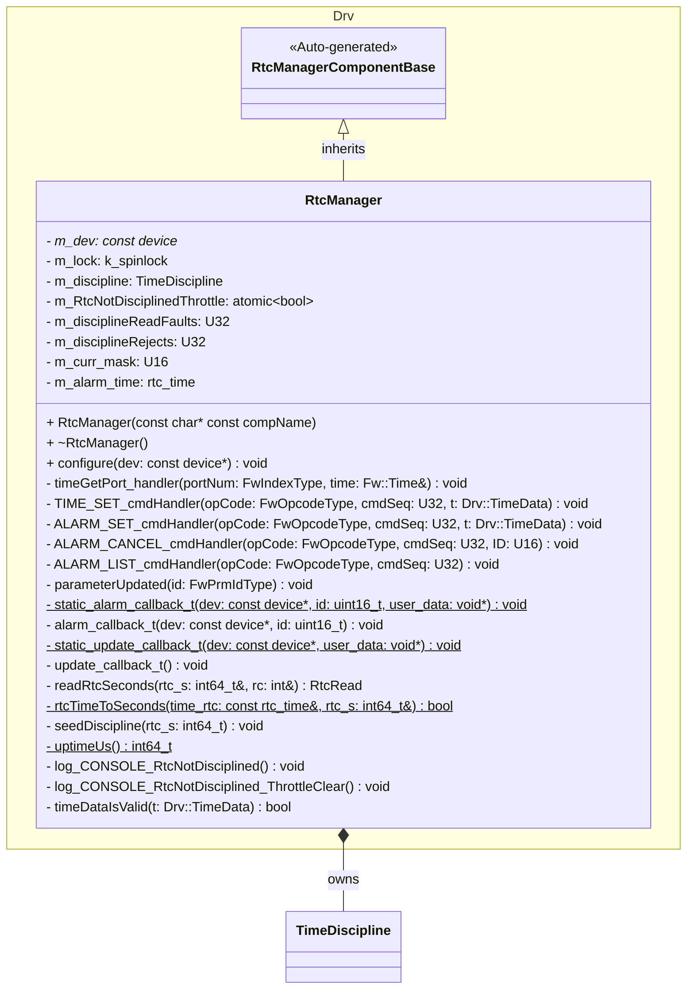

### Time Discipline Class Diagram
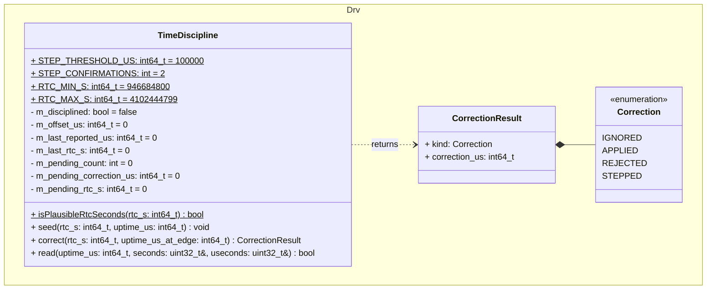

| Method | Behavior |
|---|---|
| `isPlausibleRtcSeconds` | Returns true if `rtc_s` is in [`RTC_MIN_S`, `RTC_MAX_S`] (2000-01-01T00:00:00Z to 2099-12-31T23:59:59Z) |
| `seed` | Sets the time offset to `rtc_s × 1 000 000 − uptime_us`. Sets the last RTC seconds to `rtc_s`. Sets the last reported time to 0. Sets the pending count to 0. Marks the offset as seeded |
| `correct` | If not seeded, seeds and returns `APPLIED` with correction 0. Returns `IGNORED` if `rtc_s` ≤ last RTC seconds. Otherwise calculates the correction. If the magnitude ≤ `STEP_THRESHOLD_US`: sets the pending count to 0, applies it, sets the last RTC seconds to `rtc_s`, and returns `APPLIED`. Otherwise: if the pending count > 0, `rtc_s` > pending RTC seconds, and \|correction − pending correction\| ≤ `STEP_THRESHOLD_US`, increments the pending count, else sets it to 1. Stores the correction and `rtc_s` as the pending candidate. If the count < `STEP_CONFIRMATIONS`, returns `REJECTED` (offset and last RTC seconds do not change). Else applies it, sets the last RTC seconds to `rtc_s`, sets the last reported time and the pending count to 0, and returns `STEPPED`. `correction_us` is always the calculated value |
| `read` | Returns false if not seeded. Otherwise reported time = max(`uptime_us` + offset, last reported time). Stores it as the last reported time. Splits it into seconds and microseconds |

## Sequence Diagrams

### `timeGetPort` port

The `timeGetPort` port is called from a `time connection` in a deployment topology. It uses only uptime and the time offset. When the `TIMEBASE` parameter is `TB_PROC_TIME`, it returns uptime.

#### Seeded

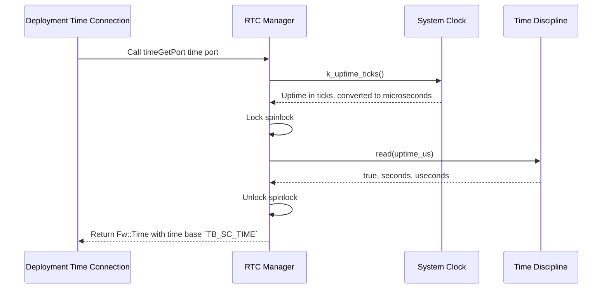

#### Not Seeded

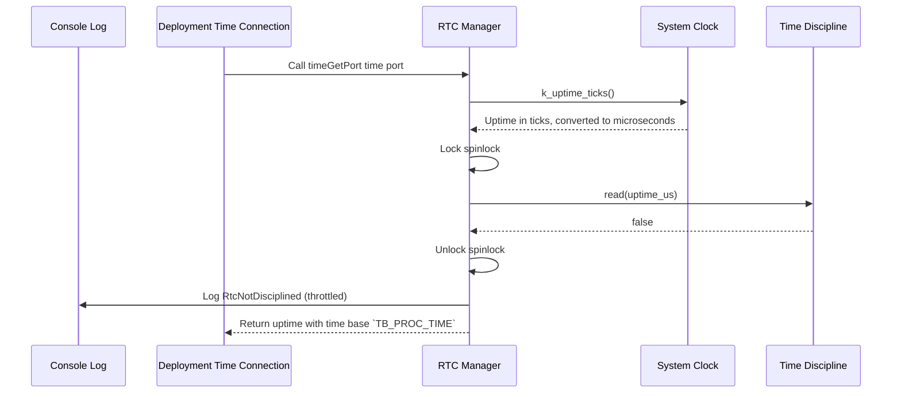

### RTC Update Callback

The RV3028 asserts `~INT` at each RTC second edge. The Zephyr driver calls the update callback on the system workqueue thread.

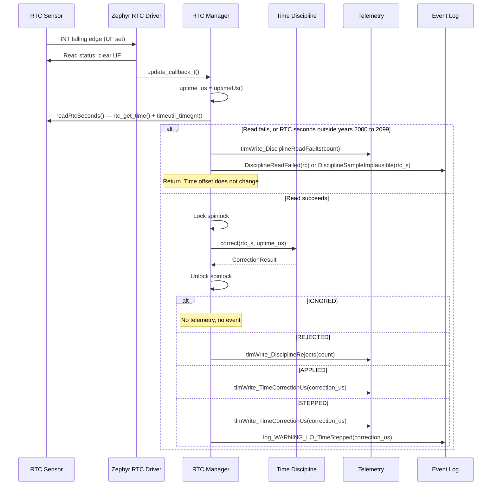

### `parameterUpdated`

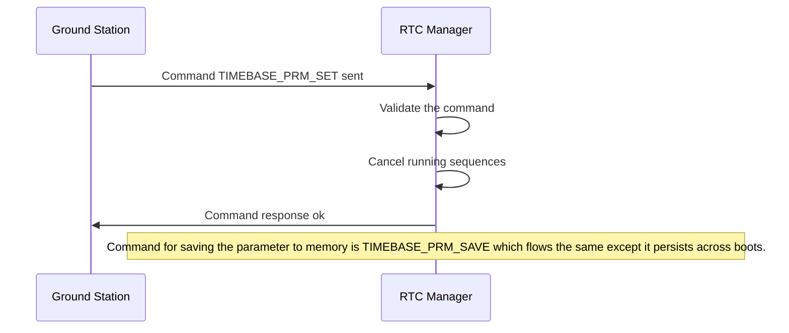

### `TIME_SET` Command

The `TIME_SET` command is called to set the current time on the RTC. The component validates all time fields before attempting to set the time.

#### Success

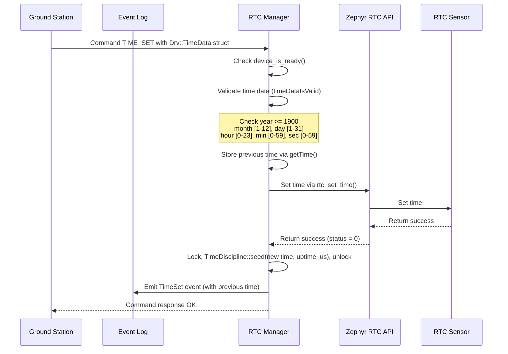

#### Validation Failure

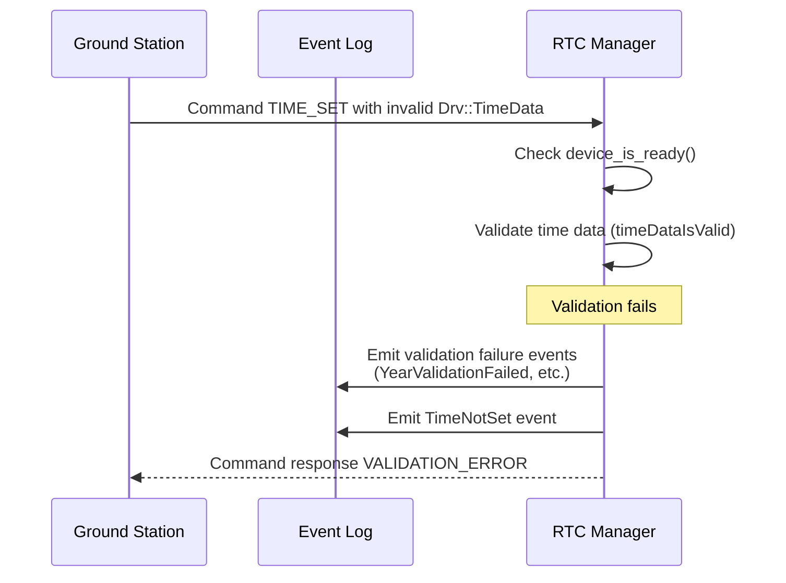

#### Device Not Ready

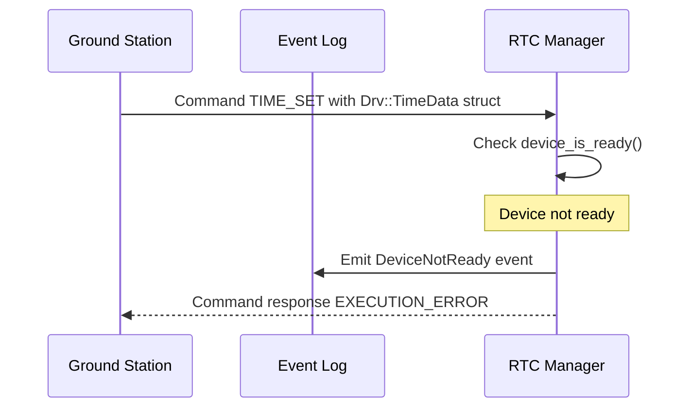

#### Time Not Set (RTC Failure)

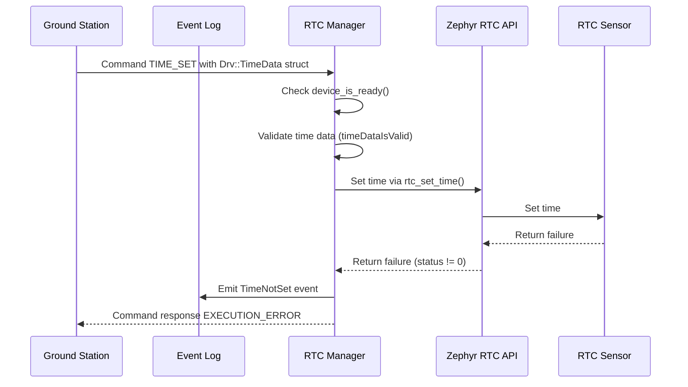

### `ALARM_SET` Command

The `ALARM_SET` command is called to set the current time on the RTC alarm. The component validates that the time is in the future before setting the alarm

#### Success

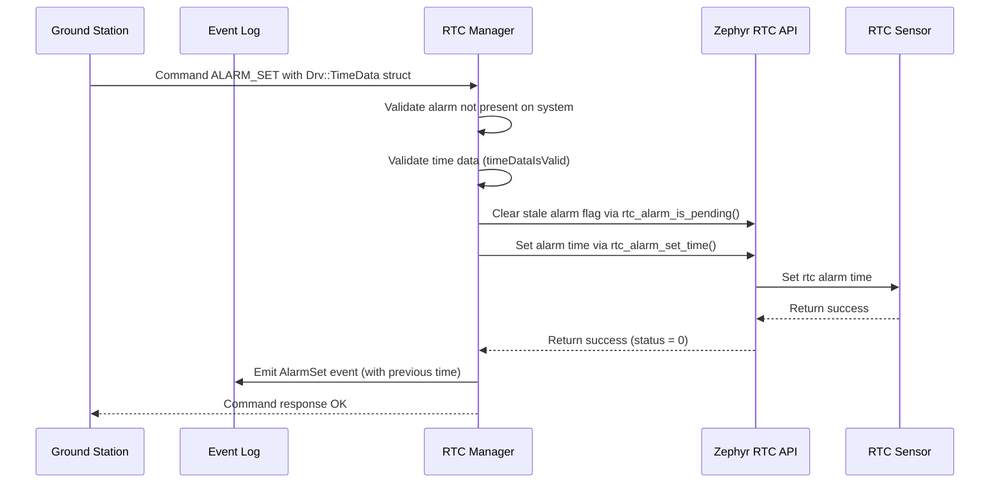

#### Failure

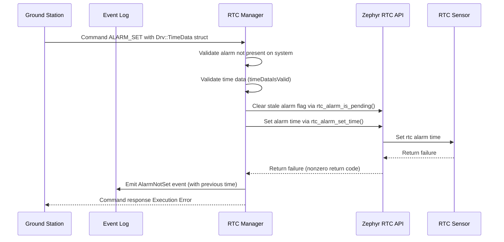

### `ALARM_CANCEL` Command

The `ALARM_CANCEL` command is called to cancel the RTC alarm. component validates that an alarm is present and can be accessed

#### Success

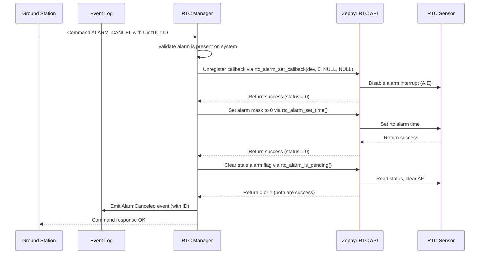

#### Failure

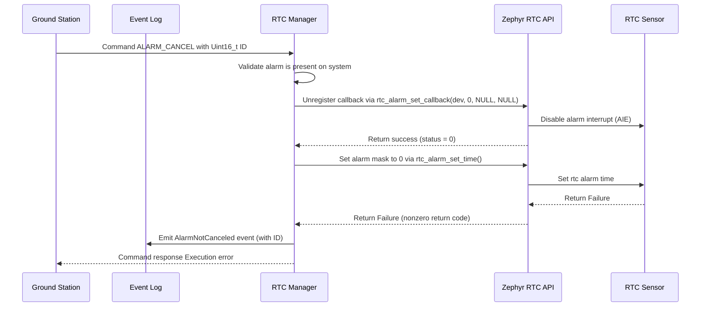

### Alarm Trigger

The alarm triggers through the `~INT` falling edge. No command is in the path.

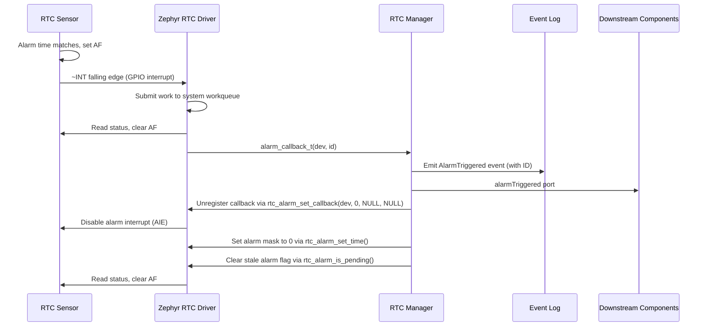

### `configure()`

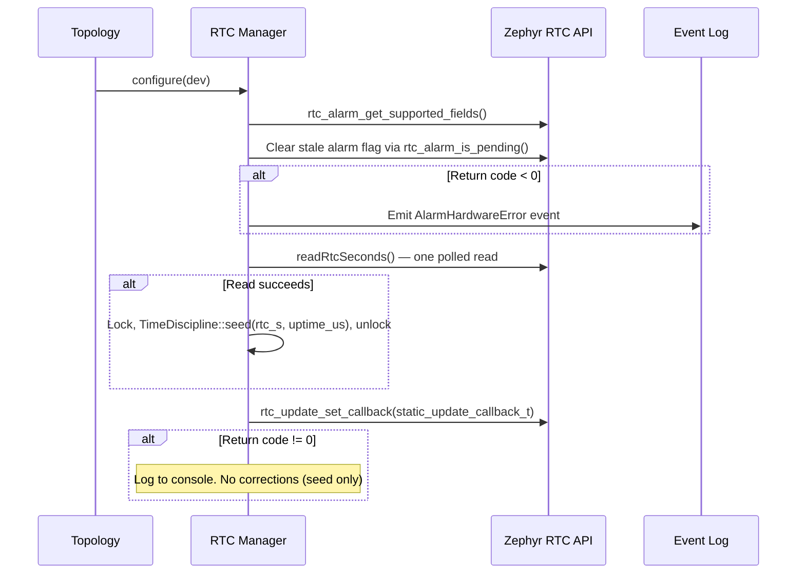

If the boot read fails, or the RTC seconds are outside years 2000 to 2099, the component is not seeded. The first update callback with a good read seeds it.

### `ALARM_LIST` Command

The `ALARM_LIST` command is called to retrieve information about the rtc alarm's current status

#### Present

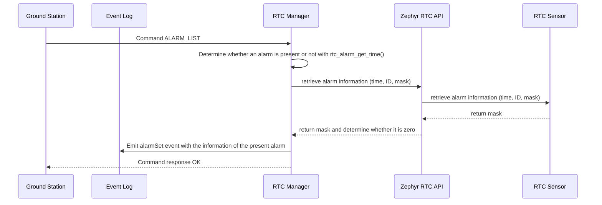

#### Absent

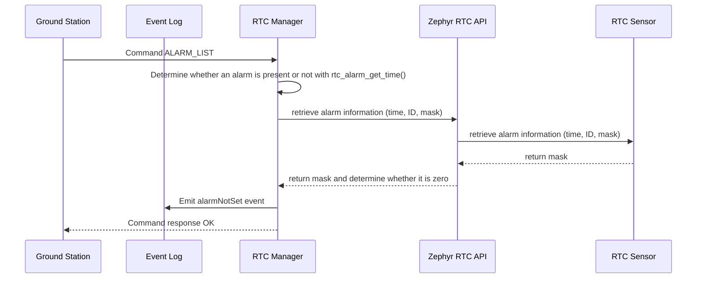

## Manual Test: Stale Alarm Flag

This procedure verifies RtcManager-019. Do not remove power from the board during the procedure. The RV3028 must keep `AF`.

1. Flash a build that has the faulty alarm interrupt path (for example `main` before this change).
2. Send `ALARM_SET` for the next minute. Wait until that minute is past. `AF` is now set and was not serviced.
3. Send `ALARM_CANCEL`. On the faulty build, this disables the alarm but does not clear `AF`.
4. Flash the build under test. Do not remove power.
5. Send `ALARM_SET` for the next minute.
6. Pass: no `AlarmTriggered` event before the alarm minute. `AlarmTriggered` occurs within 1 s after the alarm minute starts.

## Manual Test: Time Discipline

This procedure verifies RtcManager-022 on hardware. Use a 70 s capture of the update callback (uptime ticks at each callback, and each correction). The flight build has no tick-interval data, so callback spacing is judged from `TimeCorrectionUs` telemetry timestamps instead.

Pass criteria:
- `TimeCorrectionUs` samples are 1 s apart (±10 ms, board time stamps), with `telemetryDelay.DIVIDER` set to 0. One sample can be missing where the telemetry send time crosses the RTC second edge. The next value is overwritten before it is sent.
- After the first real edge, each correction is within ±2 ms.
- No event time stamp is more than 1 ms less than the time stamp before it. Events from different threads can arrive in a different order than their time stamps.
- No `TimeStepped` event after the first 3 s. A boot seed error of more than 100 ms steps at the second edge.
- `rtc_test.py` passes three times in sequence.

## Change Log

| Date | Description |
|---|---|
| 2025-9-18 | Initial RTC Manager component |
| 2025-11-14 | Added monotonic uptime failover when RTC unavailable, input validation for TIME_SET command, TEST_UNCONFIGURE_DEVICE test command, and console logging for device not ready conditions |
| 2025-12-26 | Ensured sub-second time is monotonic; added unit tests for sub-second time calculation; removed TEST_UNCONFIGURE_DEVICE |
| 2026-04-02 | Added basic functionality for setting and canceling RTC alarms |
| 2026-04-09 | Hardening for more consistent behavior |
| 2026-09-22 | Fixed alarm interrupt polarity (`~INT` is active low). Clear stale alarm flag at init and on `ALARM_CANCEL`. Integration tests verify the interrupt path |
| 2026-09-22 | Disarm the alarm in a fixed order (unregister callback, write mask 0, clear `AF`) on `ALARM_CANCEL` and after an alarm triggers, so writing the disabled alarm cannot raise a false `AlarmTriggered` |
| 2026-09-22 | Spacecraft time = uptime + time offset, corrected once per second by the RTC update interrupt. The `timeGetPort` does not access the RTC. `TimeDiscipline` replaces `RtcHelper`. Added `TimeCorrectionUs` telemetry and `TimeStepped` event |
| 2026-09-23 | A forward step needs two consistent corrections, the same as a backward step. A rejected sample does not change the last RTC seconds. RTC seconds outside years 2000 to 2099 are not used. One bad RTC read no longer moves time forward until `TIME_SET` or reboot |
| 2026-09-23 | Added `DisciplineReadFaults` and `DisciplineRejects` telemetry and `DisciplineReadFailed` and `DisciplineSampleImplausible` events, so a stale `TimeCorrectionUs` is visible. `CONFIG_RTC_UPDATE` is enabled on v5c, v5d, and v5e |
