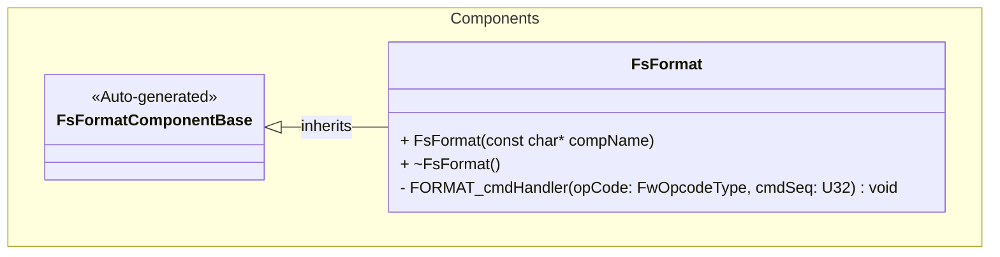
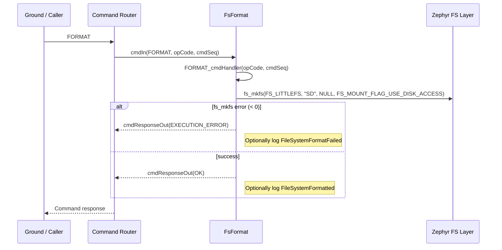

# Components::FsFormat

The FsFormat component provides a simple command interface for formatting the SD card storage. It wraps the Zephyr `fs_mkfs` API and exposes a single F Prime command that callers can use to erase and re‑initialize the SD card with a littlefs file system.

## Usage Examples

The FsFormat component is designed to be instantiated once with no configuration required at startup:

1. The component is constructed and initialized during system startup.
2. The deployment registers the `FORMAT` command over the standard command ports.
3. When an operator (or higher‑level component) decides to reformat the storage, it sends the `FORMAT` command.
4. The component calls `fs_mkfs` on the SD card disk and responds to the command with success or failure.

### Typical Usage

- **Startup**
  - No configuration, parameters, or run‑loop scheduling are required for this component. It always targets the SD card disk (`"SD"`) that backs the `/` littlefs mount established in `Main.cpp`.

- **Commanding**
  - Ground sends `FORMAT` via the command interface.
  - The component calls `fs_mkfs(FS_LITTLEFS, (uintptr_t)"SD", NULL, FS_MOUNT_FLAG_USE_DISK_ACCESS)`.
  - On success, it returns `CmdResponse::OK` and may emit a high‑severity activity event indicating successful format.
  - On error, it returns `CmdResponse::EXECUTION_ERROR` and may emit a high‑severity warning event describing the failure.

> **Warning:** Formatting will erase all data on the SD card. Use this command only in controlled scenarios (e.g., commissioning, recovery, or test).

## Class Diagram

```mermaid
classDiagram
	namespace Components {
		class FsFormatComponentBase {
			<<Auto-generated>>
		}
		class FsFormat {
			+ FsFormat(const char* compName)
			+ ~FsFormat()
			- FORMAT_cmdHandler(opCode: FwOpcodeType, cmdSeq: U32) void
		}
	}

	FsFormatComponentBase <|-- FsFormat : inherits
```

## Port, Command, and Event Interfaces

### Commands

- `FORMAT()` – Format the SD card's littlefs file system.
  - Sent over the standard F Prime command receive port `cmdIn`.
  - Responses are returned on `cmdResponseOut` as `CmdResponse::OK` on success or `CmdResponse::EXECUTION_ERROR` on failure.

### Events

The FPP definition declares two events:

- `FileSystemFormatted` (activity high) – Emitted when the file system is formatted successfully.
- `FileSystemFormatFailed` (warning high) – Emitted when the format operation fails.

> Note: At the time of writing, the C++ implementation only returns the command response code and does not yet emit these events. Future revisions should call the generated `log_ACTIVITY_HI_FileSystemFormatted()` and `log_WARNING_HI_FileSystemFormatFailed()` helpers in `FORMAT_cmdHandler` to make use of these events.

### Standard F Prime Ports

| Name           | Type         | Description                                           |
| -------------- | ------------ | ----------------------------------------------------- |
| timeCaller     | time get     | Requests the current time (not used by FsFormat).    |
| cmdRegOut      | command reg  | Registers the `FORMAT` command.                      |
| cmdIn          | command recv | Receives the `FORMAT` command.                       |
| cmdResponseOut | command resp | Sends command responses for `FORMAT`.                |
| logTextOut     | text event   | Sends textual representations of events.             |
| logOut         | event        | Sends binary events (including format success/fail). |

## Behavioral Description

### FORMAT Command Flow

```mermaid
sequenceDiagram
	participant GDS as Ground / Caller
	participant Cmd as Command Router
	participant FsFormat
	participant ZephyrFS as Zephyr FS Layer

	GDS->>Cmd: FORMAT
	Cmd->>FsFormat: cmdIn(FORMAT, opCode, cmdSeq)
	FsFormat->>FsFormat: FORMAT_cmdHandler(opCode, cmdSeq)
	FsFormat->>ZephyrFS: fs_mkfs(FS_LITTLEFS, "SD", NULL, FS_MOUNT_FLAG_USE_DISK_ACCESS)
	alt fs_mkfs error (< 0)
		FsFormat-->>Cmd: cmdResponseOut(EXECUTION_ERROR)
		note right of FsFormat: Optionally log FileSystemFormatFailed
	else success
		FsFormat-->>Cmd: cmdResponseOut(OK)
		note right of FsFormat: Optionally log FileSystemFormatted
	end
	Cmd-->>GDS: Command response
```

## Requirements

| Name                         | Description                                                                                     | Validation                                                                 |
| ---------------------------- | ----------------------------------------------------------------------------------------------- | -------------------------------------------------------------------------- |
| Format Command Support       | The component shall provide a `FORMAT` command to re‑initialize the SD card file system.        | Issue `FORMAT` from GDS and observe that the command is accepted.         |
| Success Response             | On successful formatting, the component shall return `CmdResponse::OK`.                         | Force `fs_mkfs` to succeed and verify the command response is `OK`.       |
| Failure Response             | On formatting failure, the component shall return `CmdResponse::EXECUTION_ERROR`.               | Inject an error from `fs_mkfs` (e.g., disk removed) and verify response.   |
| Success Event (optional)     | The component should emit `FileSystemFormatted` when the file system is formatted successfully. | Verify that the event is emitted after a successful format (once added).  |
| Failure Event (optional)     | The component should emit `FileSystemFormatFailed` when the format operation fails.             | Verify that the event is emitted when `fs_mkfs` returns an error (once added). |

## Change Log

| Date       | Description                                            |
| ---------- | ------------------------------------------------------ |
| 2026-01-06 | Initial design document drafted for FsFormat component |
| 2026-07-11 | Updated to reflect switch from FAT32 (QSPI partition) to littlefs (SD card) |
