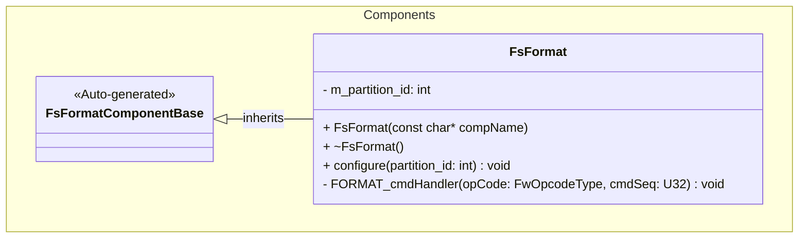
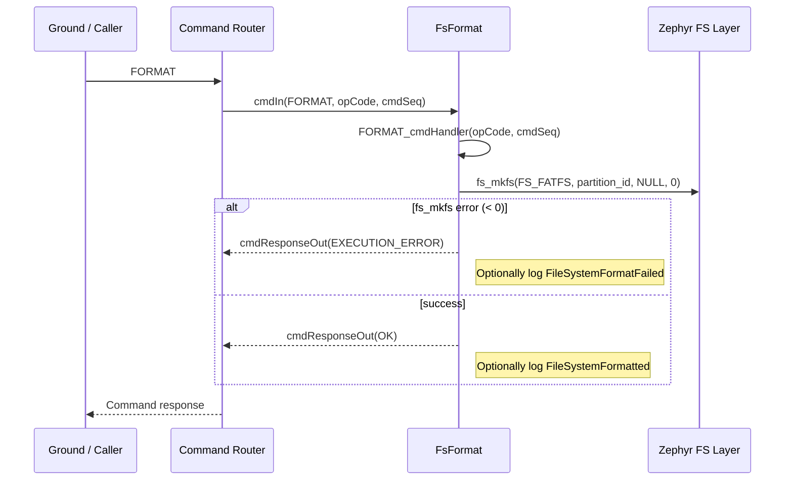

# Components::FsFormat

The FsFormat component provides a simple command interface for formatting a Zephyr file system partition. It wraps the Zephyr `fs_mkfs` API and exposes a single F Prime command that callers can use to erase and re‑initialize a storage partition with a FAT file system.

## Usage Examples

The FsFormat component is designed to be instantiated once and configured at startup:

1. The component is constructed and initialized during system startup.
2. The deployment calls `configure(partition_id)` during the configuration phase to select the Zephyr partition to format.
3. The deployment registers the `FORMAT` command over the standard command ports.
4. When an operator (or higher‑level component) decides to reformat the partition, it sends the `FORMAT` command.
5. The component calls `fs_mkfs` on the configured partition and responds to the command with success or failure.

### Typical Usage

- **Startup**
  - The deployment chooses a Zephyr partition ID that corresponds to the desired backing storage (e.g., QSPI/flash region) and passes it to `FsFormat::configure`.
  - No parameters or run‑loop scheduling are required for this component.

- **Commanding**
  - Ground sends `FORMAT` via the command interface.
  - The component calls `fs_mkfs(MKFS_FS_TYPE, partition_id, NULL, 0)`.
  - On success, it returns `CmdResponse::OK` and may emit a high‑severity activity event indicating successful format.
  - On error, it returns `CmdResponse::EXECUTION_ERROR` and may emit a high‑severity warning event describing the failure.

> **Warning:** Formatting will erase all data on the selected partition. Use this command only in controlled scenarios (e.g., commissioning, recovery, or test).

## Class Diagram

## Port, Command, and Event Interfaces

### Commands

- `FORMAT()` – Format the configured file system partition.
  - Sent over the standard F Prime command receive port `cmdIn`.
  - Responses are returned on `cmdResponseOut` as `CmdResponse::OK` on success or `CmdResponse::EXECUTION_ERROR` on failure.

### Events

The FPP definition declares two events:

- `FileSystemFormatted` (activity high) – Emitted when the file system is formatted successfully.
- `FileSystemFormatFailed` (warning high) – Emitted when the format operation fails.

> Note: At the time of writing, the C++ implementation only returns the command response code and does not yet emit these events. Future revisions should call the generated `log_ACTIVITY_HI_FileSystemFormatted()` and `log_WARNING_HI_FileSystemFormatFailed()` helpers in `FORMAT_cmdHandler` to make use of these events.

### Standard F Prime Ports

| Name           | Type         | Description                                           |
| -------------- | ------------ | ----------------------------------------------------- |
| timeCaller     | time get     | Requests the current time (not used by FsFormat).    |
| cmdRegOut      | command reg  | Registers the `FORMAT` command.                      |
| cmdIn          | command recv | Receives the `FORMAT` command.                       |
| cmdResponseOut | command resp | Sends command responses for `FORMAT`.                |
| logTextOut     | text event   | Sends textual representations of events.             |
| logOut         | event        | Sends binary events (including format success/fail). |

## Behavioral Description

### Configuration

The deployment must call `FsFormat::configure(partition_id)` before any `FORMAT` commands are issued:

- `partition_id` is stored in `m_partition_id` and later passed to Zephyr's `fs_mkfs` as the target partition.
- The current implementation does not validate the partition ID; the caller is responsible for providing a valid value.

### FORMAT Command Flow

## Requirements

| Name                         | Description                                                                                     | Validation                                                                 |
| ---------------------------- | ----------------------------------------------------------------------------------------------- | -------------------------------------------------------------------------- |
| Format Command Support       | The component shall provide a `FORMAT` command to re‑initialize a file system partition.        | Issue `FORMAT` from GDS and observe that the command is accepted.         |
| Partition Selection          | The component shall allow the deployment to select which partition is formatted.                | Call `configure(partition_id)` and verify that `fs_mkfs` uses that ID.    |
| Success Response             | On successful formatting, the component shall return `CmdResponse::OK`.                         | Force `fs_mkfs` to succeed and verify the command response is `OK`.       |
| Failure Response             | On formatting failure, the component shall return `CmdResponse::EXECUTION_ERROR`.               | Inject an error from `fs_mkfs` (e.g., invalid partition) and verify response. |
| Success Event (optional)     | The component should emit `FileSystemFormatted` when the file system is formatted successfully. | Verify that the event is emitted after a successful format (once added).  |
| Failure Event (optional)     | The component should emit `FileSystemFormatFailed` when the format operation fails.             | Verify that the event is emitted when `fs_mkfs` returns an error (once added). |

## Change Log

| Date       | Description                                            |
| ---------- | ------------------------------------------------------ |
| 2026-01-06 | Initial design document drafted for FsFormat component |
