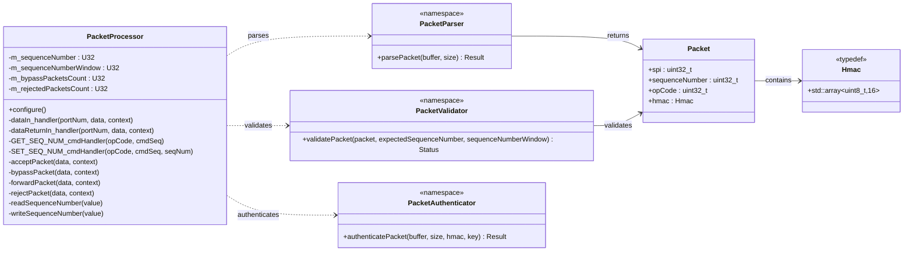

# Components::PacketProcessor

The PacketProcessor component verifies the integrity and authenticity of incoming CCSDS command packets using HMAC in the uplink path. It sits between TcDeframer and SpacePacketDeframer and enforces parse, policy validation, and authentication before forwarding commands.

## Overview

The component provides:

- Packet field extraction (SPI, sequence number, opcode, HMAC)
- Packet policy validation
    - SPI key validation against configured allowed SPIs
    - Sequence number validation for anti-replay protection
    - Opcode-based bypass policy to allow certain commands without authentication
- HMAC verification authentication per CCSDS 355.0-B-2 CMAC

Primary data path connections:

- TcDeframer.dataOut -> PacketProcessor.dataIn
- PacketProcessor.dataOut -> SpacePacketDeframer.dataIn
- PacketProcessor.dataReturnOut -> TcDeframer.dataReturnIn
- SpacePacketDeframer.dataReturnOut -> PacketProcessor.dataReturnIn

## Class Diagram



## Packet Format

The PacketProcessor receives a security-wrapped command packet and, after successful authentication, forwards the packet without the security envelope.

Input packet layout (as parsed by PacketProcessor):

- Security Header (6 bytes): SPI (2) + Sequence Number (4)
- Space Packet Primary Header (6 bytes)
- Space Packet Data Field (includes F Prime command)
- Security Trailer (16-byte HMAC)

Output packet layout (forwarded):

- Space Packet Primary Header (6 bytes)
- Space Packet Data Field

### Additional resources

- [CCSDS 355.0-B-2 CMAC Authentication Standard](https://ccsds.org/Pubs/355x0b2.pdf)

## Parameters

| Name | Type | Default | Description |
|---|---|---|---|
| SEQ_NUM_WINDOW | U32 | 50000 | Maximum allowed forward sequence-number distance before rejecting a packet as out-of-window. |
| SEQ_NUM_FILE_PATH | string | "//sequence_number.txt" | File path used to persist and restore the sequence number across restarts. |

## Port Descriptions

| Name | Direction | Type | Description |
|---|---|---|---|
| dataIn | Input (guarded) | Svc.ComDataWithContext | Receives incoming packet buffers for parse, validation, and optional authentication. |
| dataReturnIn | Input (sync) | Svc.ComDataWithContext | Receives returned ownership for buffers previously sent through dataOut. |
| dataOut | Output | Svc.ComDataWithContext | Forwards accepted or bypassed packets downstream to SpacePacketDeframer. |
| dataReturnOut | Output | Svc.ComDataWithContext | Returns ownership of rejected buffers (and relays dataReturnIn ownership upstream). |

Standard AC ports are also present for command handling, events, telemetry, parameter access, and time.

## Telemetry Channels

| Name | Type | Description |
|---|---|---|
| CurrentSequenceNumber | U32 | Current accepted sequence number tracked by the component. |
| BypassPacketsCount | U32 | Count of packets bypassed due to bypass-allowed opcode policy. |
| RejectedPacketsCount | U32 | Count of rejected packets due to parse/validation/authentication failures. |

## Events

| Name | Severity | Parameters | Description |
|---|---|---|---|
| SequenceNumberGet | Activity High | seq_num: U32 | Logged by GET_SEQ_NUM on successful read. Format: "Sequence number is {}" |
| SequenceNumberReadFailed | Warning High (throttle 2) | status: Os.FileStatus | Logged when sequence-number read fails. Format: "Failed to read sequence number, error: {}" |
| SequenceNumberSet | Activity High | seq_num: U32 | Logged by SET_SEQ_NUM on successful write. Format: "Sequence number set to {}" |
| SequenceNumberWriteFailed | Warning High (throttle 2) | status: Os.FileStatus | Logged when sequence-number write fails. Format: "Failed to write sequence number, error: {}" |
| SequenceNumberOutOfWindow | Warning High (throttle 2) | expected: U32, window: U32 | Logged when sequence-window validation fails. Format: "Sequence number out of window: Expected={}, Window={}" |
| AuthenticationFailed | Warning High (throttle 2) | auth_status: PacketAuthenticatorStatus, rc: I32 | Logged when HMAC verification fails. Format: "Authentication failed: Status={}, PSA Return Code={}" |
| ParsingFailed | Warning High (throttle 2) | parse_status: PacketParserStatus | Logged when packet parsing fails. Format: "Parsing failed: {}" |
| SpiInvalid | Warning High (throttle 2) | received: U32 | Logged when SPI policy validation fails. Format: "SPI invalid: Received {}" |

## Commands

| Name | Type | Parameters | Description |
|---|---|---|---|
| GET_SEQ_NUM | Sync | None | Reads and reports the persisted sequence number (SequenceNumberGet event). |
| SET_SEQ_NUM | Sync | seq_num: U32 | Sets and persists a new sequence number (SequenceNumberSet event). |

## Unit Tests

PacketProcessor helper functionality is covered by unit tests in PROVESFlightControllerReference/test/unit-tests:

| Test File | Coverage |
|---|---|
| test_PacketProcessor_Parser.cpp | Valid parse path plus parse failures for SPI, sequence number, opcode, and HMAC size checks. |
| test_PacketProcessor_Validator.cpp | Validation policy behavior for valid packets, bypass opcodes, invalid SPI, out-of-window sequence numbers, and wraparound window handling. |
| test_PacketProcessor_Authenticator.cpp | Authentication behavior for invalid input, successful HMAC verification, and failed verification with corrupted HMAC. |

Run unit tests with:

```bash
make test-unit
```

## GDS Plugin

To send authenticated packets from GDS, build the framing plugin:

```bash
make framer-plugin
```

Then run GDS with the framing plugin enabled as configured by the project tooling.

## Generating Keys

The default authentication key header is generated at build time from project key material (for example into AuthDefaultKey.h). This generated file is machine-local and not intended to be committed.


## Requirements

| Name | Description | Validation |
|---|---|---|
| AUTH001 | The component shall parse incoming packets to extract the SPI, sequence number, opcode (if extractable), and HMAC fields. | Unit Test |
| AUTH002 | The component shall allow certain commands to bypass authentication based on their opcode. The list of bypass-allowed opcodes shall be hardcoded in the component. | Unit Test |
| AUTH002-A | The component shall log a Bypass event when a packet is bypassed due to its opcode. | Inspection |
| AUTH002-B | The component shall increment a bypass packets count each time a packet is bypassed due to its opcode. This count shall be exposed in telemetry. | Inspection |
| AUTH002-C | The component shall forward bypassed packets without further validation or authentication to the output port. | Inspection |
| AUTH003 | The component shall validate that the SPI value corresponds to a configured Security Association. | Unit Test |
| AUTH004 | The component shall validate the received sequence number against the stored sequence number. | Unit Test |
| AUTH004-A | The component shall reject packets with sequence numbers that are outside the acceptable window and log an event. | Unit Test, Inspection |
| AUTH004-B | The component shall set the stored sequence number to the sequence number transmitted in the packet only when a packet is fully validated and authenticated | Inspection |
| AUTH004-C | The component shall allow the sequence number window to be configurable via a parameter. | Inspection |
| AUTH005 | The component shall compute the HMAC over the entire packet minus the last 16-byte security trailer. | Unit Test |
| AUTH005-A | The component shall reject packets where the computed HMAC does not match the security trailer HMAC. | Unit Test |
| AUTH006 | For any packet passing both validation and authentication steps or any packet marked for bypass, the component shall remove the Security Header and Security Trailer from the packet and pass the remaining packet data to data out. | Inspection, Integration Test |
| AUTH007 | The component shall provide a command and telemetry channel to report the current sequence number for a given Security Association (SPI) to enable ground station synchronization. | Inspection, Integration Test |

## Change Log

| Date | Description |
| --- | --- |
| 2025-11-26 | Initial design. |
| 2026-05-01 | Renamed to PacketProcessor, refactor to discrete responsibilities: Authenticator, Parser, Validator. |
