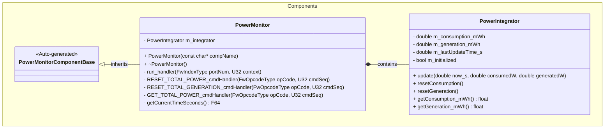
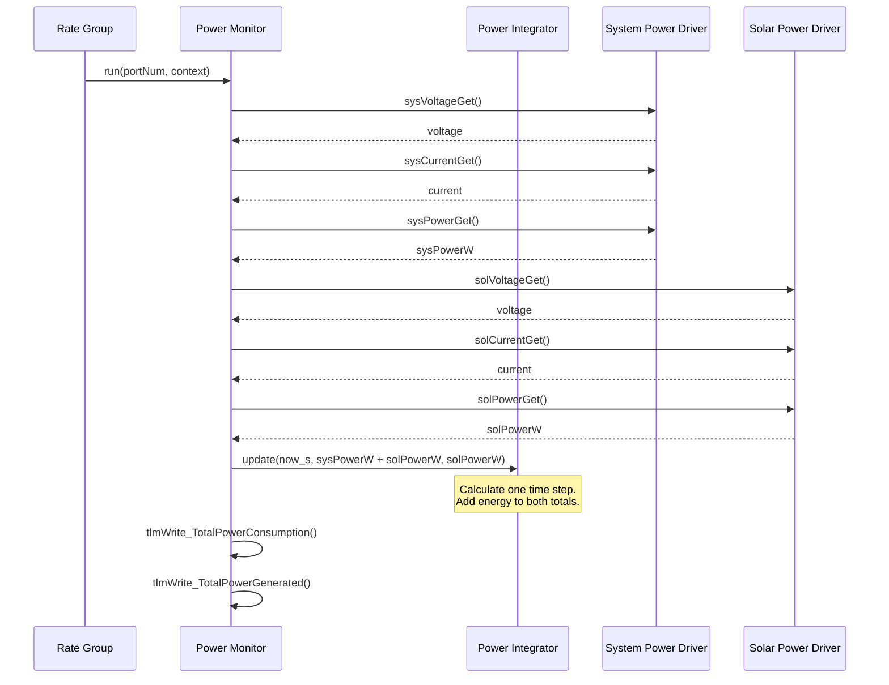

# Components::PowerMonitor

The Power Monitor component reads power data from two power monitors. It also keeps two energy totals:

- The total energy that the satellite uses (`TotalPowerConsumption`).
- The total energy that the solar panels supply (`TotalPowerGenerated`).

The component is passive. A rate group calls the component one time each second (1 Hz).

## Hardware

The component uses two INA219 power monitor chips on the I2C bus. Each chip has a Drv::Ina219Manager driver.

| Port prefix | Driver instance | I2C address | Schematic name | Measurement point |
|---|---|---|---|---|
| `sys` | `ina219SysManager` | 0x40 | Battery Power Monitor | The battery line (shunt resistor R109) |
| `sol` | `ina219SolManager` | 0x41 | Solar Power Monitor | The solar panel input `VSOLAR` (shunt resistor R108), before the charger |

> **Note:** The INA219 power value has no sign. The `sys` monitor measures the battery line. Thus, its power value is the same when the battery charges and when the battery discharges. Only the current value has a sign.

## Energy Totals

The component calculates energy from power and time. Energy (mWh) = power (W) × time (h) × 1000.

On each run cycle, the component does these steps:

1. It reads the power from the `sys` monitor and from the `sol` monitor.
2. It reads the current time.
3. It calculates the time step. The time step is the time between this cycle and the last cycle.
4. It adds `(sys power + sol power) × time step` to `TotalPowerConsumption`.
5. It adds `sol power × time step` to `TotalPowerGenerated`.
6. It sends the two totals as telemetry.

The component calculates the time step one time only in each cycle. The two totals use the same time step.

The component uses these safety rules:

- On the first cycle, the component only records the time. It does not add energy.
- If a power value is less than 0 W or more than 1000 W, the component does not add energy to that total. The other total is not affected.
- If the time step is 0 s or less, the component does not add energy. This can occur when the clock goes back.
- If the time step is 10 s or more, the component does not add energy. This can occur when the clock jumps forward.

The component keeps the totals as 64-bit (double) values. It changes them to 32-bit (F32) values only for telemetry and events. This prevents a large rounding error after many days.

The totals start at 0 mWh when the flight software starts. The totals do not stay after a reboot.

The `Components::PowerIntegrator` class contains the energy logic. This class does not use F Prime or Zephyr. Thus, you can test it with unit tests on a computer.

## Usage Examples

### Typical Usage

1. The system creates and starts the component during system startup.
2. The topology connects the component to:
   - A rate group (through the `run` input port).
   - The `sys` power monitor driver (through the `sys*` output ports).
   - The `sol` power monitor driver (through the `sol*` output ports).
3. On each rate group cycle:
   - The component calls all six output ports. Each driver reads its chip and sends its own telemetry.
   - The component updates the two energy totals.
   - The component sends `TotalPowerConsumption` and `TotalPowerGenerated` telemetry.

### Read the Total Energy

1. Look at the `TotalPowerConsumption` and `TotalPowerGenerated` telemetry channels.
2. To get the consumption total as an event, send the `GET_TOTAL_POWER` command.

### Reset a Total

1. To set the consumption total to 0 mWh, send the `RESET_TOTAL_POWER` command.
2. To set the generation total to 0 mWh, send the `RESET_TOTAL_GENERATION` command.

A reset changes only one total. The other total does not change.

## Class Diagram

## Port Descriptions
| Name | Type | Description |
|---|---|---|
| run | sync input | Starts one power monitor cycle. A rate group calls this port. |
| sysVoltageGet | output | Gets the voltage from the `sys` (battery) power monitor driver. |
| sysCurrentGet | output | Gets the current from the `sys` (battery) power monitor driver. |
| sysPowerGet | output | Gets the power from the `sys` (battery) power monitor driver. |
| solVoltageGet | output | Gets the voltage from the `sol` (solar) power monitor driver. |
| solCurrentGet | output | Gets the current from the `sol` (solar) power monitor driver. |
| solPowerGet | output | Gets the power from the `sol` (solar) power monitor driver. |

## Commands
| Name | Description |
|---|---|
| RESET_TOTAL_POWER | Sets the `TotalPowerConsumption` total to 0 mWh. Sends the `TotalPowerReset` event. |
| RESET_TOTAL_GENERATION | Sets the `TotalPowerGenerated` total to 0 mWh. Sends the `TotalGenerationReset` event. |
| GET_TOTAL_POWER | Sends the `TotalPowerConsumptionReading` event with the consumption total. |

## Events
| Name | Severity | Description |
|---|---|---|
| TotalPowerReset | ACTIVITY_LO | The consumption total is now 0 mWh. |
| TotalGenerationReset | ACTIVITY_LO | The generation total is now 0 mWh. |
| TotalPowerConsumptionReading | ACTIVITY_LO | Gives the consumption total in mWh. |

## Telemetry
| Name | Type | Unit | Description |
|---|---|---|---|
| TotalPowerConsumption | F32 | mWh | The total of `sys` power plus `sol` power over time. The component sends it on each cycle. |
| TotalPowerGenerated | F32 | mWh | The total of `sol` power over time. The component sends it on each cycle. |

> **Note:** `TotalPowerConsumption` adds the battery power and the solar power. It is not a measurement of the system load. The battery power value has no sign (see [Hardware](#hardware)). Thus, battery charge is also added.

## Sequence Diagrams

### Run Cycle

## Unit Tests
The unit tests are in `PROVESFlightControllerReference/test/unit-tests/test_PowerMonitor_PowerIntegrator.cpp`. To run them, use `make test-unit`.

| Name | Description | Output | Coverage |
|---|---|---|---|
| StartsAtZero | Makes sure that a new integrator has two totals of 0 mWh. | Both totals are 0 mWh. | Constructor |
| FirstUpdateOnlyEstablishesTimeBase | Makes sure that the first cycle adds no energy. | Both totals are 0 mWh. | `update()` first cycle |
| TimeBaseAtZeroSeconds | Makes sure that a first time of 0 s operates correctly. | Both totals are 1 mWh. | `update()` first cycle |
| BothTotalsCreditedWithFullTickPeriod | Does 3600 cycles at 1 Hz. Makes sure that each total gets the full time step (issue #526). | Each total is power × 1 h. | `update()` |
| NonUniformTickPeriod | Uses time steps of different lengths. | Each total is power × 2 s. | `update()` |
| InvalidPowerSkipsOnlyThatTotal | Sends a power value that is out of range for one total. | Only that total does not change. | Power range check |
| TimeJumpsAreNotIntegrated | Moves the clock forward and back. | Energy is added only for the 1 s steps. | Time step check |
| ResetsAreIndependent | Resets one total, then the other total. | A reset changes only one total. | `resetConsumption()`, `resetGeneration()` |
| LongDurationAccumulationKeepsPrecision | Does 30 days of cycles at 1 Hz. | The error is less than 0.0001 %. | Double precision totals |

## Requirements
| Name | Description | Validation |
|---|---|---|
| PWR-MON-REQ-001 | The component shall respond to scheduler calls on the run port. | Integration test |
| PWR-MON-REQ-002 | The component shall get the voltage from the system power driver on each run cycle. | Integration test |
| PWR-MON-REQ-003 | The component shall get the current from the system power driver on each run cycle. | Integration test |
| PWR-MON-REQ-004 | The component shall get the power from the system power driver on each run cycle. | Integration test |
| PWR-MON-REQ-005 | The component shall get the voltage from the solar panel power driver on each run cycle. | Integration test |
| PWR-MON-REQ-006 | The component shall get the current from the solar panel power driver on each run cycle. | Integration test |
| PWR-MON-REQ-007 | The component shall get the power from the solar panel power driver on each run cycle. | Integration test |
| PWR-MON-REQ-008 | The component shall add the energy of the system power plus the solar power to `TotalPowerConsumption` on each run cycle. | Unit test, Integration test |
| PWR-MON-REQ-009 | The component shall add the energy of the solar power to `TotalPowerGenerated` on each run cycle. | Unit test |
| PWR-MON-REQ-010 | The component shall use the same time step for both totals. The time step shall be the time since the last run cycle. | Unit test |
| PWR-MON-REQ-011 | The component shall not add energy to a total when its power value is less than 0 W or more than 1000 W. | Unit test |
| PWR-MON-REQ-012 | The component shall not add energy when the time step is 0 s or less, or 10 s or more. | Unit test |
| PWR-MON-REQ-013 | The component shall send `TotalPowerConsumption` and `TotalPowerGenerated` telemetry on each run cycle. | Inspection |
| PWR-MON-REQ-014 | The `RESET_TOTAL_POWER` command shall set only `TotalPowerConsumption` to 0 mWh. | Unit test |
| PWR-MON-REQ-015 | The `RESET_TOTAL_GENERATION` command shall set only `TotalPowerGenerated` to 0 mWh. | Unit test |
| PWR-MON-REQ-016 | The `GET_TOTAL_POWER` command shall send the consumption total in the `TotalPowerConsumptionReading` event. | Integration test |

## Change Log
| Date | Description |
|---|---|
| 2025-11-03 | Initial Power Monitor component |
| 2026-09-25 | Both energy totals now use the same time step. Before this change, `TotalPowerGenerated` was approximately 700 times too low (#526). The totals now use double precision. Added the PowerIntegrator unit tests. The SDD now uses Simplified Technical English. |
