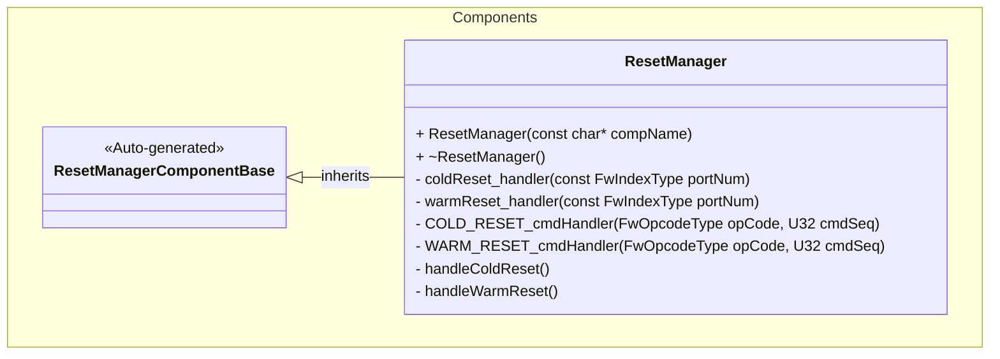
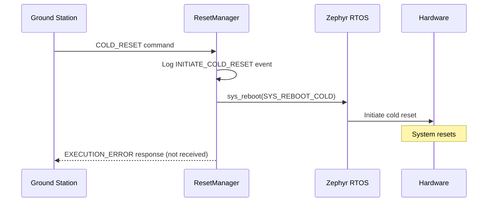
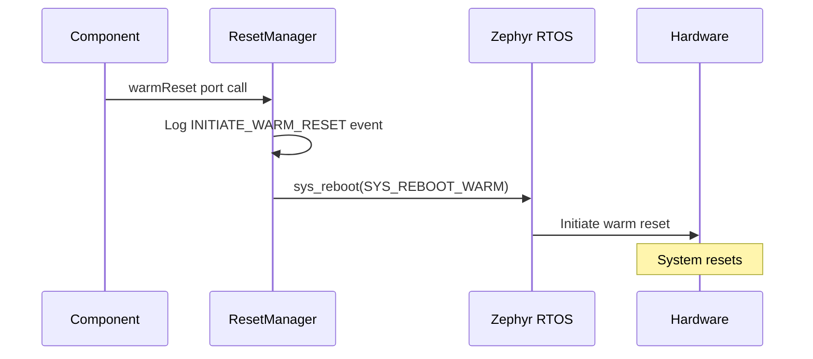

# Components::ResetManager

The ResetManager component provides system reset functionality, allowing the satellite to perform both cold and warm resets through commands or direct port calls.

## Usage Examples

The ResetManager component can be triggered in two ways:
1. Through ground commands (`COLD_RESET` or `WARM_RESET`)
2. Through direct port calls (`coldReset` or `warmReset`)

### Typical Usage

1. The component is instantiated and initialized during system startup
2. When a reset is needed:
   - **Via Command**: Ground station sends `COLD_RESET` or `WARM_RESET` command
   - **Via Port**: Another component calls the `coldReset` or `warmReset` port
3. The component:
   - Logs the appropriate event (`INITIATE_COLD_RESET` or `INITIATE_WARM_RESET`)
   - Calls the Zephyr `sys_reboot()` function with the appropriate reset type
   - System resets (command response is not received)

**Note**: After initiating a reset, the command response will indicate `EXECUTION_ERROR` since the system will reset before the response can be transmitted.

## Class Diagram

## Port Descriptions
| Name | Type | Description |
|---|---|---|
| coldReset | sync input | Triggers a cold reset of the system |
| warmReset | sync input | Triggers a warm reset of the system |

## Sequence Diagrams

### Cold Reset via Command

### Warm Reset via Port

## Commands
| Name | Description |
|---|---|
| COLD_RESET | Command to initiate a cold reset (full hardware reset) |
| WARM_RESET | Command to initiate a warm reset (software reset, preserves some state) |

## Events
| Name | Severity | Description |
|---|---|---|
| INITIATE_COLD_RESET | ACTIVITY_HI | Event indicating that a cold reset has been initiated |
| INITIATE_WARM_RESET | ACTIVITY_HI | Event indicating that a warm reset has been initiated |

## Requirements
| Name | Description | Validation |
|---|---|---|
| Cold Reset Command | The component shall provide a command to initiate a cold reset of the system | Verify system performs full hardware reset when command is issued |
| Warm Reset Command | The component shall provide a command to initiate a warm reset of the system | Verify system performs software reset when command is issued |
| Cold Reset Port | The component shall provide a port to trigger a cold reset programmatically | Verify system resets when port is called |
| Warm Reset Port | The component shall provide a port to trigger a warm reset programmatically | Verify system resets when port is called |
| Reset Event Logging | The component shall log an event before initiating any reset | Verify appropriate event is logged before reset occurs |
| Zephyr Integration | The component shall use Zephyr's `sys_reboot()` function for reset operations | Verify `sys_reboot()` is called with correct parameters |

## Change Log
| Date | Description |
|---|---|
| 2025-11-12 | Initial ResetManager component |
