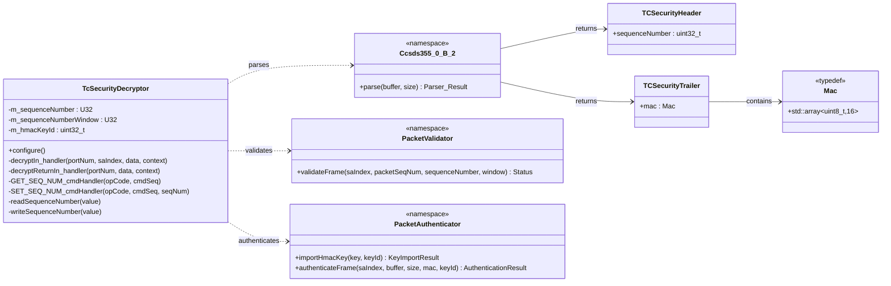

# Components::TcSecurityDecryptor

The TcSecurityDecryptor component implements the TC ProcessSecurity flow of CCSDS 355.0-B-2 in the
uplink path, acting as the decryptor behind the upstream F Prime `Svc::Ccsds::CcsdsSdlsDeframer`
(introduced in F Prime 4.3.0). The SDLS deframer extracts the 2-byte security association (SA)
index from the frame and calls this component via the `Svc.Ccsds.CcsdsSdlsDecrypt` interface; this
component validates the anti-replay sequence number, verifies the HMAC (which covers the SA index
and the frame data), then strips the remaining security envelope and forwards the frame with the
verification result recorded in the frame context (`authenticated` flag).

The component does not enforce policy. Frames that fail verification are still forwarded
(unauthenticated) so that downstream policy — owned by ProvesRouter and its opcode bypass
allowlist — can decide whether to route or reject them. This keeps knowledge of packet structure
here and knowledge of policy at the edge.

## Relationship to CcsdsSdlsDeframer

This project previously owned the full deframing/SA-extraction step in a single component
(`TcSecurityDeframer`, a pass-through between `TcDeframer` and `SpacePacketDeframer`) because stock
F Prime had no security hook. F Prime 4.3.0 added that hook, so responsibility is now split:

- `Svc::Ccsds::CcsdsSdlsDeframer` (upstream, unmodified): strips the 2-byte SA index from the frame
  and calls the decryptor with the SA index and the remaining `[SeqNum | Data | MAC]` buffer.
- `Components::TcSecurityDecryptor` (this component): validates and authenticates using the SA
  index supplied by the deframer, strips the sequence number and MAC, and reports the result.

Two deliberate deviations from a "default" upstream integration:

1. **No `Svc::Ccsds::SdlsSaRouter`.** The router selects a *component* by SA index; issue #472's
   design selects a *key* by SA index inside this component's 2-slot key store. The router would
   add a passive component and a tracking table per subtopology (three on the rp2350) for no
   benefit today. `sdlsDeframer.decryptOut` connects directly to this component; inserting a router
   later is a topology-only change if a project ever needs to dispatch to multiple decryptor
   implementations by SA index.
2. **`SdlsStatus::SUCCESS` returned for every structurally parseable frame.** Upstream's
   `CcsdsSdlsDeframer` drops any frame whose decrypt status is not `SUCCESS`, which would defeat the
   #426 bypass path (unauthenticated `CMD_NO_OP` must still reach `ProvesRouter` so its allowlist can
   accept it). This component therefore expresses authenticity solely via
   `context.authenticated` and returns `DECRYPTION_FAILURE` only when the frame is too short to
   parse, where dropping is correct regardless of authentication policy. This is a deliberate
   reading of an authentication-only security association, not a bug: there is no separate notion
   of "decryption failure" when the SA performs no decryption.

### Why not `Svc::Ccsds::SdlsFileKeyManager`

Upstream's `SdlsFileKeyManager` and the `Svc.Ccsds.SdlsKeyInterface` port were not adopted. The
upstream `SdlsKey` port carries no SA index, so it cannot express the 2-slot, SPI-keyed key store
that issue #472 needs, and #472/#490 put `PROVISION_KEY`/`ADD_KEY`/`REMOVE_KEY`/`GET_ACTIVE_KEYS`
commands directly on this component. Key material therefore stays inside this component's shell;
`SdlsFileKeyManager` would have to grow an SA-index argument on every port and duplicate the command
surface #472 already defines here, which is strictly more code for no capability gain. Adopting it
would become worth revisiting only if a future SA needed to share key material across multiple
security components.

## Overview

The component is a thin stateful shell over pure-function namespaces:

- `Ccsds355_0_B_2::parse` (Parser) — sequence number and Security Trailer (MAC) extraction from
  `[SeqNum | Data | MAC]` (the SA index is not part of this buffer; it arrives as a port argument)
- `Components::validateFrame` (Validator) — SA index validation and anti-replay sequence-number
  window validation
- `Components::authenticateFrame` / `importHmacKey` (Authenticator) — HMAC-SHA-256 (truncated to 16
  bytes) verification via the PSA multipart MAC API, covering the SA index followed by the frame
  data

The only component state is the last accepted sequence number (mutex-guarded, persisted to file)
and the imported HMAC key id.

Primary data path connections (per uplink subtopology):

- `sdlsDeframer.decryptOut -> tcSecurityDecryptor.decryptIn`
- `tcSecurityDecryptor.decryptOut -> sdlsDeframer.decryptIn`
- `sdlsDeframer.decryptReturnOut -> tcSecurityDecryptor.decryptReturnIn`
- `tcSecurityDecryptor.bufferReturnOut -> sdlsDeframer.bufferReturnIn`

## Class Diagram



## Packet Format

The upstream `Svc::Ccsds::CcsdsSdlsDeframer` strips the SA index (2 bytes) before calling this
component, so the buffer received on `decryptIn` is:

- Sequence Number (4 bytes)
- Space Packet Primary Header (6 bytes)
- Space Packet Data Field (includes F Prime command)
- Security Trailer (16-byte MAC)

Output packet layout (forwarded per CCSDS 355.0-B-2 §3.3.3.3):

- Space Packet Primary Header (6 bytes)
- Space Packet Data Field

The MAC is HMAC-SHA-256 truncated to 16 bytes, computed over the SA index (2 bytes, big-endian) and
the Data Field (everything except the Security Trailer). Because the SA index is stripped from the
buffer by the deframer before this component sees it, verification uses the PSA multipart MAC API
(`psa_mac_verify_setup` → `update(saIndex)` → `update(data)` → `psa_mac_verify_finish`) rather than a
single `psa_mac_verify` call. The ground-side `Framing/src/authenticate_plugin.py` is unchanged: it
still emits `SPI(2) | SeqNum(4) | Data | MAC(16)` and MACs `SPI | SeqNum | Data`.

### Additional resources

- [CCSDS 355.0-B-2 Space Data Link Security Protocol](https://ccsds.org/Pubs/355x0b2.pdf)

## Behavior

1. Parse the sequence number and Security Trailer. If the frame is too short to contain them it
   cannot be stripped for downstream deframing: log ParsingFailed and report
   `SdlsStatus::DECRYPTION_FAILURE` on `decryptOut` (the upstream deframer drops the frame, notifies
   `errorNotify`, and hands the buffer back).
2. Validate the SA index (only SA 0 is currently supported) and the anti-replay sequence number
   (must be strictly ahead of the last accepted value, within SEQ_NUM_WINDOW, with U32 wraparound
   handled).
3. If validation passes, verify the MAC.
4. Only when all checks pass: store and persist the received sequence number, telemeter it, and set
   `authenticated = true` in the frame context. Frames failing any check never advance the sequence
   number (issue #426).
5. Strip the sequence number and Security Trailer and forward on `decryptOut` with
   `SdlsStatus::SUCCESS` and the resulting `authenticated` flag (see "Relationship to
   CcsdsSdlsDeframer" above for why every parseable frame reports `SUCCESS`). ProvesRouter rejects
   unauthenticated packets unless their opcode is on the bypass allowlist.

At startup, `configure()` loads the persisted sequence number and telemeters it so the first
downlinked value is correct before any command is accepted (issue #427).

## Parameters

| Name | Type | Default | Description |
|---|---|---|---|
| SEQ_NUM_WINDOW | U32 | 50000 | Maximum allowed forward sequence-number distance before rejecting a packet as out-of-window. |
| SEQ_NUM_FILE_PATH | string | "//sequence_number.txt" | File path used to persist and restore the sequence number across restarts. |

## Port Descriptions

| Name | Direction | Type | Description |
|---|---|---|---|
| decryptIn | Input (guarded) | Svc.Ccsds.CcsdsSdlsEncryption | Receives the SA index and `[SeqNum \| Data \| MAC]` buffer from the upstream SDLS deframer. |
| decryptReturnIn | Input (guarded) | Svc.ComDataWithContext | Receives back ownership of buffers previously sent on decryptOut. |
| decryptOut | Output | Svc.Ccsds.CcsdsSdlsData | Forwards the decrypt status and stripped frame downstream with the authenticated flag set in the context. |
| bufferReturnOut | Output | Svc.ComDataWithContext | Returns ownership of the incoming iv/data buffer (relays decryptReturnIn ownership upstream to the deframer). |

Standard AC ports are also present for command handling, events, telemetry, parameter access, and
time.

## Telemetry Channels

| Name | Type | Description |
|---|---|---|
| CurrentSequenceNumber | U32 | Current accepted sequence number tracked by the component. Emitted at startup and on each accepted packet. |

Routed/bypassed/rejected packet counts are telemetered by ProvesRouter, which owns the accept/reject policy.

## Events

| Name | Severity | Parameters | Description |
|---|---|---|---|
| SequenceNumberGet | Activity High | seq_num: U32 | Logged by GET_SEQ_NUM on successful read. Format: "Sequence number is {}" |
| SequenceNumberReadFailed | Warning High (throttle 2) | status: Os.FileStatus | Logged when sequence-number read fails. Format: "Failed to read sequence number, error: {}" |
| SequenceNumberSet | Activity High | seq_num: U32 | Logged by SET_SEQ_NUM on successful write. Format: "Sequence number set to {}" |
| SequenceNumberWriteFailed | Warning High (throttle 2) | status: Os.FileStatus | Logged when sequence-number write fails. Format: "Failed to write sequence number, error: {}" |
| SequenceNumberInvalid | Warning High (throttle 2) | packet_seq_num: U32, seq_num: U32, window: U32 | Logged when anti-replay validation fails. Format: "Sequence number less than last accepted or out of window: Received={}, LastAccepted={}, Window={}" |
| AuthenticationFailed | Warning High (throttle 2) | auth_status: PacketAuthenticatorStatus, rc: I32 | Logged when MAC verification fails. Format: "Authentication failed: Status={}, PSA Return Code={}" |
| ParsingFailed | Warning High (throttle 2) | parse_status: PacketParserStatus | Logged when frame parsing fails. Format: "Parsing failed: {}" |
| SpiInvalid | Warning High (throttle 2) | sa_index: U32 | Logged when SA index validation fails. Format: "Security association index invalid: Received={}" |

## Commands

| Name | Type | Parameters | Description |
|---|---|---|---|
| GET_SEQ_NUM | Sync | None | Reads and reports the current sequence number (SequenceNumberGet event). |
| SET_SEQ_NUM | Sync | seq_num: U32 | Sets and persists a new sequence number (SequenceNumberSet event). |

## Unit Tests

TcSecurityDecryptor helper functionality is covered by unit tests in PROVESFlightControllerReference/test/unit-tests:

| Test File | Coverage |
|---|---|
| test_TcSecurityDecryptor_Parser.cpp | Valid parse path plus parse failures for sequence number and MAC size checks. |
| test_TcSecurityDecryptor_Validator.cpp | SA index validation, out-of-window and replayed sequence numbers, window boundary, and wraparound handling. |
| test_TcSecurityDecryptor_Authenticator.cpp | Key import failures, successful MAC verification, failed verification with corrupted MAC or data, and coverage that the SA index participates in the MAC (the same `[data\|MAC]` bytes verify under SA 0 but fail under SA 1). |

Run unit tests with:

```bash
make test-unit
```

## GDS Plugin

To send authenticated packets from GDS, build the framing plugin:

```bash
make framer-plugin
```

Then run GDS with the framing plugin enabled as configured by the project tooling.

## Generating Keys

The default authentication key header (AuthDefaultKey.h) is generated at build time from project key material via `make generate-auth-key` or `make copy-secrets`. This generated file is machine-local and not committed.

## Requirements

| Name | Description | Validation |
|---|---|---|
| AUTH001 | The component shall parse incoming frames to extract the sequence number and MAC fields. | Unit Test |
| AUTH003 | The component shall validate that the security association index supplied by the upstream deframer corresponds to a configured Security Association. | Unit Test |
| AUTH004 | The component shall validate the received sequence number against the stored sequence number. | Unit Test |
| AUTH004-A | The component shall not authenticate packets with sequence numbers that are outside the acceptable window and shall log an event. | Unit Test, Inspection |
| AUTH004-B | The component shall set the stored sequence number to the sequence number transmitted in the packet only when a packet is fully validated and authenticated. | Inspection |
| AUTH004-C | The component shall allow the sequence number window to be configurable via a parameter. | Inspection |
| AUTH005 | The component shall compute the MAC over the security association index and the frame data minus the 16-byte security trailer. | Unit Test |
| AUTH005-A | The component shall not mark packets as authenticated where the computed MAC does not match the security trailer MAC. | Unit Test |
| AUTH006 | For any parseable frame, the component shall remove the sequence number and Security Trailer and forward the remaining packet data with the verification result recorded in the frame context. | Inspection, Integration Test |
| AUTH007 | The component shall provide a command and telemetry channel to report the current sequence number to enable ground station synchronization. | Inspection, Integration Test |

Opcode-based bypass policy (formerly AUTH002) is owned by ProvesRouter; see its SDD.

## Change Log

| Date | Description |
| --- | --- |
| 2025-11-26 | Initial design. |
| 2026-07-17 | Renamed to TcSecurityDeframer, refactor to discrete responsibilities: Authenticator, Parser, Validator. Pass-through interface between TcDeframer and SpacePacketDeframer; verification result carried in frame context; policy enforcement moved to ProvesRouter. |
| 2026-08-29 | Renamed to TcSecurityDecryptor and moved onto the upstream F Prime 4.3.0 SDLS hook: implements `Svc.Ccsds.CcsdsSdlsDecrypt` behind `Svc::Ccsds::CcsdsSdlsDeframer` instead of owning deframing/SA-extraction directly. The SA index is now a port argument rather than a parsed field; the MAC covers the SA index via the PSA multipart API. No `SdlsSaRouter` or `SdlsFileKeyManager` adopted (see "Relationship to CcsdsSdlsDeframer" above). |
