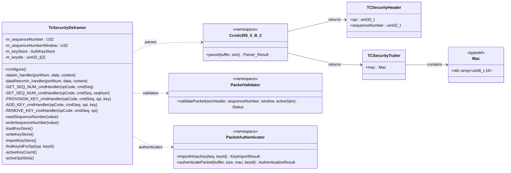

# Components::TcSecurityDeframer

The TcSecurityDeframer component implements the TC ProcessSecurity flow of CCSDS 355.0-B-2 in the uplink path. It sits between TcDeframer and SpacePacketDeframer: it parses the Security Header and Trailer, validates the SPI and anti-replay sequence number, verifies the HMAC, then strips the security envelope and forwards the frame with the verification result recorded in the frame context (`authenticated` flag).

The component does not enforce policy. Frames that fail verification are still forwarded (unauthenticated) so that downstream policy — owned by ProvesRouter and its opcode bypass allowlist — can decide whether to route or reject them. This keeps knowledge of packet structure here and knowledge of policy at the edge.

## Overview

The component is a thin stateful shell over pure-function namespaces:

- `Ccsds355_0_B_2::parse` (Parser) — Security Header (SPI, sequence number) and Trailer (MAC) extraction
- `Components::validatePacket` (Validator) — SPI validation against the active key store and anti-replay sequence-number window validation
- `Components::authenticatePacket` / `importHmacKey` / `importHmacKeyBytes` (Authenticator) — HMAC-SHA-256 (truncated to 16 bytes) verification via PSA crypto

`Validator` takes the active SPI set as a plain `ActiveSpiSlots` array (`Types.hpp`) rather than the FPP-generated key store type directly, so it — and its unit tests — stay pure C++ with no F Prime dependency; `TcSecurityDeframer::activeSpiSlots()` projects the real key store into that shape before calling `validatePacket`.

Component state is the last accepted sequence number and the on-flash key store (each mutex-guarded and persisted to file), plus the PSA key ids imported from the store's valid slots.

### Key Storage

The HMAC authentication key is **never compiled into the firmware image** (issue #220). It is persisted at `KEY_STORE_FILE_PATH` (default `/keys/authkeys.bin`) on a dedicated littlefs `keystore_partition` on internal flash, holding up to 2 slots (`{valid, spi, key}`). `configure()` loads the store and imports every valid slot into PSA; a missing/empty store is not an error — a keyless board still boots so it can be provisioned. The sequence-number file lives on the same partition (`SEQ_NUM_FILE_PATH`, default `/keys/sequence_number.bin`).

The store is shared across all `TcSecurityDeframer` instances (UART/LoRa/Sband): on an unknown SPI, `dataIn_handler` reloads the store from disk once and retries validation before rejecting the frame, so a rotation issued over one link is picked up by the others without a separate command per link.

Three commands manage the store (see [Commands](#commands)): `PROVISION_KEY` (bootstrap, only while the store is empty), `ADD_KEY` (rotation, fails at 2 active keys), and `REMOVE_KEY` (rotation, fails at 1 remaining key). All three re-import the store into PSA and update `ActiveKeyCount` telemetry on success.

Primary data path connections:

- TcDeframer.dataOut -> TcSecurityDeframer.dataIn
- TcSecurityDeframer.dataOut -> SpacePacketDeframer.dataIn
- TcSecurityDeframer.dataReturnOut -> TcDeframer.dataReturnIn
- SpacePacketDeframer.dataReturnOut -> TcSecurityDeframer.dataReturnIn

## Class Diagram



## Packet Format

TcDeframer strips the TC Primary Header and FECF before this component, so the buffer received on dataIn is:

- Security Header (6 bytes): SPI (2) + Sequence Number (4)
- Space Packet Primary Header (6 bytes)
- Space Packet Data Field (includes F Prime command)
- Security Trailer (16-byte MAC)

Output packet layout (forwarded per CCSDS 355.0-B-2 §3.3.3.3):

- Space Packet Primary Header (6 bytes)
- Space Packet Data Field

The MAC is HMAC-SHA-256 truncated to 16 bytes, computed over the Security Header and Data Field (everything except the Security Trailer).

### Additional resources

- [CCSDS 355.0-B-2 Space Data Link Security Protocol](https://ccsds.org/Pubs/355x0b2.pdf)

## Behavior

1. Parse the Security Header and Trailer. If the frame is too short to contain them it cannot be stripped for downstream deframing: log ParsingFailed and return the buffer upstream (drop).
2. Validate the SPI (must match a valid slot in the active key store — see [Key Storage](#key-storage)) and the anti-replay sequence number (must be strictly ahead of the last accepted value, within SEQ_NUM_WINDOW, with U32 wraparound handled). On an unknown SPI, the key store is reloaded from disk once and validation retried, so a rotation issued over another link is picked up here.
3. If validation passes, look up the PSA key id for the packet's SPI and verify the MAC with it.
4. Only when all checks pass: store and persist the received sequence number, telemeter it, and set `authenticated = true` in the frame context. Frames failing any check never advance the sequence number (issue #426).
5. Strip the Security Header and Trailer and forward on dataOut with the resulting `authenticated` flag. ProvesRouter rejects unauthenticated packets unless their opcode is on the bypass allowlist.

At startup, `configure()` loads the persisted sequence number and key store, telemetering both so the first downlinked values are correct before any command is accepted (issue #427). A missing or empty key store leaves the board keyless (bootable, awaiting `PROVISION_KEY`) rather than failing to boot.

## Parameters

| Name | Type | Default | Description |
|---|---|---|---|
| SEQ_NUM_WINDOW | U32 | 50000 | Maximum allowed forward sequence-number distance before rejecting a packet as out-of-window. |
| SEQ_NUM_FILE_PATH | string | "/keys/sequence_number.bin" | File path used to persist and restore the sequence number across restarts. |
| KEY_STORE_FILE_PATH | string | "/keys/authkeys.bin" | File path used to persist and restore the authentication key store across restarts. |

## Port Descriptions

| Name | Direction | Type | Description |
|---|---|---|---|
| dataIn | Input (guarded) | Svc.ComDataWithContext | Receives frames from TcDeframer for parse, validation, and authentication. |
| dataReturnIn | Input (sync) | Svc.ComDataWithContext | Receives returned ownership for buffers previously sent through dataOut. |
| dataOut | Output | Svc.ComDataWithContext | Forwards the stripped frame downstream with the authenticated flag set in the context. |
| dataReturnOut | Output | Svc.ComDataWithContext | Returns ownership of structurally invalid frames (and relays dataReturnIn ownership upstream). |

Standard AC ports are also present for command handling, events, telemetry, parameter access, and time.

## Telemetry Channels

| Name | Type | Description |
|---|---|---|
| CurrentSequenceNumber | U32 | Current accepted sequence number tracked by the component. Emitted at startup and on each accepted packet. |
| ActiveKeyCount | U8 | Number of valid slots (0-2) in the key store. Emitted at startup and after PROVISION_KEY/ADD_KEY/REMOVE_KEY. |

Routed/bypassed/rejected packet counts are telemetered by ProvesRouter, which owns the accept/reject policy.

## Events

| Name | Severity | Parameters | Description |
|---|---|---|---|
| SequenceNumberGet | Activity High | seq_num: U32 | Logged by GET_SEQ_NUM on successful read. Format: "Sequence number is {}" |
| SequenceNumberReadFailed | Warning High (throttle 2) | status: Os.FileStatus | Logged when sequence-number read fails. Format: "Failed to read sequence number, error: {}" |
| SequenceNumberSet | Activity High | seq_num: U32 | Logged by SET_SEQ_NUM on successful write. Format: "Sequence number set to {}" |
| SequenceNumberWriteFailed | Warning High (throttle 2) | status: Os.FileStatus | Logged when sequence-number write fails. Format: "Failed to write sequence number, error: {}" |
| SequenceNumberInvalid | Warning High (throttle 2) | packet_seq_num: U32, seq_num: U32, window: U32 | Logged when anti-replay validation fails. Format: "Sequence number less than last accepted or out of window: Received={}, LastAccepted={}, Window={}" |
| AuthenticationFailed | Warning High (throttle 2) | auth_status: PacketAuthenticatorStatus, rc: I32 | Logged when MAC verification fails. Format: "Authentication failed: Status={}, PSA Return Code={}" |
| ParsingFailed | Warning High (throttle 2) | parse_status: PacketParserStatus | Logged when frame parsing fails. Format: "Parsing failed: {}" |
| SpiInvalid | Warning High (throttle 2) | packet_spi: U32 | Logged when SPI validation fails. Format: "SPI invalid: Received={}" |
| KeyStoreReadFailed | Warning High (throttle 2) | status: Os.FileStatus | Logged when the key store read fails (not thrown for a missing file — that's the keyless state). Format: "Failed to read key store, error: {}" |
| KeyStoreWriteFailed | Warning High (throttle 2) | status: Os.FileStatus | Logged when the key store write fails. Format: "Failed to write key store, error: {}" |
| KeyProvisioned | Activity High | spi: U16 | Logged by PROVISION_KEY on success. Format: "Key provisioned for SPI={}" |
| KeyProvisionFailed | Warning High (throttle 2) | status: KeyStoreProvisionStatus | Logged when PROVISION_KEY fails (store not empty, bad hex key, or write failure). Format: "Key provisioning failed: {}" |
| KeyAdded | Activity High | spi: U16 | Logged by ADD_KEY on success. Format: "Key added for SPI={}" |
| KeyAddFailed | Warning High (throttle 2) | status: KeyStoreProvisionStatus | Logged when ADD_KEY fails (store full, bad hex key, or write failure). Format: "Key add failed: {}" |
| KeyRemoved | Activity High | spi: U16 | Logged by REMOVE_KEY on success. Format: "Key removed for SPI={}" |
| KeyRemoveFailed | Warning High (throttle 2) | status: KeyStoreProvisionStatus | Logged when REMOVE_KEY fails (last remaining key, SPI not found, or write failure). Format: "Key remove failed: {}" |

## Commands

| Name | Type | Parameters | Description |
|---|---|---|---|
| GET_SEQ_NUM | Sync | None | Reads and reports the current sequence number (SequenceNumberGet event). |
| SET_SEQ_NUM | Sync | seq_num: U32 | Sets and persists a new sequence number (SequenceNumberSet event). |
| PROVISION_KEY | Sync | spi: U16, key: string | Bootstrap: writes the first key slot and imports it into PSA. Only succeeds while the store is empty; bypass-allowlisted in ProvesRouter so it works on a keyless board (KeyProvisioned/KeyProvisionFailed events). |
| ADD_KEY | Sync | spi: U16, key: string | Rotation: adds a key to an empty slot. Requires an authenticated frame (not bypass-allowlisted); fails if 2 keys are already active (KeyAdded/KeyAddFailed events). |
| REMOVE_KEY | Sync | spi: U16 | Rotation: invalidates the slot matching `spi`. Requires an authenticated frame (not bypass-allowlisted); fails if it would drop the active key count below 1 (KeyRemoved/KeyRemoveFailed events). |

## Unit Tests

TcSecurityDeframer helper functionality is covered by unit tests in PROVESFlightControllerReference/test/unit-tests:

| Test File | Coverage |
|---|---|
| test_TcSecurityDeframer_Parser.cpp | Valid parse path plus parse failures for SPI, sequence number, and MAC size checks. |
| test_TcSecurityDeframer_Validator.cpp | SPI validation against the active `ActiveSpiSlots` set (single slot, second slot, no valid slots), out-of-window and replayed sequence numbers, window boundary, and wraparound handling. |
| test_TcSecurityDeframer_Authenticator.cpp | `parseHexKey` (valid upper/lowercase, null, wrong length, non-hex characters), key import via hex and raw bytes, `destroyHmacKey`, successful MAC verification, and failed verification with corrupted MAC, corrupted data, or a destroyed key. |

These cover only the pure-function layer (Parser/Validator/Authenticator; no F Prime or Zephyr dependency). The key store mutation rules enforced in the command handlers (`PROVISION_KEY`/`ADD_KEY`/`REMOVE_KEY` — provision-only-when-empty, add fails at 2, remove fails at 1) are F-Prime-component-dependent and are not covered here; see the commented-out `register_fprime_ut` block in `CMakeLists.txt` for a future on-target/component test pass.

Run unit tests with:

```bash
make test-unit
```

## GDS Plugin

To send authenticated packets from GDS, build the framing plugin:

```bash
make framer-plugin
```

Then run GDS with the framing plugin enabled as configured by the project tooling.

## Provisioning Keys

The authentication key is no longer compiled into the image, so there is nothing to generate at build time. Instead, a keyless board is provisioned after flashing by uplinking `PROVISION_KEY(spi, key)` over a bypass-allowlisted link (the flight-side integration test `PROVESFlightControllerReference/test/int/provision_key_test.py` does this in CI). Ground must be given the same key, via the `--authentication-key` CLI arg or `PROVES_AUTH_KEY` env var to the framing plugin (`Framing/src/authenticate_plugin.py`). `make copy-secrets` still copies production key material from a secure directory for use in provisioning.

## Requirements

| Name | Description | Validation |
|---|---|---|
| AUTH001 | The component shall parse incoming frames to extract the SPI, sequence number, and MAC fields. | Unit Test |
| AUTH003 | The component shall validate that the SPI value corresponds to a configured Security Association (an active slot in the on-flash key store). | Unit Test |
| AUTH004 | The component shall validate the received sequence number against the stored sequence number. | Unit Test |
| AUTH004-A | The component shall not authenticate packets with sequence numbers that are outside the acceptable window and shall log an event. | Unit Test, Inspection |
| AUTH004-B | The component shall set the stored sequence number to the sequence number transmitted in the packet only when a packet is fully validated and authenticated. | Inspection |
| AUTH004-C | The component shall allow the sequence number window to be configurable via a parameter. | Inspection |
| AUTH005 | The component shall compute the MAC over the entire frame minus the last 16-byte security trailer. | Unit Test |
| AUTH005-A | The component shall not mark packets as authenticated where the computed MAC does not match the security trailer MAC. | Unit Test |
| AUTH006 | For any parseable frame, the component shall remove the Security Header and Security Trailer and forward the remaining packet data with the verification result recorded in the frame context. | Inspection, Integration Test |
| AUTH007 | The component shall provide a command and telemetry channel to report the current sequence number to enable ground station synchronization. | Inspection, Integration Test |

Opcode-based bypass policy (formerly AUTH002) is owned by ProvesRouter; see its SDD.

## Change Log

| Date | Description |
| --- | --- |
| 2025-11-26 | Initial design. |
| 2026-07-17 | Renamed to TcSecurityDeframer, refactor to discrete responsibilities: Authenticator, Parser, Validator. Pass-through interface between TcDeframer and SpacePacketDeframer; verification result carried in frame context; policy enforcement moved to ProvesRouter. |
| 2026-07-23 | Moved the authentication key off the compiled-in image onto a littlefs key store on internal flash, alongside the sequence-number file (issue #220). Added PROVISION_KEY/ADD_KEY/REMOVE_KEY commands supporting up to 2 active keys; SPI validation now checks the active key store instead of a hard-coded SPI 0. |
