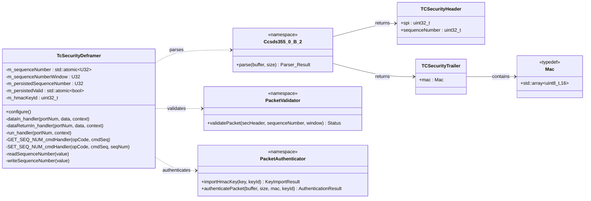

# Components::TcSecurityDeframer

The TcSecurityDeframer component implements the TC ProcessSecurity flow of CCSDS 355.0-B-2 in the uplink path. It sits between TcDeframer and SpacePacketDeframer: it parses the Security Header and Trailer, validates the SPI and anti-replay sequence number, verifies the HMAC, then strips the security envelope and forwards the frame with the verification result recorded in the frame context (`authenticated` flag).

The component does not enforce policy. Frames that fail verification are still forwarded (unauthenticated) so that downstream policy — owned by ProvesRouter and its opcode bypass allowlist — can decide whether to route or reject them. This keeps knowledge of packet structure here and knowledge of policy at the edge.

## Overview

The component is a thin stateful shell over pure-function namespaces:

- `Ccsds355_0_B_2::parse` (Parser) — Security Header (SPI, sequence number) and Trailer (MAC) extraction
- `Components::validatePacket` (Validator) — SPI validation and anti-replay sequence-number window validation
- `Components::authenticatePacket` / `importHmacKey` (Authenticator) — HMAC-SHA-256 (truncated to 16 bytes) verification via PSA crypto

The only component state is the last accepted sequence number (an atomic, serialized against `SET_SEQ_NUM` by a mutex, and persisted to file on a 1 Hz rate-group tick -- see [Sequence Number Persistence](#sequence-number-persistence)) and the imported HMAC key id.

Primary data path connections:

- TcDeframer.dataOut -> TcSecurityDeframer.dataIn
- TcSecurityDeframer.dataOut -> SpacePacketDeframer.dataIn
- TcSecurityDeframer.dataReturnOut -> TcDeframer.dataReturnIn
- SpacePacketDeframer.dataReturnOut -> TcSecurityDeframer.dataReturnIn
- rateGroup1Hz.RateGroupMemberOut[n] -> TcSecurityDeframer.run (one slot per instance)

## Class Diagram


```mermaid
classDiagram
direction LR

class TcSecurityDeframer {
  +configure()
  -dataIn_handler(portNum, data, context)
  -dataReturnIn_handler(portNum, data, context)
  -run_handler(portNum, context)
  -GET_SEQ_NUM_cmdHandler(opCode, cmdSeq)
  -SET_SEQ_NUM_cmdHandler(opCode, cmdSeq, seqNum)
  -readSequenceNumber(value)
  -writeSequenceNumber(value)
  -m_sequenceNumber : std::atomic~U32~
  -m_sequenceNumberWindow : U32
  -m_persistedSequenceNumber : U32
  -m_persistedValid : std::atomic~bool~
  -m_hmacKeyId : uint32_t
}

class Ccsds355_0_B_2 {
  <<namespace>>
  +parse(buffer, size) Parser_Result
}

class PacketValidator {
  <<namespace>>
  +validatePacket(secHeader, sequenceNumber, window) Status
}

class PacketAuthenticator {
  <<namespace>>
  +importHmacKey(key, keyId) KeyImportResult
  +authenticatePacket(buffer, size, mac, keyId) AuthenticationResult
}

class TCSecurityHeader {
  +spi : uint32_t
  +sequenceNumber : uint32_t
}

class TCSecurityTrailer {
  +mac : Mac
}

class Mac {
  <<typedef>>
  +std::array~uint8_t,16~
}

TcSecurityDeframer ..> Ccsds355_0_B_2 : parses
TcSecurityDeframer ..> PacketValidator : validates
TcSecurityDeframer ..> PacketAuthenticator : authenticates
Ccsds355_0_B_2 --> TCSecurityHeader : returns
Ccsds355_0_B_2 --> TCSecurityTrailer : returns
TCSecurityTrailer --> Mac : contains
```

## Packet Format

TcDeframer strips the TC Primary Header and FECF before this component, so the buffer received on dataIn is:

- Security Header (6 bytes): SPI (2) + Sequence Number (4)
- Space Packet Primary Header (6 bytes)
- Space Packet Data Field (includes F Prime command)
- Security Trailer (16-byte MAC)

Output packet layout (forwarded per CCSDS 355.0-B-2 §3.3.3.3):

- Space Packet Primary Header (6 bytes)
- Space Packet Data Field

The MAC is HMAC-SHA-256 truncated to 16 bytes, computed over the Security Header and Data Field (everything except the Security Trailer).

### Additional resources

- [CCSDS 355.0-B-2 Space Data Link Security Protocol](https://ccsds.org/Pubs/355x0b2.pdf)

## Behavior

1. Parse the Security Header and Trailer. If the frame is too short to contain them it cannot be stripped for downstream deframing: log ParsingFailed and return the buffer upstream (drop).
2. Validate the SPI (only SPI 0 is currently supported) and the anti-replay sequence number (must be strictly ahead of the last accepted value, within SEQ_NUM_WINDOW, with U32 wraparound handled).
3. If validation passes, verify the MAC.
4. Only when all checks pass: store the received sequence number in the atomic counter, telemeter it, and set `authenticated = true` in the frame context. Frames failing any check never advance the sequence number (issue #426). No filesystem I/O happens on this path; persistence is deferred to the `run` tick (see below).
5. Strip the Security Header and Trailer and forward on dataOut with the resulting `authenticated` flag. ProvesRouter rejects unauthenticated packets unless their opcode is on the bypass allowlist.

At startup, `configure()` loads the persisted sequence number and telemeters it so the first downlinked value is correct before any command is accepted (issue #427).

## Sequence Number Persistence

The last accepted sequence number must survive a reboot so replayed frames stay rejected. Earlier versions wrote the file on every accepted frame; on the SD-card-backed FatFs deployment each write (truncate, write, close) cost several SD block programs on the same 10 Hz thread that drains the UART, stalling reception during file uplink and racing other filesystem users (issues #461, #465, #471). Persistence is now decoupled from frame processing:

1. **Read on startup.** `configure()` reads the U32 from `SEQ_NUM_FILE_PATH` into the atomic counter. A missing file is a factory-fresh board: the default (0) is written and commanding proceeds. Any other read failure is evented (`SequenceNumberReadFailed`), the counter falls back to 0, and the first `run` tick rewrites a well-formed file.
2. **Count and compare with an atomic.** `dataIn` validates against and advances `m_sequenceNumber`, a `std::atomic<U32>`, under `m_sequenceNumberLock` (which only serializes it against `SET_SEQ_NUM`). The handler never touches the filesystem.
3. **Persist on the 1 Hz rate group.** `run_handler` snapshots the atomic without taking the lock and, if it differs from the last value known to be on disk (`m_persistedSequenceNumber`, valid when `m_persistedValid`), writes it with the existing `writeSequenceNumber`. An idle board therefore performs no writes; a continuous uplink performs at most one write per second instead of one per frame. A failed write is evented (`SequenceNumberWriteFailed`, throttled) and retried on the next tick while the in-memory counter keeps advancing. The port is `sync`, not `guarded`, so the write runs on the rate-group thread and cannot block `dataIn`.
4. **`SET_SEQ_NUM` persists immediately** (unchanged), then stores the atomic and clears `m_persistedValid` so the next tick re-persists the commanded value, closing the window in which a concurrent `run_handler` write of an older value could land last.

**Crash window.** After an unplanned reboot the restored counter may lag the true last accepted value by up to one tick (one second) of accepted frames. With ground strictly ahead, its next sequence number is accepted as long as the lag is smaller than `SEQ_NUM_WINDOW` (default 50000); the UART link bounds the lag to well under 100 frames per second, so no ground resynchronization is needed after a crash (`test_TcSecurityDeframer_Validator.cpp`, `StalePersistedCounterWithinDefaultWindow`). The trade-off is that frames accepted during that final second become replayable once after the reboot; this is accepted in exchange for never desynchronizing ground, and the window can be narrowed by driving `run` from a faster rate group. `make sync-sequence-number` continues to work unchanged because it reads the counter through `GET_SEQ_NUM`.

Note that the UART, LoRa, and S-band instances keep independent counters but share the default `SEQ_NUM_FILE_PATH`; this is pre-existing and the last instance to persist wins on reboot.

## Parameters

| Name | Type | Default | Description |
|---|---|---|---|
| SEQ_NUM_WINDOW | U32 | 50000 | Maximum allowed forward sequence-number distance before rejecting a packet as out-of-window. |
| SEQ_NUM_FILE_PATH | string | "//sequence_number.txt" | File path used to persist and restore the sequence number across restarts. |

## Port Descriptions

| Name | Direction | Type | Description |
|---|---|---|---|
| dataIn | Input (guarded) | Svc.ComDataWithContext | Receives frames from TcDeframer for parse, validation, and authentication. |
| dataReturnIn | Input (sync) | Svc.ComDataWithContext | Receives returned ownership for buffers previously sent through dataOut. |
| dataOut | Output | Svc.ComDataWithContext | Forwards the stripped frame downstream with the authenticated flag set in the context. |
| dataReturnOut | Output | Svc.ComDataWithContext | Returns ownership of structurally invalid frames (and relays dataReturnIn ownership upstream). |
| run | Input (sync) | Svc.Sched | 1 Hz rate-group tick; persists the sequence number to SEQ_NUM_FILE_PATH when it changed since the last successful write. |

Standard AC ports are also present for command handling, events, telemetry, parameter access, and time.

## Telemetry Channels

| Name | Type | Description |
|---|---|---|
| CurrentSequenceNumber | U32 | Current accepted sequence number tracked by the component. Emitted at startup and on each accepted packet (persisted to file on the 1 Hz tick, not per packet). |

Routed/bypassed/rejected packet counts are telemetered by ProvesRouter, which owns the accept/reject policy.

## Events

| Name | Severity | Parameters | Description |
|---|---|---|---|
| SequenceNumberGet | Activity High | seq_num: U32 | Logged by GET_SEQ_NUM on successful read. Format: "Sequence number is {}" |
| SequenceNumberReadFailed | Warning High (throttle 2) | status: Os.FileStatus | Logged when sequence-number read fails. Format: "Failed to read sequence number, error: {}" |
| SequenceNumberSet | Activity High | seq_num: U32 | Logged by SET_SEQ_NUM on successful write. Format: "Sequence number set to {}" |
| SequenceNumberWriteFailed | Warning High (throttle 2) | status: Os.FileStatus | Logged when a sequence-number write fails (1 Hz persist, SET_SEQ_NUM, or cold-provision default). The 1 Hz persist retries on the next tick. Format: "Failed to write sequence number, error: {}" |
| SequenceNumberInvalid | Warning High (throttle 2) | packet_seq_num: U32, seq_num: U32, window: U32 | Logged when anti-replay validation fails. Format: "Sequence number less than last accepted or out of window: Received={}, LastAccepted={}, Window={}" |
| AuthenticationFailed | Warning High (throttle 2) | auth_status: PacketAuthenticatorStatus, rc: I32 | Logged when MAC verification fails. Format: "Authentication failed: Status={}, PSA Return Code={}" |
| ParsingFailed | Warning High (throttle 2) | parse_status: PacketParserStatus | Logged when frame parsing fails. Format: "Parsing failed: {}" |
| SpiInvalid | Warning High (throttle 2) | packet_spi: U32 | Logged when SPI validation fails. Format: "SPI invalid: Received={}" |

## Commands

| Name | Type | Parameters | Description |
|---|---|---|---|
| GET_SEQ_NUM | Sync | None | Reads and reports the current sequence number (SequenceNumberGet event). |
| SET_SEQ_NUM | Sync | seq_num: U32 | Sets and immediately persists a new sequence number (SequenceNumberSet event). |

## Unit Tests

TcSecurityDeframer helper functionality is covered by unit tests in PROVESFlightControllerReference/test/unit-tests:

| Test File | Coverage |
|---|---|
| test_TcSecurityDeframer_Parser.cpp | Valid parse path plus parse failures for SPI, sequence number, and MAC size checks. |
| test_TcSecurityDeframer_Validator.cpp | SPI validation, out-of-window and replayed sequence numbers, window boundary, wraparound handling, and acceptance after a one-tick-stale restored counter. |
| test_TcSecurityDeframer_Authenticator.cpp | Key import failures, successful MAC verification, and failed verification with corrupted MAC or data. |

Run unit tests with:

```bash
make test-unit
```

## GDS Plugin

To send authenticated packets from GDS, build the framing plugin:

```bash
make framer-plugin
```

Then run GDS with the framing plugin enabled as configured by the project tooling.

## Generating Keys

The default authentication key header (AuthDefaultKey.h) is generated at build time from project key material via `make generate-auth-key` or `make copy-secrets`. This generated file is machine-local and not committed.

## Requirements

| Name | Description | Validation |
|---|---|---|
| AUTH001 | The component shall parse incoming frames to extract the SPI, sequence number, and MAC fields. | Unit Test |
| AUTH003 | The component shall validate that the SPI value corresponds to a configured Security Association. | Unit Test |
| AUTH004 | The component shall validate the received sequence number against the stored sequence number. | Unit Test |
| AUTH004-A | The component shall not authenticate packets with sequence numbers that are outside the acceptable window and shall log an event. | Unit Test, Inspection |
| AUTH004-B | The component shall set the stored sequence number to the sequence number transmitted in the packet only when a packet is fully validated and authenticated. | Inspection |
| AUTH004-C | The component shall allow the sequence number window to be configurable via a parameter. | Inspection |
| AUTH005 | The component shall compute the MAC over the entire frame minus the last 16-byte security trailer. | Unit Test |
| AUTH005-A | The component shall not mark packets as authenticated where the computed MAC does not match the security trailer MAC. | Unit Test |
| AUTH006 | For any parseable frame, the component shall remove the Security Header and Security Trailer and forward the remaining packet data with the verification result recorded in the frame context. | Inspection, Integration Test |
| AUTH007 | The component shall provide a command and telemetry channel to report the current sequence number to enable ground station synchronization. | Inspection, Integration Test |
| AUTH008 | The component shall not perform filesystem I/O while processing a frame on dataIn. | Inspection |
| AUTH008-A | The component shall persist the stored sequence number on the run tick only when it differs from the last successfully persisted value, and shall retry on the next tick after a failed write. | Inspection |
| AUTH008-B | The sequence number window shall accept ground's next sequence number after a reboot that restored a counter up to one tick stale. | Unit Test |
| AUTH008-C | SET_SEQ_NUM shall persist the commanded sequence number before acknowledging the command. | Inspection |

Opcode-based bypass policy (formerly AUTH002) is owned by ProvesRouter; see its SDD.

## Change Log

| Date | Description |
| --- | --- |
| 2025-11-26 | Initial design. |
| 2026-07-17 | Renamed to TcSecurityDeframer, refactor to discrete responsibilities: Authenticator, Parser, Validator. Pass-through interface between TcDeframer and SpacePacketDeframer; verification result carried in frame context; policy enforcement moved to ProvesRouter. |
| 2026-10-03 | Removed the per-frame sequence-number file write. The counter is an atomic persisted on a new 1 Hz `run` port when changed; `SET_SEQ_NUM` still persists immediately (issues #461, #465, #471). |
