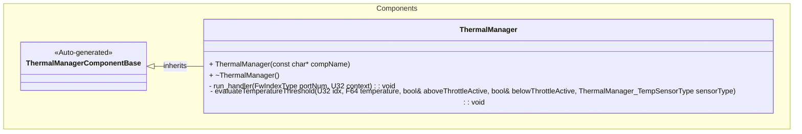
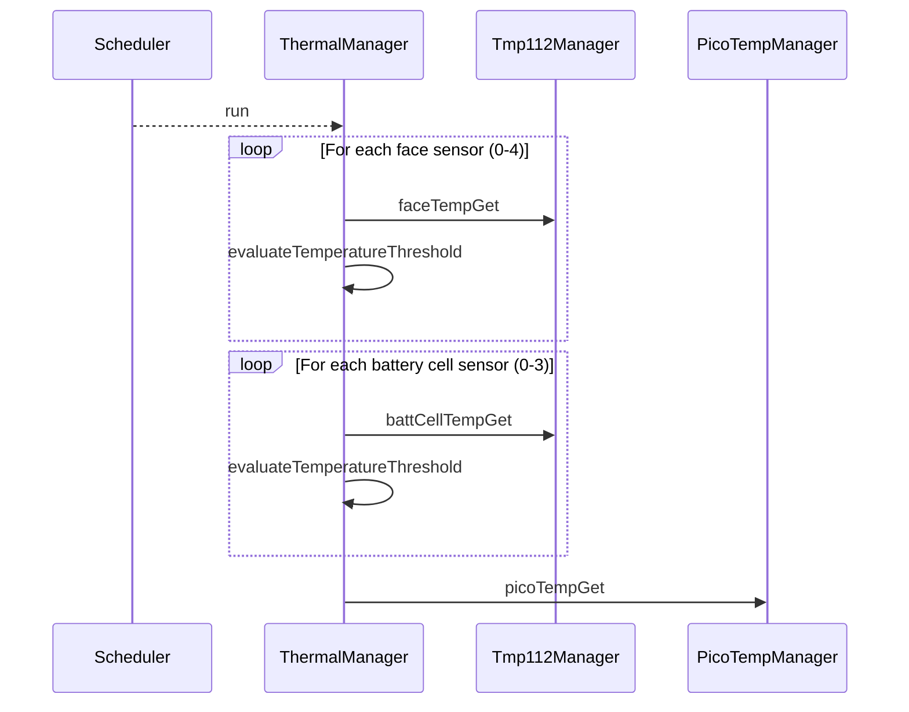

# Components::ThermalManager

The Thermal Manager component is responsible for orchestrating temperature sensor readings from multiple TMP112 sensors distributed across the spacecraft. It specifically manages sensors for the spacecraft faces and battery cells.

## Usage Examples

The Thermal Manager component is designed to be scheduled periodically to trigger collection of temperature data. It operates as a passive component that responds to scheduler calls.

### Typical Usage

1. The component is instantiated and initialized during system startup.
2. The scheduler calls the `run` port at regular intervals.
3. On each run call, the component:
   - Iterates through the connected face temperature sensor ports.
   - Iterates through the connected battery cell temperature sensor ports.
   - Triggers temperature readings for each connected sensor.
   - Triggers temperature reading from the Pico die temperature sensor.
   - Evaluates lower/upper threshold conditions for face and battery sensors with per-sensor hysteresis state

## Class Diagram

## Parameters

| Name                           | Type | Description                                                |
| ------------------------------ | ---- | ---------------------------------------------------------- |
| FACE_TEMP_LOWER_THRESHOLD      | F64  | Lower temperature threshold in °C for face sensors         |
| FACE_TEMP_UPPER_THRESHOLD      | F64  | Upper temperature threshold in °C for face sensors         |
| BATT_CELL_TEMP_LOWER_THRESHOLD | F64  | Lower temperature threshold in °C for battery cell sensors |
| BATT_CELL_TEMP_UPPER_THRESHOLD | F64  | Upper temperature threshold in °C for battery cell sensors |

## Port Descriptions

| Name            | Type         | Description                                                               |
| --------------- | ------------ | ------------------------------------------------------------------------- |
| run             | sync input   | Scheduler port that triggers temperature data collection                  |
| faceTempGet     | output       | Array of ports [5] for getting temperature data from face sensors         |
| battCellTempGet | output       | Array of ports [4] for getting temperature data from battery cell sensors |
| picoTempGet     | output       | Port for getting temperature data from Pico die temperature sensor        |
| timeCaller      | time get     | Port for requesting current system time                                   |
| tlmOut          | telemetry    | Port for emitting telemetry                                               |
| logOut          | event        | Port for emitting events                                                  |
| logTextOut      | text event   | Port for emitting text events                                             |
| prmGetOut       | param get    | Port for getting parameters                                               |
| prmSetOut       | param set    | Port for setting parameters                                               |
| cmdRegOut       | command reg  | Port for sending command registrations                                    |
| cmdIn           | command recv | Port for receiving commands                                               |
| cmdResponseOut  | command resp | Port for sending command responses                                        |

## Events

| Name                      | Description                                                                                                                                    |
| ------------------------- | ---------------------------------------------------------------------------------------------------------------------------------------------- |
| TemperatureBelowThreshold | Event emitted when a face or battery sensor reading drops below its configured lower threshold; includes sensorType, sensorId, and temperature |
| TemperatureAboveThreshold | Event emitted when a face or battery sensor reading exceeds its configured upper threshold; includes sensorType, sensorId, and temperature     |

## Sequence Diagrams

## Requirements

| Name                           | Description                                                                                                        | Validation                                                                                          |
| ------------------------------ | ------------------------------------------------------------------------------------------------------------------ | --------------------------------------------------------------------------------------------------- |
| Face Temperature Collection    | The component shall trigger data collection from connected face temperature sensors when run is called             | Verify all connected face temperature output ports are called                                       |
| Battery Temperature Collection | The component shall trigger data collection from connected battery cell temperature sensors when run is called     | Verify all connected battery cell temperature output ports are called                               |
| Pico Temperature Collection    | The component shall trigger data collection from the Pico die temperature sensor when run is called                | Verify the Pico temperature output port is called                                                   |
| Threshold Monitoring           | The component shall emit threshold events when face or battery sensor temperatures cross configured bounds         | Verify `TemperatureBelowThreshold` and `TemperatureAboveThreshold` events are emitted appropriately |
| Threshold Hysteresis           | The component shall suppress repeated threshold events until the measured temperature returns past a debounce band | Verify events are not re-emitted until the temperature re-enters the hysteresis band                |
| Periodic Operation             | The component shall operate as a scheduled component responding to scheduler calls                                 | Verify component responds correctly to scheduler input                                              |

## Change Log

| Date       | Description                                                                                                                                                                                                                   |
| ---------- | ----------------------------------------------------------------------------------------------------------------------------------------------------------------------------------------------------------------------------- |
| 2026-05-07 | Updated threshold handling to use per-sensor state and shared evaluation logic; eliminated global throttle-clear behavior. Added evaluateTemperatureThreshold helper function, removed sensor-type specific threshold events. |
| 2026-03-30 | Add Pico die temperature sensor integration                                                                                                                                                                                   |
| 2026-03-30 | Add events for when temperature readings are above/below a threshold.                                                                                                                                                         |
| 2025-12-05 | Initial Thermal Manager component SDD                                                                                                                                                                                         |
