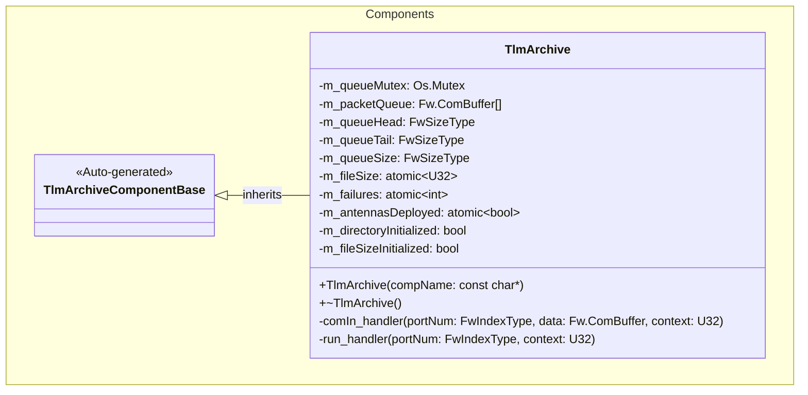
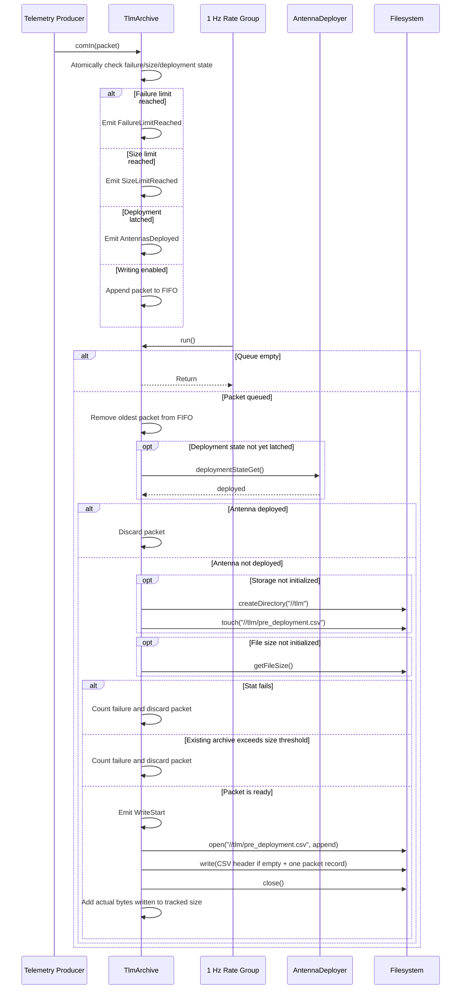

# Components::TlmArchive

The TlmArchive component preserves telemetry generated before antenna
deployment by appending serialized telemetry packets to
`//tlm/pre_deployment.csv`. Each packet is stored as one self-delimiting CSV
record containing the archive format version, packet byte count, and uppercase
hexadecimal packet payload. It uses a fixed-capacity FIFO to move filesystem
work out of the telemetry path and into the 1 Hz rate group without dropping
the other packets in a packetizer burst. A compile-time packet ID allowlist
filters packets before they consume queue space.

## Overview

TlmArchive is a passive component with two execution paths. The synchronous
`comIn` handler receives telemetry and appends it to an in-memory ring queue.
The synchronous `run` handler removes one packet from the queue and performs
the filesystem work. A mutex protects the queue storage and indices,
while atomics synchronize the cached size, failure count, and deployment latch
shared by the two calling contexts.

The reference topology connects the component as follows:

- `CdhCore.tlmSend.PktSend` sends telemetry through
  `comSplitterTelemetry.comOut` to `TlmArchive.comIn`.
- `rateGroup1Hz.RateGroupMemberOut[19]` invokes `TlmArchive.run`.
- `TlmArchive.deploymentStateGet` queries
  `AntennaDeployer.deploymentStateGet`.

Archiving stops for the remainder of the component's lifetime after it
observes a deployed antenna state. `comIn` also rejects new packets after three
counted failures or when the cached archive size reaches 25,000 bytes. A
packet that brings the archive to or above the threshold is written; subsequent
packets are rejected by `comIn` and report the size-limit event.

## Usage Examples

### Typical Usage

The component is instantiated and connected during topology setup; it does not
require an explicit configuration call.

1. A serialized telemetry packet arrives on `comIn`.
2. If writing is enabled, the component reads the F Prime packet descriptor and
   packet ID. Malformed packets, non-packetized telemetry, and packet IDs absent
   from `STORED_PACKET_IDS` are discarded.
3. If the packet passes the filter and the queue has room, it is appended to the
   FIFO. The queue is sized to `Svc::MAX_PACKETIZER_PACKETS`, allowing one
   complete packetizer send cycle to be buffered.
4. On the next 1 Hz `run` call, the component removes the oldest packet and
   queries the antenna deployment state.
5. If the antenna is not deployed, the component creates `//tlm` and
   `//tlm/pre_deployment.csv` when needed, reads the existing archive size if it
   has not already been initialized, verifies that the queued packet fits, opens
   `//tlm/pre_deployment.csv` in append mode, writes one CSV record, and closes
   the file. The CSV header is included with the first record in an empty file.
6. If the antenna is deployed, the dequeued packet is discarded without
   filesystem access. The true deployment state is latched so it is not queried
   again, and subsequent `comIn` calls reject new packets.

The archive schema is:

```csv
format_version,packet_size_bytes,packet_hex
1,4,00040102
```

`packet_hex` contains the complete `Fw.ComBuffer`, including its F Prime packet
descriptor, packet ID, timestamp, and serialized channel values. One line is
one packet; `packet_size_bytes` independently detects truncated or malformed
rows. `tools/decode_tlm_archive.py` combines these records with the generated F
Prime topology dictionary to produce named, typed telemetry values.

The queue prevents filesystem access from blocking the telemetry producer.
Because `run` executes at 1 Hz, one buffered packet is processed per rate-group
tick. An empty queue causes `run` to return without emitting an event.

## Class Diagram



## Port Descriptions

| Name | Type | Direction | Description |
|---|---|---|---|
| `comIn` | `Fw.Com` | sync input | Receives serialized telemetry packets and appends allowlisted packet IDs to the bounded FIFO when writing is enabled. |
| `run` | `Svc.Sched` | sync input | Drains the oldest queued packet, checks deployment state, and performs archive filesystem work. Connected to the 1 Hz rate group. |
| `deploymentStateGet` | `Components.GetDeploymentState` | output | Queries AntennaDeployer for its persistent deployed state. |
| `timeCaller` | time get | time get | Supplies timestamps for emitted events. |
| `logOut` | event | output | Sends binary event records. |
| `logTextOut` | text event | output | Sends text-formatted event records. |

## Component Behavior and States

TlmArchive has no explicit state enumeration. Its behavior is determined by
the following internal state:

| Name | Initial value | Description |
|---|---:|---|
| `m_packetQueue` | Empty buffers | Ring storage sized to `Svc::MAX_PACKETIZER_PACKETS` packets. |
| `m_queueHead` | `0` | Index of the next packet to dequeue. |
| `m_queueTail` | `0` | Index at which the next packet is enqueued. |
| `m_queueSize` | `0` | Number of packets currently waiting in the FIFO. |
| `m_fileSize` | `0` | Atomic cached archive size. Initialized once from the filesystem and advanced by the actual bytes written after each successful write. |
| `m_failures` | `0` | Atomic cumulative count of directory, stat, oversized-existing-archive, open, and write failures. |
| `m_directoryInitialized` | `false` | Becomes true after both `//tlm` and `//tlm/pre_deployment.csv` are successfully initialized, preventing repeated creation attempts. |
| `m_fileSizeInitialized` | `false` | Becomes true after the initial archive size is read, preventing later size queries. |
| `m_antennasDeployed` | `false` | Atomic in-memory latch set when AntennaDeployer first reports a deployed state. |
| `m_queueMutex` | Unlocked | Protects the ring storage, indices, and count. |

Conceptually, the component operates in these states:

| Name | Description |
|---|---|
| `WAITING` | Writing is enabled and the packet queue is empty. |
| `PACKETS_QUEUED` | One or more packets are waiting and are processed oldest-first, one per `run` invocation. |
| `DEPLOYED` | A true antenna deployment state has been latched. The packet that observed deployment is discarded, and subsequent packets are rejected by `comIn`. |
| `WRITE_DISABLED` | The failure count has reached its limit or the cached file size has reached 25,000 bytes. New packets are rejected by `comIn`. |

The `run` handler does not emit an event when it first observes deployment.
The throttled `AntennasDeployed` event is emitted if another packet later
arrives on `comIn`.

### Archive Size Tracking

The archive is opened in append mode, so data from an existing archive is
preserved. During one-time storage initialization, `createDirectory` ensures
that `//tlm` exists and `FileSystem::touch` ensures that
`//tlm/pre_deployment.csv` exists. `touch` creates a missing archive without
truncating an existing archive.

Before the first append attempt, the component reads the existing on-disk
size. Stat failures are reported and counted. After a successful size
initialization, the component uses the cached size rather than querying the
filesystem again. Once a successful write brings the cached archive size to or
above 25,000 bytes, subsequent packets are rejected by `comIn`. The final write
may therefore make the archive larger than the threshold by one CSV record.

After a successful write, `m_fileSize` is incremented by the actual byte count
reported by the file API. The archive is not truncated or deleted when the
limit is reached. Changes made to the archive by another component after size
initialization are not reflected in the cache.

The atomic cache uses the target's native 32-bit `U32` width. This is lossless
for all permitted archive sizes; an existing on-disk size above the 25,000-byte
limit is represented by the limit value so packet admission remains disabled.

### Failure Handling

Counted failures are cumulative and are not reset after a successful write.
The following failures increment `m_failures`:

- failure to create `//tlm`;
- failure to create or open `//tlm/pre_deployment.csv` during initialization;
- failure to read the size of an existing archive;
- rejection when the archive was already larger than the size threshold at initialization;
- failure to open the archive for append; and
- a failed or short file write.

Once three counted failures have occurred, subsequent `comIn` calls reject new
packets. The packet that encountered an error is not retried. An archive that
is already larger than the threshold when its size is first read is rejected in
`run` and increments the failure count without emitting an event.

## Sequence Diagrams

### Telemetry Archival



## Parameters

The component defines no runtime F Prime parameters. The following compile-time
implementation constants control its behavior:

| Name | Value | Description |
|---|---:|---|
| `TLM_DIRECTORY` | `//tlm` | Directory containing the archive. |
| `PRE_DEPLOYMENT_TLM_PATH` | `//tlm/pre_deployment.csv` | Append-only, one-packet-per-row pre-deployment telemetry archive. |
| `STORED_PACKET_IDS` | All currently configured telemetry packet IDs | Compile-time allowlist in `TlmArchive.cpp`. Packets whose IDs are absent are discarded before enqueueing. |
| `PACKET_QUEUE_CAPACITY` | `Svc::MAX_PACKETIZER_PACKETS` (currently 22) | Maximum packets held between the telemetry producer and 1 Hz filesystem worker. |
| `MAX_FAILURES` | `3` | Counted stat, limit, directory, open, or write failures after which new packets are rejected. |
| `MAX_FILE_SIZE` | `25000` bytes | Cached archive-size threshold after which subsequent packets are rejected. One final record may cross the threshold. |

## Commands

| Name | Description |
|---|---|
| N/A | The component defines no commands. |

## Events

| Name | Severity | Throttle | Parameters | Description |
|---|---|---:|---|---|
| `WriteStart` | Activity Low | 1 | None | Emitted immediately before each attempt to open the archive. |
| `QueueFull` | Warning High | 1 | `capacity: FwSizeType` | Emitted when an incoming packet cannot be enqueued. Its throttle is cleared after a later enqueue succeeds. |
| `FileError` | Warning High | None | `operation: string` | Reports directory creation, archive creation, record formatting, initial file-size lookup, or archive open errors. Current operation strings are `create_directory`, `create_file`, `format_record`, `get_file_size`, and `open_append`. |
| `WriteError` | Warning High | None | `status: Os.FileStatus`, `requested: FwSizeType`, `written: FwSizeType` | Reports a failed or incomplete archive write. |
| `FailureLimitReached` | Warning High | 1 | `count: I8` | Emitted by `comIn` when the cumulative failure count is at least three. The implementation supplies `3`. |
| `AntennasDeployed` | Warning Low | 1 | None | Emitted by `comIn` when deployment has been latched and a new packet is rejected. |
| `SizeLimitReached` | Warning Low | 1 | `maxSize: FwSizeType` | Emitted by `comIn` when the cached archive size is at least 25,000 bytes. The implementation supplies `25000`. |

`QueueFull` has an explicit throttle-clear call so each distinct full period
can be reported. The other throttled events report only their first occurrence
during the component's lifetime. The `comIn` checks are ordered failure limit,
size limit, then antenna deployment; if more than one condition is true, only
the first applicable event is invoked.

## Telemetry

| Name | Description |
|---|---|
| N/A | The component defines no telemetry channels. Operational status is reported through events. |

## Unit Tests

There are currently no component-specific unit tests for TlmArchive.

## Requirements

| Name | Description | Validation |
|---|---|---|
| `TLM_ARCHIVE_001` | The component shall enqueue telemetry packets in arrival order in a bounded FIFO sized for one complete packetizer send cycle. | Inspection |
| `TLM_ARCHIVE_002` | The component shall append buffered telemetry as versioned, one-packet-per-row CSV records to `//tlm/pre_deployment.csv` while the antenna deployment state is false. | Inspection |
| `TLM_ARCHIVE_003` | The component shall stop writing telemetry after observing a deployed antenna state. | Inspection |
| `TLM_ARCHIVE_004` | The component shall reject new packets after three counted failures. | Inspection |
| `TLM_ARCHIVE_005` | The component shall reject new packets after the cached archive size reaches 25,000 bytes. The write that crosses the threshold is permitted. | Inspection |
| `TLM_ARCHIVE_006` | The component shall report archive start, filesystem errors, write errors, failure-limit rejection, size-limit rejection, and deployed-state rejection through events. | Inspection |
| `TLM_ARCHIVE_007` | The component shall create the archive when missing without truncating an existing archive. | Inspection |
| `TLM_ARCHIVE_008` | The component shall enqueue only valid packetized telemetry whose packet ID appears in the compile-time `STORED_PACKET_IDS` allowlist. | Inspection |

## Change Log

| Date | Description |
|---|---|
| 2026-07-26 | Documented the mailbox, deployment-state handling, archive workflow, limits, events, topology connections, and failure behavior. |
| 2026-07-27 | Updated mailbox replacement behavior, non-destructive storage initialization, cached-size handling, rejection paths, and the current event interface. |
| 2026-07-30 | Replaced mutex-protected scalar state updates with atomics; retained the mutex only for packet mailbox copies. |
| 2026-08-01 | Replaced the concatenated binary archive with a versioned, one-packet-per-row CSV archive and documented the dictionary-backed ground decoder. |
| 2026-08-01 | Replaced the latest-value mailbox with a bounded FIFO and added repeatable empty/full queue diagnostics. |
| 2026-08-01 | Added a compile-time packet ID allowlist that filters telemetry before enqueueing. |
| 2026-08-02 | Removed the empty-queue event and its throttle state. |
