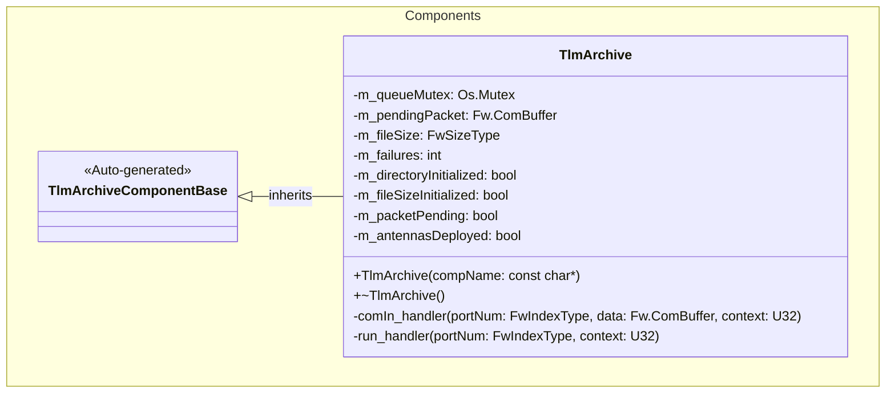
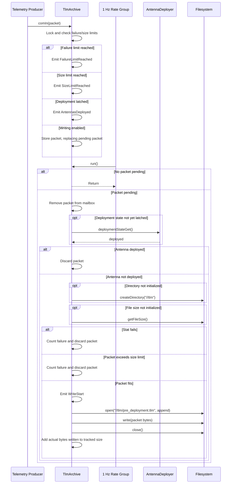

# Components::TlmArchive

The TlmArchive component preserves telemetry generated before antenna
deployment by appending serialized telemetry packets to
`//tlm/pre_deployment.tlm`. It uses a one-packet, latest-value mailbox to move
filesystem work out of the telemetry path and into the 1 Hz rate group.

## Overview

TlmArchive is a passive component with two execution paths. The synchronous
`comIn` handler receives telemetry and stores the most recent packet in an
in-memory mailbox. The synchronous `run` handler drains that mailbox and
performs the filesystem work. A mutex protects the mailbox, cached size, and
failure count shared by the two calling contexts.

The reference topology connects the component as follows:

- `CdhCore.tlmSend.PktSend` sends telemetry through
  `comSplitterTelemetry.comOut` to `TlmArchive.comIn`.
- `rateGroup1Hz.RateGroupMemberOut[19]` invokes `TlmArchive.run`.
- `TlmArchive.deploymentStateGet` queries
  `AntennaDeployer.deploymentStateGet`.

Archiving stops for the remainder of the component's lifetime after it
observes a deployed antenna state. `comIn` also rejects new packets after three
counted failures or when the cached archive size reaches 10,000 bytes. A
pending packet is rejected and counted as a failure when appending it would
exceed the size limit.

## Usage Examples

### Typical Usage

The component is instantiated and connected during topology setup; it does not
require an explicit configuration call.

1. A serialized telemetry packet arrives on `comIn`.
2. If writing is enabled, the packet is copied into the mailbox. A new packet
   arriving while another packet is pending replaces the older packet.
3. On the next 1 Hz `run` call, the component removes the pending packet and
   queries the antenna deployment state.
4. If the antenna is not deployed, the component creates `//tlm` when needed,
   reads the existing archive size if it has not already been initialized,
   verifies that the pending packet fits, opens
   `//tlm/pre_deployment.tlm` in append mode, writes the raw `Fw.ComBuffer`
   bytes, and closes the file.
5. If the antenna is deployed, the pending packet is discarded without
   filesystem access. The true deployment state is latched so it is not queried
   again, and subsequent `comIn` calls reject new packets.

The one-packet mailbox prevents filesystem access from blocking the telemetry
producer. Because `run` executes at 1 Hz, at most one buffered packet is
processed per rate-group tick.

## Class Diagram

## Port Descriptions

| Name | Type | Direction | Description |
|---|---|---|---|
| `comIn` | `Fw.Com` | sync input | Receives serialized telemetry packets. When writing is enabled, stores the packet in the mailbox, replacing any packet already pending. |
| `run` | `Svc.Sched` | sync input | Drains one pending packet, checks deployment state, and performs archive filesystem work. Connected to the 1 Hz rate group. |
| `deploymentStateGet` | `Components.GetDeploymentState` | output | Queries AntennaDeployer for its persistent deployed state. |
| `timeCaller` | time get | time get | Supplies timestamps for emitted events. |
| `logOut` | event | output | Sends binary event records. |
| `logTextOut` | text event | output | Sends text-formatted event records. |

## Component Behavior and States

TlmArchive has no explicit state enumeration. Its behavior is determined by
the following internal state:

| Name | Initial value | Description |
|---|---:|---|
| `m_pendingPacket` | Empty buffer | Storage for the single pending telemetry packet. |
| `m_packetPending` | `false` | Indicates whether the mailbox contains a packet. |
| `m_fileSize` | `0` | Cached archive size. Initialized once from the filesystem and advanced by the actual bytes written after each successful write. |
| `m_failures` | `0` | Cumulative count of directory, stat, size-limit, open, and write failures. |
| `m_directoryInitialized` | `false` | Becomes true after `//tlm` is successfully initialized, preventing repeated directory creation attempts. |
| `m_fileSizeInitialized` | `false` | Becomes true after the initial archive size is read or the archive is confirmed missing, preventing later size queries. |
| `m_antennasDeployed` | `false` | In-memory latch set when AntennaDeployer first reports a deployed state. |
| `m_queueMutex` | Unlocked | Protects the mailbox, cached size, and failure count shared by the input and rate-group contexts. |

Conceptually, the component operates in these states:

| Name | Description |
|---|---|
| `WAITING` | Writing is enabled and no packet is pending. |
| `PACKET_PENDING` | One packet is waiting for the next `run` invocation. A newer packet replaces the pending packet. |
| `DEPLOYED` | A true antenna deployment state has been latched. The packet that observed deployment is discarded, and subsequent packets are rejected by `comIn`. |
| `WRITE_DISABLED` | The failure count has reached its limit or the cached file size has reached 10,000 bytes. New packets are rejected by `comIn`. |

The `run` handler does not emit an event when it first observes deployment.
The throttled `AntennasDeployed` event is emitted if another packet later
arrives on `comIn`.

### Archive Size Tracking

The archive is opened in append mode, so data from an existing archive is
preserved. Before the first append attempt, the component reads the existing
on-disk size. A missing archive is treated as an empty archive; other stat
failures are reported and counted. After a successful initialization, the
component uses the cached size rather than querying the filesystem again. The
pending packet is rejected when its requested size would make the cached
archive size exceed 10,000 bytes.

After a successful write, `m_fileSize` is incremented by the actual byte count
reported by the file API. The archive is not truncated or deleted when the
limit is reached. Changes made to the archive by another component after size
initialization are not reflected in the cache.

### Failure Handling

Counted failures are cumulative and are not reset after a successful write.
The following failures increment `m_failures`:

- failure to create `//tlm`;
- failure to read the size of an existing archive;
- rejection of a packet that would exceed the archive size limit;
- failure to open the archive for append; and
- a failed or short file write.

A missing archive during the size check is expected and is treated as a
zero-byte file. Once three counted failures have occurred, subsequent `comIn`
calls reject new packets. The packet that encountered an error is not retried.
A size-limit rejection in `run` increments the failure count without emitting
an event; `FailureLimitReached` is emitted if a later `comIn` call observes the
failure cutoff.

## Sequence Diagrams

### Telemetry Archival

## Parameters

The component defines no runtime F Prime parameters. The following compile-time
implementation constants control its behavior:

| Name | Value | Description |
|---|---:|---|
| `TLM_DIRECTORY` | `//tlm` | Directory containing the archive. |
| `PRE_DEPLOYMENT_TLM_PATH` | `//tlm/pre_deployment.tlm` | Append-only pre-deployment telemetry archive. |
| `MAX_FAILURES` | `3` | Counted stat, limit, directory, open, or write failures after which new packets are rejected. |
| `MAX_FILE_SIZE` | `10000` bytes | Maximum cached archive size permitted after a component-managed append. |

## Commands

| Name | Description |
|---|---|
| N/A | The component defines no commands. |

## Events

| Name | Severity | Throttle | Parameters | Description |
|---|---|---:|---|---|
| `WriteStart` | Activity Low | 1 | None | Emitted immediately before each attempt to open the archive. |
| `FileError` | Warning High | None | `operation: string` | Reports directory creation, initial file-size lookup, or archive open errors. Current operation strings are `create_directory`, `get_file_size`, and `open_append`. |
| `WriteError` | Warning High | None | `status: Os.FileStatus`, `requested: FwSizeType`, `written: FwSizeType` | Reports a failed or incomplete archive write. |
| `FailureLimitReached` | Warning High | 1 | `count: I8` | Emitted by `comIn` when the cumulative failure count is at least three. The implementation supplies `3`. |
| `AntennasDeployed` | Warning Low | 1 | None | Emitted by `comIn` when deployment has been latched and a new packet is rejected. |
| `SizeLimitReached` | Warning Low | 1 | `maxSize: FwSizeType` | Emitted by `comIn` when the cached archive size is at least 10,000 bytes. The implementation supplies `10000`. |

The throttled events have no corresponding throttle-clear calls, so only their
first occurrence is reported during the component's lifetime. The `comIn`
checks are ordered failure limit, size limit, then antenna deployment; if more
than one condition is true, only the first applicable event is invoked.

## Telemetry

| Name | Description |
|---|---|
| N/A | The component defines no telemetry channels. Operational status is reported through events. |

## Unit Tests

There are currently no component-specific unit tests for TlmArchive.

## Requirements

| Name | Description | Validation |
|---|---|---|
| `TLM_ARCHIVE_001` | The component shall buffer at most one telemetry packet outside the telemetry producer's filesystem path, replacing a pending packet when newer telemetry arrives. | Inspection |
| `TLM_ARCHIVE_002` | The component shall append buffered telemetry packet bytes to `//tlm/pre_deployment.tlm` while the antenna deployment state is false. | Inspection |
| `TLM_ARCHIVE_003` | The component shall stop writing telemetry after observing a deployed antenna state. | Inspection |
| `TLM_ARCHIVE_004` | The component shall reject new packets after three counted failures. | Inspection |
| `TLM_ARCHIVE_005` | The component shall reject a write when the cached archive size plus the pending packet size would exceed 10,000 bytes. | Inspection |
| `TLM_ARCHIVE_006` | The component shall report archive start, filesystem errors, write errors, failure-limit rejection, size-limit rejection, and deployed-state rejection through events. | Inspection |

## Change Log

| Date | Description |
|---|---|
| 2026-07-26 | Documented the mailbox, deployment-state handling, archive workflow, limits, events, topology connections, and failure behavior. |
| 2026-07-27 | Updated mailbox replacement behavior, cached-size handling, rejection paths, and the current event interface. |
