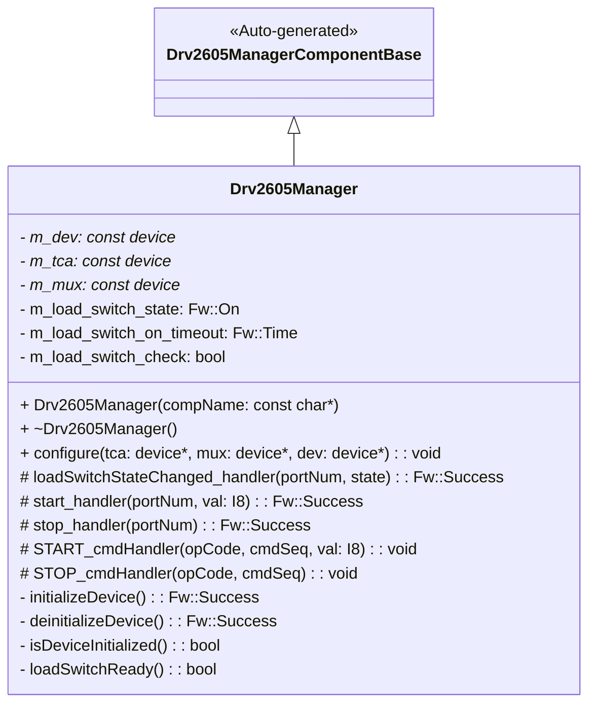
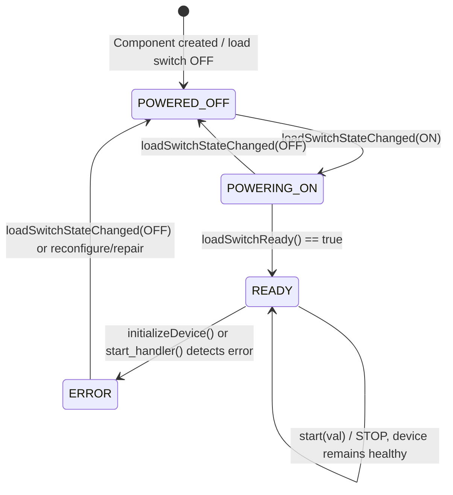
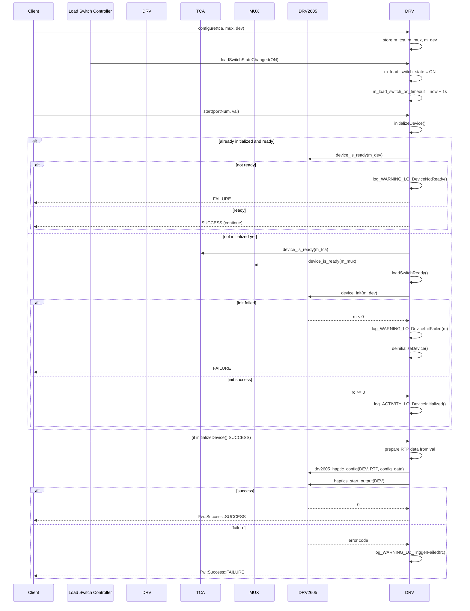
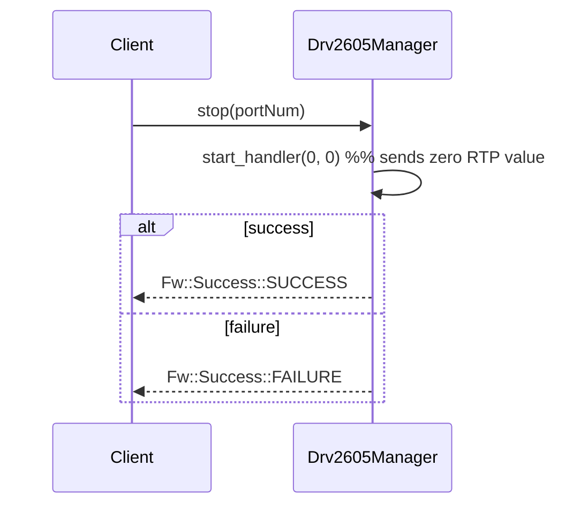

# Drv::Drv2605Manager

Component for F Prime FSW framework.

## Overview

The Drv2605Manager component provides a driver interface for the Texas Instruments DRV2605 haptic driver, which is used here as a current-controlled actuator (for example, to drive a magnetorquer). This passive component manages device configuration and safe triggering of output using the Zephyr RTOS haptics and DRV2605 APIs. It also coordinates with a power-domain load switch, a TCA device, and a mux to ensure the device is only used when hardware is healthy and fully powered.

## Usage Examples

### Typical Usage

The typical usage pattern for the Drv2605Manager component is:

1. **Configure devices**: Call `configure(tca, mux, dev)` during system initialization to provide Zephyr device pointers for the TCA, mux, and DRV2605.
2. **Track power state**: A higher-level component calls the `loadSwitchStateChanged` port whenever the associated load switch turns on or off.
3. **Start output**: Application code or another component calls the `start` port (or the `START` command) with a value in the range [-127, 127] to request output.
4. **Stop output**: Application code or another component calls the `stop` port (or the `STOP` command) to stop output.

On each `start` request, the component automatically:

- Verifies that the DRV2605 device is initialized and `device_is_ready()`.
- Verifies that the TCA and mux devices are healthy.
- Verifies that the load switch has been ON long enough to be considered stable.
- Initializes the DRV2605 if needed using `device_init()`.
- Configures the DRV2605 using `drv2605_haptic_config()` with RTP data derived from the requested value.
- Starts output using `haptics_start_output()`.

## Class Diagram

## Port Descriptions

| Name                 | Type                            | Direction  | Description                                                                                                  |
| -------------------- | ------------------------------- | ---------- | ------------------------------------------------------------------------------------------------------------ |
| start                | Drv.StartMagnetorquer           | sync input | Starts output on the DRV2605 with a signed value [-127, 127]. Internally initializes and configures device. |
| stop                 | Drv.StopMagnetorquer            | sync input | Stops output by issuing a zero-value RTP update through `start_handler`.                                     |
| loadSwitchStateChanged | Components.loadSwitchStateChanged | sync input | Notifies the component when the power-domain load switch changes state, driving (de)initialization timing.  |
| timeCaller           | time get                        | time get   | Provides current time used to implement the load-switch stabilization timeout.                              |
| cmdRegOut            | command reg                     | output     | Registers the `START` and `STOP` commands.                                                                  |
| cmdIn                | command recv                    | input      | Receives ground commands, including `START` and `STOP`.                                                     |
| cmdResponseOut       | command resp                    | output     | Sends command responses (OK or EXECUTION_ERROR).                                                            |
| logTextOut           | text event                      | output     | Sends textual event representations.                                                                        |
| logOut               | event                           | output     | Sends binary events for downlink.                                                                           |

## Component Behavior and States

Internally, Drv2605Manager maintains device and power readiness via `m_dev`, `m_tca`, `m_mux`, and `m_load_switch_state`. While there is no explicit state enum, the behavior can be described with the following conceptual states:

| Name           | Description                                                                                          |
| -------------- | ---------------------------------------------------------------------------------------------------- |
| POWERED_OFF    | Load switch is OFF; device is deinitialized or not ready.                                           |
| POWERING_ON    | Load switch just turned ON; waiting for `m_load_switch_on_timeout` to elapse before using device.   |
| READY          | Device pointers are valid, dependencies are healthy, and DRV2605 is initialized and ready to start. |
| ERROR          | Initialization or health checks have failed; events are emitted and the request returns FAILURE.    |

## Sequence Diagrams

### Initialization and Start Sequence

### Stop Sequence

## Parameters

| Name | Description                   |
| ---- | ----------------------------- |
| N/A  | No runtime parameters defined |

## Commands

The component exposes simple ground commands to map to the start/stop ports:

| Name  | Arguments         | Description                                                                 |
| ----- | ----------------- | --------------------------------------------------------------------------- |
| START | `val: I8`         | Starts output with a signed value [-127, 127]. Uses the `start` handler.   |
| STOP  | (none)            | Stops output by calling the `stop` handler.                                 |

Command responses are sent on `cmdResponseOut` with `OK` on success or `EXECUTION_ERROR` on failure.

## Events

| Name                      | Severity        | Throttle | Description                                                                                       |
| ------------------------- | --------------- | -------- | ------------------------------------------------------------------------------------------------- |
| DeviceNotReady            | WARNING_LO      | 5        | Emitted when `device_is_ready(m_dev)` returns false for an already-initialized device.           |
| DeviceInitFailed          | WARNING_LO      | 5        | Emitted when DRV2605 initialization via `device_init()` fails; includes the error return code.   |
| DeviceNil                 | WARNING_LO      | 5        | Emitted when the DRV2605 device pointer (`m_dev`) is null during init/deinit checks.             |
| DeviceStateNil            | WARNING_LO      | 5        | Emitted when the DRV2605 device state pointer is null during init/deinit checks.                 |
| DeviceHapticConfigSetFailed | WARNING_LO    | 5        | Emitted when `drv2605_haptic_config()` fails; includes the error return code.                    |
| TcaUnhealthy              | WARNING_LO      | 5        | Emitted when the TCA device is not ready according to `device_is_ready(m_tca)`.                  |
| MuxUnhealthy              | WARNING_LO      | 5        | Emitted when the mux device is not ready according to `device_is_ready(m_mux)`.                  |
| TriggerFailed             | WARNING_LO      | 5        | Emitted when `haptics_start_output()` fails; includes the error return code.                     |
| DeviceInitialized         | ACTIVITY_LO     | (none)   | Emitted once when DRV2605 initialization succeeds.                                               |

All warning events are throttled to reduce log spam; `_ThrottleClear` calls in the implementation clear throttling on success.

## Telemetry

| Name | Description                   |
| ---- | ----------------------------- |
| N/A  | No telemetry channels defined |

## Requirements

| Name    | Description                                                                                   | Validation                                                                                 |
| ------- | --------------------------------------------------------------------------------------------- | ------------------------------------------------------------------------------------------ |
| DRV-001 | Component shall initialize the DRV2605 device via the Zephyr driver when needed.             | Exercise `start`/`START` with an uninitialized device and verify `device_init()` is called. |
| DRV-002 | Component shall verify TCA and mux health before initializing the DRV2605 device.            | Force `device_is_ready(m_tca/m_mux)` to fail and verify `TcaUnhealthy`/`MuxUnhealthy` events. |
| DRV-003 | Component shall respect the load switch warm-up delay before using the DRV2605.              | Toggle `loadSwitchStateChanged(ON)` then call `start` before and after timeout; expect failure then success. |
| DRV-004 | Component shall configure DRV2605 with RTP data based on the requested signed value.         | Inspect calls to `drv2605_haptic_config()` and resulting behavior for various `val` inputs. |
| DRV-005 | Component shall start output using `haptics_start_output()` and report failures.             | Induce a driver error and verify `TriggerFailed` is emitted and `start` returns FAILURE.    |
| DRV-006 | Component shall validate device pointer and state before use.                                | Force `m_dev` or `m_dev->state` to be null and verify `DeviceNil` or `DeviceStateNil` events. |
| DRV-007 | Component shall report device-not-ready conditions for already initialized devices.          | Make `isDeviceInitialized()` true but `device_is_ready(m_dev)` false and verify `DeviceNotReady`. |
| DRV-008 | Component shall support ground commands to start and stop output.                            | Send `START`/`STOP` commands and verify correct mapping to ports and command responses.     |

## Change Log

| Date       | Description                                      |
| ---------- | ------------------------------------------------ |
| 2025-12-01 | Initial implementation and documentation draft. |
| 2025-12-20 | Use RTP mode to drive magnetorquers.            |
