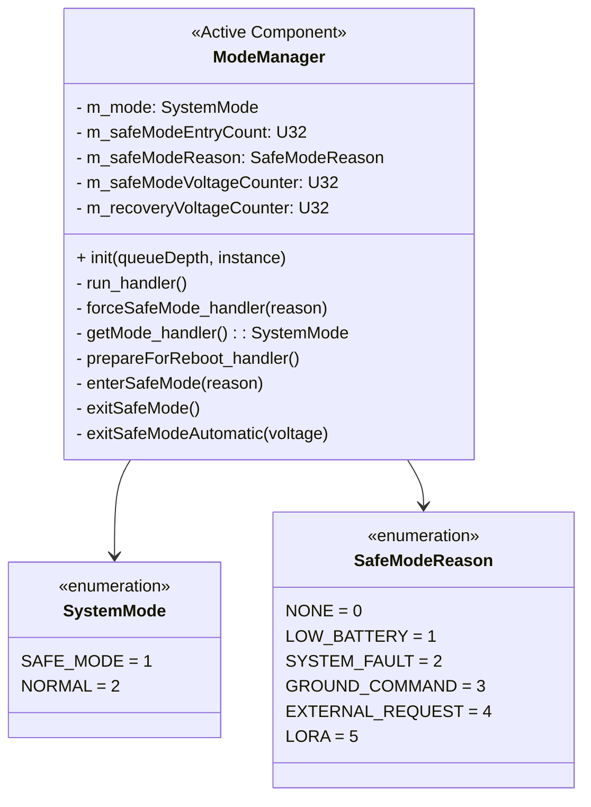
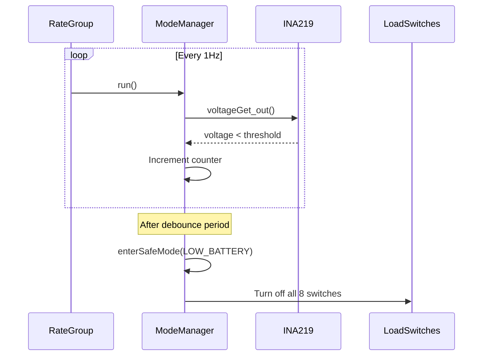
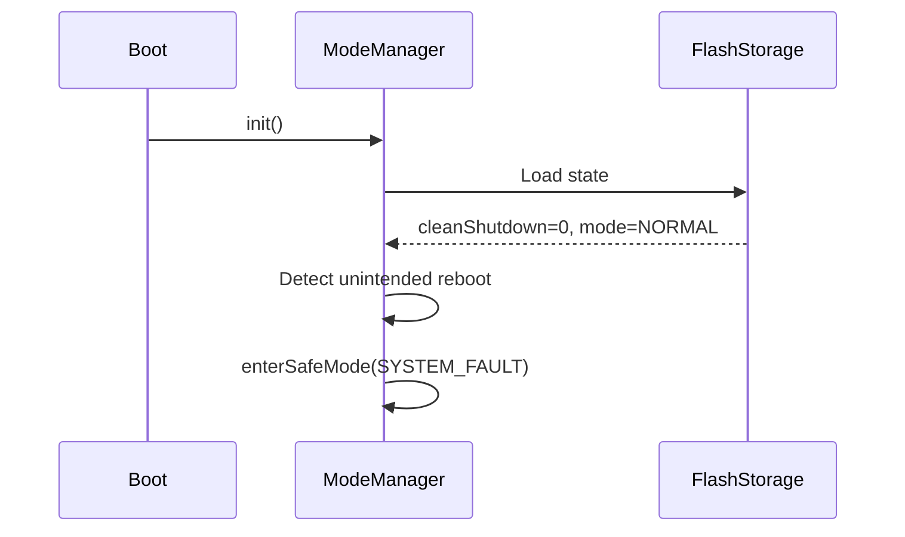

# Components::ModeManager

The ModeManager component manages system operational modes and orchestrates transitions between NORMAL and SAFE_MODE. It evaluates voltage conditions and detects unintended reboots to make mode decisions, controls power to non-critical subsystems during transitions, and maintains/persists mode state across reboots.

## Requirements
| Name | Description | Validation |
|---|---|---|
| MM0001 | The ModeManager shall maintain two operational modes: NORMAL and SAFE_MODE | Integration Testing |
| MM0002 | The ModeManager shall enter safe mode when commanded manually via FORCE_SAFE_MODE command | Integration Testing |
| MM0003 | The ModeManager shall enter safe mode when requested by external components via forceSafeMode port | Integration Testing |
| MM0004 | The ModeManager shall exit safe mode only via explicit EXIT_SAFE_MODE command or automatic voltage recovery | Integration Testing |
| MM0005 | The ModeManager shall turn off all 8 load switches when entering safe mode | Integration Testing |
| MM0006 | The ModeManager shall turn on face load switches (0-5) when exiting safe mode; payload switches (6-7) remain off | Integration Testing |
| MM0007 | The ModeManager shall persist mode state to non-volatile storage and restore on initialization | Integration Testing |
| MM0008 | The ModeManager shall detect unintended reboots and enter safe mode with reason SYSTEM_FAULT | Integration Testing |
| MM0009 | The ModeManager shall automatically enter safe mode when voltage drops below configurable threshold | Integration Testing |
| MM0010 | The ModeManager shall automatically exit safe mode (LOW_BATTERY only) when voltage recovers above configurable threshold | Integration Testing |

## Class Diagram

## Ports

### Input Ports
| Name | Type | Kind | Description |
|---|---|---|---|
| run | Svc.Sched | sync | 1Hz periodic calls for telemetry and voltage monitoring |
| forceSafeMode | ForceSafeModeWithReason | async | Safe mode requests from external components |
| getMode | GetSystemMode | sync | Query current system mode |
| prepareForReboot | Fw.Signal | sync | Set clean shutdown flag before intentional reboot |

### Output Ports
| Name | Type | Description |
|---|---|---|
| modeChanged | SystemModeChanged | Notifies components of mode changes |
| loadSwitchTurnOn | Fw.Signal [8] | Turn on load switches |
| loadSwitchTurnOff | Fw.Signal [8] | Turn off load switches |
| voltageGet | Drv.VoltageGet | Query system voltage |

## Commands

| Name | Description |
|---|---|
| FORCE_SAFE_MODE | Forces safe mode with reason GROUND_COMMAND |
| EXIT_SAFE_MODE | Exits safe mode (fails if not in safe mode) |

## Parameters

Voltage thresholds are configurable via F-Prime parameters:

| Parameter | Type | Default | Description |
|---|---|---|---|
| SafeModeEntryVoltage | F32 | 6.7 | Voltage (V) below which safe mode is entered |
| SafeModeRecoveryVoltage | F32 | 8.0 | Voltage (V) above which safe mode can be exited |
| SafeModeDebounceSeconds | U32 | 10 | Consecutive seconds required for transitions |

Parameters can be modified at runtime via `PRM_SET` commands.

## Events

| Name | Severity | Description |
|---|---|---|
| EnteringSafeMode | WARNING_HI | Entering safe mode with reason string |
| ExitingSafeMode | ACTIVITY_HI | Manually exiting safe mode |
| AutoSafeModeEntry | WARNING_HI | Auto-entry due to low voltage |
| AutoSafeModeExit | ACTIVITY_HI | Auto-exit due to voltage recovery |
| UnintendedRebootDetected | WARNING_HI | Unintended reboot detected on startup |
| ManualSafeModeEntry | ACTIVITY_HI | Safe mode commanded via FORCE_SAFE_MODE |
| ExternalFaultDetected | WARNING_HI | External component triggered safe mode |
| PreparingForReboot | ACTIVITY_HI | Clean shutdown flag being set |
| CommandValidationFailed | WARNING_LO | Command validation failed |
| StatePersistenceFailure | WARNING_LO | State save/load failed |

## Telemetry

| Name | Type | Description |
|---|---|---|
| CurrentMode | U8 | Current mode (1=SAFE_MODE, 2=NORMAL) |
| SafeModeEntryCount | U32 | Times safe mode entered (persists across reboots) |
| CurrentSafeModeReason | SafeModeReason | Current reason (NONE if not in safe mode) |

## State Persistence

State is persisted to `/mode_state.bin`:
- Current mode (U8)
- Safe mode entry count (U32)
- Safe mode reason (U8)
- Clean shutdown flag (U8)

## Safe Mode Reason Logic

| Reason | Trigger | Auto-Recovery |
|---|---|---|
| LOW_BATTERY | Voltage below threshold | Yes (when voltage recovers) |
| SYSTEM_FAULT | Unintended reboot detected | No |
| GROUND_COMMAND | FORCE_SAFE_MODE command | No |
| EXTERNAL_REQUEST | forceSafeMode port call | No |
| LORA | LoRa communication fault | No |

## Load Switch Mapping

| Index | Subsystem | NORMAL | SAFE_MODE |
|---|---|---|---|
| 0-5 | Satellite Faces | ON | OFF |
| 6-7 | Payload Power/Battery | OFF | OFF |

> When exiting to NORMAL, only face switches (0-5) turn ON. Payload switches must be controlled separately.

## Sequence Diagrams

### Safe Mode Entry (Low Voltage)

### Unintended Reboot Detection

## Design Notes

- **Hysteresis**: Entry threshold (6.7V) < Recovery threshold (8.0V) prevents oscillation
- **Debounce**: Configurable consecutive samples prevent spurious transitions
- **Reason tracking**: Only LOW_BATTERY allows auto-recovery; other reasons require manual EXIT_SAFE_MODE
- **Mode query**: Both pull (getMode) and push (modeChanged) patterns supported

## Additional Documentation

For a comprehensive finite state machine diagram documenting all Safe Mode entry and exit transitions, see:
- [Safe Mode Finite State Machine](safe-mode-fsm.md)
