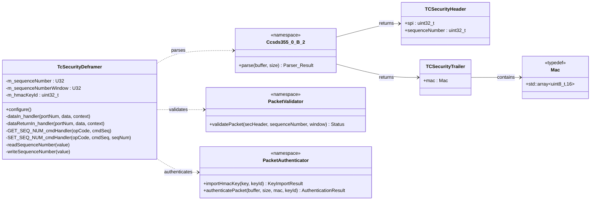

# Components::TcSecurityDeframer

The TcSecurityDeframer component implements the TC ProcessSecurity flow of CCSDS 355.0-B-2 in the uplink path. It sits between TcDeframer and SpacePacketDeframer: it parses the Security Header and Trailer, validates the SPI and anti-replay sequence number, verifies the HMAC, then strips the security envelope and forwards the frame with the verification result recorded in the frame context (`authenticated` flag).

The component does not enforce policy. Frames that fail verification are still forwarded (unauthenticated) so that downstream policy — owned by ProvesRouter and its opcode bypass allowlist — can decide whether to route or reject them. This keeps knowledge of packet structure here and knowledge of policy at the edge.

## Overview

The component is a thin stateful shell over pure-function namespaces:

- `Ccsds355_0_B_2::parse` (Parser) — Security Header (SPI, sequence number) and Trailer (MAC) extraction
- `Components::validatePacket` (Validator) — SPI validation and anti-replay sequence-number window validation
- `Components::authenticatePacket` / `importHmacKey` (Authenticator) — HMAC-SHA-256 (truncated to 16 bytes) verification via PSA crypto

The only component state is the last accepted sequence number (mutex-guarded, persisted to file) and the imported HMAC key id.

Primary data path connections:

- TcDeframer.dataOut -> TcSecurityDeframer.dataIn
- TcSecurityDeframer.dataOut -> SpacePacketDeframer.dataIn
- TcSecurityDeframer.dataReturnOut -> TcDeframer.dataReturnIn
- SpacePacketDeframer.dataReturnOut -> TcSecurityDeframer.dataReturnIn

## Class Diagram



## Packet Format

TcDeframer strips the TC Primary Header and FECF before this component, so the buffer received on dataIn is:

- Security Header (6 bytes): SPI (2) + Sequence Number (4)
- Space Packet Primary Header (6 bytes)
- Space Packet Data Field (includes F Prime command)
- Security Trailer (16-byte MAC)

Output packet layout (forwarded per CCSDS 355.0-B-2 §3.3.3.3):

- Space Packet Primary Header (6 bytes)
- Space Packet Data Field

The MAC is HMAC-SHA-256 truncated to 16 bytes, computed over the Security Header and Data Field (everything except the Security Trailer).

### Additional resources

- [CCSDS 355.0-B-2 Space Data Link Security Protocol](https://ccsds.org/Pubs/355x0b2.pdf)

## Behavior

1. Parse the Security Header and Trailer. If the frame is too short to contain them it cannot be stripped for downstream deframing: log ParsingFailed and return the buffer upstream (drop).
2. Validate the SPI (only SPI 0 is currently supported) and the anti-replay sequence number (must be strictly ahead of the last accepted value, within SEQ_NUM_WINDOW, with U32 wraparound handled).
3. If validation passes, verify the MAC.
4. Only when all checks pass: store and persist the received sequence number, telemeter it, and set `authenticated = true` in the frame context. Frames failing any check never advance the sequence number (issue #426).
5. Strip the Security Header and Trailer and forward on dataOut with the resulting `authenticated` flag. ProvesRouter rejects unauthenticated packets unless their opcode is on the bypass allowlist.

At startup, `configure()` loads the persisted sequence number and telemeters it so the first downlinked value is correct before any command is accepted (issue #427).

## Parameters

| Name | Type | Default | Description |
|---|---|---|---|
| SEQ_NUM_WINDOW | U32 | 50000 | Maximum allowed forward sequence-number distance before rejecting a packet as out-of-window. |
| SEQ_NUM_FILE_PATH | string | "//sequence_number.txt" | File path used to persist and restore the sequence number across restarts. |

## Port Descriptions

| Name | Direction | Type | Description |
|---|---|---|---|
| dataIn | Input (guarded) | Svc.ComDataWithContext | Receives frames from TcDeframer for parse, validation, and authentication. |
| dataReturnIn | Input (sync) | Svc.ComDataWithContext | Receives returned ownership for buffers previously sent through dataOut. |
| dataOut | Output | Svc.ComDataWithContext | Forwards the stripped frame downstream with the authenticated flag set in the context. |
| dataReturnOut | Output | Svc.ComDataWithContext | Returns ownership of structurally invalid frames (and relays dataReturnIn ownership upstream). |

Standard AC ports are also present for command handling, events, telemetry, parameter access, and time.

## Telemetry Channels

| Name | Type | Description |
|---|---|---|
| CurrentSequenceNumber | U32 | Current accepted sequence number tracked by the component. Emitted at startup and on each accepted packet. |

Routed/bypassed/rejected packet counts are telemetered by ProvesRouter, which owns the accept/reject policy.

## Events

| Name | Severity | Parameters | Description |
|---|---|---|---|
| SequenceNumberGet | Activity High | seq_num: U32 | Logged by GET_SEQ_NUM on successful read. Format: "Sequence number is {}" |
| SequenceNumberReadFailed | Warning High (throttle 2) | status: Os.FileStatus | Logged when sequence-number read fails. Format: "Failed to read sequence number, error: {}" |
| SequenceNumberSet | Activity High | seq_num: U32 | Logged by SET_SEQ_NUM on successful write. Format: "Sequence number set to {}" |
| SequenceNumberWriteFailed | Warning High (throttle 2) | status: Os.FileStatus | Logged when sequence-number write fails. Format: "Failed to write sequence number, error: {}" |
| SequenceNumberInvalid | Warning High (throttle 2) | packet_seq_num: U32, seq_num: U32, window: U32 | Logged when anti-replay validation fails. Format: "Sequence number less than last accepted or out of window: Received={}, LastAccepted={}, Window={}" |
| AuthenticationFailed | Warning High (throttle 2) | auth_status: PacketAuthenticatorStatus, rc: I32 | Logged when MAC verification fails. Format: "Authentication failed: Status={}, PSA Return Code={}" |
| ParsingFailed | Warning High (throttle 2) | parse_status: PacketParserStatus | Logged when frame parsing fails. Format: "Parsing failed: {}" |
| SpiInvalid | Warning High (throttle 2) | packet_spi: U32 | Logged when SPI validation fails. Format: "SPI invalid: Received={}" |

## Commands

| Name | Type | Parameters | Description |
|---|---|---|---|
| GET_SEQ_NUM | Sync | None | Reads and reports the current sequence number (SequenceNumberGet event). |
| SET_SEQ_NUM | Sync | seq_num: U32 | Sets and persists a new sequence number (SequenceNumberSet event). |

## Unit Tests

TcSecurityDeframer helper functionality is covered by unit tests in PROVESFlightControllerReference/test/unit-tests:

| Test File | Coverage |
|---|---|
| test_TcSecurityDeframer_Parser.cpp | Valid parse path plus parse failures for SPI, sequence number, and MAC size checks. |
| test_TcSecurityDeframer_Validator.cpp | SPI validation, out-of-window and replayed sequence numbers, window boundary, and wraparound handling. |
| test_TcSecurityDeframer_Authenticator.cpp | Key import failures, successful MAC verification, and failed verification with corrupted MAC or data. |

Run unit tests with:

```bash
make test-unit
```

## GDS Plugin

To send authenticated packets from GDS, build the framing plugin:

```bash
make framer-plugin
```

Then run GDS with the framing plugin enabled as configured by the project tooling.

## Generating Keys

The default authentication key header (AuthDefaultKey.h) is generated at build time from project key material via `make generate-auth-key` or `make copy-secrets`. This generated file is machine-local and not committed.

## Requirements

| Name | Description | Validation |
|---|---|---|
| AUTH001 | The component shall parse incoming frames to extract the SPI, sequence number, and MAC fields. | Unit Test |
| AUTH003 | The component shall validate that the SPI value corresponds to a configured Security Association. | Unit Test |
| AUTH004 | The component shall validate the received sequence number against the stored sequence number. | Unit Test |
| AUTH004-A | The component shall not authenticate packets with sequence numbers that are outside the acceptable window and shall log an event. | Unit Test, Inspection |
| AUTH004-B | The component shall set the stored sequence number to the sequence number transmitted in the packet only when a packet is fully validated and authenticated. | Inspection |
| AUTH004-C | The component shall allow the sequence number window to be configurable via a parameter. | Inspection |
| AUTH005 | The component shall compute the MAC over the entire frame minus the last 16-byte security trailer. | Unit Test |
| AUTH005-A | The component shall not mark packets as authenticated where the computed MAC does not match the security trailer MAC. | Unit Test |
| AUTH006 | For any parseable frame, the component shall remove the Security Header and Security Trailer and forward the remaining packet data with the verification result recorded in the frame context. | Inspection, Integration Test |
| AUTH007 | The component shall provide a command and telemetry channel to report the current sequence number to enable ground station synchronization. | Inspection, Integration Test |

Opcode-based bypass policy (formerly AUTH002) is owned by ProvesRouter; see its SDD.

## Change Log

| Date | Description |
| --- | --- |
| 2025-11-26 | Initial design. |
| 2026-05-01 | Renamed to TcSecurityDeframer, refactor to discrete responsibilities: Authenticator, Parser, Validator. |
| 2026-07-17 | Pass-through interface between TcDeframer and SpacePacketDeframer; verification result carried in frame context; policy enforcement moved to ProvesRouter. |
