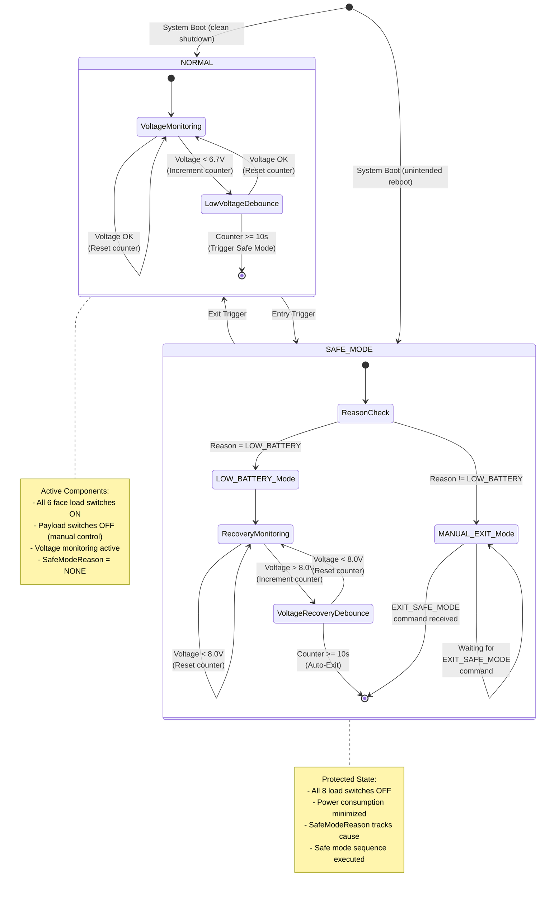

# ModeManager Safe Mode Finite State Machine

This document describes the finite state machine (FSM) for the ModeManager component's Safe Mode transitions. The ModeManager controls system operational modes and orchestrates transitions between NORMAL and SAFE_MODE based on various triggers.

## State Machine Diagram



## State Transitions

### Entry Transitions: NORMAL → SAFE_MODE

The ModeManager can enter SAFE_MODE from NORMAL mode through multiple triggers, each assigned a specific `SafeModeReason`:

| Trigger | SafeModeReason | Description | Debounce |
|---------|----------------|-------------|----------|
| **Auto: Low Voltage** | `LOW_BATTERY` (1) | Voltage drops below `SafeModeEntryVoltage` parameter (default: 6.7V) | 10 seconds (configurable) |
| **Command: FORCE_SAFE_MODE** | `GROUND_COMMAND` (3) | Ground operator issues FORCE_SAFE_MODE command | Immediate |
| **Port: forceSafeMode** | `EXTERNAL_REQUEST` (4) or custom | External component calls forceSafeMode port (e.g., watchdog timeout) | Immediate |
| **Auto: Unintended Reboot** | `SYSTEM_FAULT` (2) | System boots with cleanShutdown flag = 0 in NORMAL mode | At boot only |
| **Port: forceSafeMode (LoRa)** | `LORA` (5) | LoRa driver detects communication timeout/fault | Immediate |

#### Entry Actions
When entering SAFE_MODE, the ModeManager:
1. Executes the safe mode radio sequence (`/seq/enter_safe.bin`)
2. Sets `m_mode = SAFE_MODE`
3. Increments `m_safeModeEntryCount` (persisted)
4. Sets `m_safeModeReason` to the trigger reason
5. Emits one or more events:
   - `EnteringSafeMode(reason: string)` - Severity: WARNING_HI (always emitted with reason string)
   - `AutoSafeModeEntry(reason: SafeModeReason, voltage: F32)` - Severity: WARNING_HI (for LOW_BATTERY trigger)
   - `UnintendedRebootDetected()` - Severity: WARNING_HI (for SYSTEM_FAULT at boot)
   - `ManualSafeModeEntry()` - Severity: ACTIVITY_HI (for FORCE_SAFE_MODE command)
   - `ExternalFaultDetected()` - Severity: WARNING_HI (for forceSafeMode port call)
6. Turns OFF all 8 load switches via `loadSwitchTurnOff` ports
7. Notifies other components via `modeChanged` port with SAFE_MODE value
8. Executes safe mode sequence via `runSequence` port (may emit `SafeModeSequenceCompleted` or `SafeModeSequenceFailed`)
9. Saves state to persistent storage (`/mode_state.bin`)

### Exit Transitions: SAFE_MODE → NORMAL

Exit from SAFE_MODE depends on the `SafeModeReason`:

| Exit Method | Conditions | Applicable Reasons |
|-------------|------------|-------------------|
| **Auto-Recovery** | Voltage > `SafeModeRecoveryVoltage` (default: 8.0V) for 10+ seconds | `LOW_BATTERY` only |
| **Manual Command** | Ground operator issues EXIT_SAFE_MODE command | All reasons |

#### Exit Actions
When exiting SAFE_MODE, the ModeManager:
1. Sets `m_mode = NORMAL`
2. Clears `m_safeModeReason = NONE`
3. Emits exit event:
   - `ExitingSafeMode()` - Severity: ACTIVITY_HI (manual EXIT_SAFE_MODE command)
   - `AutoSafeModeExit(voltage: F32)` - Severity: ACTIVITY_HI (auto-recovery for LOW_BATTERY)
4. Turns ON face load switches (0-5) via `loadSwitchTurnOn` ports
   - **Note**: Payload switches (6-7) remain OFF, requiring separate commands
5. Notifies other components via `modeChanged` port with NORMAL value
6. Saves state to persistent storage

### Boot-Time State Restoration

On system initialization, the ModeManager:
1. Reads persistent state from `/mode_state.bin`
2. Restores `m_mode`, `m_safeModeEntryCount`, and `m_safeModeReason`
3. Checks `cleanShutdown` flag:
   - If `cleanShutdown = 1`: Clean boot, restore physical hardware to match saved mode
   - If `cleanShutdown = 0` AND `m_mode = NORMAL`: Unintended reboot detected → Enter SAFE_MODE with reason `SYSTEM_FAULT`
4. Clears `cleanShutdown` flag (sets to 0) for next boot detection

**Clean Shutdown Protocol**:
- The `prepareForReboot` port handler sets `cleanShutdown = 1` before intentional reboots
- This allows detection of crashes, watchdog resets, and power loss events

## State Invariants

### NORMAL Mode
- `m_mode = NORMAL (2)`
- `m_safeModeReason = NONE (0)`
- Face load switches (0-5) are ON
- Payload switches (6-7) are OFF (default)
- Voltage monitoring active (1Hz via `run` handler)
- Low voltage counter (`m_safeModeVoltageCounter`) tracks consecutive low readings
- Recovery counter (`m_recoveryVoltageCounter`) is reset to 0

### SAFE_MODE Mode
- `m_mode = SAFE_MODE (1)`
- `m_safeModeReason` = {`LOW_BATTERY`, `SYSTEM_FAULT`, `GROUND_COMMAND`, `EXTERNAL_REQUEST`, `LORA`}
- All 8 load switches are OFF
- Voltage recovery monitoring active only if `reason = LOW_BATTERY`
- Recovery counter (`m_recoveryVoltageCounter`) tracks consecutive recovery readings (if LOW_BATTERY)
- Low voltage counter (`m_safeModeVoltageCounter`) is reset to 0

## Voltage Hysteresis

The ModeManager implements voltage hysteresis to prevent oscillation between modes:

- **Entry Threshold**: 6.7V (configurable via `SafeModeEntryVoltage` parameter)
- **Recovery Threshold**: 8.0V (configurable via `SafeModeRecoveryVoltage` parameter)
- **Gap**: 1.3V hysteresis prevents rapid mode switching

**Rationale**: Battery voltage may fluctuate under load. The higher recovery threshold ensures the system has sufficient margin before resuming normal operations.

## Debouncing Logic

All voltage-triggered transitions use a configurable debounce period (default: 10 seconds):

```
NORMAL → SAFE_MODE (Low Voltage):
  - Counter increments each second voltage < 6.7V
  - Counter resets to 0 if voltage >= 6.7V
  - Transition occurs when counter >= 10

SAFE_MODE → NORMAL (Auto-Recovery):
  - Counter increments each second voltage > 8.0V AND reason = LOW_BATTERY
  - Counter resets to 0 if voltage <= 8.0V
  - Transition occurs when counter >= 10
```

**Rationale**: Debouncing prevents spurious transitions due to transient voltage spikes/dips, sensor noise, or momentary load changes.

## Reason-Based Recovery Rules

Only `LOW_BATTERY` reason allows automatic recovery. Other reasons require manual intervention:

| Reason | Auto-Recovery | Rationale |
|--------|---------------|-----------|
| `LOW_BATTERY` | ✅ Yes | Condition is measurable and reversible; safe to auto-recover when voltage stabilizes |
| `SYSTEM_FAULT` | ❌ No | Unintended reboot indicates unknown system issue; requires ground investigation |
| `GROUND_COMMAND` | ❌ No | Operator explicitly commanded safe mode; requires operator approval to exit |
| `EXTERNAL_REQUEST` | ❌ No | Another component detected a fault; requires component-specific recovery |
| `LORA` | ❌ No | Communication fault may indicate antenna deployment issue or ground station unavailability |

## Telemetry Channels

The ModeManager publishes telemetry every 1Hz via the `run` handler:

- `CurrentMode`: U8 (1 = SAFE_MODE, 2 = NORMAL)
- `CurrentSafeModeReason`: SafeModeReason enum (0-5)
- `SafeModeEntryCount`: U32 (cumulative count, persisted across reboots)

## Implementation Details

### File Locations
- **Component Definition**: `PROVESFlightControllerReference/Components/ModeManager/ModeManager.fpp`
- **Implementation**: `PROVESFlightControllerReference/Components/ModeManager/ModeManager.cpp`
- **Header**: `PROVESFlightControllerReference/Components/ModeManager/ModeManager.hpp`
- **Integration Tests**: `PROVESFlightControllerReference/test/int/safe_mode_test.py`

### Key Methods
- `run_handler()`: 1Hz periodic handler for voltage monitoring and telemetry
- `enterSafeMode(reason)`: Transition to SAFE_MODE with specified reason
- `exitSafeMode()`: Transition to NORMAL (manual command)
- `exitSafeModeAutomatic(voltage)`: Transition to NORMAL (auto-recovery)
- `forceSafeMode_handler(reason)`: Port handler for external safe mode requests
- `loadState()`: Restore state from persistent storage at boot
- `saveState()`: Persist state to non-volatile storage
- `prepareForReboot_handler()`: Set clean shutdown flag before intentional reboot

### Persistent State Structure
```cpp
struct PersistentState {
    U8 mode;                 // Current mode (1 = SAFE_MODE, 2 = NORMAL)
    U32 safeModeEntryCount;  // Number of times safe mode entered
    U8 safeModeReason;       // Reason for safe mode entry (0-5)
    U8 cleanShutdown;        // Clean shutdown flag (1 = clean, 0 = unclean)
};
```
Stored at: `/mode_state.bin` (size is architecture-dependent due to struct padding, typically 8-12 bytes)

## Testing Validation

The Safe Mode FSM is validated through integration tests in `safe_mode_test.py`:

| Test | Validates | Status |
|------|-----------|--------|
| `test_safe_01` | Initial reason = NONE in NORMAL mode | ✅ Automated |
| `test_safe_02` | FORCE_SAFE_MODE sets reason = GROUND_COMMAND | ✅ Automated |
| `test_safe_03` | EXIT_SAFE_MODE clears reason to NONE | ✅ Automated |
| `test_safe_04` | GROUND_COMMAND does not auto-recover | ✅ Automated |
| `test_safe_05` | Auto-entry on low voltage → reason = LOW_BATTERY | ⏸️ Manual |
| `test_safe_06` | Auto-recovery on voltage recovery (LOW_BATTERY only) | ⏸️ Manual |
| `test_safe_07` | Unintended reboot → reason = SYSTEM_FAULT | ⏸️ Manual |
| `test_safe_08` | Clean reboot → no safe mode entry | ⏸️ Manual |

## Design Rationale

1. **Two-State System**: Simple FSM with clear separation of concerns between operational and protected states
2. **Reason Tracking**: Enables intelligent recovery decisions and diagnostics
3. **Voltage Hysteresis**: Prevents mode oscillation under marginal battery conditions
4. **Debouncing**: Filters out transient faults and sensor noise
5. **State Persistence**: Allows unintended reboot detection and mode restoration across power cycles
6. **Selective Auto-Recovery**: Only measurable/reversible conditions (LOW_BATTERY) auto-recover; others require human decision
7. **Load Switch Control**: Minimizes power consumption in SAFE_MODE while preserving critical functions

## References

- [ModeManager Component Documentation](ModeManager.md)
